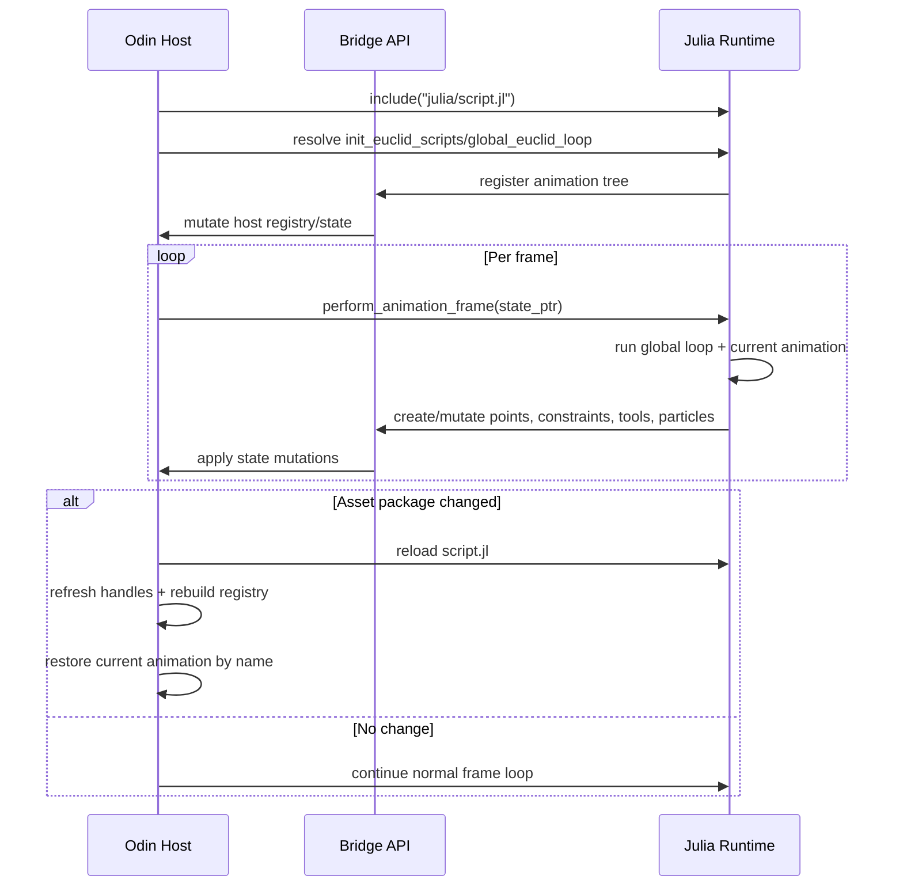

# EuclidApp Architecture Summary

## Table Of Contents

1. [What This Project Is](#what-this-project-is)
1. [Where To Start Reading](#where-to-start-reading)
1. [Module Map (Odin + Julia)](#module-map-odin--julia)
1. [Scratchpad Architecture (Interactive Runtime Surface)](#scratchpad-architecture-interactive-runtime-surface)
1. [Dynview Text Engine (Hybrid-Immediate Rendering)](#dynview-text-engine-hybrid-immediate-rendering)
1. [Odin-Julia Bridge: How the Boundary Works](#odin-julia-bridge-how-the-boundary-works)
1. [Allocation Strategy: Init-First with Explicit Exceptions](#allocation-strategy-init-first-with-explicit-exceptions)
1. [Build and Packaging Model](#build-and-packaging-model)
1. [Isometric Projection and Right-Hand Rule](#isometric-projection-and-right-hand-rule)
1. [Practical Contributor Guide](#practical-contributor-guide)
1. [Key Architecture Takeaways](#key-architecture-takeaways)

## What This Project Is

EuclidApp is a desktop visualization app for geometric constructions and proofs.
The overall structure includes 2 programming languages, Odin and Julia.

- **Odin** code provides the application shell, rendering loop, simulation data model,
    memory ownership, and bridge exports. It owns long-lived application state
    (`Euclid_General_State`), rendering, UI, and systems (kine + particles + gif capture).
- **Julia** code provides animation/content logic loaded from scripts at runtime. It
    registers an animation tree and drives per-animation behavior by calling exported
    Odin-Julia Bridge functions.

A useful mental model:

- Odin is the **engine and host process**.
- Julia is the **animation/content runtime** running inside that host.

---

## Where To Start Reading

If you are new, read in this order:

1. Host lifecycle path:
   - `src/main.odin`
   - `src/view/view.odin`
1. Host/runtime boundary:
   - `src/julia/julia.odin`
   - `src/julia/odin-julia-bridge.odin`
   - `src/julia/odin-julia-bridge.jl`
1. Julia runtime entry:
   - `src/julia/script.jl`
1. Then continue by module using the maps below, touching only each module's
   highlighted files first.

---

## Module Map (Odin + Julia)

| Section | Module | Purpose | Key files |
| --- | --- | --- | --- |
| **Odin** | Application Lifecycle | Process entry and startup/shutdown sequencing. | `src/main.odin` |
| **Odin** | Core Definitions | Canonical runtime data shapes and capacity constants. | `src/core/core.odin` |
| **Odin** | Rendering and UI | Frame loop wiring, world rendering, panel rendering, and interaction routing. | `src/view/view.odin`, `src/view/elements.odin`, `src/view/core/view_core.odin`, `src/view/core/isomath.odin`, `src/view/ui/ui.odin` |
| **Odin** | Geometry Kernel | Shapes, constraints, and system evolution/integration rules. | `src/kine/shapes.odin`, `src/kine/constraints.odin`, `src/kine/system.odin` |
| **Odin** | Bridge and Embedding | Host-side Julia lifecycle and strict bridge ABI surface. | `src/julia/julia.odin`, `src/julia/odin-julia-bridge.odin`, `src/julia/julialib.odin` |
| **Odin** | Assets and IO | Asset package extraction/path resolution and GIF output internals. | `src/files/files.odin`, `src/files/gif_encode.odin` |
| **Odin** | Particles | Multi-layer particle systems and visual effects. | `src/particles/particles.odin` |
| **---** | **--- Julia Modules ---** | **---** | **---** |
| **Julia** | Runtime Bootstrap | Script loading, animation registration, and global frame dispatch. | `src/julia/script.jl` |
| **Julia** | Bridge Wrapper | Ergonomic Julia wrappers around bridge exports. | `src/julia/odin-julia-bridge.jl` |
| **Julia** | Shared Animation Utilities | Reusable animation and geometry helper routines. | `src/julia/animations.jl`, `src/julia/geometry.jl`, `src/julia/nullanimation.jl` |
| **Julia** | Interactive Runtime | Scratchpad/REPL session lifecycle, queueing, and evaluation flow. | `src/julia/scratchpad.jl`, `src/julia/euclidrepl.jl` |
| **Julia** | Content Modules | Domain content roots and leaf animation definitions. | `src/julia/elements/elements.jl`, `src/julia/proclus/proclus.jl`, `src/julia/hilbert/hilbert.jl` |

Content-module contract:

- Root modules register tree/category nodes.
- Leaf files provide `get_view_text`, `initialize`, `loop`, `clean`.
- Bridge calls mutate host state while Julia controls pedagogical flow.

---

## Scratchpad Architecture (Interactive Runtime Surface)

Scratchpad is an interactive runtime surface, not a normal deterministic
animation. It is mounted in the animation tree as `"Scratchpad"`, but behaves
like an embedded REPL control plane.

### Core Architecture

- Odin owns UI input capture, text panel interaction, and buffer/cursor state.
- Julia owns command parsing/evaluation, command history, and output stream
  generation.
- Communication crosses the bridge through explicit scratchpad entrypoints.

### Frame Model And Lifecycle

- Input is only captured when the Scratchpad node is the active selection.
- Enter submission is parse-aware:
  - incomplete parse appends newline
  - complete parse enqueues command
- Julia processes at most one queued command per frame, then runs optional
  per-frame hooks.
- Sessions are isolated via fresh runtime modules and support explicit
  reset/clean transitions without terminating the host.

### Safety, Reliability, And Limits

- Input is policy-filtered before eval.
- Parse/eval/hook failures are surfaced as user-visible output, not host
  crashes.
- Repeated failing hooks auto-disable to prevent recurring frame-time spam.
- Queue/history/output are bounded with retention caps and overflow behavior.
- Runtime diagnostics are exposed through `:stats` counters.

Primary files:

- `src/view/ui/scratchpad_panel.odin`
- `src/julia/scratchpad.jl`
- `src/julia/euclidrepl.jl`
- `src/julia/script.jl`

---

## Dynview Text Engine (Hybrid-Immediate Rendering)

Dynview is hybrid in a specific sense:

- Julia authors text in an immediate-style way each frame.
- Odin evaluates and renders that text through retained dynview caches.
- Input can be plain fallback text or structured stream content.

Runtime path:

1. Julia always returns fallback text from `get_view_text`.
1. Julia may also emit a dynview stream via bridge calls.
1. Odin validates stream data, updates retained cache state, and performs
  layout/render from the cache for the frame.
1. On stream failure, Odin renders fallback text.

### Architectural Contract

- Odin owns stream storage, parsing, layout, interaction, and final rendering.
- Julia owns per-frame text intent and optional dynview emission.
- Bridge failures in dynview are non-fatal and never remove text output.

### Primary Files

- `src/view/ui/dynview_pipeline.odin`
- `src/view/ui/dynview_layout_cache.odin`
- `src/view/ui/text_panel.odin`
- `src/view/ui/scratchpad_panel.odin`
- `src/julia/odin-julia-bridge.jl`
- `src/julia/odin-julia-bridge.odin`
- `src/julia/script.jl`

---

## Odin-Julia Bridge: How the Boundary Works

### Basic Flow

### Ownership And Rules

- Odin owns application state, memory, rendering, and final frame orchestration.
- Julia owns animation/content logic and drives changes only through bridge APIs.
- Bridge failures should be surfaced clearly; no silent state corruption paths.
- Some bridge entrypoints restore Odin runtime context
  (`context = state^.SavedContext`) before allocation-sensitive work.

---

## Allocation Strategy: Init-First with Explicit Exceptions

This policy is strict by design.

### Non-Negotiable Rules

- Default rule: no growing host allocations in steady per-frame paths.
- Long-lived host state must be allocated at startup and reused.
- When a maximum size is known, preallocate and mutate in place.
- New per-frame heap growth requires explicit justification in review.

### Allowed Exceptions

1. Frame-scoped scratch memory from the temp allocator.
   - Example: temporary UI/text conversion buffers.
   - Requirement: reclaimed by frame reset (`free_all(context.temp_allocator)`).
1. Event-driven allocations outside steady frame loops.
   - Example: asset reload, registry rebuild, GIF capture session buffers.
   - Requirement: tied to lifecycle/user events, not continuous simulation ticks.
1. Julia runtime GC-managed allocations.
   - Julia owns script/runtime objects.
   - Odin owns host state and must stay deterministic on the host side.

### Not Allowed Without Explicit Approval

- Growing slices/arrays every frame in hot UI, view, or simulation loops.
- Rebuilding stable-capacity runtime buffers from scratch each frame.
- Hiding ownership so it is unclear who allocates, mutates, and frees.

---

## Isometric Projection and Right-Hand Rule

The isometric helper in `src/view/core/isomath.odin` uses a right-handed
world-space convention.

What that means in practice:

- Hand-position rule used in this project: hold your **right hand palm up**,
  curl the last three fingers naturally, and keep your thumb and index finger
  perpendicular.
- In that pose, the **thumb points +X** and the **index finger points +Y**.
- Therefore, by the right-hand rule (`X × Y = Z`), **+Z is up**
  (height/elevation).
- Positive rotation follows the right-hand rule around each axis: curl your right-hand
  fingers in the rotation direction; your thumb points toward the positive axis.

Projection note:

- The projection maps world coordinates into screen coordinates, so signs in the
  formula account for screen-space Y increasing downward.
- In effect, increasing `coord.z` renders higher on screen, consistent with
  treating +Z as world up.

---

## Build and Packaging Model

- `make.jl` builds Odin executable and package runtime assets into `bin/assets.pkg`.
- Packaged assets include:
  - `src/julia/**` scripts
  - `src/view/shaders/**`
  - `assets/**`
  - `manifest.txt`
- At startup, app unpacks `assets.pkg` to a writable cache directory and resolves runtime paths from there.

---

## Practical Contributor Guide

### If You Need To

Choose the owning module first, then touch that module's highlighted files.

- **Lifecycle/timing issues**:
  - Application Lifecycle Module (`src/main.odin`, `src/view/view.odin`).
- **Rendering/UI behavior**:
  - Rendering and UI Module (`src/view/elements.odin`, `src/view/ui/ui.odin`,
    `src/view/core/view_core.odin`).
- **Geometry/constraints behavior**:
  - Geometry Kernel Module (`src/kine/shapes.odin`,
    `src/kine/constraints.odin`, `src/kine/system.odin`).
- **Julia feature surface / bridge contract**:
  - Bridge and Embedding Module + Bridge Wrapper Module
    (`src/julia/odin-julia-bridge.odin`, `src/julia/odin-julia-bridge.jl`).
- **New lesson/content animation**:
  - Content Modules (`src/julia/elements/**`, `src/julia/proclus/**`,
    `src/julia/hilbert/**`).
- **Modify the Scratchpad/REPL surface**:
  - Scratchpad and UI modules (`src/julia/sratchpad.jl`, `src/julia/euclidrepl.jl`,
    `src/view/ui/scratchpad_panel.odin`)

### Typical New Animation Workflow

1. Add Julia animation module/file in `src/julia/...`.
1. Implement `get_view_text`, `initialize`, `loop`, `clean`.
1. Register it via `add_child_animation_interface` in the relevant group init script.
1. If bridge functionality is missing, add symmetric Odin export + Julia wrapper.

Review [AnimationsStyle.md](AnimationsStyle.md) for considerations on how to
make animations "fit in".

---

## Key Architecture Takeaways

- The app is **host-driven**: Odin controls lifecycle, simulation pacing, rendering, and core state.
- Julia is **content-driven**: scripts define what animation behavior runs and what geometry/tools are manipulated.
- The bridge is the contract: keep Odin exports and Julia wrappers aligned.
- Assets are packaged and loaded at runtime, enabling script/content iteration without redesigning host architecture.
