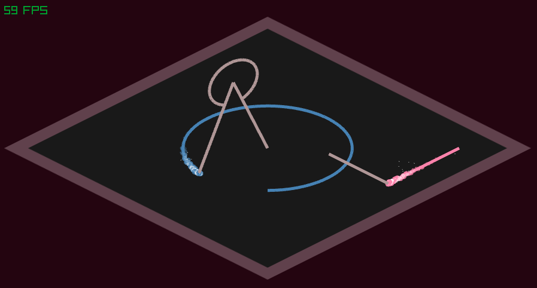

# Euclid

This is a basic project to create an application that animates Euclid's Elements.

This is done in Odin for the primary application, with bindings to Julia to drive the
animations.

This is just a start right now, just laying the foundation...

Simply use `./make.sh` to build. You can also use `./make.sh --run` to immediately run.
You must have Odin and Julia installed on your system.

