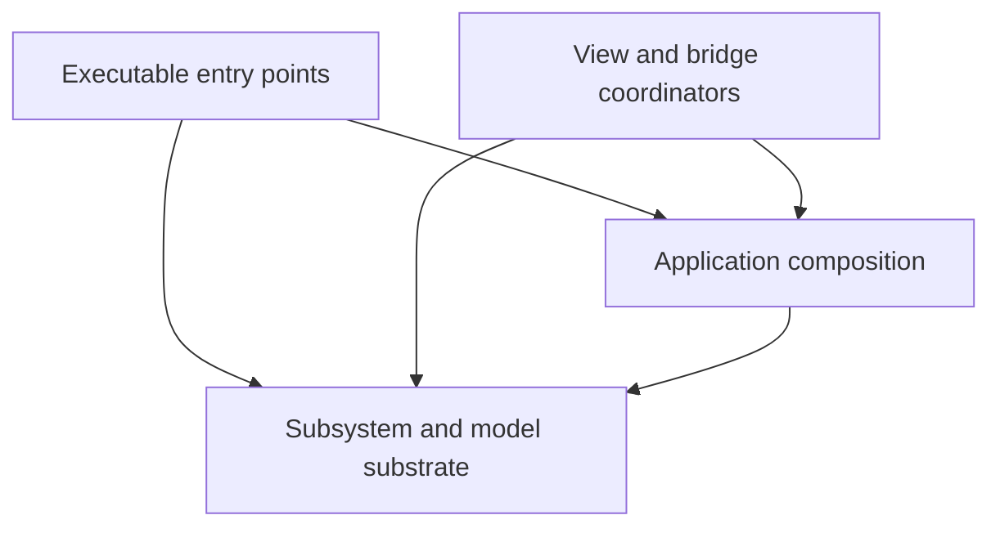
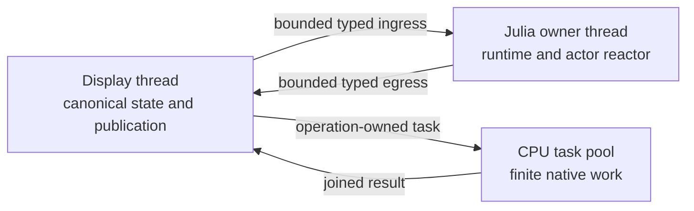
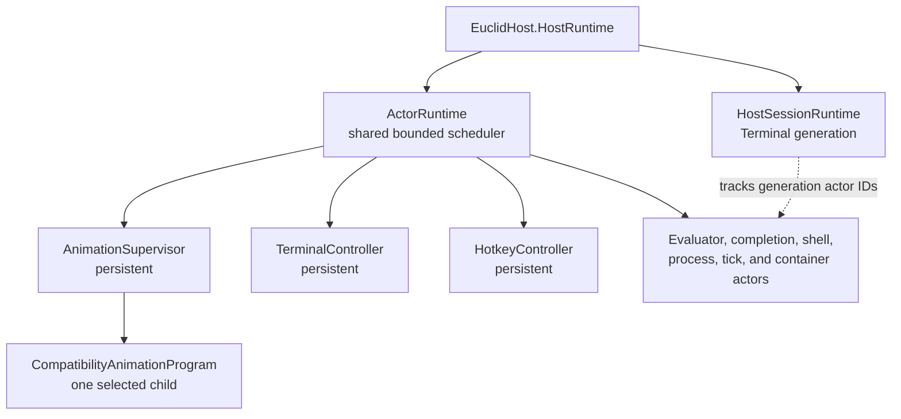
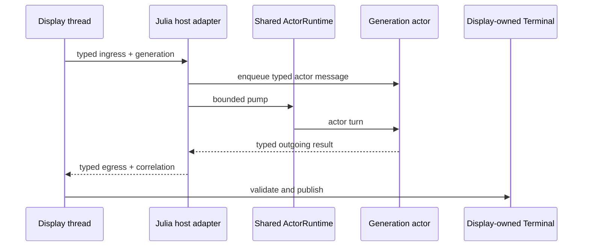
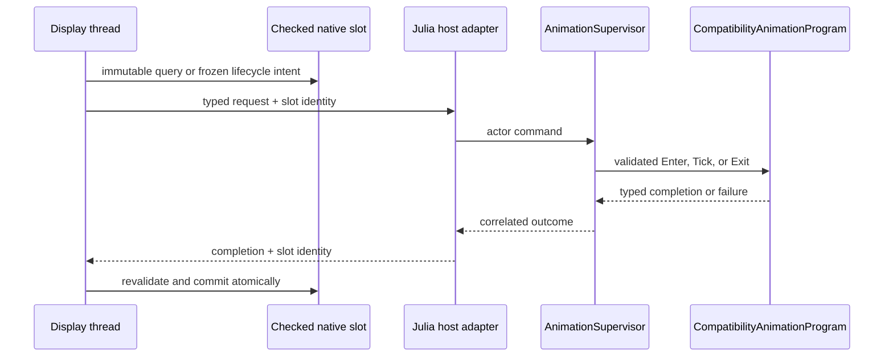
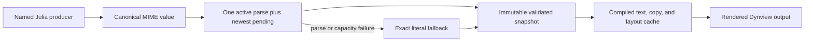
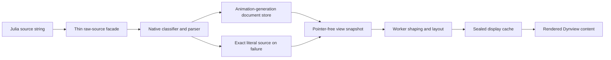
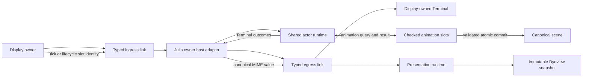

# Euclid Architecture Summary

## Table Of Contents

1. [What This Project Is](#what-this-project-is)
1. [Where To Start Reading](#where-to-start-reading)
1. [Module Map (Odin + Julia)](#module-map-odin--julia)
1. [Execution And Ownership Model](#execution-and-ownership-model)
1. [Dormant Raylib Backend Boundary](#dormant-raylib-backend-boundary)
1. [Julia Actor Architecture](#julia-actor-architecture)
1. [Terminal Architecture (Interactive Runtime Surface)](#terminal-architecture-interactive-runtime-surface)
1. [Animation Architecture](#animation-architecture)
1. [Dynview Text Engine (Hybrid-Immediate Rendering)](#dynview-text-engine-hybrid-immediate-rendering)
1. [Dynamic LaTeX Pipeline (Native Parse And Layout)](#dynamic-latex-pipeline-native-parse-and-layout)
1. [Odin-Julia Bridge: How the Boundary Works](#odin-julia-bridge-how-the-boundary-works)
1. [Native Frame Execution](#native-frame-execution)
1. [Testing Strategy](#testing-strategy)
1. [Allocation Strategy: Init-First with Explicit Exceptions](#allocation-strategy-init-first-with-explicit-exceptions)
1. [Build and Packaging Model](#build-and-packaging-model)
1. [Practical Contributor Guide](#practical-contributor-guide)
1. [Key Architecture Takeaways](#key-architecture-takeaways)

## What This Project Is

Euclid is a desktop visualization app for geometric constructions and proofs.
The overall structure includes 2 programming languages, Odin and Julia.

- **Odin** code provides the application shell, rendering loop, simulation data model,
    memory ownership, and bridge exports. It owns long-lived application state
  (`Euclid_General_State`), rendering, UI, and systems (shapes + particles +
  gif capture).
- **Julia** runtime code provides the sysimage-owned host, policy, authoring APIs, and
  bridge wrappers. Generation-owned content loaded from `src/content/` registers an
  animation tree and drives per-animation behavior through those stable APIs.

A useful mental model:

- Odin is the **engine and host process**.
- Julia is the **animation/content runtime** running inside that host.

---

## Where To Start Reading

If you are new, read in this order:

1. Host lifecycle path (`src/main.odin`, `src/view/view.odin`).
1. Julia host and actor model (`src/julia/runtime_host.jl`, `src/julia/host/`,
  `src/julia/policy/`, `src/julia/runtime.jl`).
1. Host/runtime boundary (`src/bridge/runtime_service.odin`,
   `src/bridge/animations.odin`, `src/bridge/abi-*.odin`,
   `src/julia/odin-julia-bridge.jl`).
1. Follow one subsystem end to end: Terminal (`src/view/terminal_service.odin`,
   `src/julia/terminal/`), animation (`src/julia/policy/`,
   `src/bridge/scene_commands.odin`), or Dynview (`src/view/presentation_runtime.odin`,
   `src/dynview/`).
1. Then continue by module using the maps below, touching only each module's
   highlighted files first.

---

## Module Map (Odin + Julia)

| Section | Module | Purpose | Key files |
| --- | --- | --- | --- |
| **Odin** | Application Lifecycle | Process entry and startup/shutdown sequencing. | `src/main.odin` |
| **Odin** | Application Composition | Process-wide composition, run settings, and intrinsic task records. | `src/core/core.odin` |
| **Odin** | Shared Foundations | Bounded storage, animation-generation memory, and native protocol contracts. | `src/core/storage/`, `src/core/animation/`, `src/core/protocol/` |
| **Odin** | Coordinator Contracts | Bridge transport and presentation contracts plus display and Terminal runtime models. | `src/bridge/model/`, `src/bridge/presentation/`, `src/view/model/`, `src/view/terminal/model/` |
| **Odin** | Input Boundary | Once-polled portable input frames, bounded event storage, hotkeys, and owner-bound Terminal encoding. | `src/view/input/`, `src/view/view.odin` |
| **Odin** | Rendering and UI | Frame loop wiring, world rendering, panel rendering, and interaction routing. | `src/view/view.odin`, `src/view/elements.odin`, `src/view/core/view_core.odin`, `src/view/core/isomath.odin`, `src/view/ui/ui.odin` |
| **Odin** | Font Cache | Required JuliaMono/NewCM residency, MATH-table admission, demand-paged glyphs, asynchronous CPU preparation, display-thread publication, and source reload monitoring. | `src/view/font/font.odin`, `src/view/font/prepare.odin`, `src/view/font/async.odin`, `src/view/font/finalize.odin`, `src/view/font/watch.odin` |
| **Odin** | Dynview Runtime | Bounded TeX parsing, generation-scoped semantic documents, text/math compilation, layout planning, draw-ready caches, and a generation-tagged worker-owned NewCM shaping capability. | `src/dynview/dynview.odin`, `src/dynview/parse/`, `src/dynview/core/`, `src/dynview/compile/compile.odin`, `src/dynview/math/`, `src/dynview/layout/`, `src/dynview/tracking.odin` |
| **Odin** | Geometry Kernel | Bounded entity registry, analytic curve evaluation, components, direct-target constraints, and derived render packets. | `src/shapes/model/`, `src/shapes/curve/`, `src/shapes/world_constructors.odin`, `src/shapes/world_constraints.odin`, `src/shapes/world_render.odin` |
| **Odin** | Semantic Evidence | Typed event schemas, producer-local rings, session policy, observations, scenarios, captures, exports, and artifacts. | `src/evidence/`, `src/view/scenario_runtime.odin`, `src/view/runtime_session.odin` |
| **Odin** | Operational Diagnostics | Synchronized optional file logging for lifecycle, degradation, and failure investigation. | `src/diagnostics/`, `src/main.odin` |
| **Odin** | Bridge and Embedding | Host-side Julia lifecycle, strict bridge ABI, native TeX ingestion, and snapshot staging. | `src/bridge/abi.odin`, `src/bridge/abi-*.odin`, `src/bridge/bootstrap.odin`, `src/bridge/animations.odin`, `src/bridge/scene.odin`, `src/bridge/dynview_native_tex.odin`, `src/bridge/dynview_runtime.odin` |
| **Odin** | Julia Interop Dependency | External Odin<->Julia interop package consumed by bridge embedding code. | `src/julialib/julialib.odin` (git submodule) |
| **Odin** | Assets and IO | Asset package extraction/path resolution and GIF output internals. | `src/files/files.odin`, `src/files/gif_encode.odin` |
| **Odin** | [Particle System](ParticleSystem.md) | Bounded particle layers, airborne ballistics, grounded PIC field physics, contacts, rendering, and evidence. | `src/particles/model/`, `src/particles/field.odin`, `src/particles/particles.odin`, `src/view/particles.odin` |
| **---** | **--- Julia Modules ---** | **---** | **---** |
| **Julia** | Runtime Bootstrap | Script loading, animation registration, and global frame dispatch. | `src/julia/script.jl` |
| **Julia** | Bridge Wrapper | Ergonomic Julia wrappers around bridge exports. | `src/julia/odin-julia-bridge.jl` |
| **Julia** | Shared Animation Utilities | Sysimage-owned reusable animation and geometry helpers. | `src/julia/animations.jl`, `src/julia/geometry.jl` |
| **Julia** | Application Reactor | One bounded actor scheduler for persistent Terminal roots, generation-scoped Terminal services, and animation policy supervision. | `src/julia/runtime.jl`, `src/julia/host/`, `src/julia/policy/`, `src/julia/terminal/` |
| **Julia** | LaTeX Facade | Defines canonical TeX displayables and submits exact MIME bytes to native Dynview APIs. | `src/julia/latex.jl`, `src/julia/latex/facade.jl` |
| **Julia Content** | Generation Bootstrap | Catalog descriptors, null behavior, and harness scenarios loaded into each generation. | `src/content/animation_catalog_generation.jl`, `src/content/nullanimation.jl`, `src/content/harness_scenarios.jl` |
| **Julia Content** | Content Modules | Domain roots and leaf animation definitions loaded at startup or on demand. | `src/content/elements/`, `src/content/proclus/`, `src/content/hilbert/`, `src/content/algebra/`, `src/content/curves/` |

### Cross-Module Contracts

Odin packages follow three enforced dependency layers:

- **Substrate** owns reusable storage, protocol contracts, subsystem models, and leaf
  behavior. It may depend only on substrate.
- **Composition** is root package `src/core`. It owns `Euclid_General_State`,
  `Euclid_Run_Settings`, and intrinsic application task records, and may depend on
  substrate.
- **Coordinators** are executable entry points plus `src/view` and `src/bridge`
  behavior. They may depend on composition and substrate.

More-specific model paths beneath view and bridge remain substrate. Reachability from
`Euclid_General_State` does not imply root-core ownership: each field's defining
invariants, storage policy, mutation, and tests belong to its subsystem package.
`ARCHITECTURE-FORBIDDEN-DEPENDENCY` and `ARCHITECTURE-DEPENDENCY-CYCLE` make violations
blocking repository-analysis failures.

Dynview production callers import the child package that owns each symbol. Root
`src/dynview` owns enablement and invalidation rather than forwarding child APIs:
`core` owns shared primitives, `math` measurement, `layout` placement, `compile`
rebuild ordering, and `view/ui/dynview` display-thread drawing.

Content startup registers metadata without evaluating path-backed programs. Each item
has a permanent UUID and a generation-local compatibility implementation. The Julia
animation supervisor resolves and caches implementations, owns lifecycle policy, and
keeps exactly one active program actor. That actor alone adapts typed lifecycle and tick
commands to the existing `animation_entry` interface. Julia roots the runtime host and
committed generation, while Odin-held Julia pointers remain borrowed.

Reload builds and registers a candidate against the inactive interface, roots it
separately, and asks the supervisor to stop the prior actor, reset native state, and
validate the candidate actor before one commit. Failure retires candidate roots and
restores the prior program actor; candidate state never leaks into the committed
generation.

Semantic evidence is authoritative for behavioral claims. Diagnostics explain
operation and failure, while Spall profiles measure timing; neither substitutes for
typed evidence.

---

## Execution And Ownership Model

Euclid has three execution roles. They cooperate through bounded messages, checked
slots, and joined task-pool work; they do not share mutable ownership.

| Execution role | Owns | Publishes through | Forbidden work |
| --- | --- | --- | --- |
| **Display thread** | SDL window and GPU shell, dormant Raylib resources, input, UI, canonical scene and Terminal state, fixed-step ordering, final publication | Typed Julia ingress, task-pool submissions, display-owned commit boundaries | Julia C API calls or concurrent mutation of canonical state |
| **Julia owner thread** | Julia lifetime, callback execution, one actor runtime, content generations, reload candidates, Julia-side policy | Typed egress, checked animation slots, canonical MIME envelopes | Native GPU calls, rendering, or direct mutation of display-owned state |
| **CPU task pool** | Finite operation-owned payloads and cache regions while a task is active | Joined results returned to display-readable ownership | Julia calls, thread-affine native GPU calls, or direct visible-state publication |

The Julia owner is a dedicated long-lived thread, not part of the CPU pool. The display
may help execute native pool work while waiting on a fence, but only the Julia owner
may enter Julia and only the display may publish visible state.

### Portable Runtime Values

`src/core/color` owns semantic RGBA8 values and deterministic source-name resolution.
`src/core/geometry` owns application vectors and rectangles. Canonical shapes,
particles, Dynview commands and layout records, Terminal themes, UI regions, and
prepared glyph placement use these portable values. Bridge and protocol payloads keep
their explicit wire representations. Native display packages convert portable values
to SDL or dormant Raylib values only at the owner-specific backend boundary.

### Input Boundary

The display coordinator drains the SDL event queue exactly once per frame. It applies
window lifecycle and extent facts to the native platform owner while translating
keyboard, pointer, focus, wheel, and committed text events into application-owned
`Input_Frame` values. SDL scancodes provide physical key identity, and queue order is
preserved in fixed `Input_Runtime` event storage. Consumers never poll SDL or Raylib.

`Input_Runtime` owns fixed display-lifetime storage, while each `Input_Frame` borrows
its event prefix only until the next poll. UI and Terminal consumers receive frame
value copies, resolve focus and pointer facts without repolling devices, and consume
committed text from the shared event route. Bytes retained for a Julia evaluation or
native Terminal session are gated by the complete `Input_Owner` identity, including
its generation, so stale input cannot cross owner replacement.

SDL text input follows effective window focus. The adapter publishes valid committed
UTF-8 runes and rejects invalid payloads without partial publication. Composition and
preedit remain separate feature work requiring an independently validated producer and
consumer contract.

Clipboard reads and writes, retained system cursors, and URL activation use SDL-owned
platform services. UI code publishes portable cursor intent; only the display
coordinator converts that intent to a native cursor. Clipboard reads copy SDL-owned
text before releasing it through `SDL_free`.

## Native Frame Execution

The active Linux application creates one high-density SDL window, claims it for one
Vulkan SDL_GPU device, and owns a physical-pixel RGBA8 scene target. Each eligible
frame encodes bounded indexed geometry into fixed CPU storage, uploads the occupied
vertex and index prefixes, renders adjacent compatible batches to that target, blits
the target to the acquired swapchain texture, and submits one command buffer. The scene
target has both color-target and sampler usage because the final blit samples it.

Ordinary world shapes and shadows, panel chrome, splitters, controls, Library rows,
settings, GIF controls, and non-glyph Dynview geometry use this active path. Logical
coordinates remain authoritative through encoding; the SDL boundary applies physical
viewports and outward-rounded scissors for high-density output. Capacity rejection is
atomic. Submitted-frame diagnostics expose overflow totals and vertex, index, batch,
and upload high-water marks.

Nil swapchain textures are temporary unavailable frames and do not publish
`Frame_Presented` evidence. Physical resize creates a candidate target before waiting
for idle and retiring the old target. Font atlases and Terminal attachments use a
bounded display-owned texture-operation queue. CPU workers only prepare bytes; the
display thread creates candidates, records SDL_GPU copies, and publishes exact
generations from successful submission callbacks. Failed creates discard candidates,
failed animation updates preserve the last resident frame, and borrowed upload bytes
remain owned until completion. Glyphs, Dynview text, Terminal text, and Terminal
rasters are textured quads in the active frame. Tool strokes and dust use bounded
custom commands in that same ordered render pass. Screenshot and GIF acquisition read
back the display-owned SDL scene target. Dormant Raylib source may remain, but it
neither creates a window, polls active input, records active frame presentation, nor
owns tool or particle GPU resources.

The repository-owned `EUCLID-SDL-BOUNDARY` rule permits SDL imports only in the exact
native color, icon, GPU renderer, platform, platform-service, and timing owners, the
clipboard adapter, and the display input coordinator. Its import counts fail closed on
stale or expanded ownership.

## Dormant Raylib Backend Boundary

Raylib and rlgl remain transitional implementation dependencies, not active window or
presentation owners and not canonical data substrates. Shapes, particles, Dynview,
Terminal, UI, and frame rendering retain their existing prepared caches and dormant
draw consumers. Euclid does not route them through
a generic render command stream, backend-neutral shader interface, global resource
registry, or shared native-handle abstraction.

The repository analyzer classifies every production Raylib or rlgl import under one
current owner:

| Category | Current owners and responsibility |
| --- | --- |
| Transitional compatibility | `src/view/view.odin` retains the dormant frame consumer needed by later rendering slices but does not own active presentation or device polling. |
| Subsystem drawing | View core, UI, Dynview display, and Terminal packages retain dormant immediate Raylib consumers alongside migrated owner-local geometry encoders. Tool and particle rendering are native SDL_GPU paths. |
| Audio | `src/audio` owns Raylib stream handles and chalk synthesis playback. |
| Backend resource ownership | Native SDL owners hold GPU handles; font and Terminal graphics policy retain bounded generation, publication, playback, and cleanup state through portable records. |
| Capture acquisition | `src/view/sdl_framebuffer.odin` reads the SDL scene target into the existing short-lived CPU image facade used by screenshot and GIF policy. |
| Documented font/image compatibility requirement | Font rasterization and Terminal image decoding remain CPU-owned compatibility work; their resident texture records no longer contain Raylib resources. |

Canonical Dynview compile, layout, and tracking packages use `core/geometry.Rectangle`;
only display callers convert temporary Raylib rectangles at their call boundaries.
Canonical shape and particle models, Terminal protocol/storage, and portable input
types likewise cannot import Raylib or rlgl. The repository-owned
`EUCLID-RAYLIB-BOUNDARY` rule rejects an unclassified production import and rejects
drift in every exact owner allowance.

Detailed contracts remain with their subsystem guides and owners. See
[Tool Rendering](ToolRendering.md) for local shader locations and fallback cleanup,
[Particle System](ParticleSystem.md) for dust atlas and instancing ownership, the
[Terminal Architecture](TerminalArchitecture.md) for CPU payload and texture
publication, [Synchronous Framebuffer Capture](#synchronous-framebuffer-capture) for
readback lifetime, and [Resource And File Ownership](#resource-and-file-ownership) for
native finalization and persisted output.

## Julia Actor Architecture

One `EuclidActorRuntime.ActorRuntime` organizes cooperative Julia-side concurrency on
the owner thread. It supplies bounded mailboxes, generational `ActorId` values,
correlation, lifecycle, and fair scheduling. Actors do not imply parallel Julia
execution: each actor turn runs serially on the owner thread.

### Actor Topology

| Actor lifetime | Actors | Architectural role |
| --- | --- | --- |
| Runtime | `AnimationSupervisor`, `TerminalController`, `HotkeyController` | Preserve application policy across Terminal generations and animation replacements |
| Terminal generation | Evaluator, completion, shell interpolation/session, process, tick, and container services | Isolate REPL and Terminal work so reset retires one complete session |
| Selected animation | `CompatibilityAnimationProgram` | Solely adapts typed supervisor commands to `animation_entry` `Enter`, `Tick`, and `Exit` |
| Tick subscription | `TickCallbackWrapper` | Delivers generation-local Terminal animation callbacks through `TickService` |

The host pump first drains native process, tick, and container requests, then runs the
shared ready queue within bounded turns and time, routes animation outcomes, advances
Terminal lifecycle, and advances shutdown. Terminal and animation policy therefore
share one scheduler and one owner-thread budget rather than separate loops.

The actor boundary is specific: Terminal conversations and animation policy enter the
reactor; canonical presentation values do not. Dynview publication uses the same
cross-thread transport but proceeds directly into display-owned parsing and immutable
snapshots.

See [JuliaThreadArchitecture.md](JuliaThreadArchitecture.md) for actor identities,
mailbox behavior, host-pump ordering, request and slot protocols, and shutdown details.

---

## Terminal Architecture (Interactive Runtime Surface)

Terminal is Euclid's interactive Julia and shell surface. It is owned independently
from animation-tree selection and uses generation-tagged actor messages rather than a
parallel bridge evaluator.

See [TerminalArchitecture.md](TerminalArchitecture.md) for the detailed Odin/Julia
ownership, communication, evaluation, rendering, and lifecycle model.

### Core Architecture

- Odin owns input routing, terminal cells, scrolling, native processes, rendering,
  and lifecycle evidence.
- Julia owns evaluation, completion, interpolation, actor policy, and EuclidRepl state.
- Bounded generation-tagged messages cross the boundary; stale generations are rejected
  before visible state changes.
- Terminal publication is independent from Dynview publication.

### Frame Model And Lifecycle

- Each generation receives a fresh session module, actor set, and `EuclidReplRuntime`.
- Evaluation runs asynchronously on the Julia owner thread.
- Animated jobs use generation-local tick subscriptions.
- Reset and shutdown unsubscribe active jobs before closing tick admission.

### Safety, Reliability, And Limits

- Input is policy-filtered before evaluation.
- Parse, evaluation, and hook failures become user-visible output rather than host
  failures; repeatedly failing hooks auto-disable.
- Queues, history, and output are bounded with explicit overflow behavior.
- Runtime counters are available through `:stats`.

---

## Animation Architecture

Animation policy lives in the persistent `AnimationSupervisor`. It owns the committed
runtime and animation generations, active UUID, generation-local implementation cache,
exclusive lifecycle transaction, and exactly one active compatibility child. Native
code owns fixed-step pacing, immutable query snapshots, bounded scene-command storage,
reset application, and final commit.

| Operation | Actor path | Native publication boundary |
| --- | --- | --- |
| Tick | `TickAnimation` -> supervisor -> active `CompatibilityAnimationProgram` | Validate and commit the complete scene batch before constraint solving |
| Selection/reset | Supervisor stops the old child, waits for native reset acknowledgement, then activates the replacement | Correlated lifecycle slot commits one new animation generation |
| Reload | Candidate generation is separately rooted and candidate actor `Enter` is validated | Publish the inactive interface slot only after actor activation succeeds |
| Failure | Failed child stops permanently; supervisor emits one typed failure and restores prior state when rollback permits | Reject partial or stale batches and retain the last committed generation |

Only the compatibility program actor invokes ordinary animation entries. Existing
content keeps its `animation_entry` interface while actor policy controls identity,
ordering, replacement, and failure. Tick overload coalesces elapsed time into one
pending request; it does not create an unbounded actor or transport backlog.

---

## Dynview Text Engine (Hybrid-Immediate Rendering)

Dynview snapshots contain one canonical MIME presentation materialized as either exact
plain text or native parsed semantic document content.

### Architectural Contract

| Ownership | Odin | Julia |
| --- | --- | --- |
| Runtime/UI state | Owns front buffer/cache/layout/draw, selection, and copy-hit targets | Reads nothing directly |
| Text intent | Validates MIME messages and owns parsing, storage, and immutable snapshots | Produces one canonical displayable |
| Failure semantics | Current invalid TeX is published as its exact literal source | Serialization and transport failures publish nothing partial |

Selection belongs to the display owner. Prose selects at shaped UTF-8 cluster
boundaries; math and embedded shapes are atomic units that copy their exact source
spans. Visual wrapping never inserts bytes into copied plain text.

---

## Dynamic LaTeX Pipeline (Native Parse And Layout)

LaTeX is a first-class Dynview path. Julia selects one canonical displayable; native
Dynview owns classification, parsing, semantic storage, snapshots, measurement, and
layout. See [LaTeXSupport.md](LaTeXSupport.md) for syntax and authoring behavior.

### Native Ingestion

| Stage | Implementation | Core functions | Result |
| --- | --- | --- | --- |
| Serialize | `src/julia/bridge/presentation.jl` | `presented_text`, `present`, `publish_view_content` | One bounded MIME value with exact UTF-8 bytes |
| Transfer | `src/bridge/abi-presentation.odin` | `publish_presented_text` | Producer-owned `View_Content_Ready` egress envelope |
| Submit | animation producer | `get_view_content`, `publish_view_content` | One canonical displayable |
| Classify | `src/bridge/dynview_native_tex.odin`, `src/dynview/parse/document_grammar.odin` | `presentation_source_mode`, `tex_document_whole_math` | Plain, delimited math, or unwrapped document mode |
| Schedule | `src/view/presentation_runtime.odin` | `service_presentation_runtime` | One active parse and one newest pending presentation |
| Lookup | `src/dynview/core/document_store.odin` | `document_store_lookup_keyed` | Exact generation-local positive or negative cache hit |
| Parse/build | `src/dynview/parse/`, `src/dynview/core/document_store.odin` | `dynview_parse_build_keyed` | Shared-taskpool work over operation-owned `Dynview_Parse_Result` |
| Commit | `src/dynview/core/document_store.odin` | `document_store_commit`, `document_store_resolve` | Immutable generation-scoped semantic document |
| Stage | `src/bridge/dynview_native_tex.odin` | native document/math import | Pointer-free semantic records in display-owned staging |
| Publish | `src/bridge/runtime_service.odin` | `publish_presentation_snapshot` | Immutable slot-owned semantic snapshot or exact literal source |

### End-To-End Flow

### Runtime Boundaries For LaTeX

- Julia preserves authored source and selects one bounded MIME representation. It owns
  transferred bytes until Odin returns their envelope.
- The display owns parse scheduling, generation-local document storage, and commit
  validation. One active parse and one newest pending presentation bound the work.
- Pointer-free semantic snapshots cross into display state. Store and animation-arena
  pointers do not.
- Presentation work commits independently from animation scene batches. Selection,
  reset, reload, and shutdown invalidate stale work, and every accepted task is joined.
- Odin owns font-sensitive math measurement and drawing. Rejected current content falls
  back to its exact canonical source without publishing partial semantics.

See [LaTeXSupport.md](LaTeXSupport.md) for supported syntax, document layout, font and
MATH behavior, compatibility coverage, and authoring guidance.

---

## Odin-Julia Bridge: How the Boundary Works

### Basic Flow

The bridge is a closed protocol, not a generic callback queue. Small typed values use
producer-owned pooled envelopes. Large or transactional animation payloads use
incarnation-checked service slots. Presentation bytes remain producer-owned until the
display returns their envelope after parsing or staging.

### Ownership And Rules

- Odin owns application state, memory, rendering, and final frame orchestration.
- Julia owns animation/content logic and drives changes only through bridge APIs.
- Core owns the typed runtime-service, snapshot, scene-command, and simulation
  executor data shapes referenced by `Euclid_General_State`. Bridge and view
  modules own the behavior that operates on those structures.
- The bridge is a strict API boundary. Odin exports and Julia wrappers must
  remain symmetric, and failures must be surfaced without partially mutating
  canonical host state.
- Runtime state uses concrete subsystem pointers. Do not erase subsystem types
  behind `rawptr` fields in `Euclid_General_State`.

---

## Native Frame Execution

The display thread submits two kinds of finite native task-pool windows: fixed-step
simulation and per-frame cache preparation. Both return ownership through an explicit
join before the display advances to the next dependent phase.

Task handles are generational and joined exactly once. Cancellation is cooperative:
the submitter retains payload ownership through join. Mandatory simulation and frame
preparation work is not cancelled.

### Fixed-Step Simulation

The canonical fixed-step operation is `run_deterministic_fixed_step`. It preserves this
ordering:

1. Publish an available Julia animation batch.
1. Schedule the next nonblocking Julia animation tick unless animation policy is paused.
1. Submit particle update and constraint solve tasks to the simulation pool.
1. Join the complete simulation batch.
1. Advance display-owned `fixed_step` and deterministic `simulation_time`.
1. Emit the post-join semantic trace summary.

Particle tasks exclusively mutate `Particle_System`; constraint tasks exclusively
mutate the ordered constraints and transforms in `Shape_World`. Persistent payloads and
fence storage are reused. The display may help execute queued work, but cannot advance
until the complete batch joins.

The particle task owns bounded dust contacts, airborne integration, grounded field
physics, and ambient effects. It keeps all simulation storage fixed-capacity and
performs every particle mutation inside the joined worker step. See the
[Particle System guide](ParticleSystem.md) for the complete ownership and lifecycle
contract.

Grounded dust XY velocity is owned by one PIC-style vector field. Each particle step
integrates low dust, deposits grounded density and momentum, applies coalesced tool and
scenario contacts as density-weighted field momentum, then normalizes, evolves, and
samples the field back to grounded particles. Floor tools do not directly correct
particle positions or affect airborne particles. Contacts queued before later same-step
emissions may affect those grounded deposits through the shared field; animation reset
discards pending contacts before beginning the next generation.

Tool and scenario actions cross this boundary as bounded requests. Evidence reads
pointer-free observations after the worker joins.

The windowed wrapper adds GIF policy without changing this semantic boundary.

### Synchronous Framebuffer Capture

Presented-pixel acquisition is a display-thread operation owned by the SDL platform
and adapted through `src/view/sdl_framebuffer.odin`. The platform copies its owned scene
target to a temporary `DOWNLOAD` transfer buffer, submits the copy, waits for GPU idle,
maps tightly packed RGBA8 pixels, and releases the transfer buffer before returning.
The adapter places those bytes in the existing short-lived CPU image facade for crop,
nearest-neighbor resize, PNG export, and GIF input. Captured pixels never enter
canonical state or worker storage.

Scenario evidence owns bounded screenshot requests, safe relative paths, and completion
correlation. The display owner fulfills those requests after presentation by acquiring,
exporting, and releasing one capture. GIF policy uses the same acquisition lifecycle,
then supplies validated pixel rows and pitch to the files-owned encoder. The encoder
arena, GIF byte production, and persisted output remain files responsibilities.

This boundary is deliberately synchronous and has no pending state, shared-frame
cache, or multi-frame mapped-pixel lifetime. The scene target remains SDL-owned; only
the temporary transfer buffer and CPU image cross the acquisition interval.

### Per-Frame Preparation

UI and cache preparation use explicit ordered stages around the fixed-step update:

1. Compute and publish the frame's UI regions and exact text-panel geometry.
1. Track Dynview panel, font, and style inputs to determine whether its cache is
  invalidated.
1. Resolve static focus, hover, pointer, wheel, and geometry-known controls.
1. Update Terminal geometry, scrolling, links, and routed input.
1. Complete fixed-step simulation.
1. Submit shape draw-cache construction and any invalidated Dynview compilation.
1. Join every submitted task.
1. Resolve layout-dependent presentation scrolling, copy interaction, and selection.
1. Encode bounded world, UI, and non-glyph Dynview geometry from committed state and
  fixed frame-local preparation records.
1. Upload, render, blit, and submit one SDL_GPU command buffer.

Shape preparation reads settled `Shape_World` components and writes only its derived
shape draw cache. Lens and Lune state remains analytic as two centers, two radii, and
an intersection or directional difference operation. The frame-local cache samples the
two boundary arcs and triangulates the resulting simple polygon; v1 construction accepts
only proper two-intersection overlaps, excluding tangent, disjoint, coincident, and
contained-circle topologies.
Dynview preparation reads immutable snapshots and writes only its compile and layout
caches. The tasks may run concurrently because their ownership does not overlap.
Display-only layout-dependent interaction consumes the caches after the fence joins;
drawing does not mutate interaction state or publish actions.

Before Terminal service processing, UI preparation also reconciles display-owned
logical focus against the resolved regions, active Terminal presentation, and OS window
activation. The resulting effective Terminal focus gates local and child keyboard
input, drives DECSET 1004 transitions, and selects prompt and output cursor style.

Dynview publishes complete bounded cache slices. Failure clears partial derived state
and preserves exact literal fallback; shutdown clears aliases and joins workers before
destroying arena storage.

See [ShapeSystem.md](ShapeSystem.md) for entity validity, component storage, direct
geometry and constraints, label ownership, and animation-suffix retirement.

### Font Cache

The display-owned font cache publishes complete resident generations: GPU resources,
HarfBuzz state, glyph metadata, and append-only demand-loaded pages. Regular is the
permanent fallback; other variants load on demand. CPU preparation runs on the task
pool, while GPU creation and retirement remain on the display thread.

Shaping and Dynview compilation borrow exact-generation capabilities. A stale,
incomplete, or over-capacity result falls back atomically rather than mixing font
generations or publishing partial layout. Odin alone makes font-sensitive MATH layout
decisions; drawing consumes sealed results without reshaping.

Source replacement is transactional. Failed candidates retain the prior generation,
and shutdown joins preparation before unloading GPU resources or destroying HarfBuzz
and arena state. See [LaTeXSupport.md](LaTeXSupport.md) for typography and MATH behavior
and [JuliaThreadArchitecture.md](JuliaThreadArchitecture.md) for publication lifecycle.

### Resource And File Ownership

The files package owns packaged-asset and writable-output path mechanics, archive and
manifest bytes, codecs, and persisted GIF output. Callers retain the policy that gives
those operations meaning: GIF capture owns its phase machine, framebuffer timing,
frozen dimensions, encoder sequence, and completion state, then asks `files` to persist
the completed encoded bytes. Display code does not construct the output filename or
write it directly.

CPU preparation remains with each semantic subsystem. Font workers read and rasterize
the source selected by the font cache; Terminal graphics workers decode into bounded
attachment-store storage. Joined results do not become visible directly. The display
owner revalidates the subsystem generation, admits the complete candidate, creates its
Raylib resource, and releases partial native state on failure. File access used to
select, monitor, or prepare a font remains font policy rather than a generic files
facade.

Native identities and cleanup remain local. Font generations own their fonts, pages,
shapers, and glyph tables; Terminal graphics owns texture residency and playback; tool
and dust renderers own their shaders, buffers, atlases, and fallbacks. Shutdown first
stops admission and joins accepted CPU work, then releases native resources on the
display thread while the graphics context is live. There is no global resource table,
shared generation scheme, or generic cleanup registry.

### Lifecycle And Failure Rules

- Normal Julia work begins only after startup registration publishes `Ready`.
- Content initialization establishes the sole native-state binding used by concrete
  Julia-owner handlers; startup and harness envelopes carry no executable callbacks.
- Selection, reset, and reload invalidate stale asynchronous results; failed reloads
  retain the previous valid interface generation.
- Julia actor shutdown retires the animation supervisor first, then generation-scoped
  Terminal actors, then persistent Terminal roots. Typed outcomes and requests drain
  before the owner GC root is released.
- Julia shutdown completes through typed router handling on its owner thread, and the
  worker and task pool join before canonical state is freed.

---

## Testing Strategy

| Layer | Purpose |
| --- | --- |
| Unit and module tests | First defense for geometry, Dynview, files, particles, bridge behavior, and runtime invariants. |
| Semantic traces | Typed evidence at owner-controlled state transitions. |
| Scenarios | Debug/test-only display-loop workflows involving ordering, rendering, capture, allocation, or shutdown. |
| Headless harness | Deterministic bridge/runtime behavior through the production fixed-step boundary. |

The interactive app and harness share runtime-session and deterministic-step code.
JSONL scenario CLI and display-loop orchestration compile only when repository debug or
test tooling enables `EUCLID_ENABLE_SCENARIOS`; default and strict application builds
leave that automation outside the production control surface. The headless harness is a
separate developer executable and does not enable the application scenario CLI.

See [TestingStrategy.md](TestingStrategy.md) for the full testing model,
including trace ownership, checkpoint boundaries, harness usage, failure policy,
and current coverage gaps.

---

## Allocation Strategy: Init-First with Explicit Exceptions

This policy is strict by design.

### Non-Negotiable Rules

- Do not grow host allocations in steady per-frame paths.
- Allocate long-lived state at startup and reuse it.
- Preallocate known-capacity storage and mutate it in place.
- Prepare reloads in the inactive Julia interface slot.
- Reuse fixed-step and frame-task payloads and completion storage.
- Require explicit review justification for new per-frame heap growth.

### Allowed Exceptions

1. Frame-scoped scratch from the temporary allocator, reclaimed at frame reset.
1. Julia GC-managed objects that do not move host ownership into Julia.
1. Dedicated subsystem arenas with explicit reset and teardown points.
1. Narrow event-driven outputs such as final GIF bytes, asset decompression staging,
   and candidate font metadata.

Event-driven exceptions must remain outside continuous simulation ticks and identify
the owner responsible for release.

### Current Arena Notes

- Debug process entry wraps `context.allocator` in one process-owned allocation evidence
  domain. Runtime state borrows that domain for synchronized scenario artifact samples;
  `main` restores the original allocator before final reporting and metadata teardown.
- The process domain covers allocations routed through its context allocator. Julia GC,
  Raylib/native allocations, temporary storage, and dedicated subsystem allocators remain
  outside its counters.
- Julia interface slots own registry arenas cleared on staging, rollback, or retirement.
- Snapshot slots retain presentation bytes and pointer-free semantics until the slot is
  free; display aliases are cleared before reuse.
- Dynview, font preparation, GIF capture, and evidence use dedicated lifecycle arenas.
- Scenario allocation checks sample the stable `animation`, `snapshot_slots`, and
  `display_cache` domains at display-thread synchronization points.

### Not Allowed Without Explicit Approval

- Growing slices/arrays every frame in hot UI, view, or simulation loops.
- Rebuilding stable-capacity runtime buffers from scratch each frame.
- Hiding ownership so it is unclear who allocates, mutates, and frees.

---

## Build and Packaging Model

- CMake 3.28 presets are the cross-platform entry point; `tools/make.jl` owns the
  domain-specific build, test, analysis, evidence, and asset policy.
- The CMake `check` target is the complete gate. CMake's reserved `test` target runs
  registered CTest suites only.
- HarfBuzz uses `HarfBuzz_jll` by default. Unix builds may select the supported system
  provider; Windows may not.
- Development JLL linkage is not a relocatable bundle. Releases must stage the native
  closure and use platform-relative loader metadata.
- Builds compile canonical HLSL offline and package validated SPIR-V, reflection JSON,
  shader ABI metadata, Julia scripts, and other assets into `bin/assets.pkg`; HLSL and
  build-only shader tools are not runtime assets. Debug builds publish a matching
  package beside the debug executable.
- SDL_shadercross and its recursive dependencies are tracked under `tools/shadercross`.
  Asset builds configure it under `.build/shadercross` and compile the CLI with one job;
  `EUCLID_SHADERCROSS` is an explicit developer override.
- Startup requires the package beside the executable and unpacks it to a writable
  cache. A stale unpacked cache never substitutes for a missing package.

---

## Practical Contributor Guide

### If You Need To

Choose the owning module first, then touch that module's highlighted files.

- **Lifecycle or timing:** `src/main.odin`, `src/view/view.odin`.
- **Rendering or UI:** `src/view/elements.odin`, `src/view/ui/`, `src/view/core/`.
- **Pen or compass visuals:** [ToolRendering.md](ToolRendering.md).
- **Dynview text or math:** `src/dynview/core/`, `src/dynview/math/`,
  `src/dynview/layout/`, `src/dynview/compile/`.
- **Geometry or constraints:** `src/shapes/`.
- **Julia bridge contract:** `src/bridge/abi*.odin` and
  `src/julia/odin-julia-bridge.jl`.
- **New animation:** `src/content/elements/`, `src/content/proclus/`,
  `src/content/hilbert/`, `src/content/algebra/`, `src/content/curves/`.
- **Terminal or REPL:** `src/view/terminal/`, `src/julia/host/`,
  `src/julia/euclidrepl.jl`.

### Typical New Animation Workflow

1. Add the Julia animation module/file under `src/content/`.
1. Implement `get_view_content`, `initialize`, `loop`, `clean`.
1. Implement the module's direct `animation_entry` dispatcher for Enter, Tick, and Exit.
1. Publish the named `get_view_content` producer from `initialize`, or from `loop`
  only when semantic view content changes, using `publish_view_content`.
1. Register `animation_entry` via `add_child_animation_interface` in the relevant
  group init script.
1. If bridge functionality is missing, add symmetric Odin export + Julia wrapper.

Review [AnimationsStyle.md](AnimationsStyle.md) for considerations on how to
make animations "fit in".

---

## Key Architecture Takeaways

- The app is **host-driven**: Odin controls lifecycle, simulation pacing,
  rendering, and core state.
- Julia is **content-driven**: scripts define what animation behavior runs and
  what geometry/tools are manipulated.
- One Julia owner thread runs one shared actor scheduler. Persistent policy roots,
  generation-scoped Terminal actors, and one supervised animation child organize all
  Julia-side application concurrency.
- Terminal and animation enter the actor model; Dynview is a separately published
  immutable value pipeline.
- The bridge is a closed typed contract: keep Odin exports, Julia wrappers, message
  identity, and slot validation aligned.
- Host memory strategy is lifecycle-scoped: startup allocations, temp scratch,
  and dedicated arenas for targeted subsystems.
- Dynview materializes one canonical MIME presentation as exact plain text, validated
  native semantics, or exact literal source after TeX rejection.
- Julia selects and serializes displayables; Odin classifies, parses, compiles, lays
  out, and renders LaTeX through Dynview.
- Assets are packaged and loaded at runtime, enabling script/content iteration
  without redesigning host architecture.
