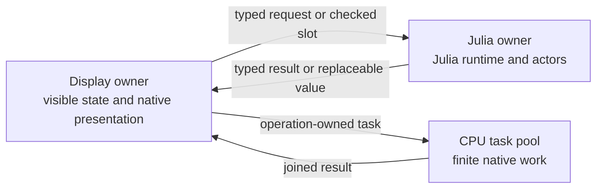

# Euclid Architecture Summary

> Euclid is an Odin-hosted desktop application: Odin owns the display, native
> resources, and visible state, while a dedicated Julia thread runs animation and
> content policy. Typed messages and explicit owner-controlled handoffs connect them.
> This guide maps those boundaries to the code and specialist guides, and records the
> architectural history that explains why the system is shaped this way.

## Table Of Contents

1. [What This Project Is](#what-this-project-is)
1. [Where To Start Reading](#where-to-start-reading)
1. [Module Map (Odin + Julia)](#module-map-odin--julia)
1. [Execution And Ownership Model](#execution-and-ownership-model)
1. [Architecture Guide Map](#architecture-guide-map)
1. [Odin's Three-Layer Architecture](#odins-three-layer-architecture)
1. [Julia Actor Architecture](#julia-actor-architecture)
1. [Terminal Architecture (Interactive Runtime Surface)](#terminal-architecture-interactive-runtime-surface)
1. [Odin-Julia Bridge: How the Boundary Works](#odin-julia-bridge-how-the-boundary-works)
1. [Testing Strategy](#testing-strategy)
1. [Allocation Strategy: Init-First with Explicit Exceptions](#allocation-strategy-init-first-with-explicit-exceptions)
1. [Build And Packaging](#build-and-packaging)
1. [Practical Contributor Guide](#practical-contributor-guide)
1. [Key Architecture Takeaways](#key-architecture-takeaways)
1. [Addendum: Architectural History](#addendum-architectural-history)

## What This Project Is

Euclid is a desktop application for geometric constructions, animation, and
mathematical presentation. Odin owns the application and display runtime; embedded
Julia provides animation and content policy. They cooperate through a typed bridge,
not through shared mutable scene state.

| Think of | As |
| --- | --- |
| Odin | The host, native application, and authority for visible state |
| Julia | The embedded content and animation runtime, entered only by its owner thread |
| CPU task pool | Finite native work whose results return to an owning thread at a join |
| Architecture guides | Entry points and motivation; implementation and tests are authoritative |

## Where To Start Reading

Choose a path based on what you need to understand:

| If you are trying to... | Start with |
| --- | --- |
| Understand one ordinary display frame | [`src/view/frame.odin`](../../../src/view/frame.odin), then [`src/view/view.odin`](../../../src/view/view.odin) |
| Trace process startup or shutdown | [`src/main.odin`](../../../src/main.odin), [`src/app/`](../../../src/app/), [`src/view/window_session.odin`](../../../src/view/window_session.odin) |
| Follow a Julia request across the language boundary | [`JuliaThreadArchitecture.md`](JuliaThreadArchitecture.md), [`src/bridge/runtime_service.odin`](../../../src/bridge/runtime_service.odin) |
| Find a UI control or panel | [`UiSystem.md`](UiSystem.md), [`src/view/ui/`](../../../src/view/ui/) |
| Change geometry, particles, text, or persistent data | Use the [guide map](#architecture-guide-map) to find that subsystem's entry point |
| Change style, animation content, localization, or tests | [`CodingStandards.md`](CodingStandards.md), [`AnimationsStyle.md`](AnimationsStyle.md), [`Localization.md`](Localization.md), [`TestingStrategy.md`](TestingStrategy.md) |

For a first code-reading pass, follow one vertical path—such as a frame, a Terminal
request, an animation tick, or a presentation value—from its coordinator to its state
owner and publication point. The guide map identifies likely owners without attempting
to restate their internal protocols.

## Module Map (Odin + Julia)

The useful shape of the repository is not simply two language inventories. These
tables group code by the architectural question a contributor is likely to ask.

### Application and coordination

| Area | Responsibility | Start in |
| --- | --- | --- |
| Process and app setup | Arguments, startup composition, resolved settings, user-store lifetime | [`src/main.odin`](../../../src/main.odin), [`src/app/`](../../../src/app/) |
| Application composition | Whole-app state and run settings; does not own every reachable model | [`src/core/core.odin`](../../../src/core/core.odin) |
| Display coordinator | Frame order, UI preparation, simulation, presentation, drawing | [`src/view/`](../../../src/view/) |
| Julia host and bridge | Julia lifetime, typed transport, ABI exports, request/result routing | [`src/bridge/`](../../../src/bridge/), [`src/julia/host/`](../../../src/julia/host/) |
| Native backend | SDL3 window, input, GPU, audio, and platform-affine work | [`src/view/native/`](../../../src/view/native/) |

### Reusable models and runtime systems

| Area | Responsibility | Start in |
| --- | --- | --- |
| Core substrate | Bounded storage, animation-generation memory, protocols, portable values | [`src/core/storage/`](../../../src/core/storage/), [`src/core/animation/`](../../../src/core/animation/), [`src/core/protocol/`](../../../src/core/protocol/) |
| Geometry and constraints | Shape world, curves, tools, constraints, render preparation | [`src/shapes/`](../../../src/shapes/) |
| Particles | Dust and particle state, field physics, worker updates | [`src/particles/`](../../../src/particles/) |
| UI and interaction | Regions, widgets, panels, focus, accessibility semantics | [`src/view/ui/`](../../../src/view/ui/) |
| Terminal | Display-owned terminal surface and services, connected to Julia session policy | [`src/view/terminal/`](../../../src/view/terminal/) |
| Dynview | Native semantic text model, compilation, math measurement, and layout | [`src/dynview/`](../../../src/dynview/) |
| Fonts | Face loading, shaping support, worker preparation, display publication | [`src/view/font/`](../../../src/view/font/) |
| Simulation and capture | Fixed-step execution, task joins, screenshots and GIF policy | [`src/view/simulation/`](../../../src/view/simulation/), [`src/view/capture/`](../../../src/view/capture/) |

### Content, persistence, and evidence

| Area | Responsibility | Start in |
| --- | --- | --- |
| Content catalogue and search | Packaged catalogue admission, generations, search service | [`src/core/content/`](../../../src/core/content/), [`src/view/content/`](../../../src/view/content/) |
| User preferences | Typed settings plus separate durable user-data storage | [`src/settings/`](../../../src/settings/), [`src/userdata/`](../../../src/userdata/) |
| SQLite boundary | Native bindings and owned database/query policy | [`src/sqlite/`](../../../src/sqlite/) |
| Julia runtime policy | Sysimage host, actor runtime, animation and Terminal policy | [`src/julia/`](../../../src/julia/) |
| Authored content | Animation modules and their content-facing helpers | [`src/content/`](../../../src/content/) |
| Evidence and diagnostics | Typed behavioral evidence, scenarios, profiles, and operational logs | [`src/evidence/`](../../../src/evidence/), [`src/diagnostics/`](../../../src/diagnostics/) |
| Build and analysis | Build orchestration, tests, static analysis, assets, and wiki | [`tools/`](../../../tools/) |

The [Architecture Guide Map](#architecture-guide-map) provides the next step for each
subsystem. For dependency ownership and normative code rules, see
[Coding Standards](CodingStandards.md).

## Execution And Ownership Model

Euclid's main runtime roles are distinct owners, not interchangeable worker threads:

| Owner | Owns | Publishes or hands off |
| --- | --- | --- |
| Display thread | Visible UI and scene state, window/GPU resources, input, frame and fixed-step ordering | Validated Julia results; tasks with explicit payload ownership |
| Julia owner thread | Julia C API and heap roots, content generations, one actor scheduler, Julia-side policy | Typed egress messages, checked animation results, presentation values |
| CPU task pool | Native data while a finite operation is active | Joined result to the submitting owner |

```mermaid
flowchart LR
    Display[Display owner<br/>visible state and native presentation]
    Julia[Julia owner<br/>Julia runtime and actors]
    Workers[CPU task pool<br/>finite native work]

    Display -->|typed request or checked slot| Julia
    Julia -->|typed result or replaceable value| Display
    Display -->|operation-owned task| Workers
    Workers -->|joined result| Display
```

Only the Julia owner enters Julia. Julia actors organize policy on that thread; they are
not the transport and do not own display state. The display remains responsible for
validating and committing results. Native tasks likewise return data through explicit
joins rather than publishing visible state themselves.

These boundaries enable Julia work to overlap ordinary display work, but they do not
make Julia parallel or guarantee independence from CPU and memory pressure. Animation
execution is asynchronous while its validated effects commit at fixed-step boundaries.
See [Julia Thread Architecture](JuliaThreadArchitecture.md) for the message and timing
model.

## Architecture Guide Map

Use the focused guide before following implementation details. The code and tests remain
the authority for current behavior.

| Task or subsystem | Guide | Code entry |
| --- | --- | --- |
| Understand the UI, widgets, layout, and input | [UI System](UiSystem.md) | [`src/view/ui/`](../../../src/view/ui/) |
| Understand Julia ownership, actors, messages, and ticks | [Julia Thread Architecture](JuliaThreadArchitecture.md) | [`src/bridge/`](../../../src/bridge/), [`src/julia/`](../../../src/julia/) |
| Work on the Terminal surface and runtime | [Terminal Architecture](TerminalArchitecture.md) | [`src/view/terminal/`](../../../src/view/terminal/), [`src/julia/`](../../../src/julia/) |
| Change shapes, curves, or constraints | [Shape System](ShapeSystem.md) | [`src/shapes/`](../../../src/shapes/) |
| Change particles or dust-field behavior | [Particle System](ParticleSystem.md) | [`src/particles/`](../../../src/particles/) |
| Trace glyph preparation and rendering | [Font Rasterization](FontRasterization.md) | [`src/view/font/`](../../../src/view/font/) |
| Work on semantic access and platform adapters | [Accessibility](Accessibility.md) | [`src/accessibility/`](../../../src/accessibility/), [`src/view/native/accessibility/`](../../../src/view/native/accessibility/) |
| Work on packaged content, user settings, or SQLite | [SQLite Architecture](Sqlite3.md) | [`src/sqlite/`](../../../src/sqlite/), [`src/view/content/`](../../../src/view/content/), [`src/userdata/`](../../../src/userdata/) |
| Work on native tool visuals | [Tool Rendering](ToolRendering.md) | [`src/view/world/`](../../../src/view/world/) |
| Author animation behavior | [Animations Style](AnimationsStyle.md) | [`src/content/`](../../../src/content/) |
| Author or modify mathematical presentation | [LaTeX Support](LaTeXSupport.md) | [`src/dynview/`](../../../src/dynview/) |
| Change localized application/content messages | [Localization](Localization.md) | [`src/view/messages/`](../../../src/view/messages/), [`src/julia/localized_content.jl`](../../../src/julia/localized_content.jl) |
| Decide how to validate a behavior change | [Testing Strategy](TestingStrategy.md) | [`tools/scenarios/`](../../../tools/scenarios/), owning subsystem tests |
| Change repository rules | [Coding Standards](CodingStandards.md) | [`tools/analysis_settings.jl`](../../../tools/analysis_settings.jl) |

`WikiComposition.md` documents a narrow wiki-generation convention rather than a
runtime subsystem.

## Odin's Three-Layer Architecture

The Odin side is organized around three architectural layers. This is more than a
directory map: it is the intended separation between reusable domain capabilities,
whole-application wiring, and runtime orchestration.

| Layer | Role | Typical homes |
| --- | --- | --- |
| **Reusable substrate** | Owns domain models, algorithms, storage, and protocols. It should work without knowing which complete application composes it. | [`src/shapes/`](../../../src/shapes/), [`src/particles/`](../../../src/particles/), [`src/dynview/`](../../../src/dynview/), [`src/core/storage/`](../../../src/core/storage/), [`src/core/protocol/`](../../../src/core/protocol/) |
| **Application composition** | Defines the small set of whole-application state and run settings, then wires the participating systems together. It is the composition root, not a general home for every model reachable from app state. | [`src/core/core.odin`](../../../src/core/core.odin) |
| **Coordinating systems** | Own executable behavior and orchestration: receive input or requests, order work, call the relevant substrate, and publish results at the correct owner boundary. | [`src/view/`](../../../src/view/), [`src/bridge/`](../../../src/bridge/) |

The aspiration is that dependencies point toward reusable capabilities: substrate
does not import the application composition root, and these layers do not form cycles.
That keeps models independently understandable and lets coordinators compose them
without turning application state into a universal dependency. A more-specific model
can live beneath a coordinator's directory while still belonging architecturally to
the substrate; responsibility and dependency direction matter more than the folder
name.

This is an intended shape, not a claim that every package is already perfectly
separated. The [Coding Standards](CodingStandards.md#package-dependency-direction)
define the enforceable dependency rules. On the Julia side, the complementary
architectural story is the [actor framework](#julia-actor-architecture): actors
organize serialized Julia policy, while typed bridge transport and display ownership
remain separate concerns.

View is a particularly unwieldy module that has continued to grow, and candidates continue
to exist for refactoring specialized cores into the substrate layer. This work may well
continue in the future.

## Julia Actor Architecture

One Julia actor scheduler organizes Terminal and animation policy on the dedicated
Julia owner thread. Typed bridge links and checked slots carry cross-thread requests
and results; actors do not. See [Julia Thread Architecture](JuliaThreadArchitecture.md)
for the details and code routes.

## Terminal Architecture (Interactive Runtime Surface)

Terminal combines an Odin-owned interactive surface and native process resources with
Julia-owned evaluation and session policy. It is integrated into View but retains its
own state and lifecycle. See [Terminal Architecture](TerminalArchitecture.md) for
ownership, messaging, evaluation, rendering, and lifecycle.

## Odin-Julia Bridge: How the Boundary Works

The bridge is a closed typed contract, not a generic callback queue. Small requests and
results use producer-owned bounded messages; animation work and other long-lived
payloads use checked slots or immutable snapshots. Odin validates and publishes
results to the owner of visible state. Keep Odin exports, Julia wrappers, message
identity, and failure handling symmetric.

Start at [`src/bridge/model/`](../../../src/bridge/model/),
[`src/bridge/runtime_service.odin`](../../../src/bridge/runtime_service.odin), and
[`src/julia/odin-julia-bridge.jl`](../../../src/julia/odin-julia-bridge.jl). Follow
[Julia Thread Architecture](JuliaThreadArchitecture.md) for the transport and
publication patterns.

## Testing Strategy

| Layer | Best for |
| --- | --- |
| Unit and module tests | Local behavior, data structures, and subsystem invariants |
| Semantic traces | Typed evidence at owner-controlled state transitions |
| Scenarios | Debug/test display workflows involving ordering, input, rendering, capture, or shutdown |
| Headless harness | Deterministic bridge/runtime behavior through the fixed-step boundary |

See [Testing Strategy](TestingStrategy.md) for authoring scenarios, evidence
interpretation, commands, and coverage limits. Use the evidence type appropriate to the
claim: a screenshot, diagnostic log, profile, and semantic trace answer different
questions.

## Allocation Strategy: Init-First with Explicit Exceptions

Allocation policy is normative in [Coding Standards](CodingStandards.md#allocation-and-lifetime).
In brief, choose storage by owner and lifetime, reuse bounded storage in steady-state
paths, and detach borrowers before resetting arenas. The shared animation allocator is
available for native data that should live for one animation generation; temporary
scratch and Julia GC roots follow separate lifetimes.

## Build And Packaging

CMake presets are the cross-platform build entry point; `tools/make.jl` owns the
domain-specific build, tests, analysis, evidence, and asset commands. Packaged runtime
assets include Julia content and the deterministic content catalogue. Keep build and
verification procedures in the [Coding Standards](CodingStandards.md) and
[Testing Strategy](TestingStrategy.md) guides, rather than duplicating command matrices
here.

## Practical Contributor Guide

Choose the owner first, then follow its focused guide and tests:

| Change | First code route | Read next |
| --- | --- | --- |
| Process lifecycle or frame ordering | [`src/main.odin`](../../../src/main.odin), [`src/view/frame.odin`](../../../src/view/frame.odin) | [Julia Thread Architecture](JuliaThreadArchitecture.md) if Julia work is involved |
| UI control, panel, or focus behavior | [`src/view/ui/`](../../../src/view/ui/) | [UI System](UiSystem.md) |
| Shape or constraint behavior | [`src/shapes/`](../../../src/shapes/) | [Shape System](ShapeSystem.md) |
| Dust or particle behavior | [`src/particles/`](../../../src/particles/) | [Particle System](ParticleSystem.md) |
| Terminal feature | [`src/view/terminal/`](../../../src/view/terminal/) | [Terminal Architecture](TerminalArchitecture.md) |
| Julia bridge or animation policy | [`src/bridge/`](../../../src/bridge/), [`src/julia/`](../../../src/julia/) | [Julia Thread Architecture](JuliaThreadArchitecture.md) |
| Authored animation | [`src/content/`](../../../src/content/) | [Animations Style](AnimationsStyle.md) |
| Presentation parsing or rendering | [`src/dynview/`](../../../src/dynview/) | [LaTeX Support](LaTeXSupport.md), [Font Rasterization](FontRasterization.md) |
| Content database or saved preferences | [`src/view/content/`](../../../src/view/content/), [`src/userdata/`](../../../src/userdata/) | [SQLite Architecture](Sqlite3.md) |

For a new animation, add its Julia implementation under `src/content/`, follow the
`animation_entry` and view-content contracts in [Animations Style](AnimationsStyle.md),
and update the build-time catalogue inputs. If the feature needs a new host capability,
change the Odin export and Julia wrapper together, then test the boundary and its
owner-controlled publication.

## Key Architecture Takeaways

- Odin is the host and authority for visible state, native resources, and frame order.
- Julia is a dedicated, serialized content and policy runtime—not a display-state owner.
- CPU tasks perform finite native work and return results through explicit joins.
- Typed messages, immutable snapshots, and checked slots are intentional alternatives
  for different cross-owner payloads.
- State belongs to the subsystem that owns its lifetime; `src/core` is composition,
  not a universal model package.
- Focused architecture guides point into code; implementation and tests define current
  behavior.

## Addendum: Architectural History

This is selected architectural context, not a release-by-release changelog. Add a note
when a significant change helps explain a current ownership boundary, design choice, or
contributor route.

This addendum is intentionally selective and should remain useful rather than
exhaustive. When adding a historical note, state what changed and why it helps explain
today's architecture; avoid turning the section into a dated feature changelog.

### From notebook experiments to a native application

Euclid began as Julia experiments for drawing Euclid's *Elements* with GLMakie in
Jupyter notebooks, including two- and three-dimensional transformations. The desktop
application took shape separately from an Odin isometric kinematic stick-figure
experiment. Its reusable shape system, pen, and compass grew from that work, initially
using Raylib as the principal native dependency.

The first desktop interface was a fixed-order set of controls: an animation sidebar,
text along the bottom, and a small Library toolbar. Settings and GIF capture joined the
right-hand area; GIF controls later became their own accordion section. Early
particles supplied trails and flicker, then dust. The first particle model used
cell-based collision detection and ordinary Newtonian motion. A custom GIF encoder
provided the first capture path.

### Julia moved from frame callback to owner thread

Julia was added to drive shape animations and initially ran on the display thread.
That connected content to the scene quickly, but meant evaluation, callbacks, and
runtime work all had to return to the thread responsible for frames. As Julia use and
interactive work grew, it was moved to a persistent owner thread, with a separate
native task pool for finite parallel work. The owner thread established a single place
for Julia C API access and enabled more asynchronous workflows while keeping display
state under Odin ownership.

### Content, tools, and native preparation expanded

Proclus and then Hilbert broadened the authored animation catalogue; later content
areas included Algebra, Logic, Curves, and Tarski. Asset packaging and hot reload made
content iteration less dependent on rebuilding the application. GPU shaders added
three-dimensional-looking tools and dust instancing. Platform support expanded across
Linux, macOS, and Windows.

The particle system moved to a structure-of-arrays layout and SIMD-capable operations,
then to a PIC-style grounded dust model: particles deposit into a vector field, field
physics run there, and results return to particles. These changes reflect a shift from
individual per-particle behavior toward explicit data-oriented simulation stages.

### Julia host and interactive session matured

The early Scratchpad provided limited Julia REPL behavior tied closely to animation
shapes. It evolved into Terminal: an interactive emulator with Julia evaluation,
completion and shell modes, session lifecycle, and terminal graphics protocols.
Generation-scoped actors grew around Terminal policy and were later extended to
animation supervision. The sysimage-based host and reloadable animation modules made
startup and content replacement more deliberate.

The Julia/Odin static-analysis tooling also grew into a project of its own, while
continuing to enforce repository-specific rules for the mixed-language codebase.
The build moved from early Julia scripts and make wrappers to a CMake preset entry
point, retaining Julia tooling for domain-specific build and verification work.

### Text and fonts became a native pipeline

The first mathematical text path parsed LaTeX in Julia, sent drawing commands to Odin,
and used Raylib font features plus custom fraction and radical drawing. Font work grew
from stb through HarfBuzz and math-font support. Later, TeX parsing moved into Odin so
semantic parsing and renderer behavior could share a native boundary; MIME-based
presentation APIs separated authored content from rendering policy.

The renderer moved from stb/Raylib font handling to FreeType and HarfBuzz under SDL.
Text support expanded with OpenType MATH data and embedded Euclid shape artifacts.
The current ownership and handoff paths are described in
[Font Rasterization](FontRasterization.md) and [LaTeX Support](LaTeXSupport.md).

### From Raylib to SDL, and from controls to systems

Raylib was replaced by SDL3 and SDL_GPU, removing the prior backend dependency.
Tool and dust shaders moved to HLSL with SDL_shadercross for platform shader
translation. Image handling moved from stb and custom GIF code to SDL_image; drawing
audio was later reintroduced through SDL with a looping sound source.

The UI evolved from fixed-order controls into reusable widgets, organized panels,
accordion navigation, routed input and focus, localization, and accessibility
integration. Portrait and landscape layouts and a startup presentation joined the
display path. AccessKit support introduced semantic controls and native adapters, with
platform limitations remaining an active area for evaluation.

### Content data became explicit

SQLite was first introduced for full-text animation search with FTS5 and spellfix.
Julia sidecars became a source for authored presentation and searchable prose, while
Odin built and queried the packaged content database. Localization definitions were
then added to the content database. Durable user preferences later gained a separate
mutable SQLite database, distinct from the packaged catalogue.
