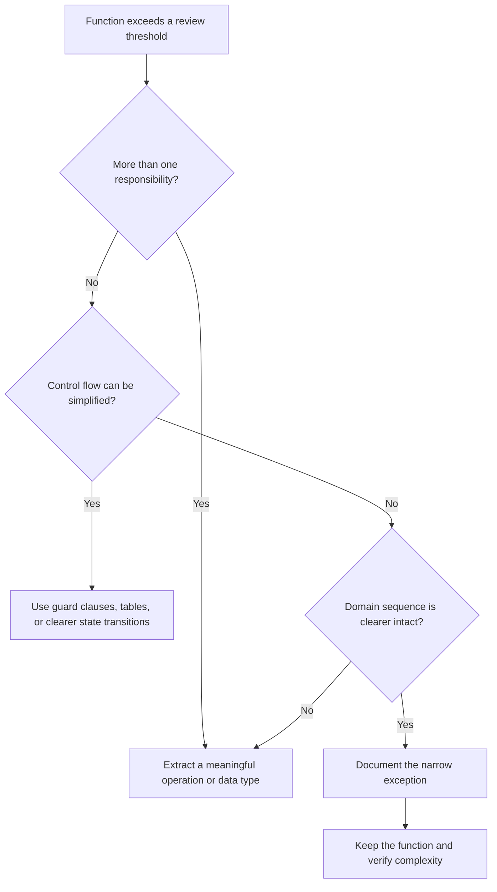

# Coding Standards

This document and `tools/analysis_settings.jl` are the coding sources of truth
for this repository. This guide defines the reviewable human standard;
`tools/analysis_settings.jl` is the living configuration for its automated
enforcement.

## Table Of Contents

1. [Purpose](#purpose)
1. [How To Read This Standard](#how-to-read-this-standard)
1. [Upstream Style Relationship](#upstream-style-relationship)
1. [Fast Compliance Checklist](#fast-compliance-checklist)
1. [Global Rules](#global-rules)
1. [Verification Gate](#verification-gate)
1. [Odin-Julia Boundary Rules](#odin-julia-boundary-rules)
1. [Odin Rules (Required)](#odin-rules-required)
1. [Julia Rules (Required)](#julia-rules-required)
1. [Documentation Rules](#documentation-rules)
1. [Error Handling, Performance, Safety](#error-handling-performance-safety)
1. [Standard Updates](#standard-updates)

## Purpose

This document converts language-community guidance and project experience into
reviewable rules for Euclid. It is intentionally concise, but not at the
expense of rationale, scope, or enforcement.

## How To Read This Standard

Normative language and enforcement labels:

| Term | Meaning |
| --- | --- |
| **MUST** | Required. A violation blocks acceptance unless this document names an exception. |
| **SHOULD** | Strong default. Deviations require a concrete readability or correctness reason. |
| **MAY** | Optional and context-dependent. |
| **Automated** | Checked by `make test` (the `julia make.jl -vt` gate), compiler flags, tests, or vet analysis. |
| **Review** | Checked during code review because reliable automation is not yet available. |

### Living Automated Policy

`tools/analysis_settings.jl` is the current source of truth for analyzer rule
responses, thresholds, scan configuration, and reviewed exceptions. It layers
Euclid-specific policy over the analysis engine's baseline settings in
`tools/analysis/settings.jl`.

When a standard is automated, this document must agree with the active project
settings. Update both surfaces when changing policy; do not document an
enforcement level, threshold, or exception that the active settings do not
implement.

When guidance conflicts, use this precedence:

1. Safety, correctness, ownership, and ABI requirements.
1. Active automated policy in `tools/analysis_settings.jl`.
1. Repository-specific rules in this document and `ArchitectureSummary.md`.
1. Established local module conventions.
1. Upstream Odin or Julia style guidance.

An exception should state what rule is being relaxed and why the normal form is
worse in that case. It should also explain how correctness or readability
remains protected. Do not add comments merely to excuse weak code; improve the
code first.

## Upstream Style Relationship

This standard incorporates and specializes:

- [Odin examples naming and style conventions](https://github.com/odin-lang/examples/wiki/Naming-and-style-convention)
- [Julia style guide](https://docs.julialang.org/en/v1/manual/style-guide/)

| Area | Upstream default | Euclid policy |
| --- | --- | --- |
| Odin indentation | Tabs for indentation; spaces for alignment. | **Four spaces; tabs forbidden.** |
| Odin vet flags | Includes `-vet-tabs`. | Uses strict flags but omits `-vet-tabs`. |
| Odin naming | Ada types; snake values; screaming constants. | Adopted; bridge names remain symmetric. |
| Odin initialization | Prefer inference and complete initializers. | Adopted with boundary exceptions. |
| Julia indentation | Four spaces. | Adopted. |
| Julia naming | Lowercase; `!` for argument mutation. | Adopted; use `snake_case` when needed. |
| Julia typing | Generic unless dispatch requires constraints. | Adopted; ABI wrappers use exact types. |

Repository policy wins where it deliberately differs. In particular, never
introduce tabs into Odin files to match the upstream examples repository. The
Odin build uses `-vet -strict-style`, `-disallow-do`, and
`-warnings-as-errors`. Explicit types remain appropriate where ABI layout or
numeric width is part of the contract.

## Fast Compliance Checklist

Before marking work complete, verify all items below:

- Build + vet + tests run with `make test` (the standard Makefile path; equivalently
  `julia make.jl -vt`).
- No hidden per-frame allocation growth in host-side hot paths.
- Odin and Julia bridge changes are symmetric and documented.
- Ownership is explicit: who allocates, mutates, and frees.
- Functions stay within size/complexity limits or include justification.
- Return shapes use one value or, when genuinely clearer, a two-item tuple.
- No Odin or Julia closing parenthesis begins its own continuation line.
- Every named Odin procedure and Julia function has a useful doc comment or docstring.
- Doc comments explain contracts, intent, and side effects rather than narrating syntax.
- Public API names, mutation signals, argument order, and type constraints
  match language conventions.
- Canonical validation occurs at boundaries; internal code does not repeatedly
  normalize bad input.

## Verification Gate

Before work is complete, run the standard Makefile target:

```sh
make test
```

`make test` is the preferred path on systems that support `make`. It runs
`tools/configure.sh` once (verifying the toolchain and installing Julia dependencies)
and then the full driver gate, equivalent to `julia make.jl -vt`. `make check` is an
alias.

`make vet` alone is insufficient because it omits tests. Running tests alone is
insufficient because it omits the build and repository analysis. Do not report the
combined gate as passing when a phase was skipped.

| Surface | Enforcement | Expected result |
| --- | --- | --- |
| Odin build/style | Analysis engine's strict analytical Odin build | No warnings or style failures. |
| Odin behavior | `odin test src -all-packages` through the verification gate | All tests pass. |
| Julia behavior | `src/julia/test/runtests.jl` through the verification gate | All tests pass. |
| Julia static analysis | JET entry-point analysis via OdinJuliaAnalysis | No actionable reports. |
| Julia/Odin complexity | Function metric rules with reviewed exceptions | No blocking rows; reviewed warnings only. |
| Analysis report | `.build/reports/analysis.md` | No failures and no unexplained new warning. |
| Documentation structure | Markdown rules and review | Valid headings, links, fences, and line length. |

Run the narrowest relevant test while developing, then run the complete gate
before delivery. A new warning is work to understand, even when the current
report classifies it as nonblocking.

## Global Rules

### Readability and Determinism

- Prefer clear, deterministic behavior over cleverness.
- Keep module boundaries explicit and predictable.
- Avoid mutable global variables.
- Prefer structs over long tuples and over long parameter lists when inputs
  form one coherent data shape.
- Prefer established language and repository idioms over custom mini-frameworks.
- Keep the happy path visually prominent; validate or reject exceptional states
  at boundaries.
- Name values for their domain meaning, not their temporary implementation role.

### Command-Line Short Flags

For paired command-line options, lowercase short flags MUST enable the option
and the corresponding uppercase flag MUST disable it, such as `-a`/`-A`.
Combined short groups are allowed and are applied left to right, so the last
occurrence wins. Unpaired actions such as help or clean remain lowercase.

### Line Length

- 90 chars: warning threshold.
- 100 chars: discouraged.
- 120 chars: hard upper bound except unavoidable cases.

### Closing Parenthesis Placement (Absolute)

In both Odin and Julia, a closing `)` MUST remain on the same physical line as
the final parameter or argument. This applies to procedure/function
declarations, definitions, calls, macro invocations, and any other wrapped
parenthesized construct.

The following continuation-line forms are wholesale forbidden:

- a line containing only `)`;
- a line beginning with `) {`;
- a line beginning with `) -> Return_Type`;
- a line beginning with `) -> Return_Type {`;
- a line beginning with `)::ReturnType` or `) = begin`;
- any equivalent form that moves the closing delimiter away from the final item.

This rule has no style exception for a long return type or header. Reflow
earlier parameters, use a meaningful named return type, or otherwise
restructure the declaration. Do not solve line length by moving `)` or the
tokens that complete its header onto a new line.

Code review MUST reject a violation even when the compiler or formatter accepts it.

### Function Size and Complexity

- A function/procedure SHOULD remain at or below 20 executable lines.
- More than 20 executable lines requires review justification; more than 30
  requires a documented exception and a clear reason decomposition would make
  the code worse.
- Each function/procedure must have one clear responsibility.
- If parameter count exceeds 5, reevaluate and group related inputs.
- Cyclomatic complexity SHOULD remain at or below 10 and MUST remain below 15
  unless a documented exception is granted.
- Do not split into trivial wrappers only to satisfy line-count rules.

The analysis report records executable lines, parameter count, and cyclomatic
complexity for both languages.
Julia complexity above 10 is blocking outside configured content-script exceptions.
Odin complexity at or above 15 is blocking, and 11-14 produces a warning. Executable
line and parameter count remain review signals in both languages. Exceptions are
reviewed entries in `tools/analysis_settings.jl` with drift detection rather than
inline markers.

The analyzer also classifies every allocation call site by allocator source. An
allocation it cannot classify is a **blocking** analysis failure; an implicit or
explicit default-heap allocator (`context.allocator`, `heap.allocator()`) produces
a warning. Dynamic-array mutators (`append`, `reserve`, `resize`) are exempt because
the array carries its allocator from creation. Documented exceptions are
`ReviewedAllocationPolicy` entries in `tools/analysis_settings.jl` with a reason,
such as a process-lifetime singleton created once at startup.

Use this decision path when a function grows:



### Return Shape

Odin procedures and Julia functions SHOULD return one semantic value. A tuple
return SHOULD contain no more than two items. When three or more values belong
together, define a named struct instead.

| Shape | Policy | Typical use |
| --- | --- | --- |
| One value | Preferred | Entity, collection, status, or named result struct. |
| Two-item tuple | Allowed when the relationship is immediate | `(value, ok)` or `(result, status)`. |
| Three or more tuple items | Strongly discouraged | Replace with a named result struct. |
| Nested tuple used to avoid the limit | Forbidden | Model the result explicitly. |

A collection, optional/union result, or named struct counts as one value. The
concern is positional return arity, not the number of elements inside a
returned collection or variants in one return type.

Prefer a named result struct when any of these conditions apply:

- callers need more than two returned values;
- fields have units, ownership, lifecycle, or validity relationships;
- several call sites destructure the same positional shape;
- the result is likely to gain fields;
- field names would make review safer than positional order;
- success/failure carries payload, diagnostics, or partial-progress metadata.

An exception for more than two positional values requires explicit review
justification. Acceptable reasons are narrow, such as compatibility with an
external ABI or a language-mandated callback shape. Convenience, avoiding a
small struct, or preserving an accidental local pattern is not sufficient.

Do not introduce a reusable abstraction solely to avoid a clear local two-item
tuple. Conversely, do not keep a wide tuple merely because destructuring makes
the call site superficially short.

## Odin-Julia Boundary Rules

### Bridge Contract

- Treat the bridge as a strict API contract.
- New bridge capabilities must be added symmetrically:
  - Odin exported function.
  - Julia wrapper function.
  - Input/output and side-effect documentation.
- Bridge APIs should use explicit action-oriented names.

### Ownership and Failure Semantics

- Boundary APIs must document:
  - allocator/owner,
  - mutator,
  - lifecycle manager.
- Mutating operations must be clearly named.
- Boundary errors must be surfaced predictably.
- Do not hide failures behind silent fallbacks unless explicitly documented.
- Every Julia C API call MUST execute on the persistent Julia owner thread.
  Externally reachable worker tasks MUST assert owner identity before calling
  Julia or a helper that calls Julia.
- Cross-thread requests and events MUST use bounded service-owned storage or
  self-contained copied payloads. Their owner, recycler, generation identity,
  and saturation behavior MUST be explicit.
- Worker completion MUST report success or failure with request identity.
  Required lifecycle messages MUST retry with a bounded terminal policy rather
  than being silently dropped.

## Odin Rules (Required)

### Naming

| Construct | Form | Example |
| --- | --- | --- |
| Import name | `snake_case`; prefer one word | `strings`, `raylib`, `font_core` |
| Type | `Ada_Case` | `Scene_Command_Batch` |
| Enum value | `Ada_Case` | `Request_State.Ready` |
| Procedure | `snake_case` | `publish_scene_batch` |
| Parameter/local | `snake_case` | `request_index` |
| Constant | `SCREAMING_SNAKE_CASE` | `MAX_SCENE_COMMANDS` |

Names SHOULD communicate domain role and units where ambiguity is possible:

- Prefer `elapsed_seconds`, `point_index`, and `command_count` over `value`,
  `id`, and `size`.
- Avoid repeating package or type context that is already obvious at the call site.
- Boolean names SHOULD read as predicates: `is_ready`, `has_capacity`, `should_publish`.
- Use established bridge ABI names exactly. Do not improve one side independently.
- Avoid abbreviations unless they are conventional in this codebase or domain,
  such as `abi`, `ui`, `io`, `dt`, or `ptr` at an interop boundary.

### Formatting

| Rule | Required form |
| --- | --- |
| Indentation | Four spaces per level; tabs are forbidden, including alignment. |
| Braces | Opening brace remains on the declaration or control-flow line. |
| Binding spacing | `value: int` and `value := 5`; never `value : int` or `value:=5`. |
| Wrapping | Indent continuation lines by four spaces; align further only when it aids scanning. |
| Delimiter close | Keep `)` with the final parameter or argument in declarations and calls. |
| Return/brace | Do not isolate `->` or `{` from the header it completes. |
| Blank lines | Separate conceptual blocks, not every statement. |

```odin
build_scene_batch :: proc(
    state: ^Euclid_General_State,
    generation: u64) -> (Scene_Command_Batch, bool) {
    batch := Scene_Command_Batch {
        generation = generation,
    }
    return batch, validate_scene_batch(state, &batch)
}
```

Keep wrapped calls compact, but do not compress unrelated arguments onto a line
merely to save vertical space. If a signature repeatedly exceeds the line
limit, reconsider the data shape before inventing unusual alignment.

For Odin, `generation: u64) -> (Scene_Command_Batch, bool) {` demonstrates the
required terminal shape. The final parameter, closing parenthesis, return
declaration, and opening brace remain one continuous header.

### Compiler Cleanliness

Odin production code MUST compile cleanly under:

```text
-vet -strict-style -disallow-do -warnings-as-errors
```

These flags catch unused values, shadowing, discouraged syntax, and other style
defects. The repository intentionally does not use `-vet-tabs`, because that
flag requires tabs while this project requires spaces. Do not suppress a
warning when a clearer declaration or control flow removes it.

### Design and Initialization

- Prefer `value := expression` when the inferred type is clear and is not
  itself a contract.
- Use an explicit type for ABI layout, fixed numeric width, union selection,
  empty/default values, or when it materially improves understanding.
- Prefer `value := Some_Type { ... }` over `value: Some_Type = { ... }`.
- Initialize coherent state in one struct literal rather than declaring and
  assigning fields later.
- Use field names in nontrivial literals. Positional literals are acceptable
  only when their meaning is immediate and stable.
- Avoid mutable globals. Constants and immutable lookup data are acceptable
  when module ownership is clear.

```odin
runtime := Julia_Runtime_Service {
    owner_thread_id = owner_thread_id,
    state           = .Starting,
}
```

Do not repeat a type annotation that inference already proves unless that
annotation documents a meaningful boundary.

### Procedures and Control Flow

- Give each procedure one observable purpose.
- Prefer guard clauses when they remove deep nesting and keep failure paths short.
- Keep state transitions explicit; do not encode lifecycle state in unrelated booleans.
- Prefer a struct when several parameters travel together or share validation/ownership.
- Do not use `do` syntax; the build rejects it with `-disallow-do`.
- Avoid hidden mutation through broadly shared pointers. Pass the narrow owner
  or subsystem needed.
- For an approved two-item tuple, return the primary value first and status
  second unless an established API contract requires another order.
- Replace wider positional returns with an `Ada_Case` result struct and
  descriptive fields.

### Comments and Function Placement

- Public/cross-file functions should appear near the top of a file.
- Every named procedure MUST have a doc comment directly above its declaration,
  including local and file-private helpers.
- Every reusable named type, enum, procedure group, and package-level
  subsystem contract MUST have a doc comment.
- A concise one-sentence comment is sufficient for a simple helper, but omission is not.
- Keep helpers near the owning operation when they are not part of the
  package-facing surface.
- Document invariants, ownership, units, valid ranges, and failure semantics
  that types do not show.
- Do not narrate assignments, loops, or conditionals that are already clear from the code.

```odin
// Return the published scene batch when its generation is current.
resolve_scene_batch :: proc(
  state: ^Euclid_General_State,
  generation: u64) -> (Scene_Command_Batch, bool) {
    // ...
}
```

Use normal Odin documentation comments immediately before the declaration. Do
not separate the comment from its declaration with unrelated constants,
attributes, or implementation notes.

### Resource Management

- Make allocation owner, mutation owner, recycler, and teardown point
  identifiable from the API.
- Use `defer` when multiple exits require the same guaranteed cleanup.
- Avoid `defer` in a simple single-exit path when direct cleanup preserves
  clearer linear flow.
- Pair acquisition and cleanup visibly. Transfer ownership only through a
  documented operation.
- Do not retain temp-allocator memory beyond its reset boundary.
- Use bounded, preallocated storage in steady frame paths unless an approved
  exception applies.

## Julia Rules (Required)

### Formatting and Structure

- 4-space indentation.
- Keep wrapped calls compact and readable.
- In every declaration and call, `)` MUST remain on the final parameter or argument line.
- Keep a Julia return annotation such as `::Result` on that same completed header line.
- Prefer functions over top-level script logic.
- Avoid non-const globals; prefer explicit state paths.
- Do not parenthesize `if` or `while` conditions.
- Use blank lines to separate concepts, not individual statements.
- Keep executable module initialization narrow and obvious. Content
  registration is an explicit project exception, not a general license for
  top-level computation.

```julia
function resolve_entry(
  module_ref::Module,
  symbol::Symbol)::Union{Nothing,Function}
  return isdefined(module_ref, symbol) ? getfield(module_ref, symbol) : nothing
end

entry = resolve_entry(
  runtime_module,
  callback_symbol)
```

### Docstrings

- Every named function MUST have a Julia docstring attached directly to its binding.
- Every module and reusable named type MUST have a docstring.
- A concise one-sentence docstring is sufficient for a simple private helper,
  but omission is not.
- Multiple methods MAY share one canonical function docstring when they
  implement the same semantic contract. A method with distinct constraints,
  side effects, ownership, or failure behavior needs its own documentation.
- Anonymous functions and one-off callback literals do not require independent
  docstrings; document the named operation or value that owns their behavior.
- Generated methods MAY be documented at their generator when the generated
  contract is uniform and the generated bindings remain discoverable.

```julia
"""Return the current callback binding, or `nothing` when the symbol is undefined."""
function resolve_entry(
  module_ref::Module,
  symbol::Symbol)::Union{Nothing,Function}
  return isdefined(module_ref, symbol) ? getfield(module_ref, symbol) : nothing
end
```

Use Julia docstrings, not detached `#` comments, for named API documentation
so `Docs` metadata and the future generated Code reference can discover it.

### Naming and API Semantics

| Construct | Form | Guidance |
| --- | --- | --- |
| Module/type | `CamelCase` | Use full domain words when practical. |
| Function | lowercase | Use `snake_case` when squashed words are hard to read. |
| Mutating function | trailing `!` | Required when an explicit argument is mutated. |
| Constant | `CamelCase` or established local form | Keep related modules internally consistent. |
| Internal name | descriptive name | `_` may signal internal status but does not enforce privacy. |

- Avoid inconsistent abbreviations; concise names are useful only when callers
  can remember them.
- A `!` signals mutation beyond implicit advancement of an `IO` or RNG
  argument. For example, `read(io)` need not end in `!`, while a function that
  also mutates a destination buffer should.
- Provide copying and mutating pairs only when both semantics are useful and
  their cost difference is meaningful.
- Do not use naming to hide side effects. Document host mutation performed
  through bridge calls.

### Type and Dispatch Style

| Prefer | Avoid | Reason |
| --- | --- | --- |
| `f(x)` when operations define the contract | `f(x::Int64)` by habit | Julia specializes generic code. |
| `Integer` or `Number` when semantically required | One concrete numeric type | Preserve valid callers. |
| Conversion at the caller | Silent broad conversion inside a narrow API | Caller chooses rounding/loss policy. |
| Simple `Union` or `nothing` sentinel | Unrelated multi-concept unions | Complex unions hide weak models. |
| A clear abstract container contract | Elaborate unions inside container types | Simpler dispatch and inference. |
| `isa` and `<:` for type relationships | Exact type equality by default | Subtypes remain valid. |

- Add a type constraint when it defines dispatch, rejects an invalid domain, or
  documents an ABI.
- Exact bridge types such as `Cint`, `Cfloat`, and `Ptr{Cvoid}` are contracts,
  not overspecification.
- Avoid a static parameter when the type variable is not needed; use
  `typeof(x)` when that is the actual requirement.
- Decide whether a concept is represented by a type or an instance and use that
  choice consistently.
- Avoid type piracy. A tightly coupled interoperability extension requires
  explicit justification, tests, and ownership documentation.
- Do not overload methods on broad Base container types to customize one
  element type. Define behavior on a project-owned wrapper or project-owned
  function instead.

### Interfaces and Encapsulation

- Prefer exported methods over direct field access outside the type's owning module.
- Treat fields and non-exported functions as implementation details unless
  documented otherwise.
- Expose conceptual operations that can support multiple implementations, not
  storage layout.
- Unsafe operations MUST be checked or include `unsafe` in the public name.
- Do not expose raw pointers through ordinary collection-like syntax that appears safe.
- Constructors named `T(...)` MUST return an instance of `T`.

### Argument Order

Follow Julia Base ordering when applicable:

| Priority | Argument role | Example |
| --- | --- | --- |
| 1 | Function/callback | `map(f, values)` |
| 2 | `IO` stream | `show(io, value)` |
| 3 | Input being mutated | `fill!(destination, value)` |
| 4 | Output type | `parse(Int, text)` |
| 5 | Non-mutated input | Domain inputs after destination/type. |
| 6 | Key/index, then value | Preserve familiar collection order. |
| 7 | Other positional arguments | Stable domain order. |
| 8 | Varargs | Last among positional arguments. |
| 9 | Keyword arguments | Last; use for optional policy, not required identity. |

Bridge wrappers MAY put `state_ptr` first because it is the mutated host
context and an established project convention. Do not reorder one wrapper
independently from related APIs.

### Functions, Macros, and Control Flow

- Pass a named function directly instead of wrapping it as `x -> f(x)`.
- Avoid splatting merely to collect or concatenate values; use direct
  iteration, `collect`, or the appropriate concatenation operation.
- Prevent predictable invalid states instead of using broad `try/catch` as
  ordinary control flow.
- Catch at a boundary only when the boundary can add context, recover,
  translate the error, or preserve host safety.
- Prefer a function over a macro when runtime values are sufficient.
- Treat `eval` inside a macro as a design warning; it couples behavior to top-level scope.
- Use integer literals in generic numeric code when a floating literal would
  force unwanted promotion. Use `oneunit`, `zero`, or similar generic
  constructors when they express the intent.

### Embedded Runtime Rules

- Julia C API calls remain on the persistent owner thread, including exception
  inspection and shutdown.
- Use `Base.invokelatest` only where freshly evaluated Scratchpad or reload
  definitions require latest-world dispatch. Do not spread it into ordinary
  static call paths.
- Keep bridge calls and their status handling visible. Stop transactional
  emission after failure.
- Do not retain host pointers beyond their documented generation or lifecycle.
- Runtime-loaded scripts must surface parse, load, and evaluation failures with
  useful context.

### View Text Rule

- `get_view_text` output should be plain Unicode text with renderer wrapping.
- Keep `get_view_text` as a named producer and invoke it through
  `publish_view_update` from lifecycle or semantic-change points. Do not register
  it as a native callback or poll it per frame.
- Do not manually pre-wrap ordinary view text unless fixed-width or semantic
  layout demands it.

### Function/Control Flow Guidance

- Keep local conversions close to the boundary that requires them.
- Use `eachindex` or the collection's interface rather than assuming one-based
  contiguous indices.
- Prefer methods that describe behavior over caller access to representation fields.
- Keep return shapes stable. Use a named `CamelCase` struct when several
  outputs form one enduring concept or when a result would otherwise exceed
  two positional values.

### Animation-Script Exception

- Animation definition files may keep longer phase-oriented `loop` functions
  when that improves readability of animation state flow.
- This exception is narrow and does not waive general clarity requirements.

## Documentation Rules

### Markdown Structure

- Every Markdown file must have exactly one H1.
- Heading levels must be sequential.
- Use direct, technical, non-hedging language.
- Use fenced code blocks with language tags when practical.
- Keep list formatting consistent.
- Use ordered lists for procedures and unordered lists for constraints or unordered facts.
- Use inline code for paths, commands, identifiers, flags, and literal values.
- Use repository-relative internal links.
- Keep prose within the 120-character hard line limit.

### High-Value Presentation

Choose the representation that makes comparison or flow easiest to verify:

| Information | Preferred form |
| --- | --- |
| Small set of independent rules | Bullets. |
| Ordered procedure or precedence | Numbered list. |
| Several items with the same attributes | Table. |
| Ownership, state, or message flow | Mermaid diagram plus a short textual contract. |
| Exact accepted/rejected syntax | Small paired code examples. |
| Rationale with exceptions | Short prose immediately after the rule. |

- Do not force prose into a table when cells need multiple paragraphs.
- Do not use a diagram for a sequence that a short numbered list communicates better.
- A diagram supplements the normative text; it does not become the only
  statement of a requirement.
- Prefer one strong example over several nearly identical examples.

### Doc Comments And Docstrings (Required)

Doc comments are mandatory source code, not optional polish. They are the
canonical prose for the future generated Code reference and part of the
declaration's review contract.

| Declaration | Requirement |
| --- | --- |
| Named Odin procedure | Doc comment required, including private helpers. |
| Named Julia function | Docstring required, including private helpers. |
| Package/module | Document its responsibility and boundary. |
| Reusable type or enum | Document meaning, invariants, and ownership where applicable. |
| Bridge declaration/wrapper | Document ABI inputs, outputs, mutation, ownership, and failure. |
| Constant | Document when units, sentinel meaning, limits, or policy are not obvious. |
| Anonymous local callback | No separate docstring; document the named owning operation. |

- Begin with a useful summary of behavior, not the declaration restated in English.
- Record side effects, units, valid ranges, ownership transfer, thread
  affinity, and failure semantics when they are part of the contract.
- Describe parameters and return values when names and types do not make their
  roles obvious.
- Keep documentation attached to the declaration so language tooling and Wiki
  extraction can find it.
- Keep implementation commentary near the invariant or unusual decision it explains.
- Remove stale comments in the same change that makes them stale.
- Do not preserve duplicate prose in several files. Keep one canonical
  explanation and link to it.

## Error Handling, Performance, Safety

### Error Handling

- Validate external input and cross-module contracts at the receiving boundary.
- Fail fast on violated invariants; return a typed status for expected
  operational failure.
- Do not partially publish state. Build or mutate in staging, validate, then
  commit atomically.
- Error messages must identify the operation and include relevant request,
  generation, symbol, path, or index context without exposing secrets.
- Catch an error only to recover, add context, translate across a boundary, or
  preserve host safety.
- Do not swallow exceptions/errors or replace them with empty output without
  explicit justification.
- Cleanup and completion reporting must run on both success and failure paths.

| Failure kind | Preferred response |
| --- | --- |
| Programmer invariant violation | Assert or fail immediately with context. |
| Invalid external/user input | Reject at the boundary with an actionable message. |
| Capacity/backpressure | Return explicit status; apply documented retry/drop policy. |
| Transactional bridge failure | Stop emission, discard staging, retain canonical state. |
| Optional presentation failure | Use a documented complete fallback. |
| Required lifecycle failure | Report identity and follow bounded terminal policy. |

### Performance and Allocation

- Optimize with evidence, not guesswork.
- Prefer algorithm, data-layout, and work-elimination improvements over
  incidental syntax tricks.
- Measure representative workloads before and after a non-obvious optimization.
- Keep host-side per-frame paths allocation-aware.
- Avoid hidden allocation churn in hot loops.
- Preallocate bounded steady-state buffers and mutate them in place.
- Keep Julia performance-critical code inside functions and avoid untyped mutable globals.
- Do not make a Julia API artificially concrete for performance; Julia
  specializes generic methods.
- Make performance-motivated complexity local and document the measured reason.
- Follow the allocation policy in `ArchitectureSummary.md`.

### Safety

- Do not expose unsafe low-level operations as default APIs.
- Validate external/input data at boundaries.
- Keep interop assumptions explicit and documented.
- Keep pointer validity, count/span relationships, ABI widths, and nullability explicit.
- Never let a borrowed slice, pointer, arena allocation, or generation-bound
  handle outlive its owner.
- Thread-affine Julia, rendering, window, and audio operations must remain on
  their owning threads.
- Prefer bounded failure over unchecked truncation, overflow, or queue growth.

## Standard Updates

- Changes to this document must preserve clarity and enforceability.
- When a change affects automated policy, update `tools/analysis_settings.jl`
  in the same change and verify the resulting analysis behavior.
- Avoid optimizing this document for line count when doing so removes
  rationale, scope, exceptions, or enforcement guidance.
- Use tables and diagrams when they compress repeated structure without hiding nuance.
- Recheck upstream guidance periodically, but do not adopt upstream changes
  that conflict with an intentional repository policy.

A standards change SHOULD identify:

| Field | Question answered |
| --- | --- |
| Rule | What behavior or form is expected? |
| Rationale | What defect or inconsistency does it prevent? |
| Scope | Which languages, modules, or paths does it govern? |
| Exceptions | When is the normal form worse? |
| Enforcement | Is it automated, review-enforced, or both? |
| Migration | Does existing code need immediate or incremental cleanup? |
