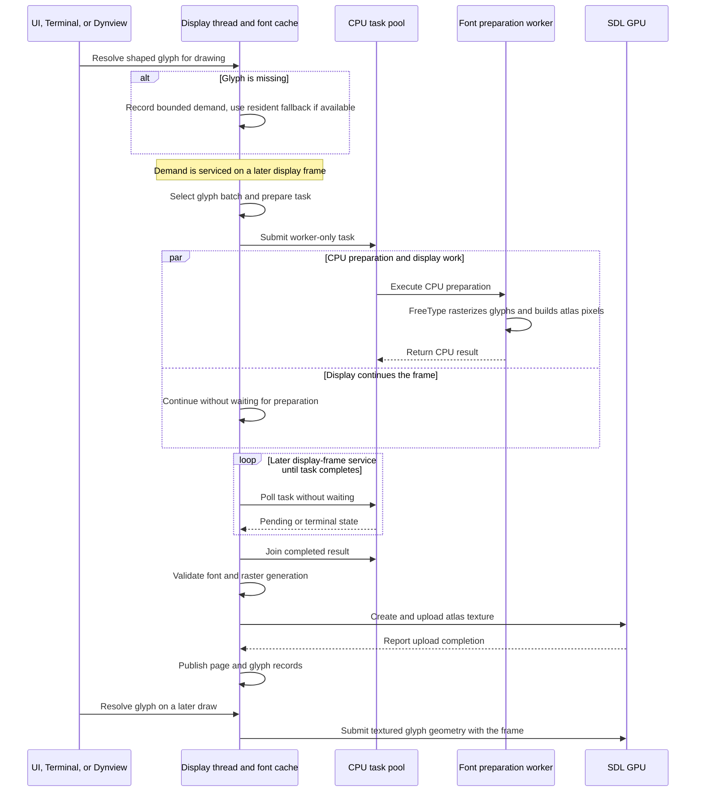

# Font Rendering And Rasterization

> Euclid keeps text layout, glyph images, and display resources on distinct paths so
> richer typography can grow without making font work part of the GPU or Julia boundary.

## Table Of Contents

1. [Why The Pipeline Evolved](#why-the-pipeline-evolved)
1. [The Current Path](#the-current-path)
1. [Where To Trace A Change](#where-to-trace-a-change)
1. [Boundaries That Matter During Investigation](#boundaries-that-matter-during-investigation)

## Why The Pipeline Evolved

Font handling grew alongside Euclid's LaTeX and presentation work. The first view
renderer parsed LaTeX in Julia, sent drawing commands to Odin, and used Raylib text
features plus manual line drawing for constructions such as fractions and radicals.
That was enough to begin rendering formulas, but it left shaping and mathematical
typography increasingly difficult to extend.

The next iterations moved through `stb`-based rendering and then HarfBuzz shaping with
Raylib. HarfBuzz made shaped glyph runs and OpenType MATH data available; a proportional
math face and richer formula support made the font layer part of document layout rather
than just a way to draw labels. Later, moving the application to SDL also replaced the
font raster path: Euclid now uses FreeType for glyph images, HarfBuzz for shaping and
math-font data, and a repository-owned C adapter to bridge FreeType into the native
code. These steps explain why the current font path spans more than one library and
several runtime owners.

## The Current Path

Text is shaped into glyph identities and positioned runs. Dynview can also consult the
math face's OpenType MATH data for formula construction and measurement. Separately,
the font cache resolves those glyphs to rasterized coverage: required seed glyphs are
made available early, while additional glyphs and physical-size variants can be
prepared on demand.

The resulting path is:

1. **Choose and shape a face.** HarfBuzz supplies shaped glyph IDs, advances, offsets,
   and the math-font queries used by Dynview.
2. **Prepare glyph images.** FreeType loads the font source and produces grayscale
   glyph coverage and bitmap placement data. CPU preparation can run as worker work.
3. **Publish atlas resources.** Prepared pixels and glyph metadata return to the font
   cache; the display owner creates, uploads, and releases SDL textures.
4. **Draw through a consumer.** UI text, Terminal output, and Dynview use the font
   cache and the application's textured drawing path.

The split is intentional: shaped metrics are the layout input, while a raster is an
image at a particular size. Changing a raster should not silently redefine the shaped
run's layout.

### New Glyph: Demand To Draw

An unresolved glyph does not start FreeType from the drawing call. The display-owned
cache records bounded demand, uses a resident fallback where possible, and services
preparation on later frames. CPU raster work runs as a worker-only task: the display
thread submits it and polls without waiting for it. Once complete, the display thread
joins the result, checks that it still belongs to the current font and raster generation,
then owns texture upload and publication. A later draw can resolve the newly resident
page.

The font service advances once per display frame. Its preparation slot serializes font
CPU work, while the shared task pool continues to own worker execution. The worker
returns CPU data only; it never publishes textures or mutates visible glyph state.
In the current SDL path, the display owner submits the candidate texture upload and waits
for its completion before the callback commits the page. That GPU handoff is distinct
from the asynchronous CPU raster work. The page is committed only when the task identity
is still current and the texture operation succeeds. If demand is superseded or upload
fails, the candidate is discarded rather than becoming a partial resident page.

## Where To Trace A Change

| Concern | Start here |
| --- | --- |
| Cache, face selection, font requests, raster identity, and lifecycle | [`src/view/font/font.odin`](../../../src/view/font/font.odin), [`src/view/font/model/`](../../../src/view/font/model/) |
| Per-frame service and worker-only task scheduling | [`src/view/frame.odin`](../../../src/view/frame.odin), [`src/view/font/async.odin`](../../../src/view/font/async.odin), [`src/taskpool/taskpool.odin`](../../../src/taskpool/taskpool.odin) |
| CPU atlas preparation | [`src/view/font/prepare.odin`](../../../src/view/font/prepare.odin), [`src/view/font/freetype.odin`](../../../src/view/font/freetype.odin) |
| FreeType face, metrics, and bitmap operations | [`src/view/font/freetype.odin`](../../../src/view/font/freetype.odin), [`libs/freetype/`](../../../libs/freetype/) |
| HarfBuzz shaping and OpenType MATH queries | [`src/view/font/harfbuzz.odin`](../../../src/view/font/harfbuzz.odin), [`libs/harfbuzz/`](../../../libs/harfbuzz/) |
| Display-thread atlas publication and SDL texture lifetime | [`src/view/font/finalize.odin`](../../../src/view/font/finalize.odin), [`src/view/resources.odin`](../../../src/view/resources.odin), [`src/view/native/texture_operations.odin`](../../../src/view/native/texture_operations.odin), [`src/view/native/sdl_draw_runtime.odin`](../../../src/view/native/sdl_draw_runtime.odin) |
| UI and common text drawing | [`src/view/ui/text/text.odin`](../../../src/view/ui/text/text.odin) |
| Terminal text and styled output | [`src/view/terminal/render.odin`](../../../src/view/terminal/render.odin) |
| Dynview prose and math shaping/layout | [`src/dynview/compile/`](../../../src/dynview/compile/), [`src/dynview/math/`](../../../src/dynview/math/), [`src/view/simulation/simulation_executor.odin`](../../../src/view/simulation/simulation_executor.odin) |
| Native textured 2D drawing | [`src/view/native/draw_encoder.odin`](../../../src/view/native/draw_encoder.odin), [`src/view/native/sdl_draw_runtime.odin`](../../../src/view/native/sdl_draw_runtime.odin) |

For a raster request, follow the font cache into CPU preparation, then follow the
prepared result into display-owned texture publication. For a layout discrepancy, start
with the text consumer or Dynview compiler and trace its shaping and metrics requests
before investigating atlas pixels.

## Boundaries That Matter During Investigation

- **Shaping and rasterization answer different questions.** HarfBuzz shaping determines
  glyph sequence and placement; FreeType supplies glyph images and raster placement.
  Dynview's math path additionally uses generation-scoped OpenType MATH data.
- **Workers do not publish GPU resources.** Font preparation is CPU-side work. SDL
  texture creation, upload, replacement, and release belong to the display owner.
- **Font identity is generation-scoped.** A reload or replacement can leave old work
  in flight. Results must match the active font/raster identity before they are used;
  stale preparation must not replace a newer face.
- **Not every glyph is necessarily resident immediately.** The cache combines startup
  coverage with bounded on-demand glyph and raster preparation. A pending glyph may
  indicate ordinary demand work rather than a shaping failure.
- **Failures must not become plausible blank output.** Face or atlas preparation can
  fail, and publication is a distinct step. When diagnosing missing text, check both
  the preparation result and whether the matching atlas was successfully published.

The implementation and its tests define the current details. This guide is an entry
point to the font path and the design reasons behind its boundaries; it is not a second
source of truth for raster flags, library versions, platform packaging, or cache limits.
