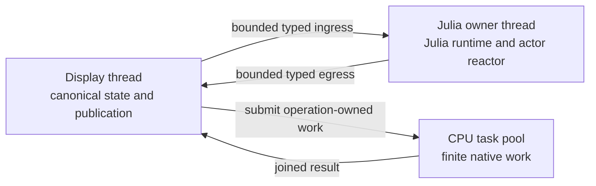
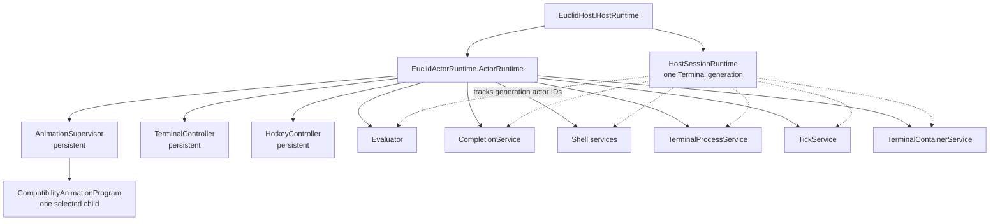
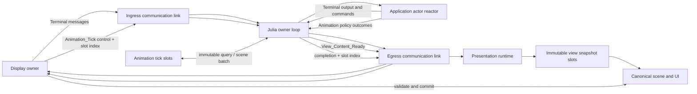
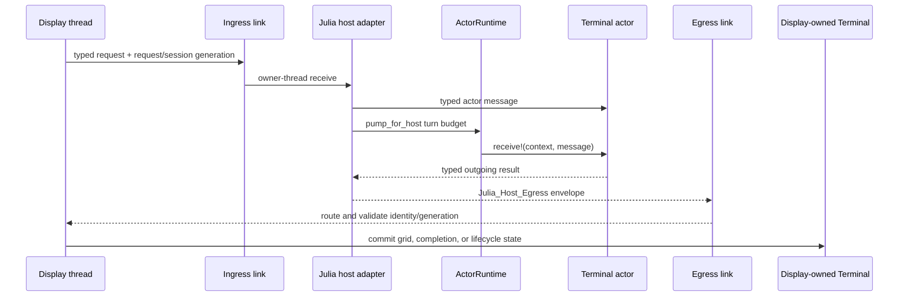
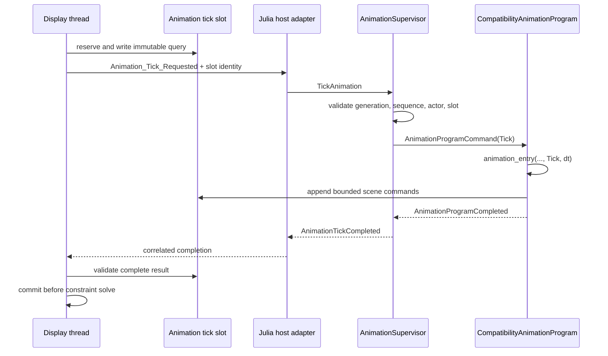
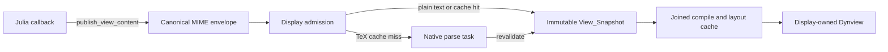

# Julia Owner Thread Architecture

## Table Of Contents

1. [Purpose](#purpose)
1. [Thread Model And Ownership](#thread-model-and-ownership)
1. [Julia Actor Model](#julia-actor-model)
1. [Cross-Thread Protocols](#cross-thread-protocols)
1. [Source Map](#source-map)
1. [Runtime Service](#runtime-service)
1. [Startup And Readiness](#startup-and-readiness)
1. [Normal Frame Integration](#normal-frame-integration)
1. [Terminal Pipeline](#terminal-pipeline)
1. [Animation Tick Pipeline](#animation-tick-pipeline)
1. [Animation Lifecycle And Reload](#animation-lifecycle-and-reload)
1. [View And Dynview Pipeline](#view-and-dynview-pipeline)
1. [Lifecycle, Failure, And Diagnostics](#lifecycle-failure-and-diagnostics)
1. [Memory And Odin Context](#memory-and-odin-context)
1. [Shutdown](#shutdown)
1. [Correctness Invariants](#correctness-invariants)
1. [Verification Coverage](#verification-coverage)
1. [Current Constraints](#current-constraints)

## Purpose

Euclid embeds Julia as its content and animation runtime. Julia runs on one
persistent owner thread, not on the display thread. That thread initializes
Julia, executes Julia callbacks, inspects exceptions, reloads content, and shuts
the runtime down.

The architecture is easiest to understand in three layers:

1. **Threads establish ownership.** The display thread, Julia owner thread, and CPU
   task pool each own different state and APIs.
1. **Actors organize Julia-side concurrency.** One actor runtime on the Julia owner
   thread coordinates Terminal policy and animation policy without introducing
   parallel Julia execution.
1. **Bounded protocols publish results.** Typed envelopes, checked slots, immutable
   snapshots, and transactional command batches move effects back to display-owned
   state.

The central rule beneath all three layers is:

> Only the Julia owner thread may call the Julia C API, and ordinary
> asynchronous Julia work may affect display-owned state only through bounded
> published data.

The actor model is central to Julia-side policy, but it is not the cross-thread
transport and it does not own display state. Terminal and animation requests enter the
actor runtime after the Julia owner receives them. Presentation/Dynview values are
published directly to Odin because they are replaceable values rather than actor
conversations.

## Thread Model And Ownership

Euclid has three distinct execution roles:

| Execution role | Owns | May call | Must not do |
| --- | --- | --- | --- |
| **Display thread** | Window events, raylib and GPU/audio resources, UI, canonical scene and Terminal state, fixed-step orchestration, final publication | Native simulation, rendering, bridge submission, result validation and commit | Call the Julia C API, render from another thread, or expose mutable canonical state to Julia |
| **Julia owner thread** | Julia lifetime, C API calls, callback execution, one actor runtime, content registration, reload candidates, Julia-side policy | Pump actors, evaluate Julia, serialize presentation values, fill checked animation slots | Render, call thread-affine raylib APIs, or concurrently mutate canonical display state |
| **CPU task pool** | Only the operation-owned payload or cache region assigned to each finite task | Particle and constraint work, shape-cache preparation, Dynview parse/compile/layout, CPU-only font preparation | Call Julia, call thread-affine raylib APIs, retain payloads after join, or publish visible state directly |

The Julia owner thread is not part of the CPU worker pool. It is a dedicated,
long-lived command processor with different ownership and shutdown rules.
The display may help execute CPU-pool tasks while waiting on a deterministic fence,
but that does not transfer display ownership or permit Julia work on those workers.



Synchronization establishes publication boundaries rather than shared ownership:

- Communication links transfer typed messages between the display and Julia owners.
- Service-owned slots transfer larger animation queries and transactional results.
- Task-pool fences return operation-owned native data to display-readable ownership.
- No path allows a worker or Julia actor to mutate visible state directly.

## Julia Actor Model

The Julia owner is both a serialized bridge-request executor and the sole executor of
one `EuclidActorRuntime.ActorRuntime`. Actors provide bounded mailboxes, generational
identity, lifecycle, correlation, and fair cooperative scheduling. They do **not** add
parallel Julia threads: every actor turn runs on the Julia owner thread.

### Actor Hierarchy And Lifetimes

`EuclidHost.HostRuntime` owns the actor runtime and the persistent roots. A
`EuclidHost.HostSessionRuntime` groups actors that must be replaced together when the
Terminal generation changes.

| Lifetime | Actor or service | Responsibility |
| --- | --- | --- |
| Runtime | `AnimationSupervisor` | Owns animation identity, implementation cache, lifecycle transaction, active program actor, and child failure state |
| Runtime | `TerminalController` | Owns Terminal visibility and top-level Terminal policy |
| Runtime | `HotkeyController` | Owns hotkey registration and routing policy |
| Terminal generation | `Evaluator` | Sequences Julia evaluation and emits correlated output and completion |
| Terminal generation | `CompletionService` | Computes and correlates completion results |
| Terminal generation | `ShellInterpolationService` | Resolves shell interpolation requests |
| Terminal generation | `ShellSession` | Owns generation-local shell policy and session lifecycle |
| Terminal generation | `TerminalProcessService` | Coordinates native process requests and process lifecycle |
| Terminal generation | `TickService` | Aggregates native tick pulses and publishes them to Julia subscribers |
| Terminal generation | `TerminalContainerService` | Correlates Terminal container configuration and observation |
| Selected animation | `CompatibilityAnimationProgram` | Adapts typed actor commands to one implementation's `Enter`, `Tick`, and `Exit` operations |
| Tick subscription | `TickCallbackWrapper` | Adapts one subscribed Terminal animation callback to `TickService` delivery |



There is exactly one live compatibility program actor after successful activation and
none after animation stop. Reset and reload retire the prior actor generation before a
replacement becomes active. A retired `ActorId` cannot address a reused scheduler slot
because actor identity includes both index and generation.

### Owner-Thread Pump

The host adapter calls `pump_for_host` with bounded turns and a time budget. One pump
cycle performs these stages in order:

1. Drain native Terminal process, tick, and container requests into their actors.
1. Run the shared actor scheduler's ready queue within the turn and time budget.
1. Route animation-supervisor outcomes to the waiting native protocol.
1. Advance Terminal session lifecycle.
1. Advance coordinated host shutdown.

`HostPumpStatus` reports whether more service is required and exposes scheduler,
Terminal, and animation pressure. Fairness is scheduler-wide: Terminal and animation
policy share one ready queue rather than competing owner loops.

### Actor Responsibilities And Boundaries

| Concern | Actor-owned policy | Native/display-owned mechanism |
| --- | --- | --- |
| Terminal evaluation and completion | Admission, sequencing, correlation, session lifecycle | Input capture, typed transport, terminal grid mutation, rendering |
| Shell and process interaction | Julia-side shell policy and actor lifecycle | PTY/process ownership and operating-system integration |
| Animation selection and reset | Child activation, `Enter`/`Exit` ordering, active identity | Scene reset command application and lifecycle-slot completion |
| Animation tick | Child validation and compatibility callback invocation | Immutable query snapshot, bounded scene batch, fixed-step commit |
| Reload | Candidate actor validation, prior-actor restoration on failure | Candidate interface slot, native registry publication, generation commit |
| Presentation/Dynview | No actor owns the published value | MIME egress, native parsing, immutable semantic snapshot, compile/layout cache |

The last row is intentional. Julia code may produce presentation content while executing
inside an actor, but `publish_view_content` publishes a value directly through egress;
the presentation itself is not sent to another Julia actor.

## Cross-Thread Protocols

The links are shared transport, not a shared execution model. `Julia_Host_Ingress` and
`Julia_Host_Egress` are tagged unions carried in producer-owned pooled envelopes. The
message kind selects the Julia actor or native publication path after receipt.



| Path | Cross-boundary carrier | Julia-side execution | Durable result | Why this path exists |
| --- | --- | --- | --- | --- |
| Terminal | Typed ingress and egress messages | Generation-scoped actors pumped by the owner thread | Display-owned terminal state | Terminal work is conversational, independently correlated, and may outlive one frame. |
| Presentation/Dynview | `View_Content_Ready` egress message | Direct publication from content execution; no Julia actor | Display-owned immutable snapshot slot, then derived cache | Presentations are replaceable values, not conversations or scene mutations. |
| Animation tick | `Animation_Tick` control request and completion event | Active program actor through the supervisor | Tick slot with query snapshot and scene-command batch | Fixed-step work needs bounded latest-result pacing and atomic scene commit. |
| Lifecycle | `Animation_Lifecycle_Requested` and correlated completion | Animation supervisor transaction | Checked lifecycle slot outcome | Selection and reload require an exclusive, correlated barrier. |

### Terminal Message Path

Terminal ingress is decoded by Odin bridge adapters and delivered to actors owned by
the active `HostSessionRuntime`. Actor turns perform evaluation, completion, shell,
process, tick, and container policy. The host pump drains actor output and encodes it as
typed egress messages for display-owned commit.

### Presentation Message Path

`publish_view_content` serializes one canonical MIME value and places
`View_Content_Ready` directly on the Julia-to-display egress link. It does not address a
Julia actor and does not wait for an animation tick slot to publish.

The display retains the producer-owned envelope while it classifies or parses the
source, then copies validated pointer-free semantics into a view snapshot slot. This
separation lets presentation supersession, parsing, and publication proceed without
changing scene-batch commit or actor lifecycle.

### Animation Slot Path

Animation ticks do not send scene payloads through pooled envelopes. The display fills
a service-owned slot, sends a small request containing its index, and the owner thread
validates and attaches that slot before sending a typed tick to the animation
supervisor. The active program actor invokes the compatibility entry while query bridge
calls read the immutable snapshot and mutation bridge calls append to the bounded
scene-command batch. The completion message returns only correlation and slot identity.

Slots are used because animation work is frame-paced, replaceable, and tightly bounded.
One pending tick is enough: later elapsed time coalesces instead of creating an actor
mailbox or copying large query and result payloads through the links.

## Source Map

| Path | Boundary and policy | Julia execution | Display publication |
| --- | --- | --- | --- |
| Shared transport | `src/core/core.odin`, `src/bridge/communication_link.odin`, `src/bridge/runtime_service.odin` | `src/bridge/runtime_service.odin` | `src/bridge/runtime_service.odin` |
| Terminal actors | `src/view/terminal_service.odin`, `src/core/protocol/` | `src/julia/host/`, `src/julia/actors/`, `src/julia/repl/` | `src/view/terminal/`, `src/terminal/` |
| Presentation/Dynview | `src/julia/bridge/presentation.jl`, `src/bridge/abi-presentation.odin` | Direct callback during content execution | `src/view/presentation_runtime.odin`, `src/bridge/dynview_native_tex.odin`, `src/dynview/` |
| Animation ticks | `src/bridge/animations.odin` | `src/julia/policy/`, `src/julia/runtime_host.jl`, content modules | `src/bridge/scene_commands.odin`, `src/view/simulation_executor.odin` |
| Lifecycle and reload | `src/bridge/animations.odin` | `src/julia/policy/`, `src/julia/runtime_host.jl` | `src/bridge/bootstrap.odin`, `src/view/runtime_session.odin` |

The frame loop that orders all publication paths lives in `src/view/view.odin`. Julia
initialization and shutdown live in `src/bridge/bootstrap.odin`.

## Runtime Service

`Julia_Runtime_Service` is allocated before Julia starts. It is the common transport
and lifetime owner, not a single payload protocol. It owns:

- one persistent `thread.Thread`
- one pooled ingress link and one pooled egress link
- monotonically increasing request IDs
- lifecycle, reload, failure, and saturation diagnostics
- deferred message pointers plus fixed view-snapshot and animation-tick slots
- animation pacing and latency counters

The service is shared storage with closed ownership, not a bag of concurrently mutable
state. Every field belongs to one of these classes:

| Ownership class | Fields | Publication rule |
| --- | --- | --- |
| Display-owned | `worker`, `display_egress_dispatch`, `display_egress_user_data`, `display_pending_view_content`, `next_request_id`, `lifecycle`, `active_request_id`, `active_request_kind`, failure and saturation counters, view publication counters, and animation pacing, sequence, and latency counters | Only the display mutates these fields while routing egress or advancing the frame. |
| Julia-owner-owned | `evidence_ring`, `profile`, `runtime_host`, `pending_view_content`, presentation generation and override fields, and `owner_thread_id` | Only the owner mutates these fields. Pooled egress publishes values; shutdown clears `runtime_host` before completion. |
| Immutable after startup | `evidence_session`, `request_link`, and `event_link` bindings | Startup installs these bindings before worker traffic. Each link then enforces producer-pool ownership and consumer return. |
| Slot-state-mediated | `view_snapshots`, `view_snapshot_generation`, `published_view_snapshot_index`, `animation_tick_slots`, and `animation_lifecycle_slot` | A producer mutates only its reserved incarnation. Consumers validate handle incarnation, identity, generation, and sequence before commit or recycle. |
| Lifecycle-transaction-mediated | `reload_state`, `reload_requested`, `reload_failure_injection`, `runtime_generation`, `reload_failed_mtime_unix_nano`, and `animation_generation` | Display intent is frozen into a checked lifecycle slot. The owner may update transaction state only while the display waits for that exact completion; the display observes it after routing the completion. |
| Message-published | All `Julia_Host_Ingress` and `Julia_Host_Egress` values | Producers retain envelope ownership until consumers return them. The transport accepts no generic callback or arbitrary task-data pointer. |

`animation_tick_pending` is display-owned pacing state, not a worker signal. Lifecycle
quiescence is decided before its typed request is sent. `reload_requested` is copied into
the lifecycle slot; the owner compares and consumes that frozen transaction while the
display waits. Neither field acts as an unsynchronized wakeup.

The service's `runtime_host` pointer is borrowed. Its GC ownership comes from the
worker-stack `Julia_Runtime_Gc_Frame`, installed before host construction and retained
until immediately before Julia teardown. The rooted `EuclidRuntimeHost` owns one active
animation generation, one active Terminal `HostSessionRuntime`, and a borrowed pointer
to the lifetime-stable Odin application state. Each Terminal generation owns a fresh
session module, actor set, and `EuclidReplRuntime`. Replacing the Terminal generation
resets that session-local state. Odin never roots Julia values by retaining their
addresses in service state, and Julia never frees the borrowed native pointer.

Each communication link contains a bounded outbound channel, a bounded return channel,
and a producer-owned TLSF pool. Terminal and presentation bytes may live in those pooled
envelopes. Animation query and scene payloads do not: their control records carry a slot
index into service-owned storage.

Consumers return envelopes to the producing link rather than freeing foreign storage.
Completed slot payloads remain valid independently of event draining until their owning
consumer publishes or releases the slot.

### Control Request And Event Types

The following control messages share the communication links with Terminal and
presentation messages. Every accepted control request receives a monotonically
increasing `request_id`; its event repeats the kind, ID, slot index, and success state.

| Request | Worker action | Completion event |
| --- | --- | --- |
| `Runtime_Initialize_Requested` | Initialize Julia and include the packaged script | `Initialized` |
| `Runtime_Content_Initialize_Requested` | Bind stable native state and register content | `Invoke_Complete` |
| `Animation_Tick_Requested` | Run Julia loops against a checked query and command slot | `Animation_Tick_Complete` |
| `Animation_Lifecycle_Requested` | Execute frozen selection, reset, or reload intent | `Invoke_Complete` |
| `Harness_Scenario_Requested` | Run one bounded deterministic scenario | `Invoke_Complete` |
| `Runtime_Shutdown_Requested` | Tear Julia down and exit the worker loop | `Shutdown_Complete` |

The owner loop exhaustively switches on this tagged union and calls concrete handlers.
There is no generic task dispatcher or callback/data escape hatch.

Display-side submission uses nonblocking communication-link send. Queue saturation cannot
implicitly block the display thread. Failed insertion leaves the caller
responsible for recycling its slot or retrying required work, and increments
`request_saturation_count`.

The owner thread blocks on ingress while idle and uses reliable bounded send for required
completions. Egress can therefore apply backpressure if the display stops draining it,
without allowing memory growth.

### Worker Dispatch Loop

`julia_runtime_worker` records its operating-system thread ID, then processes ingress
messages serially until `Runtime_Shutdown_Requested`:

1. Receive one ingress envelope.
1. Dispatch control requests directly or route Terminal messages into the host runtime.
1. Pump bounded application actor work when the reactor requires it.
1. Emit any required correlated control event and Terminal egress.
1. Return the consumed ingress envelope to its producer.
1. Restore the worker's saved Odin context.
1. Clear the worker temporary allocator.

Serial execution is intentional. The architecture makes Julia concurrent with
rendering; it does not execute multiple Julia tasks at once.

`assert_julia_runtime_owner` guards externally reachable task boundaries before
they invoke Julia-backed helpers.

## Startup And Readiness

The window exists before Julia initialization begins, so startup can continue
drawing while the owner thread performs Julia work.

The sequence is:

1. Prepare packaged assets, using a separate startup worker when available.
1. Create the Julia runtime service and owner thread.
1. Submit `Runtime_Initialize_Requested`.
1. Initialize Julia and include `src/julia/script.jl` on the owner thread.
1. Receive `Initialized` while drawing startup frames.
1. Allocate canonical host state on the display thread.
1. Submit `Runtime_Content_Initialize_Requested` with its sole stable native binding.
1. Resolve Julia handles and register content on the owner thread.
1. Receive its correlated `Invoke_Complete`.
1. Publish lifecycle state `Ready` only after registration and priming succeed.
1. Finish display-thread graphics and audio initialization.

`Initialized` does not mean normal runtime work is ready. The separate `Ready`
transition prevents animation, view, and Terminal work from observing a
partially registered interface.

After ten seconds without a startup completion, the loading label changes to
`Julia is not responding` and logs the request ID. Startup continues waiting
and rendering; closing the window terminates the process.

## Normal Frame Integration

The display loop performs Julia publication and submission at explicit points:

```text
validate and route Terminal output
service presentation envelopes and ready parse work
run zero or more fixed simulation steps
    publish newest valid animation tick
    schedule the next animation tick
    run and join particle + constraint tasks
run and join per-frame shape + optional Dynview preparation
draw
```

There is no Julia call in the drawing path. Rendering consumes canonical host
state and previously published caches.

## Terminal Pipeline

Terminal is the clearest end-to-end example of the actor architecture. Odin owns the
interactive surface and native resources; Julia actors own the policy that interprets
requests and sequences Julia work.

### Ownership Split

| Odin/display ownership | Julia actor ownership |
| --- | --- |
| Keyboard and paste input routing | Evaluation admission and sequencing |
| Terminal grid, scrollback, selection, and rendering | Completion and shell interpolation policy |
| PTY/native process resources and operating-system calls | Shell-session and process lifecycle correlation |
| Container geometry application and visible UI state | Container observation and request correlation |
| Native fixed-step pulse production | Tick subscriptions and callback delivery |
| Final validation of generation-tagged output | Generation-local `EuclidReplRuntime` and session module |

Every active Terminal generation owns a `HostSessionRuntime` with a fresh
`EuclidTerminalSession_<generation>` module, `EuclidReplRuntime`, and generation-scoped
actor set. Persistent `TerminalController` and `HotkeyController` roots survive session
replacement; evaluator, completion, shell, process, tick, and container actors do not.

### Request To Publication



The exact ingress adapter depends on the operation:

| Request family | Julia destination | Result path |
| --- | --- | --- |
| Interactive input and evaluation | `Evaluator` | Bounded output batches plus evaluation completion or continuation state |
| Completion | `CompletionService` | Correlated completion result applied to display-owned completion UI |
| Shell interpolation | `ShellInterpolationService` | Correlated interpolation result or explicit failure |
| Shell and native process lifecycle | `ShellSession` and `TerminalProcessService` | Typed process requests, observations, output, and completion |
| Native fixed-step pulse | `TickService` | Pulses delivered to generation-local subscriptions |
| Container geometry and policy | `TerminalContainerService` | Correlated configuration and observation messages |
| Hotkey registration | `HotkeyController` | Persistent policy result independent of session replacement |

Output does not enter a second actor system on the display thread. The display egress
router validates each message and applies it to the owning native subsystem. Terminal
output may span bounded batches; stale generation, queue saturation, and malformed
results are explicit rejection conditions rather than hidden blocking or growth.

EuclidRepl helpers are closures installed in the generation-local session module.
Animated jobs subscribe through `Ticks.Subscription`; `TickCallbackWrapper` actors
adapt those callbacks to `TickService` delivery. Session reset and shutdown unsubscribe
active jobs before tick admission closes, then retire generation actors and clear
managed geometry.

## Animation Tick Pipeline

Animation ticks are asynchronous, replaceable work tied to fixed simulation
time. Two service-owned slots bound storage, while policy allows only one
pending request.

Each `Animation_Tick_Slot` contains:

- request ID
- animation generation
- monotonically increasing tick sequence
- selected animation identity
- accumulated fixed-step delta
- submission timestamp
- immutable `Animation_Query_Snapshot`
- bounded `Scene_Command_Batch`

### Actor Execution Path



The supervisor is the policy owner. It rejects stale identity or sequence, selects the
one active program actor, and converts child completion or failure into a typed outcome.
The compatibility actor is the only ordinary path that invokes `animation_entry`.
Native code owns slot attachment, immutable query storage, scene-command storage, and
final commit; it does not independently select or invoke an animation implementation.

### Immutable Query State

Before submission, the display thread copies every value asynchronous Julia
animation code may query:

- the fixed point array
- packed typed animation values
- pen state
- compass state

During callback execution, `animation_query_snapshot_target` points to this
slot-owned copy. Query bridge functions use the snapshot rather than reading
canonical point or tool state concurrently.

The snapshot represents state at submission time. It deliberately does not
track canonical changes made while Julia is running.

### Transactional Scene Mutation

Before actor dispatch, the owner thread attaches the slot's `Scene_Command_Batch` as
`scene_command_batch_target`. The active compatibility program actor then invokes the
entry. Mutating bridge exports capture commands instead of directly applying them to
canonical scene state, and the host detaches every slot alias before completion.

The command vocabulary covers current recurring animation mutations:

- point position, color, brush, offset, and visibility
- bounded point-hide batches
- pen and compass locks, movement, visibility, and active state
- drawing-sound state
- particle emission
- animation cycle-boundary notification

The batch holds 64 commands. A point batch within one command holds up to eight
indices. Exceeding either bound marks the entire batch invalid.

Typed animation writes use a separate bounded pending-value buffer in the same
batch. Reads select the newest matching pending value before falling back to the
immutable query snapshot. Validation and commit publish typed values and scene
commands together, so a rejected scene command or typed write publishes neither.

The display validates the complete batch before applying any command. Validation
checks counts, overflow, producing-animation identity, explicit indices, tool
dependencies, and every bounded point-list index. Commands are applied in
callback order only after validation succeeds. Invalid, overflowed, stale, or
exception-producing batches have no partial effect.

### Fixed-Step Publication Boundary

Each fixed step uses this order:

1. Publish the newest completed animation result, if valid.
1. Schedule the next owner-thread animation tick.
1. Submit particle and constraint work to the CPU pool.
1. Join that simulation batch.
1. Continue GIF capture and any remaining fixed steps.

Publication immediately before constraints is a correctness boundary. Julia
may command raw pen or compass endpoint positions; constraints must normalize
that geometry before rendering or capture observes it.

The next tick's query snapshot is captured after publication and before the
current constraint task completes. Animation code sees committed command intent
at that boundary, while rendering sees the subsequently settled geometry.

### Stale Result Rejection

A completed animation tick can commit only when all of these remain true:

- its generation equals `animation_generation`
- its sequence is newer than `animation_last_committed_sequence`
- no animation reset is pending
- its animation is still both current and selected
- its scene-command batch validates

Selection, reset, and reload increment the animation generation and release
completed old-generation slots. Pointer identity also prevents publishing work
for a retired interface.

### Backpressure And Pacing

When one tick is pending, later fixed-step deltas are coalesced rather than
queued. Accumulated time is capped at 250 ms, preventing a slow callback from
creating an unbounded queue or catch-up spiral.

When submission becomes possible, accumulated time is included in the new
tick. If slot or request-channel reservation fails, elapsed time is retained
for a later attempt and the drop counter advances.

Under sustained Julia overload, logical animation time is therefore coalesced
and capped while display, input, simulation, and rendering continue.

## Animation Lifecycle And Reload

Selection, reset, and reload are not ordinary replaceable ticks. They may create
objects, rebuild registries, replace Julia handles, and require one synchronous,
correlated transaction.

`synchronize_animation_lifecycle` handles this exception:

1. Refuse to begin while an animation tick is pending.
1. Enter reload state `Quiescing`.
1. Freeze intent in the checked lifecycle slot and submit
  `Animation_Lifecycle_Requested`.
1. Block for that correlated completion while accepting unrelated events.
1. Increment `animation_generation` after success.
1. Clear accumulated tick time and completed old-generation slots.

This typed barrier is deliberate and narrow. It preserves exclusive access while the
supervisor stops the old program actor, requests typed native reset work, activates the
replacement actor, and commits Julia-side policy. Ordinary animation, view, and
Terminal paths remain asynchronous.

### Staged Reload

Packaged asset modification time drives reload. The owner-thread lifecycle handler
uses these states:

```text
Quiescing -> Including -> Registering -> Publishing -> Idle
                                      \-> Failed
```

Reload does not retire the active interface before a replacement is usable:

1. Re-extract changed packaged assets and preserve the active animation UUID.
1. Construct a fresh anonymous `EuclidRuntimeGeneration` under a local GC root.
1. Give that generation fresh catalog, load-cache, module, and implementation roots.
1. Clear and resolve the inactive state-owned interface slot.
1. Register candidate metadata and restore the active UUID against that slot.
1. Root the candidate separately from the committed host generation.
1. Ask the supervisor to stop the prior actor and validate the candidate actor's Enter.
1. Commit the host's active generation with one assignment and clear the candidate root.
1. Publish the candidate interface and clear the retired slot.

`Euclid_General_State` owns exactly two inline `Euclid_Julia_Interface` slots.
Their addresses remain stable for the complete host-state lifetime. Reload
does not allocate or free interface structs. Each slot retains its own growing
registry arena so a candidate can coexist with the active generation while
registration and stable-ID restoration are validated.

If construction, registration, loading, or Enter fails, the candidate actor and root are
retired, the candidate registry arena is cleared, the previous slot is restored, and
full Julia GC is forced while the stable host still roots the old generation. The
supervisor restores exactly one prior program actor. The failed package modification
time is retained so the same broken revision is not retried every frame. A newer
revision may trigger another attempt.

Scenario-only one-shot failure selectors exercise candidate-load and candidate-Enter
rollback through this production transaction. They are Odin-owned, consumed once, and
cleared on either publication or rollback; Julia has no mutable fault-injection global.

Successful publication increments `runtime_generation` and clears the failed
revision marker. View snapshots carry this runtime generation in addition
to animation identity, preventing a recycled arena address from validating an
old snapshot after later reloads.

## View And Dynview Pipeline

Dynview is a publication pipeline, not an actor subsystem. A Julia callback may produce
the value while an actor is running, but publication does not address an actor, consume
an actor mailbox, or mutate the animation tick's scene batch. This keeps replaceable
document content independent from conversational Terminal policy and fixed-step scene
mutation.

| Stage | Execution owner | Owned result |
| --- | --- | --- |
| Select and serialize canonical MIME | Julia owner thread | Producer-owned bounded egress envelope |
| Admit, classify, and schedule parse | Display thread | One active parse plus newest pending value |
| Parse semantic TeX | CPU task pool | Operation-owned parse result |
| Validate and stage | Display thread | Pointer-free immutable `View_Snapshot` |
| Compile, shape, and lay out invalidated content | CPU task pool, joined before drawing | Sealed display-cache slices |
| Publish, interact, and draw | Display thread | Visible Dynview state and copy targets |



Julia selects one canonical MIME representation and clones its exact bytes into a
producer-owned bounded egress envelope. The display borrows that envelope until any
native parse work joins, then returns it to the Julia owner for destruction.

Each `View_Snapshot` owns:

- request ID, runtime generation, animation generation, and snapshot generation
- producing-animation identity
- one canonical MIME value and up to 32 KiB of exact presentation bytes
- one growing arena and bounded builders for command text, commands, math programs,
  math commands, math nodes, and semantic document records
- up to 1,024 Dynview commands and 32 KiB of command text
- up to 256 math programs
- up to 4,096 math commands
- up to 4,096 math nodes

The display admits one active parse and one newest pending presentation. Accepting a
new current generation clears visible content immediately, replaces any older pending
envelope, and cooperatively cancels active stale work. `Presentation_Cleared` and
`Presentation_Superseded` record those owner-controlled transitions.

Slots retain the `Free`, `Pending`, `Complete`, and `Published` lifecycle. A slot arena
is reset and its builders are reinitialized only after the display has returned that
slot to `Free` and reservation selects it for another generation. Saturated slots,
stale completions, superseded completions, and published aliases therefore cannot lose
storage before release. Every payload family uses sealed arena-backed slices.

### Julia Serialization And Transfer

Animation modules expose `get_view_content` and publish through `publish_view_content`.
Julia chooses `text/latex` only for values that explicitly support it; ordinary strings
remain unquoted `text/plain`. Serialization is bounded and atomic. `View_Content_Ready`
carries one MIME value, exact bytes, animation identity, generation fields, and an
producer generation and presentation identity.

The Julia egress communication link has fixed queue and TLSF backing. A saturated link
retains only the newest presentation, and all replaced or returned envelopes are
destroyed by their producing owner. Neither the display nor a taskpool worker frees
memory into the Julia-owned pool.

### Display-Owned Parse Scheduling

The display classifies exact bytes as plain text, delimited math, or an unwrapped TeX
document. Plain text and exact positive or negative document-store hits materialize
without task submission. Cache misses run finite parser work on the shared taskpool in
operation-owned `Dynview_Parse_Result` storage. Workers do not enter Julia, mutate the
document store, or touch visible state.

The producer envelope remains borrowed through task join because the parse result keeps
an exact source view. After join, the display revalidates runtime generation, animation
generation and identity, presentation generation, reload state, and reset state before
committing to the generation-local document store. Rejected TeX materializes as the
exact canonical source; transport or serialization failure publishes nothing partial.

### Display Publication

The display stages one current plain value or immutable semantic document into a free
snapshot slot. Staging copies canonical bytes and pointer-free semantic records, seals
all builders, and validates the complete snapshot before publication.

Validation requires every slice to alias its sealed builder prefix. It checks command
text spans, math-program ranges and roots, node text and child ranges, document spans,
and enum values. The display installs immutable views of canonical presentation bytes
and semantic records before releasing the previous published slot.

Publication also requires the producing animation to remain current. A stale
snapshot is released, and old published content is cleared rather than shown
beneath a new selection.

A valid snapshot becomes the display's immutable Dynview content view. Compilation reads
commands and text directly from that view. Math measurement and shaping seed a separate
display-owned mutable working cache because derived metrics and shaped-run indexes are
not semantic snapshot state. Replacement installs all new aliases before recycling the
previous slot; invalidation and shutdown clear every alias before slot reuse or arena
destruction.

### Compile And Layout

Publication invalidates display-owned Dynview compile and layout caches.
`prepare_ui_frame` then computes exact panel bounds and tracks panel, font, and
style inputs.

The per-frame CPU-pool window runs:

- shape draw-cache construction every frame
- Dynview compilation and layout only when invalidated

#### Cache Ownership And Rebuild

`Dynview_System` owns one growing display-cache arena initialized before executor
publication. The submitted Dynview task alone enters worker-mutable ownership, resets
the arena for an invalidated rebuild, and returns display-readable ownership before
fence completion. Fence waiting may execute queued work on the display thread, so
ownership is defined by task role and guarded execution identity rather than by
requiring a distinct operating-system thread. Failed builds clear partial derived
views, record a stable error, and retain exact literal source. Unchanged frames do not
reset the arena; shutdown destroys it after the task pool has joined and stopped.

Bounded builders compile plain text and copy payload bytes into this arena while
preserving the existing logical text limit. Copy payload begins with the snapshot's
canonical presentation bytes rather than a copy-only command. Both builders seal before
either populated slice is published. Those slices are display-readable aliases whose
lifetime ends at the next invalidated cache-arena reset; failure clears both aliases
before returning to exact literal source. A bounded copy-block builder participates in
the same transaction and seals before any compiled bytes or blocks publish, preserving
source order and payload spans under the command-count limit.

#### Layout And Copy Interaction

Copy hit targets are panel- and scroll-dependent display geometry. After the worker
fence returns display ownership, the display thread clears and repopulates one reusable
bounded target builder from the sealed copy blocks and fixed layout records. Repeated
frames retain its allocated arena capacity rather than abandoning storage. Each
successful refresh publishes only its populated prefix; failure publishes no targets.
All copy-record aliases and reusable builder state are cleared before an invalidated
arena reset.

Bounded line and item builders construct the layout while the invalidated Dynview task
owns worker-mutable cache state. Item indexes, line indexes, grid placement, clipping,
and scalar counts update against populated builder prefixes during measurement. After
all commands and aggregate scroll metrics validate, both builders seal before
`layout_is_valid` publishes their display-readable slices. Empty content still seals
one canonical line. Overflow or invalid layout clears both aliases and preserves source
fallback. Their lifetime ends at the next invalidated cache-arena reset.

#### Math Shaping Capability

Shaped-run and glyph builders use the same arena while enforcing the existing
math-command and shaped-glyph limits. They publish complete populated slices only after
validating the current font generation and every source, glyph, and command-site span.
Failure clears all shaped aliases and restores every command-site fallback sentinel.
Recursive math measurement consumes these records after the shaping pass. Recursive
draw items retain their source math-command index so the display thread can consume the
exact same command/site record without reshaping or reconstructing advances.

Dynview owns a separate generation-tagged NewCM HarfBuzz capability. The display
thread builds a complete candidate from the resident `Math_Regular` source after font
service and before frame submission. Successful replacement invalidates font/layout
state; failed replacement preserves the prior capability and suppresses repeated work
for that failed generation. Its mutable HarfBuzz buffer is distinct from the font
cache buffer and is available only to the Dynview frame-preparation worker. The joined
fence returns read ownership before drawing. Shutdown destroys this capability after
worker completion and before retiring font generations.

The capability provides bounded left-to-right `math` script shaping, glyph extents,
italic correction, and top-accent attachment. Native TeX semantics distinguish
italic-variable and upright math runs. The worker shaping call strictly projects
eligible source scalars into caller-owned temporary bytes; command-buffer, fallback,
and copy text remain unchanged. Malformed roles, UTF-8, or insufficient workspace fail
without publishing a shape. Production math measurement consumes complete cached runs
and approved MATH attachments while preserving whole-run fallback, existing prose
measurement, and outer-grid policy. Drawing validates the matching resident
`Math_Regular` generation and complete glyph residency before drawing cached 26.6
offsets and advances. A stale generation, invalid slice, or pending glyph rejects the
whole site before the existing fallback path runs.

#### Frame Publication

These tasks write disjoint caches and may run concurrently. The display joins
the preparation batch before drawing, making panel rendering cache-only. Scroll
state, copy-hit targets, and interaction remain display-thread work.

## Lifecycle, Failure, And Diagnostics

The service lifecycle is:

```text
Not_Started -> Starting -> Ready -> Shutdown_Requested -> Stopped
                    \-------------------------------> Failed
```

Readiness is published after initialization and content registration.
Initialization or shutdown completion failure marks the lifecycle terminally
`Failed`. Ordinary request failures do not stop the runtime; they update
attributed diagnostics.

`Julia_Runtime_Diagnostics` exposes display-safe scalar state:

- lifecycle state
- active request ID and kind
- total failed requests
- last failed request ID and kind
- request-channel saturation count
- reload state
- runtime generation

`Animation_Tick_Diagnostics` additionally exposes queue depth and high water,
submitted, committed, coalesced, stale, and dropped counts, the last committed
sequence, and last and maximum publication latency.

These snapshots do not invoke Julia or expose Julia-owned handles. Julia
exceptions are reported at their bridge boundary. A failed animation callback
invalidates its batch, preventing partial publication.

## Memory And Odin Context

Cross-thread payload storage is fixed and service-owned. Normal frame operation
does not allocate request payloads for animation ticks or view snapshots. Terminal
transport has its own bounded queue and payload ownership.

### Host Allocation Ownership

- `Euclid_General_State` is allocated once by the display thread with its
  persistent context allocator. Both Julia interface structs are inline in
  this allocation and have no separate allocator or deallocation path.
- `Julia_Runtime_Service` is allocated once with the startup context allocator. The
  service owns and frees it after the Julia worker has stopped.
- Ingress and egress communication links each own fixed channel storage and a bounded
  producer-side pool. The service destroys both links during teardown.
- `thread.create_and_start_with_data` owns the persistent worker's platform
  thread resources. `thread.destroy` releases them after `Shutdown_Complete`.
- View snapshots, animation tick slots, query snapshots, and scene-command batches are
  inline in `Julia_Runtime_Service`. Request traffic does not allocate these payloads.
- Each view snapshot additionally owns one growing arena. The service initializes these
  arenas in place, resets one only when reusing a `Free` slot, and destroys all of them
  after the Julia worker has stopped. Initialized arena owners are never copied. Sealed
  text and semantic record slices remain valid for the complete slot generation, and
  display aliases are detached before their owning slot can be reset or destroyed.

### Registry Arena Ownership

Each interface slot lazily creates one growing virtual-memory arena during its
first content registration. That arena owns the complete generation registry:

- animation interface nodes
- copied animation names
- UUID lookup-table buffers

`prepare_julia_interface_generation` calls `arena_free_all` before reusing an
inactive slot. Rollback clears the failed candidate arena. Successful
publication clears the retired arena after the active-slot switch. Clearing
retains arena infrastructure for the next reload; application teardown calls
`arena_destroy` for both slots.

No pointer into a cleared registry arena may be dereferenced. Animation ticks
use lifecycle generations, and view snapshots use runtime generations plus
animation identity, before accepting data that contains registry pointers.

### Temporary Allocator Ownership

The owner captures its initial Odin context. Typed content initialization also
stores a valid runtime context in `Euclid_General_State.saved_context`.
Exported bridge entrypoints restore this context before allocation-sensitive
Odin work.

After every non-shutdown request, the worker restores its original context and
clears its temporary allocator. Therefore:

- worker temporary strings must be copied before task completion
- slot payloads must not point into temporary storage
- long-lived bridge state must have an explicit persistent owner
- bridge callbacks must restore `saved_context` before allocating helpers

The display separately clears its frame temporary allocator after drawing.

## Shutdown

Normal shutdown is cooperative and owner-thread-affine:

1. Retry nonblocking insertion of `Runtime_Shutdown_Requested` while draining egress.
1. Send the bounded stop command to the animation supervisor, retrying after any queued
  startup command drains; the supervisor runs the active program actor's `Exit` before
  stopping itself.
1. Stop generation-scoped Terminal actors after the animation supervisor is no longer
  live.
1. Stop the persistent hotkey and Terminal controller roots after generation actors are
  no longer live.
1. Drain typed actor outcomes and pending requests until `HostPumpStatus.shutdown_ready`
  is true.
1. Call `jl_atexit_hook` through `end_julia` on the owner thread.
1. Send `Shutdown_Complete` and exit the owner loop.
1. Join/destroy the stopped worker.
1. Destroy snapshot-slot arenas and both communication links.
1. Destroy both interface registry arenas and free canonical host state.

Shutdown request saturation or missing completion after five seconds is
terminal. The process exits because an arbitrary Julia C call cannot be safely
killed and recovered in-process.

Service destruction is valid only after shutdown completion. Destroying a live
owner would violate Julia lifetime ownership and could strand queued payloads.

## Correctness Invariants

1. Every Julia C API call executes on the persistent owner thread.
1. Every owner-thread request emits one correlated completion event.
1. Communication-link payloads remain producer-owned until the consumer returns them.
1. Animation bridge queries read the active immutable query snapshot.
1. Recurring animation mutations are captured in a bounded scene batch.
1. Scene batches validate completely before any canonical mutation.
1. Animation results publish at a fixed-step boundary before constraints.
1. View snapshots publish only after complete semantic validation.
1. Slot state is recycled only by the responsible consumer.
1. Selection, reset, and reload invalidate asynchronous old-generation work.
1. Rendering performs no Julia call and consumes only joined host caches.
1. Julia owner work never calls thread-affine raylib rendering APIs.

Crossing the ingress link alone does not make a callback safe. Its reads and writes must
still use the path-specific actor, snapshot, command-batch, or lifecycle protocol.

## Verification Coverage

Odin view tests cover ordered scene-command commit, atomic invalid-batch
rejection, deferred mutation, tool dependency validation, immutable animation
queries, generation and sequence rejection, bounded tick coalescing, failure
attribution, reload failure tracking, Dynview snapshot validation, newest
completion selection, stale-view clearing, Terminal generation rejection, output
publication, evidence loss, and repeated host worker-pool joins.

Julia tests cover Terminal actors, evaluation, EuclidRepl, bridge helpers, geometry,
LaTeX, and runtime-facing content behavior. The required repository gate is:

```sh
cmake --preset default
cmake --build --preset default --target check
```

This runs the validated build, repository analysis, and all tests.

Automated tests do not prove visual timing, responsiveness during an arbitrary
stuck Julia C call, or platform-specific embedding behavior. Release validation
must still exercise startup, selection, reset, Terminal evaluation and session
replacement, valid and invalid reloads, induced Julia delay, and shutdown on supported
platforms.

## Current Constraints

- Julia work is serialized on one owner thread. A slow request delays later
  Julia requests, although ordinary display frames continue.
- Animation lifecycle operations use a synchronous typed barrier after ticks quiesce.
  Selection, reset, and reload may briefly stall display.
- Animation overload coalesces and caps logical time instead of guaranteeing
  every intermediate tick.
- View generation is requested once per frame when no request is pending; it is
  not driven by a complete semantic invalidation graph.
- Terminal ingress and request saturation are bounded rejection conditions. Required
  UI intent must handle unsuccessful submission explicitly.
- Startup can report an unresponsive owner but cannot safely cancel an
  arbitrary Julia call in-process.
- Shutdown timeout is terminal because Julia cannot be forcefully unwound while
  preserving process integrity.

These are current operating characteristics. Changes to them must
preserve the ownership, boundedness, and atomic-publication invariants above.
