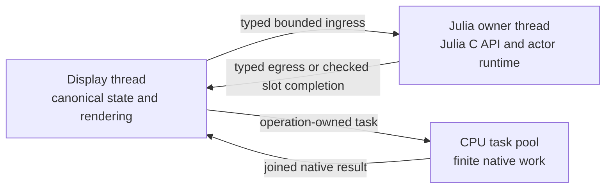
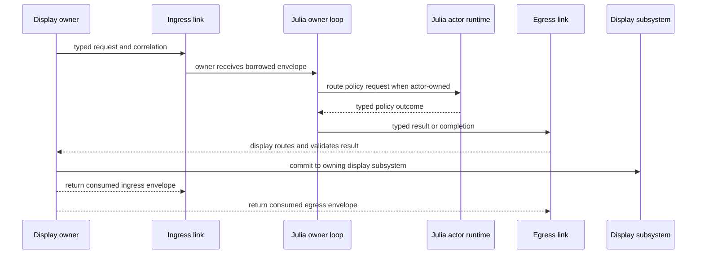
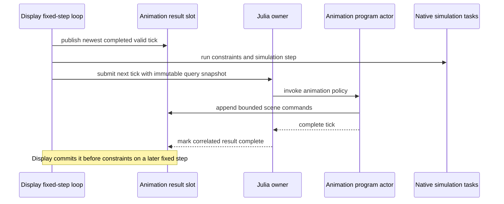
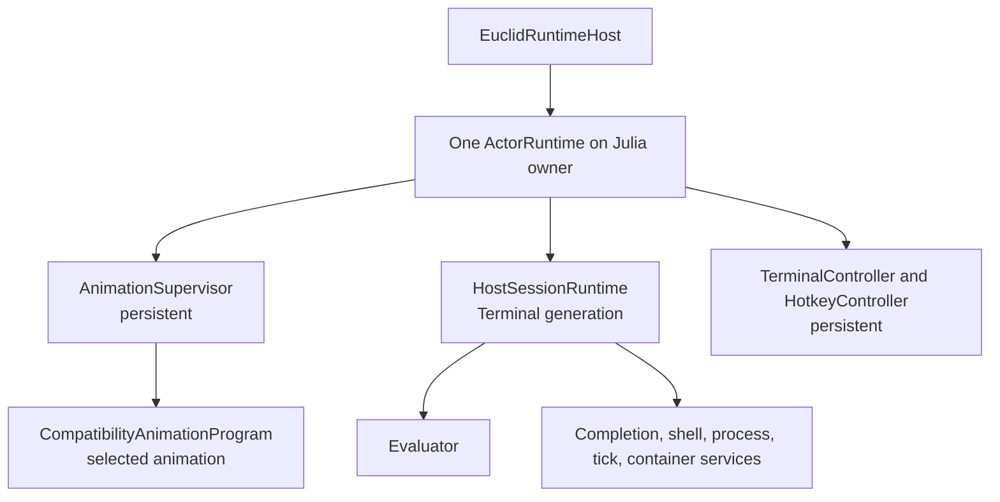
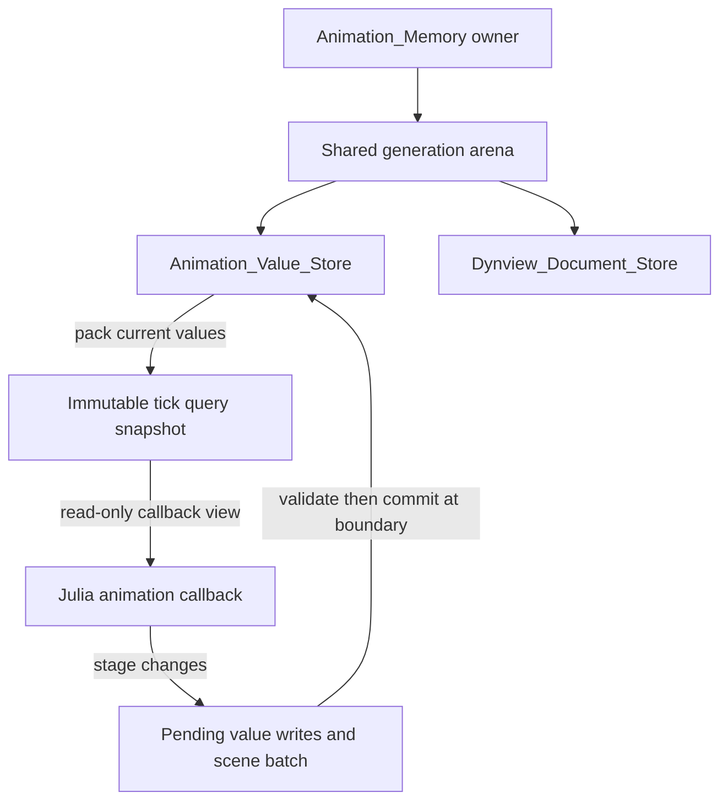
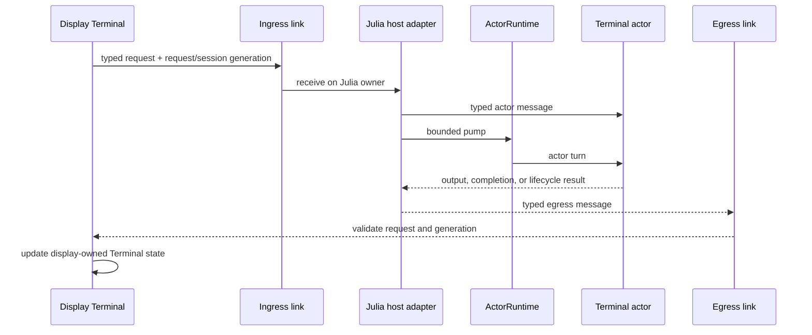

# Julia Thread Architecture

> Julia policy runs on one dedicated owner thread. Typed messages and checked
> result slots connect it to the display, while the display remains authoritative
> for visible application state.

## Table Of Contents

1. [Why Julia Has An Owner Thread](#why-julia-has-an-owner-thread)
1. [The Ownership Model](#the-ownership-model)
1. [Messages Are The Boundary](#messages-are-the-boundary)
1. [Synchronous Ticks, Asynchronous Work](#synchronous-ticks-asynchronous-work)
1. [Actors Organize Julia Policy](#actors-organize-julia-policy)
1. [Memory And Lifetime Boundaries](#memory-and-lifetime-boundaries)
1. [Follow The Main Workflows](#follow-the-main-workflows)
1. [Code Map](#code-map)
1. [Failure, Lifecycle, And Verification](#failure-lifecycle-and-verification)
1. [Correctness Invariants](#correctness-invariants)

## Why Julia Has An Owner Thread

Julia arrived before the dedicated thread. It was first added as the driver for shape
animations, and callbacks initially ran on the display thread. That was a natural first
step: the display owned the scene, and Julia produced animation changes for it. As the
runtime grew, however, every Julia operation—including interactive evaluation, reload,
and presentation production—had to return to that same thread.

The display thread also has a frame deadline. Letting it enter an embedded language
runtime couples input, rendering, and frame pacing to Julia compilation, evaluation,
garbage collection, and other potentially long runtime work. A dedicated owner thread
moves that Julia work off the display thread's critical path, creates the opportunity to
overlap it with native frame work, and gives all Julia C API access one stable home. It
also creates room for more asynchronous services without making every new feature
another special case in the render loop.

This is an isolation and scheduling boundary, not a claim that Julia work is free or
parallel:

- Julia calls remain serialized on one thread; the actor runtime does not add parallel
  Julia execution.
- Julia garbage collection or a slow callback can still delay other Julia requests and
  consume CPU. Separating the owner reduces direct interference with display-thread
  execution; it does not eliminate CPU or memory contention, or promise pause-free
  Julia work.
- Native work may run on the CPU task pool, but those workers never enter Julia.
- Some operations intentionally rendezvous with the Julia owner. The frame-tick
  relationship is asynchronous in execution but still ordered at fixed-step commit
  boundaries.

The architectural goal is to make the ordinary path increasingly asynchronous while
keeping the points that must be ordered explicit and small.

## The Ownership Model

Three execution roles cooperate but do not share mutable ownership:

| Role | Owns | Typical work | Boundary back to the display |
| --- | --- | --- | --- |
| **Display thread** | Window and GPU resources, UI, canonical scene and Terminal state, fixed-step orchestration | Poll input, prepare UI, route results, publish validated state, draw | Submits typed ingress; validates and commits typed egress or slots |
| **Julia owner thread** | Julia lifetime and C API, one actor runtime, Julia content generations and policy | Initialize/evaluate Julia, pump actors, run animation callbacks, serialize presentation, reload | Sends typed egress or completes a checked slot |
| **CPU task pool** | Operation-owned native payloads and caches during finite tasks | Simulation, constraint solving, TeX parse, Dynview compilation/layout, font preparation | Returns joined operation-owned results to the display owner |

The Julia owner is a persistent thread, not one of the CPU-pool workers. The display
thread is the only owner of visible state and native rendering. The Julia thread may
request changes but cannot directly mutate canonical scene or UI state. Task-pool work
may prepare native data but cannot call Julia, use thread-affine native APIs, or publish
visible state.


```mermaid
flowchart LR
    D[Display thread<br/>canonical state and rendering]
    J[Julia owner thread<br/>Julia C API and actor runtime]
    W[CPU task pool<br/>finite native work]

    D -->|typed bounded ingress| J
    J -->|typed egress or checked slot completion| D
    D -->|operation-owned task| W
    W -->|joined native result| D
```

The actor runtime exists inside the Julia-owner boundary. It organizes Julia-side
policy; it is neither a transport between operating-system threads nor an owner of
display state.

## Messages Are The Boundary

The bridge uses two typed tagged unions:

- [`Julia_Host_Ingress`](../../../src/bridge/model/runtime.odin) carries
  display-produced requests to the Julia owner.
- [`Julia_Host_Egress`](../../../src/bridge/model/runtime.odin) carries Julia-produced
  results and events back to the display.

Each direction has a bounded communication link with a producer-owned envelope pool.
The consumer borrows a message, interprets or copies its contents, then returns it to
the link that allocated it. This makes memory ownership travel with the message; the
receiver does not free memory from the other thread's pool.

The unions carry several message families. Their differences are part of the design,
not implementation trivia:

| Conversation | Display to Julia | Julia to display | Payload strategy |
| --- | --- | --- | --- |
| Runtime startup and shutdown | `Runtime_Initialize_Requested`, `Runtime_Content_Initialize_Requested`, `Runtime_Shutdown_Requested` | `Runtime_Initialized`, `Runtime_Content_Initialized`, `Runtime_Shutdown_Completed` | Correlated control message and completion |
| Animation tick | `Animation_Tick_Requested` with slot identity | `Animation_Tick_Completed` with the same slot identity | Small message; immutable query and scene batch stay in checked service-owned slot |
| Animation selection, reset, reload | `Animation_Lifecycle_Requested` with transaction identity | `Animation_Lifecycle_Completed` | Checked lifecycle slot plus correlated completion |
| Terminal session and evaluation | `Terminal_Session_Started`, `Evaluation_Requested`, `Terminal_Interactive_Input`, and other typed Terminal requests | `Terminal_Session_Ready`, `Terminal_Output_Batch`, `Evaluation_Completed`, and other typed results | Pooled typed messages carrying request/session identity |
| Completion and shell interaction | `Completion_Requested` and shell/session requests | `Completion_Result`, `Completion_Failed`, and correlated policy results | Bounded typed request and response |
| Presentation content | Produced directly by Julia as `View_Content_Ready` | Not an actor conversation | Producer-owned MIME bytes in an egress envelope; display stages a pointer-free snapshot |
| Terminal tick stream | `Tick_Pulse` and stream acknowledgements/configuration | `Tick_Stream_Configure_Requested`, `Tick_Stream_Stop_Requested` | Typed control and pulse messages, correlated to a Terminal generation |

Message names above are representative, not the complete union. The exhaustive current
variants are defined beside the union in
[`src/bridge/model/runtime.odin`](../../../src/bridge/model/runtime.odin) and the
Terminal protocol in [`src/core/protocol/`](../../../src/core/protocol/). The bridge
worker dispatches known variants; it is not a generic callback queue.


```mermaid
sequenceDiagram
    participant D as Display owner
    participant I as Ingress link
    participant J as Julia owner loop
    participant A as Julia actor runtime
    participant E as Egress link
    participant C as Display subsystem

    D->>I: typed request and correlation
    I->>J: owner receives borrowed envelope
    J->>A: route policy request when actor-owned
    A-->>J: typed policy outcome
    J->>E: typed result or completion
    E-->>D: display routes and validates result
    D->>C: commit to owning display subsystem
    D-->>I: return consumed ingress envelope
    D-->>E: return consumed egress envelope
```

### When a message is not the payload

Some work is too large or has a different lifetime to copy through a channel for every
request. In those cases the message carries a handle to an explicitly owned slot:

- Animation tick requests identify a slot containing the immutable query snapshot and
  bounded scene-command batch.
- Lifecycle requests identify a slot containing the frozen selection/reset/reload
  intent.
- Presentation messages carry source bytes through the producer's bounded pool; after
  parsing and validation, the display publishes pointer-free semantic records into a
  snapshot slot.

Handles include reservation or generation identity where reuse could make an old
completion look current. The consumer checks that identity before commit and is the
owner that releases or recycles the slot. The exact slot layout and state transitions
live in [`runtime.odin`](../../../src/bridge/model/runtime.odin).

## Synchronous Ticks, Asynchronous Work

“Julia is asynchronous” does not mean animation policy has been detached from the
simulation clock. The display keeps a fixed-step simulation, sends animation work to
Julia without waiting for each callback to finish, and commits a completed result only
at an authorized fixed-step boundary.


```mermaid
sequenceDiagram
    participant D as Display fixed-step loop
    participant S as Animation result slot
    participant J as Julia owner
    participant A as Animation program actor
    participant N as Native simulation tasks

    D->>S: publish newest completed valid tick
    D->>N: run constraints and simulation step
    D->>J: submit next tick with immutable query snapshot
    J->>A: invoke animation policy
    A->>S: append bounded scene commands
    A-->>J: complete tick
    J-->>S: mark correlated result complete
    Note over D,S: Display commits it before constraints on a later fixed step
```

In code, [`run_deterministic_fixed_step`](../../../src/view/simulation/simulation_timing.odin)
first attempts to publish an available tick result, then submits a new tick if policy is
not paused, and runs the native simulation work. The result is validated and committed
before constraints can consume it. A result that finishes after a boundary waits for a
later one; stale generations or sequences are rejected. Under overload, elapsed work is
coalesced rather than growing an unbounded backlog.

This preserves a synchronous **commit contract** without making Julia execution
synchronous with every frame. Rendering never calls Julia and never waits for a tick
callback. It consumes canonical state after owner-controlled publication and joined
native preparation.

There are deliberate exceptions:

| Operation | Wait behavior | Why |
| --- | --- | --- |
| Startup initialization | Startup waits for correlated readiness before using Julia content | The runtime must exist before content services can rely on it |
| Animation tick | Asynchronous request; result commits at a fixed-step boundary | Keep simulation ordering while allowing display/native work to overlap Julia |
| Terminal evaluation/completion | Request/result messages; no render-loop Julia call | Evaluation and user interaction may take longer than a frame |
| Animation selection/reset/reload | Synchronous correlated lifecycle barrier after tick quiescence | Replacing Julia generations and animation actors must be exclusive |
| View/Dynview content | Replaceable asynchronous publication, then native parse/compile work | Content can supersede older content without being a scene mutation |
| Shutdown | Cooperative owner-thread sequence, then join | Julia cannot be safely unwound from an unrelated thread |

The exact frame ordering is in [`frame.odin`](../../../src/view/frame.odin) and
[`simulation_timing.odin`](../../../src/view/simulation/simulation_timing.odin). This
guide describes the boundaries; those functions are the authority for call order.

## Actors Organize Julia Policy

All actor turns run on the Julia owner thread. The actors provide typed mailboxes,
generational identity, request correlation, lifecycle, and cooperative scheduling.
They do not create parallel Julia execution and do not replace the Odin communication
links or checked slots.

The owner adapter pumps one shared scheduler with bounded turns and a time budget.
Terminal and animation policy therefore make progress through one fair ready queue,
while each actor retains a narrow responsibility. The pump status reports whether more
service is due; it is not a second thread or a promise that every Julia request finishes
within a frame.

| Lifetime | Actor or service | Policy it owns |
| --- | --- | --- |
| Runtime | `AnimationSupervisor` | Animation identity, active program actor, selection/reset/reload transactions, child failure |
| Runtime | `TerminalController` | Terminal visibility and top-level session policy |
| Runtime | `HotkeyController` | Hotkey registration and routing policy |
| Terminal generation | `Evaluator` | Julia evaluation sequencing and correlated output/completion |
| Terminal generation | `CompletionService`, `ShellInterpolationService` | Completion and shell-expression policy |
| Terminal generation | `ShellSession`, `TerminalProcessService` | Julia shell policy and coordination of native process lifecycle requests |
| Terminal generation | `TickService`, `TerminalContainerService` | Tick subscriptions and container observation/policy |
| Selected animation | `CompatibilityAnimationProgram` | Adapts actor commands to one animation's `Enter`, `Tick`, and `Exit` callbacks |

Persistent roots survive Terminal generation replacement; evaluator and other
generation-scoped actors are retired with their session. The selected animation
program is a child of the persistent supervisor and is replaced transactionally.
Generation-bearing `ActorId`s prevent a stale message from addressing a reused
scheduler slot.


```mermaid
flowchart TD
    Host[EuclidRuntimeHost]
    Runtime[One ActorRuntime on Julia owner]
    Supervisor[AnimationSupervisor<br/>persistent]
    Program[CompatibilityAnimationProgram<br/>selected animation]
    Session[HostSessionRuntime<br/>Terminal generation]
    Evaluator[Evaluator]
    Services[Completion, shell, process, tick, container services]
    Roots[TerminalController and HotkeyController<br/>persistent]

    Host --> Runtime
    Runtime --> Supervisor --> Program
    Runtime --> Session
    Session --> Evaluator
    Session --> Services
    Runtime --> Roots
```

**Boundary to keep clear:** Julia actors decide what Julia-side policy should happen.
The Odin bridge decides how requests and results cross threads, and display-owned
subsystems decide whether published results are still valid and when they affect
visible state.

## Memory And Lifetime Boundaries

There are two memory stories here, and they should not be conflated: native
generation-scoped animation storage, and Julia objects that must stay rooted while
native code calls into Julia.

### One shared native animation arena

Odin's `Animation_Memory` owns a shared arena borrowed by both the animation-value
store and Dynview document store. They are separate stores with different APIs, but
their generation-scoped allocations draw from the same backing arena. This gives
animation values and authored document data a common lifetime and lets the application
retire that generation's storage together.


```mermaid
flowchart TB
    Owner[Animation_Memory owner]
    Arena[Shared generation arena]
    Values[Animation_Value_Store]
    Documents[Dynview_Document_Store]
    Callback[Julia animation callback]
    Snapshot[Immutable tick query snapshot]
    Commands[Pending value writes and scene batch]

    Owner --> Arena
    Arena --> Values
    Arena --> Documents
    Values -->|pack current values| Snapshot
    Snapshot -->|read-only callback view| Callback
    Callback -->|stage changes| Commands
    Commands -->|validate then commit at boundary| Values
```

Before publishing a new generation, the owners clear the value and document-store
borrowers, reset the arena once, then publish the new generation to both stores. The
stores must not retain pointers into the prior generation across that reset. Tick
callbacks do not borrow this mutable canonical arena for arbitrary reads: the display
packs values into the immutable tick snapshot, and Julia writes are staged for
validation and commit. See [`memory.odin`](../../../src/core/animation/memory.odin),
[`value_store.odin`](../../../src/core/animation/value_store.odin),
[`document_store.odin`](../../../src/dynview/core/document_store.odin), and the shared
orchestration in [`animation_storage.odin`](../../../src/bridge/animation_storage.odin).

### Julia GC roots have a defined window

The Julia heap is not this arena. Native code holds Julia handles only while the Julia
owner thread is active, and the handles must remain visible to Julia's collector for
the exact period native code relies on them:

- The worker installs a Julia GC frame rooting the runtime host for its initialized
  lifetime. The host owns the Julia-side runtime generation and actor runtime; the
  Odin service pointer is borrowed and remains valid until the worker has shut down.
- Calls that construct Julia tick or lifecycle arguments push a stack GC frame for the
  Julia values used during that invocation, then restore the prior GC stack on return.
- Reload stages a candidate under a local root while it is validated. The stable host
  continues to root the active generation until the candidate is committed or rolled
  back.
- Julia-to-Odin byte transfers use explicit preserved Julia values while native code
  copies them into producer-owned bridge storage. The receiver does not retain Julia
  heap pointers.

This is a bounded rooting window, not a global pause of Julia GC: ordinary Julia
collection remains part of Julia execution. When investigating a stale Julia handle,
start with the worker-lifetime frame and teardown in
[`runtime_service.odin`](../../../src/bridge/runtime_service.odin), then inspect
per-call roots and reload staging in
[`animations.odin`](../../../src/bridge/animations.odin) and
[`bootstrap.odin`](../../../src/bridge/bootstrap.odin). Julia-side byte preservation is
visible in [`presentation.jl`](../../../src/julia/bridge/presentation.jl).

The bridge links, tick slots, lifecycle slot, and view snapshot slots have their own
bounded storage and lifetimes; they do not allocate from the shared animation arena.
Their definitions and ownership transitions are in
[`src/bridge/model/runtime.odin`](../../../src/bridge/model/runtime.odin) and the
transport helpers in [`communication_link.odin`](../../../src/bridge/communication_link.odin).

## Follow The Main Workflows

### Terminal: interactive request and response

Terminal is the clearest actor conversation. Odin owns input routing, the terminal
grid, scrollback, selection, PTY/process resources, and rendering. Julia actors own
evaluation sequencing, completion, shell policy, and generation-local session state.


```mermaid
sequenceDiagram
    participant D as Display Terminal
    participant I as Ingress link
    participant H as Julia host adapter
    participant R as ActorRuntime
    participant A as Terminal actor
    participant E as Egress link

    D->>I: typed request + request/session generation
    I->>H: receive on Julia owner
    H->>A: typed actor message
    H->>R: bounded pump
    R->>A: actor turn
    A-->>H: output, completion, or lifecycle result
    H-->>E: typed egress message
    E-->>D: validate request and generation
    D->>D: update display-owned Terminal state
```

Ingress/egress variants include evaluation requests and output batches, completion
requests/results, session start/stop, interactive input, input ownership, geometry and
capability observations, process requests, and tick-stream messages. Rather than
duplicating all Terminal protocol fields here, follow
[`src/core/protocol/`](../../../src/core/protocol/) and
[`src/view/terminal/service/terminal_service.odin`](../../../src/view/terminal/service/terminal_service.odin).
For Terminal behavior and lifecycle, see [Terminal Architecture](TerminalArchitecture.md).

Each Terminal session generation has a fresh Julia module, REPL runtime, and
generation-scoped actors. Evaluation output can be emitted in bounded batches; Odin
validates the generation before changing its grid. Native process ownership stays on
the Odin side even when Julia shell policy participates.

### Animation: snapshot in, transaction out

An animation callback must not query or mutate canonical display state while Julia is
running independently. The display reserves a tick slot and copies the query values
Julia may read into an immutable snapshot. Mutation bridge calls append commands to
that slot's bounded scene batch rather than changing the scene directly.

The request carries a slot handle plus request ID, animation generation, and tick
sequence. The Julia owner validates the identity, routes the typed tick through
`AnimationSupervisor` to the one active compatibility program, and returns a correlated
completion. Odin validates the completed slot and commits its whole batch at a
fixed-step boundary. Stale, malformed, or overflowing results are not partially
applied.

### Invocation Content Query

Animation code can query the content specification selected for its current callback,
including the locale, edition, animation identity, and content/runtime generations.
The host copies and validates that value for the specific `Enter`, `Tick`, or `Exit`
invocation, then binds the Julia-owned copy only for that callback. It does not expose a
pointer into Odin storage or provide a background query of mutable current selection.
This is why an old `Exit` and a replacement `Enter` can each see the correct
generation-specific value during a lifecycle transition.

Follow
[`content_specification.odin`](../../../src/bridge/content_specification.odin) and
[`content_specification.jl`](../../../src/julia/bridge/content_specification.jl).
The callback-scoping contract is also used by [Localization And Editions](Localization.md)
and the [Architecture Summary](ArchitectureSummary.md).

Start at [`animations.odin`](../../../src/bridge/animations.odin) for request
submission, validation, and fixed-step publication; then follow
[`scene_commands.odin`](../../../src/bridge/scene_commands.odin) for transactional
mutation and [`animation_supervisor.jl`](../../../src/julia/policy/animation_supervisor.jl)
for Julia policy. The query and command data structures are in
[`src/bridge/model/model.odin`](../../../src/bridge/model/model.odin).

### Selection, reset, and reload: an explicit barrier

Lifecycle changes are not ordinary ticks. Replacing a selected program or content
generation requires exclusive ordering with the currently active callback:

1. Stop admitting new ticks and wait until the outstanding tick is resolved.
1. Freeze the requested operation and current identity into a checked lifecycle slot.
1. Send `Animation_Lifecycle_Requested` and wait for its correlated completion while
   still routing unrelated egress.
1. Validate the result; only then advance the animation/runtime generation and resume
   normal tick submission.

Reload builds and validates a candidate runtime generation before publication. If
loading or candidate activation fails, it retires the candidate and restores the prior
active generation. This is intentionally a narrow synchronous barrier; it is not the
ordinary communication model for ticks, Terminal requests, or presentation updates.
Follow [`runtime_session.odin`](../../../src/view/runtime_session.odin),
[`bootstrap.odin`](../../../src/bridge/bootstrap.odin), and
[`animation_supervisor.jl`](../../../src/julia/policy/animation_supervisor.jl).

### Presentation: a replaceable value, not an actor conversation

Julia can publish authored presentation content directly as `View_Content_Ready`.
There is no presentation actor, and the content is not appended to an animation scene
batch. The display admits the newest value, parses TeX on native worker tasks when
needed, validates it, and publishes immutable pointer-free semantics into a snapshot.
Compilation, shaping, and layout then produce display-readable derived caches.

This path can supersede older content while parsing or compilation is underway. The
display retains a producer-owned envelope until native parsing joins, returns the
envelope to the Julia link, and publishes only a complete current-generation snapshot.
Begin at [`presentation.jl`](../../../src/julia/bridge/presentation.jl),
[`abi-presentation.odin`](../../../src/bridge/abi-presentation.odin), and
[`presentation_runtime.odin`](../../../src/view/presentation/presentation_runtime.odin);
continue into [`dynview_native_tex.odin`](../../../src/bridge/dynview_native_tex.odin)
and [`src/dynview/`](../../../src/dynview/).

## Code Map

| Question | Start here | Continue into |
| --- | --- | --- |
| How are Julia requests and events transported? | [`communication_link.odin`](../../../src/bridge/communication_link.odin), [`runtime_service.odin`](../../../src/bridge/runtime_service.odin) | [`src/bridge/model/runtime.odin`](../../../src/bridge/model/runtime.odin) |
| Where is request dispatch and owner-thread enforcement? | [`runtime_service.odin`](../../../src/bridge/runtime_service.odin) | [`runtime_host.jl`](../../../src/julia/runtime_host.jl), [`src/julia/host/`](../../../src/julia/host/) |
| How is the Julia runtime initialized and stopped? | [`bootstrap.odin`](../../../src/bridge/bootstrap.odin) | [`src/julia/sysimage_core.jl`](../../../src/julia/sysimage_core.jl), [`src/julia/host/`](../../../src/julia/host/) |
| Where is actor creation and pump policy? | [`host.jl`](../../../src/julia/host.jl) | [`src/julia/policy/`](../../../src/julia/policy/) |
| How is Terminal work submitted and committed? | [`terminal_service.odin`](../../../src/view/terminal/service/terminal_service.odin) | [`src/core/protocol/`](../../../src/core/protocol/), [`src/julia/policy/`](../../../src/julia/policy/) |
| How are animation requests and batches handled? | [`animations.odin`](../../../src/bridge/animations.odin), [`scene_commands.odin`](../../../src/bridge/scene_commands.odin) | [`animation_supervisor.jl`](../../../src/julia/policy/animation_supervisor.jl), [`animation_protocol.jl`](../../../src/julia/policy/animation_protocol.jl) |
| How is presentation content published? | [`abi-presentation.odin`](../../../src/bridge/abi-presentation.odin) | [`presentation_runtime.odin`](../../../src/view/presentation/presentation_runtime.odin), [`src/dynview/`](../../../src/dynview/) |
| Where are bridge payload types defined? | [`src/bridge/model/`](../../../src/bridge/model/) | [`src/core/protocol/`](../../../src/core/protocol/) |
| Where are focused tests? | [`communication_link_test.odin`](../../../src/bridge/communication_link_test.odin) | [`animations_test.odin`](../../../src/bridge/animations_test.odin), [`src/julia/test/`](../../../src/julia/test/) |

The display frame coordinator that interleaves egress routing, presentation, fixed
steps, and drawing is [`view.odin`](../../../src/view/view.odin) and
[`frame.odin`](../../../src/view/frame.odin). The dedicated Julia thread and runtime
service are implemented in [`runtime_service.odin`](../../../src/bridge/runtime_service.odin).

## Failure, Lifecycle, And Verification

### Failure and shutdown

The bridge reports queue saturation, allocation failure, stale identity, invalid
payloads, and actor failure as explicit outcomes. Display-side submission is bounded
and nonblocking; a failed send leaves the caller responsible for handling the request
or releasing its reserved slot. Egress may apply bounded backpressure if the display
stops draining it. Counters and diagnostics are available in the bridge runtime
service.

Shutdown is cooperative because Julia is thread-affine and an arbitrary C API call
cannot safely be killed from another thread. The display requests shutdown, the owner
retires animation and Terminal actors in dependency order, Julia performs its own
teardown, and only after the completion does the display join the thread and destroy
links and owned storage. Startup and shutdown details are in
[`bootstrap.odin`](../../../src/bridge/bootstrap.odin) and
[`runtime_service.odin`](../../../src/bridge/runtime_service.odin).

### Current boundaries and tradeoffs

- Julia requests execute serially. A slow callback delays later Julia work, though the
  display can continue ordinary frames and native work.
- Fixed-step animation publication is ordered, but overload may coalesce elapsed ticks.
- Selection/reset/reload use a synchronous lifecycle barrier and may briefly stall the
  display while the old generation is retired and the new one is validated.
- Presentation production and Terminal requests are message-driven, but both remain
  subject to bounded queue pressure and owner-thread service time.
- Separating the thread reduces direct coupling to display execution; it does not
  guarantee that Julia GC or CPU contention cannot affect responsiveness.

These are current implementation characteristics, not desirable limits for all future
work. The direction is more asynchronous service where it helps responsiveness, with
explicit correlation, bounded storage, immutable reads, and owner-controlled commit.

## Correctness Invariants

Keep these boundaries intact when changing message types, task ordering, or actor
policy:

- Only the Julia owner thread enters the Julia C API.
- Julia actors organize policy but never mutate visible display-owned state.
- A transport envelope stays owned by its producer and returns to that producer after
  consumption; large or long-lived work uses an explicitly owned slot or snapshot.
- Animation queries read an immutable submission snapshot; scene changes publish as a
  complete validated batch before constraints.
- Generation, sequence, and reservation identity are checked before a delayed result is
  committed or storage is reused.
- Presentation snapshots and native task results are fully prepared and joined before
  display-owned aliases or caches consume them.
- Rendering does not call Julia or consume worker-owned mutable data.

### Verification

The bridge and actor behavior have Odin and Julia test coverage. For a focused entry,
start with [`communication_link_test.odin`](../../../src/bridge/communication_link_test.odin),
[`animations_test.odin`](../../../src/bridge/animations_test.odin), and
[`src/julia/test/animation_actor_tests.jl`](../../../src/julia/test/animation_actor_tests.jl);
Terminal, runtime-host, and publication tests are grouped under
[`src/julia/test/`](../../../src/julia/test/) and their owning Odin packages.

Use the repository's documented commands rather than ad hoc language invocations:

```sh
julia tools/make.jl unit julia
julia tools/make.jl unit odin
cmake --build --preset default --target check
```

The full `check` target is the repository gate. Unit suites alone do not verify the
validated build and repository analysis; consult [Testing Strategy](TestingStrategy.md)
for selecting behavioral evidence when a change depends on frame ordering, reload,
Terminal interaction, or shutdown.
