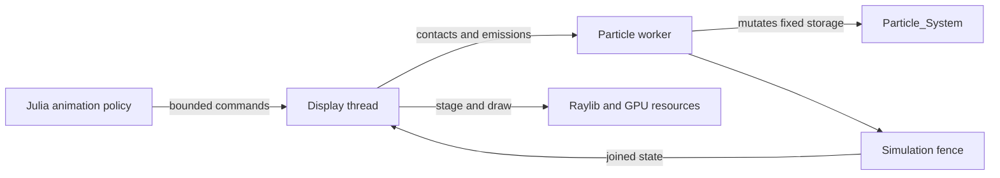
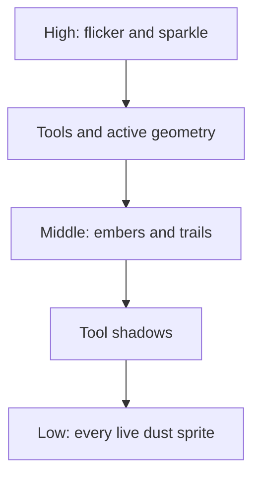
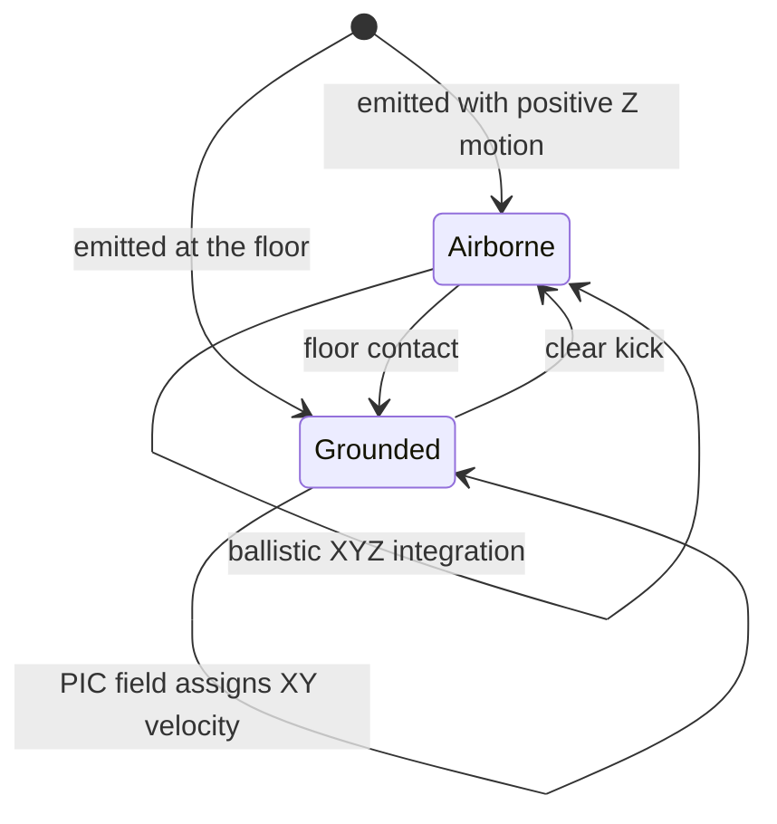
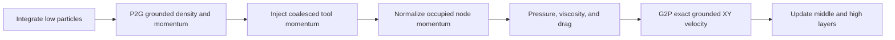
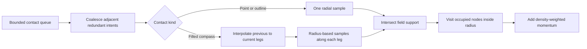

# Particle System

## Purpose And Ownership

Euclid's particle system owns bounded particle storage, deterministic emission,
fixed-step particle motion, grounded-dust field physics, and particle diagnostics.
Julia animation policy may request emissions and tool actions, but it does not mutate
particle storage. The particle worker is the sole simulation writer during a fixed
step. The display thread reads only after the simulation fence joins and exclusively
owns projection, Raylib resources, GPU uploads, and drawing.

The shipped grounded-dust design is particle-in-cell (PIC): particles remain the
visible material while one fixed vector field is the sole authority for grounded XY
velocity. Airborne dust remains ballistic. Every live low particle remains an
individual sprite.



## Particle Layers

Particles use three bounded layers with stable draw ordering.

| Layer | Typical content | Simulation | Render order |
| --- | --- | --- | --- |
| Low | Grounded and airborne dust | Ballistic Z plus grounded PIC XY | Behind tool shadows and active geometry |
| Middle | Embers and trails | Individual lifetime and velocity | Between shadows and active tools |
| High | Flicker and sparkle | Individual lifetime and velocity | Above tools |



`Particle_System` owns fixed-capacity structure-of-arrays storage for all layers. It
also owns deterministic random state, the bounded contact queue, grounded transfer
records, the field planes, and scalar diagnostics. No steady-state physics or render
staging path grows storage.

## Dust Lifecycle

Dust emission reserves a dead low-particle slot, assigns identity and spawn sequence,
initializes its sprite and visual state, and gives it an authored initial velocity.
Scenario emissions use explicit distribution, count, position, radius, and seed values
so acceptance runs are reproducible.

A particle above the floor is airborne. Gravity and ordinary ballistic integration own
its position and velocity until floor contact. A particle at the floor participates in
the grounded field and receives its XY velocity only from that field. A clear kick can
raise grounded particles into the airborne regime; gravity eventually returns them.



Grounded tool contacts never directly correct particle positions and never affect
airborne dust. Contacts already deposited into the shared field can affect grounded
particles emitted later in the same fixed step; this ordering is intentional.

## Grounded PIC Field

The field is a fixed $251 \times 251$ nodal lattice over normalized board coordinates
$[0,1]^2$. Its spacing is

$$
h = \frac{1}{250}.
$$

It owns five scalar planes:

- density $\rho$;
- momentum or normalized velocity work planes $m_x$ and $m_y$;
- solved velocity planes $u_x$ and $u_y$.

Only the inclusive support rectangle touched by current deposits is processed. The
solve rectangle expands support by one node in each direction and clamps to the board,
providing the cardinal-neighbor halo required by pressure and viscosity. The previous
solve rectangle is cleared before the next deposition pass.

### Bilinear Transfer

For board position $p=(x,y)$, clamped lattice coordinates are

$$
q_x = 250\,\operatorname{clamp}(x,0,1), \qquad
q_y = 250\,\operatorname{clamp}(y,0,1).
$$

Let $i=\min(\lfloor q_x\rfloor,249)$,
$j=\min(\lfloor q_y\rfloor,249)$, $a=q_x-i$, and $b=q_y-j$. The
four bilinear weights are

$$
w_{00}=(1-a)(1-b),\quad w_{10}=a(1-b),\quad
w_{01}=(1-a)b,\quad w_{11}=ab.
$$

They sum to one at interior and boundary positions. Each grounded particle caches its
base node, fractional coordinates, and particle slot once per step. P2G and G2P expand
that compact record into the same four-node stencil.

### Fixed-Step Pipeline



For grounded particles $p$ and field nodes $i$, deposition is

$$
\rho_i = \sum_p w_{ip}, \qquad
\mathbf m_i = \sum_p w_{ip}\mathbf v_p.
$$

Occupied momentum is normalized to nodal velocity. Yielded pressure is quadratic above
the density threshold:

$$
P(\rho)=k\max(\rho-\rho_y,0)^2.
$$

The solver applies a centered pressure gradient, a cardinal discrete velocity
Laplacian, bounded pressure acceleration, and rational drag:

$$
\mathbf u_i^{n+1} =
\frac{\mathbf u_i^n + \Delta t\left(-\nabla P_i/\rho_i +
\nu\nabla^2\mathbf u_i\right)}{1+\lambda\Delta t}.
$$

G2P reconstructs each grounded particle's exact next XY velocity:

$$
\mathbf v_p^{n+1}=\sum_i w_{ip}\mathbf u_i^{n+1}.
$$

There is no independent grounded residual velocity, particle-pair correction, or sleep
state competing with this result.

## Tool Contacts

The display queues bounded contact intents instead of searching particle storage.
Each intent records its source, geometry, and spawn-sequence cutoff. The worker preserves
command order and coalesces only adjacent contacts with identical source semantics and
geometry.

Pens, ordinary compass movement, outlined circles, and outline highlights use point
contacts. Each contributes one radial-away sample at the authored tip. A filled-circle
update instead records the previous and current compass legs as one compound joint-2
contact. The worker interpolates complete legs across that motion, then samples along
each leg. Both interval counts derive from geometric distance and contact radius, so
sample spacing remains bounded in both dimensions and no radial or angular bands are
skipped.



At an occupied node, contact momentum scales by local density. Point contacts push
radially away from their sample. Filled-compass contacts follow local authored leg
motion, including when a sample lies exactly on an occupied field node. Empty nodes are
ignored, and airborne particles never enter this grounded field path. Diagnostics
retain overflow, coalesced-contact, generated-sample, and visited field-node counts so
contact cost can be explained without per-node trace events.

## Rendering

The renderer projects every live low particle and stores one interleaved `Dust_Instance`
record per visible sprite. The preferred path uploads that stream to one VBO and draws
GPU instances from the dust atlas. The immediate-mode fallback draws the same live
particles as quads when instancing is unavailable or disabled.

The field is never rendered as aggregate material. There is no aggregate texture,
coverage plane, sprite suppression, or alternate dense-pile rendering authority.
Particle identity, position, color, lifetime, size, sprite variant, and Z motion remain
particle-owned.

## Explicit Exclusions

The accepted system deliberately has none of the following:

- aggregate membership or hysteresis;
- a grounded particle-pair solver or collision grid;
- adaptive dense relaxation;
- sleeping, waking, quiet-frame, or wake-halo authority;
- direct grounded position correction from tools;
- aggregate field rendering or hidden low-particle sprites.

Airborne dust is individual and ballistic. Grounded dust is individual and visible but
shares one field-owned XY velocity model.

## Evidence And Acceptance

Post-join display observations expose live, grounded, and airborne counts; peak grounded
field speed; kinetic measure; solve-node area; bounded contact diagnostics; and rendered
low-sprite count. Scenario predicates use these canonical values:

- `dust_settled`: every live dust particle is grounded and peak field speed is at or
  below the settled threshold;
- `dust_active`: grounded field speed exceeds the activity threshold;
- `dust_airborne`: at least one live dust particle is above the floor.

Artifact schema 2 records only the accepted particle and field model. The checked-in
scenarios are:

- `dust-emission-acceptance`: deterministic 20,000-particle emission and capture;
- `dust-settling-acceptance`: settle, contact, activity, resettle, kick, and capture;
- `dust-pic-dense-acceptance`: 20,000-particle settle, contact wave, active and settled
  captures, allocation baseline, bad-free assertion, and orderly shutdown.

A screenshot is supporting visual evidence, not scenario success. The manifest must be
`passed`, required trace evidence must remain complete, allocation assertions must pass,
and shutdown must complete.

## Tuning And Source Map

Field dimensions and settled threshold live in `src/particles/model/model.odin`. Pressure,
viscosity, drag, transfer, support, and solve behavior live in
`src/particles/field.odin`. Emission, ballistic integration, contact queueing and
sampling, reset, kick, and fixed-step ordering live in `src/particles/particles.odin`.
Low-particle GPU and fallback rendering live in `src/view/particles.odin`. Observation,
predicates, and artifacts live under `src/evidence/`.

Tune constants only with deterministic field tests, both ordinary dust scenarios, the
dense PIC scenario, and comparable profile evidence. Preserve bilinear conservation,
boundary clamping, fixed storage, stable slot order, and worker/display ownership.

## Verification

Run the documented repository commands:

```sh
julia tools/make.jl unit odin
cmake --build --preset debug
julia tools/make.jl scenario dust-emission-acceptance
julia tools/make.jl scenario dust-settling-acceptance
julia tools/make.jl scenario dust-pic-dense-acceptance
julia tools/make.jl wiki
julia tools/make.jl check-wiki
cmake --build --preset default --target check
```

The complete `check` target, not a unit suite or screenshot alone, is the final delivery
gate.
