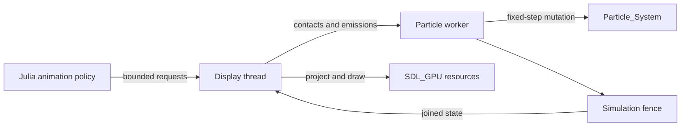
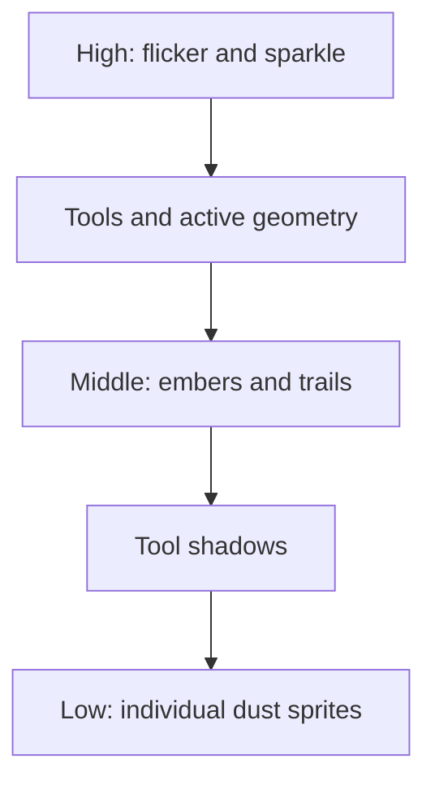
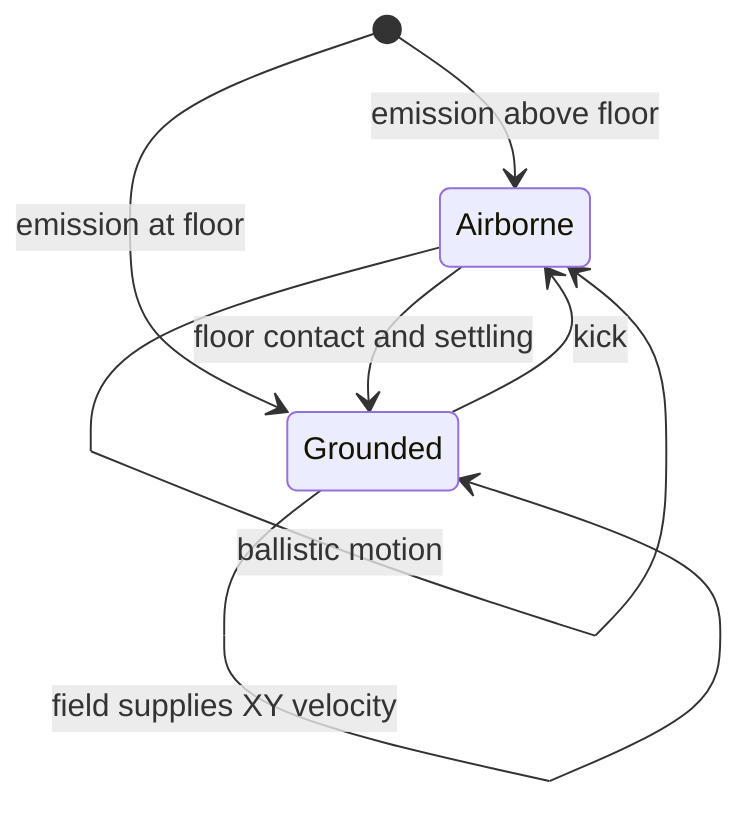
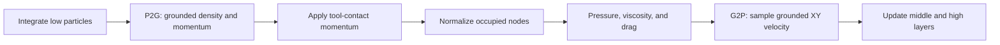

# Particle System

> Euclid keeps particles as the visible, individually owned material while using a
> shared field to coordinate the motion of grounded dust.

## Table Of Contents

1. [Why The System Changed](#why-the-system-changed)
1. [Ownership And Execution](#ownership-and-execution)
1. [Particle Layers And Lifecycle](#particle-layers-and-lifecycle)
1. [Grounded Dust As A Field](#grounded-dust-as-a-field)
1. [Contacts And Rendering](#contacts-and-rendering)
1. [Where To Trace A Change](#where-to-trace-a-change)
1. [Evidence And Exploration](#evidence-and-exploration)

## Why The System Changed

Particles began as effects around the drawing tools: trails and flickers first, then
dust released by geometric constructions. The early dust model used cell-based
collision detection and ordinary Newtonian particle motion. This gave the application
an expressive way to show construction and motion, but left the particle representation
and simulation model open to continued evolution.

As the system grew, its storage moved to structure-of-arrays form and gained SIMD
optimizations where available. The grounded-dust model later changed more substantially:
instead of resolving grounded motion through individual particle collisions, particles
transfer density and momentum to a shared PIC-like field; the field is evolved, then
sampled back to each particle. That change put field mechanics and individual particle
identity side by side, rather than replacing the dust with a continuous rendered
surface.

The rendering path evolved too. Dust instancing began in the earlier Raylib renderer
and later moved to SDL_GPU with the rest of the native backend. The history explains
why simulation, field transfer, and drawing are separate concerns today—and why this
guide points to the owning code rather than treating implementation values here as a
second specification.

## Ownership And Execution

Julia animation policy can request effects, but it does not mutate particle storage.
The display owner gathers contacts and emission requests; fixed-step work mutates the
particle and field state; after the worker fence joins, display-side rendering consumes
the settled result.

| Concern | Owner and boundary |
| --- | --- |
| Animation intent | Julia policy requests emissions and tool actions through the bridge. |
| Canonical particles and field | `Particle_System` owns fixed storage, deterministic random state, contact intents, field planes, and observations. |
| Fixed-step mutation | Particle/constraint work runs in the simulation task window; the particle worker is the simulation writer for particle state during that step. |
| Visible rendering | The display thread reads joined state, projects particles, and owns SDL_GPU publication and drawing. |
| Behavioral evidence | The evidence and scenario layers observe committed state; they do not bypass ordinary particle APIs. |

```mermaid
flowchart LR
    Julia[Julia animation policy] -->|bounded requests| Display[Display thread]
    Display -->|contacts and emissions| Worker[Particle worker]
    Worker -->|fixed-step mutation| System[Particle_System]
    Worker --> Fence[Simulation fence]
    Fence -->|joined state| Display
    Display -->|project and draw| GPU[SDL_GPU resources]
```

The important boundary is the join: the display must not read particle state while
fixed-step work is mutating it. For the exact task ordering and synchronization path,
start at [`src/view/simulation/simulation_executor.odin`](../../../src/view/simulation/simulation_executor.odin)
and [`src/view/frame.odin`](../../../src/view/frame.odin).

## Particle Layers And Lifecycle

The layers are a rendering and effect organization, not three different particle
frameworks. Low particles are primarily dust; middle particles carry trails and embers;
high particles provide flicker and sparkle. Their relative ordering helps preserve the
intended relationship between dust, shadows, tools, and effects.

| Layer | Typical role | Position in the draw order |
| --- | --- | --- |
| Low | Grounded and airborne dust | Behind tool shadows and active geometry |
| Middle | Embers and trails | Between shadows and active tools |
| High | Flicker and sparkle | Above tools |

```mermaid
flowchart TB
    High[High: flicker and sparkle]
    Tools[Tools and active geometry]
    Middle[Middle: embers and trails]
    Shadows[Tool shadows]
    Low[Low: individual dust sprites]
    High --> Tools --> Middle --> Shadows --> Low
```

Dust changes between airborne and grounded motion. Airborne particles follow ballistic
motion and may bounce at the floor. Grounded particles remain individually represented,
but their XY velocity is sampled from the shared field. A kick can return grounded dust
to airborne motion.

```mermaid
stateDiagram-v2
    [*] --> Airborne: emission above floor
    [*] --> Grounded: emission at floor
    Airborne --> Grounded: floor contact and settling
    Grounded --> Airborne: kick
    Grounded --> Grounded: field supplies XY velocity
    Airborne --> Airborne: ballistic motion
```

## Grounded Dust As A Field

The field maps normalized board coordinates onto a fixed square lattice. Let $N$ be
the number of nodes along either axis (`DUST_FIELD_DIM` in
[`src/particles/model/model.odin`](../../../src/particles/model/model.odin)). The board
spans $N-1$ intervals, so the spacing is

$$
h = \frac{1}{N-1}.
$$

For a board position $p=(x,y)$, clamped lattice coordinates are

$$
q_x=(N-1)\operatorname{clamp}(x,0,1), \qquad
q_y=(N-1)\operatorname{clamp}(y,0,1).
$$

The cell's fractional coordinates $a$ and $b$ define a four-node bilinear stencil:

$$
w_{00}=(1-a)(1-b),\quad w_{10}=a(1-b),\quad
w_{01}=(1-a)b,\quad w_{11}=ab.
$$

The weights sum to one, including at the board boundary. Particle-to-grid (P2G)
deposits each grounded particle's weighted density and XY momentum. After the field
updates its occupied nodes, grid-to-particle (G2P) samples the same stencil back to the
particle. Reusing the transfer coordinates keeps both directions consistent:

$$
\rho_i = \sum_p w_{ip}, \qquad
\mathbf m_i = \sum_p w_{ip}\mathbf v_p, \qquad
\mathbf v_p^{\,n+1}=\sum_i w_{ip}\mathbf u_i^{\,n+1}.
$$

Here $\rho_i$ and $\mathbf m_i$ are deposited density and momentum; $\mathbf u_i$ is
the field's solved velocity. The field organizes local motion, while each particle
retains its own position, visual properties, and identity.

```mermaid
flowchart LR
    Integrate[Integrate low particles] --> Deposit[P2G: grounded density and momentum]
    Deposit --> Contact[Apply tool-contact momentum]
    Contact --> Normalize[Normalize occupied nodes]
    Normalize --> Solve[Pressure, viscosity, and drag]
    Solve --> Sample[G2P: sample grounded XY velocity]
    Sample --> Layers[Update middle and high layers]
```

The solver's pressure law is a compact way to describe how crowded regions yield and
spread. Let $\rho_y$ denote the yield density and $k$ the pressure strength; their
current values are owned by `DUST_PRESSURE_YIELD` and `DUST_PRESSURE_STRENGTH` in
[`src/particles/field.odin`](../../../src/particles/field.odin):

$$
P(\rho)=k\max(\rho-\rho_y,0)^2.
$$

The pressure gradient contributes a bounded acceleration. Viscosity smooths neighboring
velocities, and rational drag damps them. In the following expression, $\Delta t$ is the
simulation step; $\nu$, $\lambda$, and $a_{\max}$ correspond to
`DUST_VISCOSITY`, `DUST_DRAG_RATE`, and `DUST_PRESSURE_ACCELERATION_MAX` in the same
solver module:

$$
\mathbf a_i^{\,p}=
\operatorname{clamp}\left(-\frac{\nabla P_i}{\rho_i},
-\mathbf a_{\max},\mathbf a_{\max}\right),
\qquad
\mathbf u_i^{\,n+1}=
\frac{\mathbf u_i^{\,n}+\Delta t\left(
\mathbf a_i^{\,p}+\nu\nabla^2\mathbf u_i^{\,n}\right)}
{1+\lambda\Delta t}.
$$

Only the region touched by deposits, plus its neighbor halo, needs field work. This keeps
the fixed topology useful as a local solver without making every field node part of
every step. Exact support bounds, integration order, and coefficients are implementation
details; the equations describe the model, not a separately maintained tuning contract.

## Contacts And Rendering

Tool contacts enter through bounded intents rather than scanning the particle arrays.
Point tools, filled-compass motion, shape reveals, and floor labels can contribute
different contact geometry; the worker turns those intents into field-local impulses.
This makes grounded response part of the shared field solve, while airborne dust remains
outside that interaction path.

Rendering preserves particle identity. Each visible low particle contributes an
individual sprite. The SDL_GPU instanced path is preferred; a bounded expanded-geometry
path can draw the same sprites when instancing is unavailable. Both feed the ordered
frame command stream so particle layers retain their place around shapes, shadows, and
tools. The field itself is not rendered as an aggregate dust surface.

The low-dust opacity expression makes the fade inputs explicit. If $t$ is normalized
lifetime progress, $\alpha_{\mathrm{peak}}$ is the display tuning in
[`src/view/world/particles_encoder.odin`](../../../src/view/world/particles_encoder.odin),
and $\alpha_{\mathrm{authored}}$ is the particle's authored alpha, the staged alpha is

$$
\alpha = \operatorname{clamp}(1-t,0,1)
    \frac{\alpha_{\mathrm{peak}}}{255}
    \frac{\alpha_{\mathrm{authored}}}{255}.
$$

The mask coverage and straight-alpha blend are handled by the native dust pipeline.
For renderer changes, follow
[`src/view/world/particles.odin`](../../../src/view/world/particles.odin),
[`src/view/world/particles_encoder.odin`](../../../src/view/world/particles_encoder.odin),
and [`src/view/native/sdl_dust_pipeline.odin`](../../../src/view/native/sdl_dust_pipeline.odin).

## Where To Trace A Change

| If you are changing... | Start with... |
| --- | --- |
| Particle storage, identities, field records, or limits | [`src/particles/model/model.odin`](../../../src/particles/model/model.odin) |
| Emission, ballistic motion, kicks, contacts, or step order | [`src/particles/particles.odin`](../../../src/particles/particles.odin) |
| P2G/G2P transfer, pressure, viscosity, drag, or support bounds | [`src/particles/field.odin`](../../../src/particles/field.odin) |
| Projection, instancing, fallback drawing, or alpha | [`src/view/world/particles.odin`](../../../src/view/world/particles.odin), [`src/view/world/particles_encoder.odin`](../../../src/view/world/particles_encoder.odin), [`src/view/native/sdl_dust_pipeline.odin`](../../../src/view/native/sdl_dust_pipeline.odin) |
| Runtime evidence or scenario observations | [`src/evidence/`](../../../src/evidence/), [`tools/scenarios/`](../../../tools/scenarios/) |
| Deterministic field and particle behavior | [`src/particles/field_test.odin`](../../../src/particles/field_test.odin), [`src/particles/particles_test.odin`](../../../src/particles/particles_test.odin) |

## Evidence And Exploration

The field tests are the clearest place to understand transfer conservation, boundary
handling, impulses, and solver behavior. Particle tests cover emission, fixed-step
transitions, and the interaction between field state and particle state. The checked-in
[`dust-emission-acceptance`](../../../tools/scenarios/dust-emission-acceptance.jsonl),
[`dust-settling-acceptance`](../../../tools/scenarios/dust-settling-acceptance.jsonl), and
[`dust-pic-dense-acceptance`](../../../tools/scenarios/dust-pic-dense-acceptance.jsonl)
scenarios exercise progressively broader runtime behavior.

Use observations and scenario artifacts to support claims about settling, contact
response, rendered particles, allocation behavior, or shutdown. A screenshot can help
review appearance, but it does not establish that the scenario passed or that its
semantic evidence is complete. The relevant tests, scenario manifests, and current
source remain authoritative for exact values and behavior.
