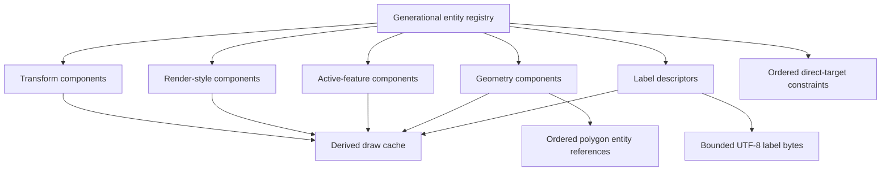
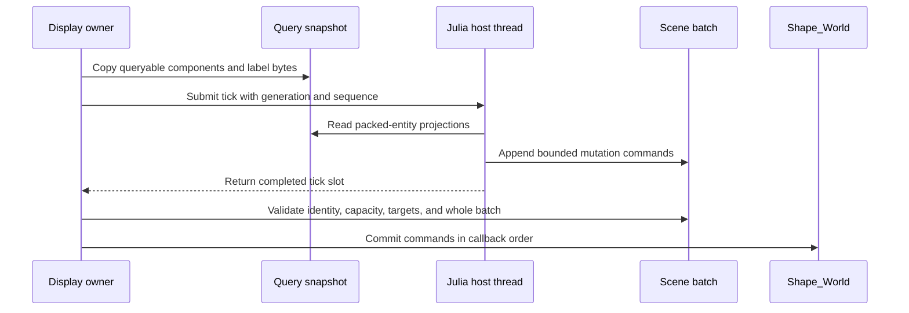
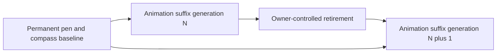

# Shape System

## Purpose

Euclid stores canonical geometry in one fixed-capacity `Shape_World`. The world is
specialized for two lifetimes: a permanent tool prefix and one replaceable animation
suffix. It is deliberately not a general entity-component framework. It has no arbitrary
entity deletion, free list, swap removal, or runtime storage growth.

This guide describes four contracts that must remain aligned:

1. `Shape_World` owns canonical identity, components, topology, text, and constraints.
2. The Odin-Julia bridge exposes packed identities and pointer-free ABI values.
3. The shape preparation worker compiles canonical state into a bounded draw cache.
4. Animation retirement invalidates every derived or borrowed view before reuse.

## Source Map

| Concern | Owning source |
| --- | --- |
| Entity, component, pool, constraint, and world types | `src/core/shapes.odin` |
| ABI structs, status values, and bridge version | `src/bridge/abi.odin` |
| Shape constructors and preflight | `src/shapes/world_constructors.odin` |
| Direct-target constraint creation and solving | `src/shapes/world_constraints.odin` |
| World-to-packet compilation | `src/shapes/world_render.odin` |
| Shared packet sorting and polygon triangulation | `src/shapes/draw_cache.odin` |
| Native shape exports | `src/bridge/abi-shapes.odin` |
| Constraint and permanent-tool exports | `src/bridge/abi-constraints.odin`, `src/bridge/abi-tools.odin` |
| Asynchronous query and command transaction | `src/bridge/scene_commands.odin` |
| Julia ABI layouts and wrappers | `src/julia/bridge/common.jl`, `src/julia/bridge/points.jl` |
| Julia constraint and tool wrappers | `src/julia/bridge/constraints.jl`, `src/julia/bridge/tools.jl` |
| Worker scheduling and fences | `src/view/simulation_executor.odin` |
| Display-thread packet consumption | `src/view/elements.odin` |
| Startup and retirement | `src/view/runtime_session.odin`, `src/bridge/animations.odin` |

## Ownership And Concurrency

| Resource | Long-lived owner | Authorized mutation boundary |
| --- | --- | --- |
| Registry and canonical components | Display runtime | Startup, synchronized construction, committed scene batches |
| Ordered constraints | Display runtime | Construction, tool commands, joined fixed-step work |
| Label and polygon pools | Display runtime | Transactional construction and owner-controlled rewind |
| Animation query snapshot | Julia tick slot | Immutable for one asynchronous callback |
| Scene command batch | Julia tick slot | Appended by Julia callback, validated and committed by display |
| Draw cache storage | `Shape_World` | Exclusively lent to the frame-preparation worker until join |
| Raylib resources | Display thread | Drawing and shutdown only |

Canonical ownership does not imply that every computation runs on the display thread.
The owner lends non-overlapping mutation capabilities to finite workers, then joins them
before observing their results or changing the same storage. Constraint solving writes
canonical transforms during the fixed-step task window. Shape preparation reads settled
canonical state and writes only `world.draw_cache` during the frame-preparation window.

No Julia callback receives a pointer into a shape store. No worker may retain a world,
snapshot, label, polygon, or packet borrow beyond its task fence.

## Canonical World



`Shape_World` contains one registry, five sparse-dense component sets, two variable-size
inline pools, one ordered constraint store, and the derived draw cache.

| Store | Canonical meaning | Ordering rule |
| --- | --- | --- |
| `registry` | Live entity slots and generations | Append-only slot order |
| `transforms` | Current and previous world positions | Entity construction order |
| `render_styles` | Color, brush, offset, visibility | Entity construction order |
| `active_features` | Selected tool or arc subfeature | Entity construction order |
| `geometries` | Kind-tagged direct entity references | Immutable after construction |
| `labels` | MIME and source-span descriptors | Immutable after construction |
| `vertex_references` | Variable-arity polygon topology | Caller-supplied vertex order |
| `label_store` | Immutable UTF-8 source bytes | Append order within the lifetime |
| `constraints` | Direct transform targets and policy | Stable solver order |

Every component set stores dense entity/value arrays plus a sparse slot-to-dense index.
Sparse entries store the dense index plus one, reserving zero for absence. Lookup succeeds
only when all three checks pass:

1. The entity slot is nonzero and inside the live registry prefix.
2. The slot generation equals the handle generation.
3. The sparse entry points to a dense row containing that exact entity.

This is the only validity rule. Geometry, constraints, bridge calls, snapshots, and
render preparation all resolve entities through it.

### Entity Encoding

`Shape_Entity` contains a 32-bit slot and a 32-bit generation. ABI and snapshot storage
pack it without pointers:

$$
\operatorname{packed} = (\operatorname{generation} \ll 32)\;|\;\operatorname{slot}
$$

Slot zero and generation zero are invalid. Unpacking recovers an identity but does not
prove liveness; the receiving registry must still resolve it. Retirement increments the
generation of every reused animation slot, so a packed handle from an older animation
cannot name a new entity in the same slot.

### Geometry Composition

A drawable host entity owns a render style and either geometry or a label. Geometry
references separate transform entities directly:

| Kind | Direct canonical references |
| --- | --- |
| Point | Host entity also owns its transform |
| Line | First and second transforms |
| Arc or filled arc | Center, start, and finish transforms |
| Polygon | Offset and count into ordered entity references |
| Pen | Two joint transforms |
| Compass | Two joint transforms and one pivot transform |

Typed handles such as `Shape_Line_Handle` and `Shape_Compass_Handle` group the host,
transform entities, and tool constraint indices for callers. They do not introduce a
second ownership graph.

### Labels

A label component stores MIME, byte offset, byte count, and revision. The source lives
in the world's fixed 32 KiB byte pool. Version one accepts nonempty, single-line,
control-free UTF-8 `text/plain` source up to 256 bytes. `text/latex` is reserved and
rejected until a dedicated renderer is available.

Descriptors are pointer-free, but a descriptor is meaningful only with the matching
live label store generation. Code must copy bytes when crossing the ABI and must not
retain a borrowed `string` across world retirement.

## Construction And Constraints

Constructors compute a complete `Shape_Construction_Needs` value before mutation. The
preflight covers entities, each component kind, label bytes, polygon references, and
constraints. Once preflight succeeds, publication is infallible under the world-owner
contract; otherwise the constructor returns an explicit status with the world unchanged.

Constraints are independent of rendering topology. Each payload names the transform
entities it reads or moves. Supported kinds are floor, snap-to-floor, snap-point,
distance, minimum angle, maximum angle, and center-pivot. Distance and angle constraints
also carry an explicit movement policy: move first, move both, or move second.

The constraint store preserves insertion order. Forward and reverse passes therefore
have deterministic meaning, and bounded solve-to-error alternates those passes until it
converges or exhausts its iteration budget. A stale or component-incompatible target is
rejected before insertion and cannot become an unchecked array index.

## Odin-Julia Bridge ABI

Julia animation code imports `OdinJuliaBridge`; it does not bind directly to canonical
Odin structures. The public Julia names intentionally retain familiar terms such as
`create_new_line`, `get_point`, and `set_point_position`, but their identity argument is
now a packed `Shape_Entity`, not a legacy point-array index.

### ABI Value Rules

| Contract | Odin representation | Julia representation |
| --- | --- | --- |
| Entity identity | `u64` | `UInt64` or `Integer` converted to `UInt64` |
| Position | `Vector3` of `f32` | `NTuple{3, Cfloat}` |
| Color | Four `u8` channels | `BridgeColor` |
| Boolean fields in shape structs | `u8` | `UInt8` |
| Status | `i32` | `Int32` |
| Constructor result | Status plus packed handles | Isomorphic `BridgeShape*` struct |
| Entity query | `Bridge_Shape_View` | `BridgePointView` |
| Label query | Caller-owned byte destination | Copied Julia `String` or `nothing` |

ABI structs must remain field-for-field compatible in order, width, and meaning. A field
rename on one side is harmless only when layout and semantics remain identical. Adding,
removing, or reordering fields requires symmetric Odin definitions, Julia definitions,
wrappers, tests, and bridge-version review.

### Export Families

| Family | Native exports | Contract |
| --- | --- | --- |
| Construction | `shape_create_point`, `shape_create_label`, line, arc, and polygon variants | Return status-bearing packed handle groups |
| Query | `shape_get_view`, `shape_copy_label_source` | Return pointer-free projections or copy into caller storage |
| Mutation | Position, visibility, color, active color, brush, offset, active feature | Resolve required component or capture a scene command |
| Constraints | Floor, snap, distance, angle, center-pivot, solve | Validate direct packed transform targets |
| Tools | Pen and compass visibility, active feature, motion, lock, position query | Address permanent baseline handles and constraints |

Callers must inspect constructor and mutation status before using returned data. The
shape-world status mapping used by the bridge is:

| Shape outcome | Bridge status |
| --- | --- |
| Success | `BRIDGE_STATUS_OK` (0) |
| Invalid argument | `BRIDGE_STATUS_INVALID_ARGUMENT` (2) |
| Capacity exhausted | `BRIDGE_STATUS_OUT_OF_CAPACITY` (5) |
| Illegal state or duplicate component | `BRIDGE_STATUS_ILLEGAL_STATE` (6) |
| Stale entity or missing component | `BRIDGE_STATUS_NOT_FOUND` (8) |
| Invalid UTF-8 | `BRIDGE_STATUS_INVALID_UTF8` (10) |
| Unsupported MIME | `BRIDGE_STATUS_UNSUPPORTED_MIME` (11) |

The bridge version is currently 6. Feature flags advertise optional contracts, but
version and flags do not replace exact ABI layout checks.

### Synchronous And Asynchronous Calls

The bridge has two distinct execution modes.

**Synchronized lifecycle calls** execute against canonical `Shape_World` immediately.
Shape and constraint constructors belong to this mode and must remain inside a lifecycle
window where no worker reads or mutates the world.

**Asynchronous animation-tick calls** operate through one immutable query snapshot and
one bounded scene-command batch. Shape mutators detect capture mode, append their packed
target and value, and return `BRIDGE_STATUS_OK` when capture succeeds. That status means
the command was recorded; canonical mutation occurs only if the later batch commits.



The query snapshot copies registry state, transforms, styles, active features, geometry,
labels, and label bytes. Reads during capture never fall back to concurrently changing
canonical state. Tool position queries follow the same rule.

The command batch holds at most 64 commands. Overflow marks the entire batch invalid and
suppresses direct mutation. Before commit, the display owner verifies the animation
identity, command count, overflow state, pending animation-value writes, every packed
entity, and every required component or tool constraint. Any failure rejects the whole
batch; no shape command is applied partially. Successful commands commit in original
callback order and emit semantic evidence.

Constructors and constraint-creation exports are not scene commands. Do not call them
from an asynchronous tick unless they first gain an explicit bounded capture protocol.

## Draw Cache

`Shapes_Draw_Cache` is fixed storage embedded in `Shape_World`, but it is not canonical
state. It is a renderer-oriented packet rebuilt from scratch for each prepared frame.
Identity, constraints, bridge queries, and evidence must never derive truth from it.

### Packet Layout

| Packet region | Contents |
| --- | --- |
| `items` | Tagged union of label, point, line, arc, filled-arc, polygon, pen, and compass draws |
| `polygon_vertices` | Interpolated world-space vertices for visible polygons |
| `polygon_triangles` | Packet-local triangle indices produced by triangulation |
| `polygon_ring_nodes` | Reused ear-clipping workspace; not published semantics |
| `pen`, `compass` | Dedicated tool copies used by shadow and crossing passes |
| Counts and draw flags | Initialized prefixes and tool-presence publication state |

Label items retain MIME, byte offset, byte count, and revision rather than copying text.
The display resolves those descriptors against the still-live canonical label store.
This is safe only because packet consumption finishes before any animation rewind.

### Build Pipeline

```mermaid
flowchart LR
    S[Visible render styles] --> R[Resolve live entity]
    R --> C[Read label or geometry]
    C --> I[Interpolate direct transforms]
    I --> P[Reserve packet ranges]
    P --> T[Triangulate polygons]
    T --> O[Stable visual-depth sort]
    O --> J[Worker fence join]
    J --> D[Display draw passes]
```



`build_shape_world_draw_cache` first resets every packet count and tool flag. It then
iterates dense render-style order, skips hidden or stale entities, resolves an optional
active feature, and dispatches labels before geometry. Transform values are linearly
interpolated between `previous_position` and `position` using the frame alpha.

Polygon construction reserves contiguous vertex and maximum triangle ranges. If entity
resolution or item reservation fails, it rolls those ranges back. Ear clipping operates
in the packet's reusable ring workspace and emits packet-local triangle indices. The
builder performs no heap allocation.

After construction, a stable insertion sort uses the isometric depth heuristic
`x + y - z`. Entirely flat geometry and near-equal depths retain authored order. This is
a painter-order approximation over whole primitives; it does not split intersecting
geometry or claim exact visibility.

### Capacity And Degradation

The item, polygon vertex, and polygon triangle regions have independent fixed limits.
The cache builder has no status return: an invalid source or exhausted packet region
omits that drawable from the current packet. Polygon reservation is transactional, so a
failed polygon does not leak partial ranges into following items. Canonical state remains
unchanged and may be rebuilt on a later frame.

This differs intentionally from canonical construction failure. A constructor must
reject without mutation; packet preparation may degrade by omission because the packet
is disposable derived state. New packet kinds must preserve reset, reservation rollback,
and deterministic ordering behavior.

### Publication And Display Consumption

The frame-preparation worker is the only writer to the cache during its task window. The
display thread waits for the complete preparation fence, then reads initialized packet
prefixes for low geometry, merged high geometry, shape shadows, tool shadows, and
pen-polygon crossing behavior. Raylib calls occur only on the display thread.

Animation rewind begins by zeroing all packet frontiers and tool flags. This prevents a
draw item, especially a label descriptor, from naming canonical storage that is about to
be reused.

## Lifetime And Retirement

At startup, `make_shape_storage` allocates one world, constructs the compass and pen,
freezes all current frontiers, settles tool constraints, and copies current transforms to
their previous-position fields. The resulting prefix lives until application shutdown.



Every append-only store records its own baseline frontier. Animation replacement calls
one production transaction, `reset_animation_switch_state`, in this order:

1. Close generation-owned terminal activity.
2. Release and join accepted terminal graphics work.
3. Destroy terminal presentation state.
4. Emit clear particles while retiring geometry and labels still resolve.
5. Invalidate the draw cache and rewind every shape-world suffix.
6. Increment generations for retired entity slots.
7. Clear other animation-memory borrowers and begin the next generation.
8. Hide permanent tools and restore incoming-animation drawing policy.

`shape_world_rewind_animation` owns the complete shape rewind. It clears component sparse
membership, restores dense counts, rewinds polygon references, label bytes, and ordered
constraints, then invalidates entity identities. Callers must not rewind individual
stores or begin animation-memory reuse before this operation completes.

## Failure Model

| Boundary | Failure behavior |
| --- | --- |
| Entity or component lookup | Return absent; never index through a stale handle |
| Canonical constructor | Return status and preserve all world frontiers |
| Constraint creation | Reject unresolved targets or invalid movement policy |
| Label creation | Reject invalid MIME, UTF-8, control text, or exhausted bytes |
| ABI label copy | Reject insufficient caller capacity without returning a pointer |
| Scene command capture | Mark overflow and suppress direct canonical mutation |
| Scene batch commit | Validate all commands, then apply all or reject all |
| Draw-cache build | Omit invalid or unrepresentable derived items; preserve canonical state |
| Animation rewind | Reject unless every baseline frontier was frozen |

Steady-state construction, solving, interpolation, packet preparation, and retirement
use fixed storage and do not allocate.

## Tests And Verification

| Contract | Primary tests |
| --- | --- |
| Packing, stale handles, sparse membership, rewind | `src/core/shapes_test.odin` |
| Transactional constructors, labels, tools | `src/shapes/world_constructors_test.odin` |
| Direct-target solver behavior | `src/shapes/world_constraints_test.odin` |
| Interpolation, dispatch, triangulation, packet invalidation | `src/shapes/world_render_test.odin` |
| ABI layout behavior and packed-handle rejection | `src/bridge/abi_shapes_test.odin` |
| Snapshot isolation and atomic scene batches | `src/view/dynview_test.odin` |
| Production retirement ordering | `src/bridge/animations_test.odin` |
| Evidence projection | `src/evidence/observe/observe_test.odin` |

Use the complete language suites while developing and the canonical gate before delivery:

```sh
julia tools/make.jl unit odin
julia tools/make.jl unit julia
cmake --build --preset default --target check
```

## Contributor Checklist

- Keep canonical shape state exclusively in `Shape_World`.
- Use packed generational entities across ABI, command, snapshot, and evidence boundaries.
- Validate liveness and required component membership at every external boundary.
- Keep Odin and Julia ABI structs exactly symmetric and review bridge-version impact.
- Distinguish synchronous construction from asynchronous command capture.
- Treat capture success as provisional until the complete scene batch commits.
- Preflight every canonical store needed by a constructor before mutation.
- Preserve direct constraint targets and deterministic solver order.
- Keep labels and polygon references pointer-free and generation-scoped.
- Treat the draw cache as disposable derived state, never as canonical identity.
- Roll back partial packet reservations and preserve stable depth ordering.
- Join all readers before animation retirement or storage reuse.
- Extend focused tests for stale handles, capacity failure, batch rejection, packet
  invalidation, and retirement ordering when changing these contracts.
