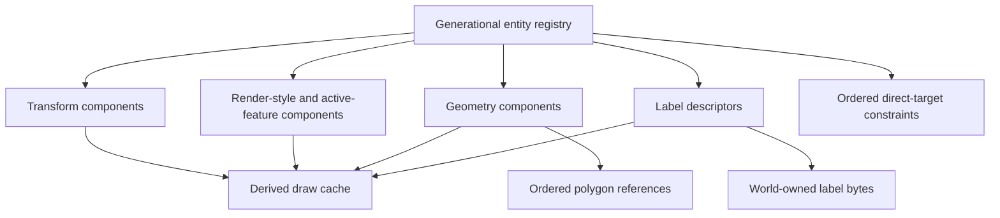
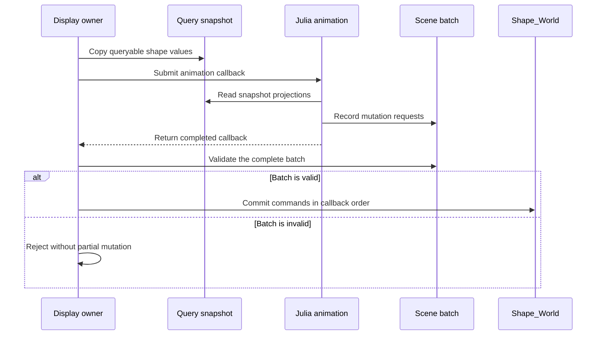

# Shape System

> Euclid's shape system grew from drawn constructions into a reusable geometric
> model: canonical shape state is owned once, then projected for animation,
> simulation, and rendering.

## Table Of Contents

1. [How The Shape System Evolved](#how-the-shape-system-evolved)
1. [The Canonical Model](#the-canonical-model)
1. [Geometry, Constraints, And Curves](#geometry-constraints-and-curves)
1. [Animation And The Julia Boundary](#animation-and-the-julia-boundary)
1. [Prepared Drawing](#prepared-drawing)
1. [Permanent Tools And Animation Lifetimes](#permanent-tools-and-animation-lifetimes)
1. [Where To Trace A Change](#where-to-trace-a-change)

## How The Shape System Evolved

Euclid was first conceived in Julia, GLMakie, and Jupyter notebooks as a way to explore
Euclidean constructions in 2D and 3D. The current desktop application was rebuilt from a
separate Odin experiment in kinematic isometric stick figures; it was not a direct
continuation of the notebook implementation.

| Stage | What it contributed |
| --- | --- |
| **The Odin prototype** | Kinematic isometric stick figures, extracted into reusable shapes for an isometric surface. Pen and compass tools began as line drawings in a Raylib-only application. |
| **The desktop application** | The extracted Odin shape model became the construction core, and the Julia animation driver was brought into the application. |

The first shape storage design was an array of large shape records, with intrusive
linked lists embedded in those records to express relationships and traversal. As
constructions and tools grew, that layout became awkward to extend and less friendly to
CPU cache use. The current model replaces it with ECS-inspired sparse-set components:
shape identity is separate from the data each shape uses, and dense component storage
supports iteration over the relevant data.

This is not a general-purpose ECS. The current world is shaped around Euclid's
construction model and its lifetimes. That history helps explain why the code separates
entity identity, geometry, constraints, animation commands, and prepared draw packets.

## The Canonical Model

`Shape_World` owns canonical shape identity, transforms, visual properties, geometry,
labels, polygon topology, and constraints. Its values are the authority from which
simulation and rendering derive their views.

| Concern | Owner or boundary |
| --- | --- |
| Canonical world and permanent tool baseline | Display runtime |
| Animation-owned shapes and constraints | Append-only world suffix after the frozen baseline |
| Julia animation reads | Immutable query snapshot |
| Julia animation mutations | Scene-command batch committed by the display owner |
| Constraint solve and draw-cache preparation | Bounded worker task windows, joined before reuse or observation |
| Native drawing resources | Display thread |

```mermaid
flowchart TD
    Registry[Generational entity registry]
    Registry --> Transform[Transform components]
    Registry --> Style[Render-style and active-feature components]
    Registry --> Geometry[Geometry components]
    Registry --> Label[Label descriptors]
    Geometry --> Topology[Ordered polygon references]
    Label --> Bytes[World-owned label bytes]
    Registry --> Constraints[Ordered direct-target constraints]
    Transform --> Cache[Derived draw cache]
    Style --> Cache
    Geometry --> Cache
    Label --> Cache
```

Each component set keeps dense entity/value rows and a sparse lookup from entity slot to
dense row. Entity handles pair a slot with a generation. Packing that pair for a
pointer-free boundary uses:

$$
\operatorname{packed} =
(\operatorname{generation} \ll 32)\;|\;\operatorname{slot}
$$

Unpacking yields an identity, not proof that it is live. The receiving registry resolves
the slot and generation, and the component set confirms that the dense row belongs to
that entity. This is why stale-handle checks appear at model and bridge boundaries.

Geometry is composed from explicit references rather than nested ownership trees:

| Shape family | Canonical relationships |
| --- | --- |
| Point | The host entity owns its transform. |
| Line | Geometry refers to two transform entities. |
| Arc | The host transform is the center; the arc component carries radius, start angle, and signed sweep. |
| Trochoid | The host transform is the fixed center; an analytic component carries rolling and tracer parameters. |
| Cycloid | Two endpoint transforms define the directed baseline; an analytic component carries rolling and tracer parameters. |
| Polygon | An ordered range of vertex entity references. |
| Pen and compass | Joint and pivot transforms plus their tool constraints. |
| Label | A descriptor into world-owned UTF-8 bytes. |

Typed handles group the entities and constraints a caller needs to operate a construction;
they do not create a second ownership graph. When values cross the bridge or snapshot
boundary, copy data rather than retaining world pointers, borrowed strings, or pool
references.

An arc is one center-bearing host, not a pair of endpoint entities. Its signed sweep
distinguishes direction; the current and previous values are interpolated together for
rendering. Trochoids likewise remain analytic rather than storing sampled curve entities.
For reduced radius ratio \(R/r=p/q\), a complete trochoid has parameter period
\(2\pi q\). The named epi- and hypocycloid forms are semantic constructors over that
same trochoid representation; for a hypocycloid, tracer distance equals rolling radius.
Cycloid geometry instead derives motion from its two baseline endpoints and the no-slip
rolling condition. These distinctions matter when changing constructors or interpolation:
the draw samples are derived, while these parameters and references define the shape.

## Geometry, Constraints, And Curves

Constructors assemble hosts, transforms, geometry, and related constraints. They
preflight their required world storage before publishing a construction, so failure
does not leave a partially created shape. The model and constructor packages are the
source of truth for supported shape kinds and validation.

Constraints are independent of draw topology. Each names the transforms it reads or may
move, and their stable order gives the solver repeatable passes. The current families
include floor and snapping rules, distance, angle, and center-pivot constraints.
Distance and angle constraints make their movement policy explicit: move the first
target, both targets, or the second target. See
[`world_constraints.odin`](../../../src/shapes/world_constraints.odin) for the solver
and its constraint-specific behavior.

Curves keep analytic parameters in canonical components; sampled vertices belong to
preparation, not shape identity. For a trochoid with fixed-circle radius \(R\), rolling
radius \(r\), and tracer distance \(d\), the rolling-center distance is \(R+r\) for
external rolling and \(R-r\) for internal rolling. Internal rolling requires \(R>r\).
Cycloids describe a rolling circle along a directed line, with tracer distance classifying
ordinary, curtate, and prolate forms. Directed parameter domains support drawing either
direction.

These parameters are interpolated and evaluated to produce the current visible curve.
The curve package owns evaluation and adaptive sampling; the draw cache consumes the
result. The exact sampling policy and bounds belong in
[`src/shapes/curve/`](../../../src/shapes/curve/), not in this guide.

Labels use a pointer-free descriptor into bytes owned by the world. A descriptor is
valid only with the world lifetime that owns those bytes; consumers that cross an
ownership boundary copy the source. This is particularly important during animation
retirement, when the label pool is rewound along with the shape suffix.

## Animation And The Julia Boundary

Julia animation code uses `OdinJuliaBridge`; it does not bind directly to `Shape_World`.
The bridge offers two distinct paths:

- Synchronized lifecycle operations construct shapes and constraints when the world is
  not concurrently borrowed.
- Animation callbacks read an immutable snapshot and record mutations in a bounded
  command batch. The display owner validates the batch before applying any command.

```mermaid
sequenceDiagram
    participant D as Display owner
    participant Q as Query snapshot
    participant J as Julia animation
    participant B as Scene batch
    participant W as Shape_World

    D->>Q: Copy queryable shape values
    D->>J: Submit animation callback
    J->>Q: Read snapshot projections
    J->>B: Record mutation requests
    J-->>D: Return completed callback
    D->>B: Validate the complete batch
    alt Batch is valid
        D->>W: Commit commands in callback order
    else Batch is invalid
        D->>D: Reject without partial mutation
    end
```

The snapshot prevents a callback from observing a mixture of canonical states. Recording
a mutation is provisional: canonical state changes only if the later validation and
commit succeeds. Validation covers the animation identity and each command's target and
required component; any invalid command rejects the batch rather than leaving partial
shape mutations. Constructors are not implicitly part of that asynchronous protocol.

Odin and Julia bridge records must remain layout- and meaning-compatible. When changing
this boundary, trace both exports and wrappers, dispatch, validation, and ABI tests. Start with
[`scene_commands.odin`](../../../src/bridge/scene_commands.odin),
[`abi-shapes.odin`](../../../src/bridge/abi-shapes.odin), and
[`src/julia/bridge/`](../../../src/julia/bridge/).

## Prepared Drawing

The shape draw cache is a renderer-oriented projection rebuilt from canonical state for
a frame. It contains interpolated geometry and draw items, not authoritative identity,
constraint state, or bridge query results. This keeps geometry useful to other systems
without making them depend on renderer packet layout.

```mermaid
flowchart LR
    World[Canonical shape world] --> Visible[Resolve visible live entities]
    Visible --> Geometry[Read geometry and interpolate transforms]
    Geometry --> Packet[Build bounded draw packet]
    Packet --> Sort[Order for visual depth]
    Sort --> Fence[Preparation task joins]
    Fence --> Display[Display consumes draw items]
```

The preparation worker writes the derived cache during its task window. The display
waits for that work to join before consuming the initialized packet data and submitting
drawing. The cache is bounded and disposable: if a drawable cannot be represented in a
frame, preparation can omit it without changing canonical world state. See
[`world_render.odin`](../../../src/shapes/world_render.odin),
[`draw_cache.odin`](../../../src/shapes/draw_cache.odin), and
[`src/view/world/geometry.odin`](../../../src/view/world/geometry.odin) for compilation,
shared packet processing, and display consumption.

Polygon ranges are reserved as a unit and rolled back if the polygon cannot be resolved
or represented. Prepared items are stably ordered using the project's isometric depth
heuristic; this is a painter-order approximation, not exact visibility for intersecting
geometry. Both behaviors belong to packet preparation and must not mutate the canonical
construction.

## Permanent Tools And Animation Lifetimes

Startup constructs permanent tools and freezes the resulting world prefixes as a
baseline. An animation appends its own shapes and constraints after those prefixes.
Replacing an animation retires the suffix and starts another generation:

```mermaid
flowchart LR
    Baseline[Permanent tools and frozen baseline]
    Current[Animation-owned suffix]
    Retire[Owner-controlled retirement]
    Next[Next animation suffix]

    Baseline --> Current --> Retire --> Next
    Baseline --> Next
```

Retirement is coordinated with the rest of the runtime:

1. Stop accepting work that belongs to the old animation and join work already accepted.
2. Emit clear effects that need the old geometry while it still resolves.
3. Invalidate prepared draw data, then rewind component, topology, label, and constraint
   suffixes together.
4. Advance the retired entity generations before the next animation reuses their slots.

The baseline remains. This is the reason retirement belongs to the world/runtime
lifecycle rather than arbitrary entity deletion.

For the concrete ordering, inspect
[`runtime_session.odin`](../../../src/view/runtime_session.odin),
[`animations.odin`](../../../src/bridge/animations.odin), and
`shape_world_rewind_animation` in
[`shapes.odin`](../../../src/shapes/model/shapes.odin).

The important failure distinction is between canonical construction and frame
preparation. Construction must reject without publishing a partial shape. A draw packet
may omit an item that cannot be represented in that frame, because the packet is derived
and can be rebuilt. Scene commands are a third boundary: validate the complete batch,
then commit it or reject it without partial mutation.

## Where To Trace A Change

| If the change is about… | Start here |
| --- | --- |
| Entity validity, component membership, or world lifetime | [`src/shapes/model/`](../../../src/shapes/model/) |
| Constructors or constraints | [`world_constructors.odin`](../../../src/shapes/world_constructors.odin), [`world_constraints.odin`](../../../src/shapes/world_constraints.odin) |
| Curve parameters or sampling | [`src/shapes/curve/`](../../../src/shapes/curve/) |
| Julia-facing reads and mutations | [`scene_commands.odin`](../../../src/bridge/scene_commands.odin), [`src/julia/bridge/`](../../../src/julia/bridge/) |
| Frame interpolation or draw packets | [`world_render.odin`](../../../src/shapes/world_render.odin), [`draw_cache.odin`](../../../src/shapes/draw_cache.odin) |
| Worker scheduling or display consumption | [`simulation_executor.odin`](../../../src/view/simulation/simulation_executor.odin), [`geometry.odin`](../../../src/view/world/geometry.odin) |
| Animation switch and suffix retirement | [`runtime_session.odin`](../../../src/view/runtime_session.odin), [`animations.odin`](../../../src/bridge/animations.odin) |

Useful tests include
[`shapes_test.odin`](../../../src/shapes/model/shapes_test.odin) for identity and
component behavior, [`world_constructors_test.odin`](../../../src/shapes/world_constructors_test.odin)
for construction boundaries, [`world_constraints_test.odin`](../../../src/shapes/world_constraints_test.odin)
for solving, [`world_render_test.odin`](../../../src/shapes/world_render_test.odin) for
interpolation and packet preparation, and
[`animations_test.odin`](../../../src/bridge/animations_test.odin) for retirement
ordering. The code and tests are the detailed specification; this guide is a route into
them.
