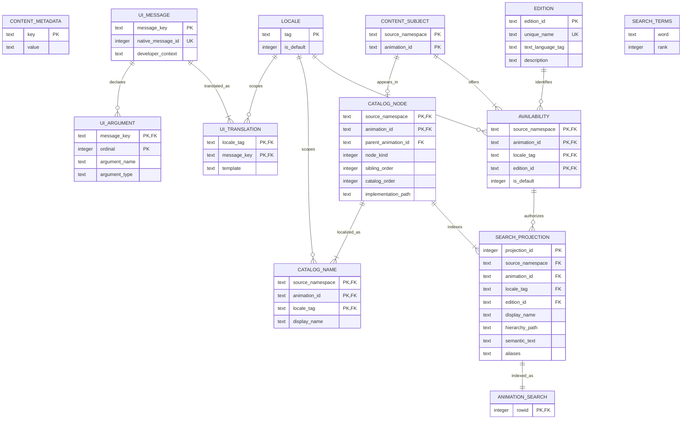

# SQLite Architecture

## Purpose

Euclid uses SQLite as a repository-owned, statically linked store for immutable
application content, including the built-in animation catalogue and its search
projection. SQLite is not an application state store and is not entered from the
display thread. Both the standalone builder and runtime catalogue use the `src/sqlite`
mechanics substrate; each retains its own SQL, schema, and domain policy. Julia
produces canonical source records, the builder creates and validates a deterministic
database asset, and one dedicated Odin worker owns the immutable runtime connection.

This guide describes the current implementation, including native shell-message
consumers and invocation-owned animation specifications. Search history, writable
profile storage, vectors, locale/edition selectors, and learned ranking remain
separate future work.

For practical authoring and consumer-extension workflows, start with
[Localization And Editions](Localization.md). This guide owns storage, schema,
admission, and retirement details.

## Architectural Position

SQLite sits below the Library search coordinator and beside the packaged content it
indexes. Its main boundaries are:

- Julia owns catalogue descriptors, localized content declarations, and authored
  search sidecars.
- Build tooling converts those facts into a canonical JSON Lines corpus.
- The native content builder owns schema creation, indexing, transaction, validation,
  and vacuum policy while using shared SQLite mechanics.
- `src/sqlite` owns native connection, statement, binding, stepping, and column mechanics.
- Asset packaging owns reproducibility checks, hashes, and package-manifest metadata.
- The files subsystem resolves and validates the extracted packaged asset.
- The catalogue store owns catalogue SQL, admission, query ranking, and named statements.
- The catalogue worker exclusively owns store connections and request execution.
- The display thread owns query intent, result commitment, and catalogue-ID resolution.

```mermaid
flowchart LR
    Content[Localized declarations, catalogue, and search content]
    Corpus[Canonical schema-3 JSON Lines records]
    Builder[Standalone Odin content builder]
    Database[Immutable content.sqlite3]
    Package[Validated assets package]
    Worker[Dedicated catalogue worker]
    Display[Display-owned Library UI]

    Content -->|Julia export| Corpus
    Corpus -->|bounded records and fingerprint| Builder
    Builder -->|schema, FTS5, spellfix, validation| Database
    Database -->|byte-determinism check and SHA-256| Package
    Package -->|validated path and content fingerprint| Worker
    Display -->|bounded value request| Worker
    Worker -->|bounded IDs and suggestion| Display
```



The important ownership rule is that drawing and widget code never call SQLite. Search
requests and results cross bounded channels as pointer-free values. The display resolves
returned source-aware document IDs against the active native catalogue registry only
after a result passes query-generation and index-generation checks.

## Native Dependency and Linkage

The repository vendors SQLite 3.53.4's amalgamation and the upstream `spellfix1`
extension under `libs/sqlite3/source/`. `sqlite3_custom.c` builds one translation unit
with these compile-time choices:

- `SQLITE_ENABLE_FTS5` enables the FTS5 virtual table module.
- `SQLITE_OMIT_LOAD_EXTENSION` removes runtime extension loading.
- `spellfix.c` is compiled into the same binary.
- `euclid_sqlite_register_spellfix` registers spellfix explicitly on each connection.

`tools/build_config.jl` fingerprints the SQLite sources, host tools, target, and compile
arguments. It compiles a content-addressed static archive named `libsqlite3.a` on Linux
and macOS or `sqlite3.lib` on Windows. Both the application and standalone content builder
link that repository-owned archive. Linux tool linkage also includes `libm`, `libdl`,
and pthreads.

The narrow Odin binding in `libs/sqlite3/sqlite3.odin` exposes the raw connection,
statement, bind, column, execution, diagnostics, and extension-registration ABI.
Production mechanics are wrapped by `src/sqlite`, whose explicit `Connection` and
`Statement` values provide open modes, persistent prepare, row/done/failure stepping,
reset with binding clearance, typed binds, bounded text copies, checked numeric reads,
and structured error facts. Text binding uses explicit byte lengths and
`SQLITE_TRANSIENT`; it does not allocate a temporary C string. Immutable URI path
encoding uses caller-provided scratch storage.

`src/sqlite` owns mechanics only. It has no schema, catalogue types, worker, migration,
transaction policy, pool, or connection arena. Concrete consumers own named statement
sets and retain their own SQL and failure policy. The catalogue runtime uses
`src/view/content/database.odin` and `statements.odin`; the standalone builder uses a
fixed `Builder_Statements` set in `tools/content_builder/main.odin`. Raw ABI use is
limited to the substrate and dedicated raw-boundary tests.

## Build and Packaging Pipeline

The database build is part of asset generation rather than application startup.

1. `src/julia/search/content_corpus.jl` combines typed localized-content declarations,
   catalogue identity, availability, and current search content into schema-3 records.
1. `tools/export_content_records.jl` atomically writes the canonical JSON Lines stream
   and reports its lowercase SHA-256 fingerprint.
1. `tools/content_builder/main.odin` validates bounded records and references, creates
   the normalized schema, inserts rows through named substrate-backed statements,
   rebuilds FTS5, derives spellfix vocabulary, and validates before vacuuming it. Its
   transaction, schema, ordering, and fail-fast policy remain builder-owned.
1. `tools/make.jl` independently builds two candidate databases and requires their file
   digests to match. This makes byte reproducibility part of asset admission.
1. The accepted database is staged as `content/content.sqlite3` inside `assets.pkg`.
   The schema-4 package manifest records its SHA-256 digest, content fingerprint, and
   content schema version. Schema-2 catalogue packages and schema-3 package manifests
   are rejected; startup performs no migration.

The schema-3 corpus contains declaration kinds for metadata, locales, UI messages and
arguments, translations, content subjects, catalogue nodes and names, editions,
availability, and search projections. It is bounded to 4 MiB, 16 KiB per record, and
4,096 records. The shipped projection still contains exactly 138 catalogue nodes.
Terminal has no authored search content; path-backed nodes require semantic text.
Build-time ordering by kind and stable identity keeps generation reproducible.

The builder uses a single transaction for declarations and index publication. It checks
foreign keys, translation/name/default/projection coverage, signatures, integrity,
representative FTS, spellfix vocabulary, and exact shipped counts before `VACUUM`.
Runtime startup does not repair or migrate a database; an invalid package fails
admission.

## Persisted Database Model

The packaged database has normalized declaration tables plus search indexes. FTS5 and
spellfix create internal shadow tables, but those implementation tables are owned by
SQLite and are not Euclid contracts. `animation_catalog` and `search_metadata` are
read-only compatibility views for the current catalogue worker; the normalized
`catalog_node`, `catalog_name`, `search_projection`, and `content_metadata` tables are
authoritative.



### `content_metadata`

This `WITHOUT ROWID` key/value table defines the schema and generation contract. It
stores schema/tool/SQLite/tokenizer/query compatibility, default locale, content and
generation fingerprints, canonical record count, and per-kind record counts. The
current catalogue worker reads a compatibility view over selected metadata keys:

| Key | Current meaning |
| --- | --- |
| `schema_version` | Persisted Euclid content schema version, currently `3`. |
| `tool_compatibility` | Required content builder contract, currently `euclid-content-builder-v1`. |
| `sqlite_version` | Required SQLite implementation version, currently `3.53.4`. |
| `content_fingerprint` | SHA-256 identity of the complete canonical record stream. |
| `generation_identity` | Immutable content generation identity; currently the content fingerprint. |
| `record_count`, `table_counts` | Canonical record total and record counts by kind. |
| `default_locale` | Shipped UI locale, currently `en-US`. |
| `catalog_projection_schema_version` | Compatibility-view search projection contract, currently `2`. |
| `projection_count` | Required search projection count, currently `138`. |
| `tokenizer_version` | Euclid tokenizer contract, currently `porter-unicode61-v1`. |
| `query_contract_version` | Runtime query/compiler contract, currently `1`. |

The catalogue store reads the `search_metadata` view, which maps projection-specific
keys to the legacy names expected by its current admission path. Schema-4 package
admission separately requires the new content database path and digest fields.

### `animation_catalog`

This read-only compatibility view joins `catalog_node` and `search_projection` to
provide the columns expected by the existing catalogue worker. `projection_id` is
exposed as `rowid`; parent references and ordering come from the normalized node
records, while search text comes from the projection. The view is not authoritative
and will be retired when the worker consumes the normalized schema directly.

### `animation_search`

`animation_search` is an external-content FTS5 table over the four searchable text
columns in `search_projection`. External content avoids storing a second authoritative
copy of those text values while preserving an optimized inverted index.

Its tokenizer is:

```text
porter unicode61 remove_diacritics 2
```

`unicode61` supplies Unicode-aware tokenization and removes Latin-script diacritics;
the Porter wrapper stems indexed and queried terms. `detail=full` retains positional
information required for phrase behavior. The index is rebuilt explicitly after all
document rows are inserted, so the ordinary table and external index are published as
one deterministic generation.

The ranked rows query orders ascending `bm25` with column weights:

| Column | Weight |
| --- | ---: |
| `display_name` | 10.0 |
| `hierarchy_path` | 6.0 |
| `aliases` | 8.0 |
| `semantic_text` | 2.0 |

Because lower FTS5 BM25 values rank first, titles are strongest, followed by aliases,
hierarchy context, and then authored semantic prose. Stable namespace and document-ID
ordering break score ties. Result windows use fixed `LIMIT` and `OFFSET` bounds.

### `search_terms`

`search_terms` is a spellfix1 virtual table containing the unstemmed authored
vocabulary. Its `rank` is derived from neutral-token occurrence count as
`1000000 - min(count, 999999)`, so more frequent words receive a smaller, preferred
rank. Spellfix ordering is deterministic: edit distance, derived rank, then lexical
word order.

Spellfix does not replace FTS. It is consulted only when the compiled FTS query has no
results, only positive bare terms are eligible, and at most eight candidates are read.
For each candidate, Euclid recompiles the complete normalized query with one replacement
and requires that it produce a real FTS result. The best verified candidate becomes a
friendly-syntax suggestion; the original query is not silently rewritten.

## Build-Only Vocabulary Projection

Porter stemming is useful for document retrieval but unsuitable as the source of
human-readable spelling suggestions. The builder therefore creates a second,
temporary FTS5 projection using plain `unicode61 remove_diacritics 2` tokenization.


`plain_search_vocabulary` is an `fts5vocab` row projection over the temporary neutral
index. After its terms populate `search_terms`, both temporary virtual tables are
dropped before commit. They are reproducible build machinery, not packaged schema.

## Runtime Query Path

Runtime startup follows a fail-closed path:

1. `src/files/files.odin` validates the schema-4 asset manifest, fixed
   `content/content.sqlite3` path, schema version, database digest, and content
   fingerprint.
1. The runtime session resolves the extracted database and creates the content
    service, including the Library search capability.
1. The content database opens the immutable URI through `src/sqlite` with read-only,
    URI, and no-mutex flags.
1. It registers spellfix, prepares the complete named statement set, validates required
    schema-3 metadata against the package fingerprint, then materializes and seals
    every content projection in one generation.
1. The worker publishes `Ready` only when database and materialized-generation
    identities match.

The dedicated worker owns the connection from open through statement finalization and
close. `SQLITE_OPEN_NOMUTEX` is valid because no other thread accesses that connection.
The service uses a fixed TLSF-backed allocator and two stable arena-backed generation
slots with capacity-eight request, query-result, and control-result channels. Separate
result channels prevent synchronous reload coordination from consuming an asynchronous
Library query result. The worker coalesces queued query work toward the newest generation
without crossing a control command.

Named reads admit locale declarations, required native message keys and IDs, typed
ordinal signatures, complete templates, subjects, topology, localized names, editions,
availability/defaults, and search-facing text. Each string is copied into packed bounded
generation storage; SQLite column borrows never survive stepping. Counts and coverage
are checked before readiness, including the reserved null subject without adding a
Library node. Search names must match localized names and their declared default edition.
An edition's language need not match the UI locale. Search-only databases are rejected.

### Authored Editions And Sidecar Coverage

`src/content/localization/manifest.jl` assembles the shipped `original-en-us`,
`elements-heath-adapted`, and `hilbert-townsend-adapted` editions. All three use
the same `EditionDeclaration` and `AvailabilityDeclaration` contracts, validation,
database records, and native resolution; original content has no privileged path.
Every subject, including the reserved null subject and Terminal adapter, has exactly
one default edition for each admitted UI locale. An edition names provenance and
text language, not an animation implementation or a second presentation producer.
A test-only Ancient Greek edition under en-US proves those languages are independent;
it does not ship a selector or multilingual search.

Adjacent `*_content.jl` sidecars own canonical authored View text and semantic search
facts. Corpus export covers every path-backed catalogue entry, including grouping
nodes; Terminal has an explicit empty semantic projection. Manifest admission
rejects missing, duplicate, or unknown subject bindings.
Names, hierarchy paths, aliases, and semantic text form the existing deterministic
search projection. Locale/edition metadata does not replace these bytes or change
ranking. See [animation authoring](AnimationsStyle.md#animation-program-contract)
for the callback query and publication contract.

### Native Shell Messages

`src/core/content/messages.odin` owns the stable typed message IDs, their exact
key/ordinal coverage, and the native consumer signatures. Admission requires those
signatures while leaving translated wording authored. The shipped en-US dataset has
69 messages, including GIF submission and resize notices, and ten named arguments.

Templates contain literal UTF-8 and `{identifier}` substitutions only. Identifiers
match `[a-z][a-z0-9_]{0,31}`; nested or escaped braces, expressions, plural rules,
locale detection, and fallback chains are unsupported. Values are bounded text
(512 bytes), decimal `u32`, nonnegative decimal `i64` counts, or finite `f32` with the
existing `%.1f` rendering. Missing keys/locales/translations, signature or template
errors, invalid values, and capacity failures return explicit statuses.

Formatting is allocation-free and transactional: a failed call leaves the caller's
bytes unchanged. The logical output bound is 536 bytes even if the supplied storage
is larger. Static labels are copied into bounded display-owned slots by
`src/view/messages/messages.odin`; no prepared label retains a content-arena pointer.
Dynamic values use caller storage and are consumed immediately or copied by semantic
publication. GIF status notes keep their existing owned buffer and reject overflow
with a diagnostic instead of truncating. Generation retirement cannot invalidate
already published accessibility text or a retained notice.

All eligible Library, Settings, GIF, accordion, animation-control, presentation-label,
and FPS consumers use these paths. Terminal streams, user input, authored presentation
prose, numeric control values, stable widget/focus IDs, and diagnostics remain outside
the shell-message projection. No locale or edition switching is exposed.

The query compiler in `src/view/content/query.odin` is the security and syntax boundary.
It validates bounded UTF-8 friendly syntax, normalizes punctuation to token separators,
and emits only quoted terms, `AND`, `NOT`, and a final bare-term prefix marker. Raw user
text never receives FTS5 grammar authority and all SQL values are bound parameters.

At most 16 query items, 1,024 compiled MATCH bytes, and one fixed result window cross
the worker boundary. Results contain source-aware IDs rather than SQLite pointers or
borrowed text. The display rejects stale query or index generations before replacing
visible state, then resolves accepted UUIDs through the active catalogue.

## Failure and Lifecycle Semantics

SQLite is required for the content service and its built-in Library search capability.
A missing asset, digest or metadata mismatch, extension-registration failure, statement
failure, or database-open failure prevents content-service startup and causes runtime
session startup to fail. Query parse failures are reported as invalid input; execution
failures produce a stable failed status rather than exposing SQLite diagnostics to UI.

Reload opens and validates a candidate immutable connection while the active connection
continues serving queries. The candidate generation builds the inactive native registry;
promotion swaps database and generation slots together but retains the previous pair
until Julia generation commit and native publication succeed. Discard reverses a
provisional promotion, while finalization closes and resets only the retired pair. Stage,
commit, rollback, and finalize acknowledgements verify database/generation identity.
Malformed staged messages, templates, editions, or defaults retain the entire active
dataset and leave Julia binding preparation untouched. Search results carry the database
generation and stale results are rejected after promotion; retained query intent is
reissued when that identity changes. The bridge resolves packed text through validated
generation references and
clones names and paths into interface-owned storage.

Shutdown sends a bounded control message, drains through the worker's stopped result,
joins the thread, finalizes prepared statements in reverse order, closes active and
candidate connections, destroys channels, and releases service storage. Every database
connection is immutable, so no journal, WAL, migration, or write-contention policy
exists in the runtime architecture.

Session teardown keeps the active content owner alive through the Julia shutdown
acknowledgement, then joins the content worker and clears the state reference. No
invocation can inherit a dangling service during its terminal lifecycle.

## Module Map

| Layer | Responsibility | Primary files |
| --- | --- | --- |
| Raw native dependency | Vendored amalgamation, spellfix source, compile switches, narrow Odin ABI. | `libs/sqlite3/` |
| Runtime mechanics substrate | Explicit connections/statements, typed binding and columns, lifecycle, and structured errors. | `src/sqlite/` |
| Build configuration | Content-addressed static archive and platform linker flags. | `tools/build_config.jl` |
| Content record authority | Typed localized declarations, catalogue identity, availability, and authored semantic search content. | `src/julia/localized_content.jl`, `src/julia/search/content_corpus.jl`, `src/julia/search/search_content.jl` |
| Content record export | Atomic schema-3 JSON Lines publication and content fingerprint. | `tools/export_content_records.jl` |
| Content database construction | Concrete builder statements, normalized schema, transaction, insertion, FTS rebuild, spellfix vocabulary, coverage validation, and vacuum. | `tools/content_builder/main.odin` |
| Asset packaging | Double-build reproducibility, digesting, staging, manifest publication. | `tools/make.jl` |
| Asset admission | Manifest validation, extraction, path and fingerprint resolution. | `src/files/files.odin` |
| Content model | Bounded protocols, records, and packed generation contracts. | `src/core/content/model.odin`, `src/core/content/records.odin` |
| Query contract | Friendly syntax admission and bounded FTS5 MATCH compilation. | `src/view/content/query.odin` |
| Content database and statements | Immutable admission, metadata, search, spellfix, and the complete named statement set. | `src/view/content/database.odin`, `src/view/content/statements.odin` |
| Content generation | Bounded row codecs, packed text append, complete projection validation, and sealing. | `src/view/content/generation.odin` |
| Content worker and service | Thread scheduling, bounded channels, active/staged generation slots, publication, rollback, and retirement. | `src/view/content/worker.odin`, `src/view/content/service.odin` |
| Display coordinator | Debounce, submission, generation checks, catalogue resolution, UI commit. | `src/view/ui/library/service/library_search.odin`, `src/view/runtime_session.odin` |

## Current Constraints

- The database indexes only the built-in source namespace.
- Schema, SQLite, tokenizer, query contract, and exact document count are version-locked.
- The database is generated and replaced as a complete asset; there are no migrations.
- Runtime access is read-only and immutable; SQLite stores no user or session state.
- FTS and spellfix behavior is deterministic and bounded.
- Search results identify catalogue nodes, not arbitrary text passages.
- Porter stemming and Latin diacritic removal reflect the current corpus contract, not a
  finalized multilingual search design.
- SQLite virtual-table shadow schemas are implementation details and must not be queried
  by application code.

Any future writable history, localization-specific index, edition, vector projection,
or learned ranker needs its own ownership, lifecycle, bounded-storage, migration, and
privacy design. It should not weaken the immutable packaged-index contract described
here.

## Verification

Relevant checks are layered:

- Julia corpus tests verify canonical records and deterministic serialization.
- Search query tests verify admitted syntax and exact MATCH compilation.
- Catalogue worker tests exercise metadata admission, FTS results, spellfix suggestions,
  queue capacity, and generation rejection.
- Files tests verify package-manifest and extracted-asset admission.
- Asset generation proves two independently built database files are byte-identical;
    the builder and catalogue runtime share mechanics but not domain policy.
- Native message tests cover every shipped baseline, signatures, grammar, numeric
  precision, exact capacities, and allocation-free formatting. Display tests verify
  retained shell text survives content-generation retirement.
- Manifest and native admission tests cover all edition kinds, the Greek-under-en-US
  fixture, complete projection rejection, and transactional candidate retirement.
- `tools/scenarios/content-specification-acceptance.jsonl`
  exercises the initial Enter query, ordinary authored publication, reset, committed
  reload/retirement, allocation baselines, capture, no bad frees, and shutdown.
  Exact invocation values and revision stability are checked by native/Julia unit
  tests; the scenario does not expose a new query or switching control.
- The canonical repository gate builds the application and runs all tests and analysis:

```sh
cmake --build --preset default --target check
```

Use `julia tools/make.jl assets` when intentionally changing corpus generation, SQLite
inputs, schema, tokenizer, or packaged search metadata. A source-only unit test is not a
substitute for rebuilding and admitting the generated asset after such changes.
