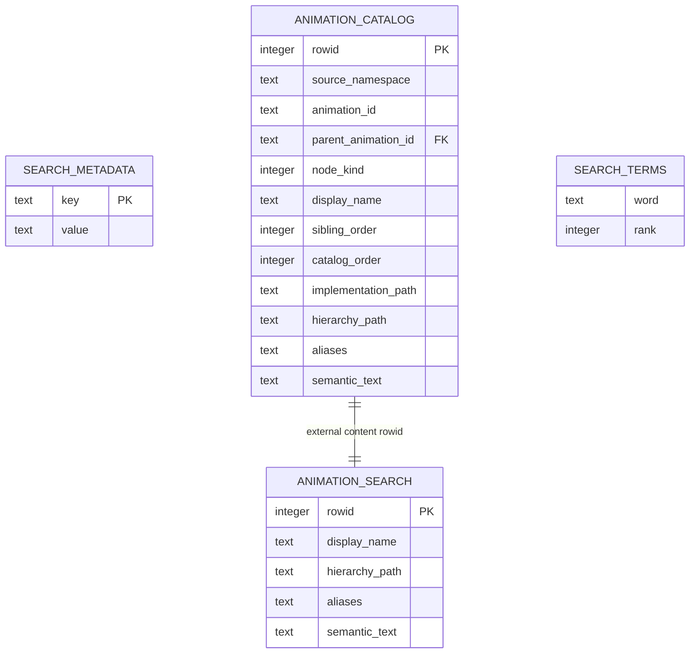
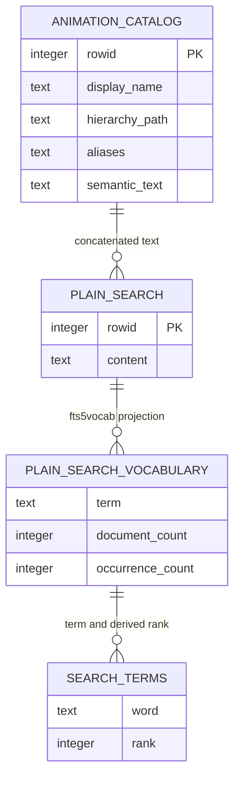

# SQLite Architecture

## Purpose

Euclid uses SQLite as a repository-owned, statically linked search engine over the
built-in animation catalogue. SQLite is not an application state store and is not
entered from the display thread. Both the standalone builder and runtime catalogue use
the `src/sqlite` mechanics substrate; each retains its own SQL, schema, and domain
policy. Julia produces the canonical source records, the builder creates and validates
a deterministic database asset, and one dedicated Odin worker owns the immutable
runtime connection.

This guide describes the current implementation. Search history, writable profile
storage, vectors, localization, and learned ranking remain separate future design work.

## Architectural Position

SQLite sits below the Library search coordinator and beside the packaged content it
indexes. Its main boundaries are:

- Julia owns catalogue descriptors and authored search sidecars.
- Build tooling converts those facts into a canonical JSON Lines corpus.
- The native index builder owns schema creation, indexing, transaction, validation, and
    vacuum policy while using shared SQLite mechanics.
- `src/sqlite` owns native connection, statement, binding, stepping, and column mechanics.
- Asset packaging owns reproducibility checks, hashes, and package-manifest metadata.
- The files subsystem resolves and validates the extracted packaged asset.
- The catalogue store owns catalogue SQL, admission, query ranking, and named statements.
- The catalogue worker exclusively owns store connections and request execution.
- The display thread owns query intent, result commitment, and catalogue-ID resolution.

```mermaid
flowchart LR
    Content[Catalogue and authored search content]
    Corpus[Canonical JSON Lines corpus]
    Builder[Standalone Odin index builder]
    Database[Immutable animations.sqlite3]
    Package[Validated assets package]
    Worker[Dedicated catalogue worker]
    Display[Display-owned Library UI]

    Content -->|Julia export| Corpus
    Corpus -->|bounded records and fingerprint| Builder
    Builder -->|schema, FTS5, spellfix, validation| Database
    Database -->|byte-determinism check and SHA-256| Package
    Package -->|validated path and corpus fingerprint| Worker
    Display -->|bounded value request| Worker
    Worker -->|bounded IDs and suggestion| Display
```



The important ownership rule is that drawing and widget code never call SQLite. Search
requests and results cross bounded channels as pointer-free values. The display resolves
returned source-aware document IDs against the active native catalogue registry only
after a result passes query-generation and index-generation checks.

## Native Dependency and Linkage

The repository vendors SQLite 3.53.4's amalgamation and the upstream `spellfix1`
extension under `libs/sqlite3/source/`. `sqlite3_custom.c` builds one translation unit
with these compile-time choices:

- `SQLITE_ENABLE_FTS5` enables the FTS5 virtual table module.
- `SQLITE_OMIT_LOAD_EXTENSION` removes runtime extension loading.
- `spellfix.c` is compiled into the same binary.
- `euclid_sqlite_register_spellfix` registers spellfix explicitly on each connection.

`tools/build_config.jl` fingerprints the SQLite sources, host tools, target, and compile
arguments. It compiles a content-addressed static archive named `libsqlite3.a` on Linux
and macOS or `sqlite3.lib` on Windows. Both the application and standalone index builder
link that repository-owned archive. Linux tool linkage also includes `libm`, `libdl`,
and pthreads.

The narrow Odin binding in `libs/sqlite3/sqlite3.odin` exposes the raw connection,
statement, bind, column, execution, diagnostics, and extension-registration ABI.
Production mechanics are wrapped by `src/sqlite`, whose explicit `Connection` and
`Statement` values provide open modes, persistent prepare, row/done/failure stepping,
reset with binding clearance, typed binds, bounded text copies, checked numeric reads,
and structured error facts. Text binding uses explicit byte lengths and
`SQLITE_TRANSIENT`; it does not allocate a temporary C string. Immutable URI path
encoding uses caller-provided scratch storage.

`src/sqlite` owns mechanics only. It has no schema, catalogue types, worker, migration,
transaction policy, pool, or connection arena. Concrete consumers own named statement
sets and retain their own SQL and failure policy. The catalogue runtime uses
`src/view/catalog/database.odin` and `statements.odin`; the standalone builder uses a
fixed `Builder_Statements` set in `tools/search_index_builder/main.odin`. Raw ABI use is
limited to the substrate and dedicated raw-boundary tests.

## Build and Packaging Pipeline

The database build is part of asset generation rather than application startup.

1. `src/julia/search/search_corpus.jl` combines UUID-ordered catalogue descriptors with
   authored search content. It emits one versioned record per catalogue node.
1. `tools/export_search_corpus.jl` atomically writes the canonical JSON Lines corpus and
   reports its lowercase SHA-256 fingerprint.
1. `tools/search_index_builder/main.odin` validates bounded records, creates the schema,
   inserts documents through named substrate-backed statements, rebuilds FTS5, derives
   spellfix vocabulary, and validates the result before vacuuming it. Its transaction,
   schema, ordering, and fail-fast policy remain builder-owned.
1. `tools/make.jl` independently builds two candidate databases and requires their file
   digests to match. This makes byte reproducibility part of asset admission.
1. The accepted database is staged as `catalog/animations.sqlite3` inside
    `assets.pkg`. The package manifest records its SHA-256 digest, catalogue corpus
    fingerprint, and catalogue schema version.

The canonical corpus currently contains 138 nodes. Records carry a source namespace,
stable UUID, node kind, display name, hierarchy path, aliases, and semantic text.
Terminal has no authored search content; path-backed catalogue nodes require semantic
text. Build-time ordering by UUID and fixed schema operations keep generation stable.

The builder uses a single transaction for document and index publication. It runs
`pragma_integrity_check`, verifies the exact document count, executes a representative
FTS query, requires a nonempty spellfix vocabulary, and then runs `VACUUM`. Runtime
startup does not repair or migrate a database; an invalid package fails admission.

## Persisted Database Model

The packaged database has four logical structures. FTS5 and spellfix create internal
shadow tables, but those implementation tables are owned by SQLite and are not Euclid
contracts.



### `search_metadata`

This `WITHOUT ROWID` key/value table defines the runtime compatibility contract. It
stores:

| Key | Current meaning |
| --- | --- |
| `schema_version` | Persisted Euclid schema version, currently `2`. |
| `sqlite_version` | Required SQLite implementation version, currently `3.53.4`. |
| `catalog_fingerprint` | SHA-256 identity of the canonical corpus. |
| `document_count` | Required catalogue row count, currently `138`. |
| `tokenizer_version` | Euclid tokenizer contract, currently `porter-unicode61-v1`. |
| `query_contract_version` | Runtime query/compiler contract, currently `1`. |
| `index_generation` | Corpus fingerprint used to derive the runtime generation. |

The catalogue store requires exact values before publishing readiness. This rejects
mismatched content, schema, tokenizer assumptions, query syntax, and SQLite builds at
the boundary.

### `animation_catalog`

This ordinary table stores the package's static catalogue records and searchable text.
`(source_namespace, animation_id)` is unique, parent IDs reference another catalogue
record, and partial unique indexes enforce sibling order for both roots and children.
Integer `rowid` provides the external-content identity used by FTS5. Runtime search rows
return only namespace and stable animation ID; accepted IDs are resolved through the
native registry, and display code never accesses SQLite directly.

### `animation_search`

`animation_search` is an external-content FTS5 table over the four searchable text
columns in `animation_catalog`. External content avoids storing a second authoritative
copy of those text values while preserving an optimized inverted index.

Its tokenizer is:

```text
porter unicode61 remove_diacritics 2
```

`unicode61` supplies Unicode-aware tokenization and removes Latin-script diacritics;
the Porter wrapper stems indexed and queried terms. `detail=full` retains positional
information required for phrase behavior. The index is rebuilt explicitly after all
document rows are inserted, so the ordinary table and external index are published as
one deterministic generation.

The ranked rows query orders ascending `bm25` with column weights:

| Column | Weight |
| --- | ---: |
| `display_name` | 10.0 |
| `hierarchy_path` | 6.0 |
| `aliases` | 8.0 |
| `semantic_text` | 2.0 |

Because lower FTS5 BM25 values rank first, titles are strongest, followed by aliases,
hierarchy context, and then authored semantic prose. Stable namespace and document-ID
ordering break score ties. Result windows use fixed `LIMIT` and `OFFSET` bounds.

### `search_terms`

`search_terms` is a spellfix1 virtual table containing the unstemmed authored
vocabulary. Its `rank` is derived from neutral-token occurrence count as
`1000000 - min(count, 999999)`, so more frequent words receive a smaller, preferred
rank. Spellfix ordering is deterministic: edit distance, derived rank, then lexical
word order.

Spellfix does not replace FTS. It is consulted only when the compiled FTS query has no
results, only positive bare terms are eligible, and at most eight candidates are read.
For each candidate, Euclid recompiles the complete normalized query with one replacement
and requires that it produce a real FTS result. The best verified candidate becomes a
friendly-syntax suggestion; the original query is not silently rewritten.

## Build-Only Vocabulary Projection

Porter stemming is useful for document retrieval but unsuitable as the source of
human-readable spelling suggestions. The builder therefore creates a second,
temporary FTS5 projection using plain `unicode61 remove_diacritics 2` tokenization.



`plain_search_vocabulary` is an `fts5vocab` row projection over the temporary neutral
index. After its terms populate `search_terms`, both temporary virtual tables are
dropped before commit. They are reproducible build machinery, not packaged schema.

## Runtime Query Path

Runtime startup follows a fail-closed path:

1. `src/files/files.odin` validates the asset manifest, fixed relative database path,
   schema version, database digest shape, and corpus fingerprint shape.
1. The runtime session resolves the extracted database and creates the catalogue
    service, which currently exposes the Library search capability.
1. The catalogue database opens the immutable URI through `src/sqlite` with read-only,
    URI, and no-mutex flags.
1. It registers spellfix, prepares the complete named statement set, validates required
    metadata against the package fingerprint, then materializes and seals a generation.
1. The worker publishes `Ready` only when database and materialized-generation
    identities match.

The dedicated worker owns the connection from open through statement finalization and
close. `SQLITE_OPEN_NOMUTEX` is valid because no other thread accesses that connection.
The service uses a fixed TLSF-backed allocator and two stable arena-backed generation
slots with capacity-eight request, query-result, and control-result channels. Separate
result channels prevent synchronous reload coordination from consuming an asynchronous
Library query result. The worker coalesces queued query work toward the newest generation
without crossing a control command.

The query compiler in `src/view/catalog/query.odin` is the security and syntax boundary.
It validates bounded UTF-8 friendly syntax, normalizes punctuation to token separators,
and emits only quoted terms, `AND`, `NOT`, and a final bare-term prefix marker. Raw user
text never receives FTS5 grammar authority and all SQL values are bound parameters.

At most 16 query items, 1,024 compiled MATCH bytes, and one fixed result window cross
the worker boundary. Results contain source-aware IDs rather than SQLite pointers or
borrowed text. The display rejects stale query or index generations before replacing
visible state, then resolves accepted UUIDs through the active catalogue.

## Failure and Lifecycle Semantics

SQLite is required for the catalogue service and its built-in Library search capability.
A missing asset, digest or metadata mismatch, extension-registration failure, statement
failure, or database-open failure prevents catalogue-service startup and causes runtime
session startup to fail. Query parse failures are reported as invalid input; execution
failures produce a stable failed status rather than exposing SQLite diagnostics to UI.

Reload opens and validates a candidate immutable connection while the active connection
continues serving queries. The candidate generation builds the inactive native registry;
promotion swaps database and generation slots together but retains the previous pair
until Julia generation commit and native publication succeed. Discard reverses a
provisional promotion, while finalization closes and resets only the retired pair. Stage,
commit, rollback, and finalize acknowledgements verify database/generation identity.
Search results carry the database generation and stale results are rejected after
promotion. The bridge resolves packed text through validated generation references and
clones names and paths into interface-owned storage.

Shutdown sends a bounded control message, drains through the worker's stopped result,
joins the thread, finalizes prepared statements in reverse order, closes active and
candidate connections, destroys channels, and releases service storage. Every database
connection is immutable, so no journal, WAL, migration, or write-contention policy
exists in the runtime architecture.

## Module Map

| Layer | Responsibility | Primary files |
| --- | --- | --- |
| Raw native dependency | Vendored amalgamation, spellfix source, compile switches, narrow Odin ABI. | `libs/sqlite3/` |
| Runtime mechanics substrate | Explicit connections/statements, typed binding and columns, lifecycle, and structured errors. | `src/sqlite/` |
| Build configuration | Content-addressed static archive and platform linker flags. | `tools/build_config.jl` |
| Corpus authority | Catalogue-derived records and authored semantic search content. | `src/julia/search/search_corpus.jl`, `src/julia/search/search_content.jl` |
| Corpus export | Atomic JSON Lines publication and corpus fingerprint. | `tools/export_search_corpus.jl` |
| Index construction | Concrete builder statements, schema, transaction, insertion, FTS rebuild, spellfix vocabulary, validation, and vacuum. | `tools/search_index_builder/main.odin` |
| Asset packaging | Double-build reproducibility, digesting, staging, manifest publication. | `tools/make.jl` |
| Asset admission | Manifest validation, extraction, path and fingerprint resolution. | `src/files/files.odin` |
| Catalogue model | Bounded protocols and packed generation contracts. | `src/core/catalog/model.odin` |
| Query contract | Friendly syntax admission and bounded FTS5 MATCH compilation. | `src/view/catalog/query.odin` |
| Catalogue database and statements | Immutable admission, metadata, search, spellfix, and the complete named statement set. | `src/view/catalog/database.odin`, `src/view/catalog/statements.odin` |
| Catalogue generation | Bounded row codecs, packed text append, topology validation, and sealing. | `src/view/catalog/generation.odin` |
| Catalogue worker and service | Thread scheduling, bounded channels, active/staged generation slots, publication, rollback, and retirement. | `src/view/catalog/worker.odin`, `src/view/catalog/service.odin` |
| Display coordinator | Debounce, submission, generation checks, catalogue resolution, UI commit. | `src/view/library_search.odin`, `src/view/runtime_session.odin` |

## Current Constraints

- The database indexes only the built-in source namespace.
- Schema, SQLite, tokenizer, query contract, and exact document count are version-locked.
- The database is generated and replaced as a complete asset; there are no migrations.
- Runtime access is read-only and immutable; SQLite stores no user or session state.
- FTS and spellfix behavior is deterministic and bounded.
- Search results identify catalogue nodes, not arbitrary text passages.
- Porter stemming and Latin diacritic removal reflect the current corpus contract, not a
  finalized multilingual search design.
- SQLite virtual-table shadow schemas are implementation details and must not be queried
  by application code.

Any future writable history, localization-specific index, edition, vector projection,
or learned ranker needs its own ownership, lifecycle, bounded-storage, migration, and
privacy design. It should not weaken the immutable packaged-index contract described
here.

## Verification

Relevant checks are layered:

- Julia corpus tests verify canonical records and deterministic serialization.
- Search query tests verify admitted syntax and exact MATCH compilation.
- Catalogue worker tests exercise metadata admission, FTS results, spellfix suggestions,
  queue capacity, and generation rejection.
- Files tests verify package-manifest and extracted-asset admission.
- Asset generation proves two independently built database files are byte-identical;
    the builder and catalogue runtime share mechanics but not domain policy.
- The canonical repository gate builds the application and runs all tests and analysis:

```sh
cmake --build --preset default --target check
```

Use `julia tools/make.jl assets` when intentionally changing corpus generation, SQLite
inputs, schema, tokenizer, or packaged search metadata. A source-only unit test is not a
substitute for rebuilding and admitting the generated asset after such changes.
