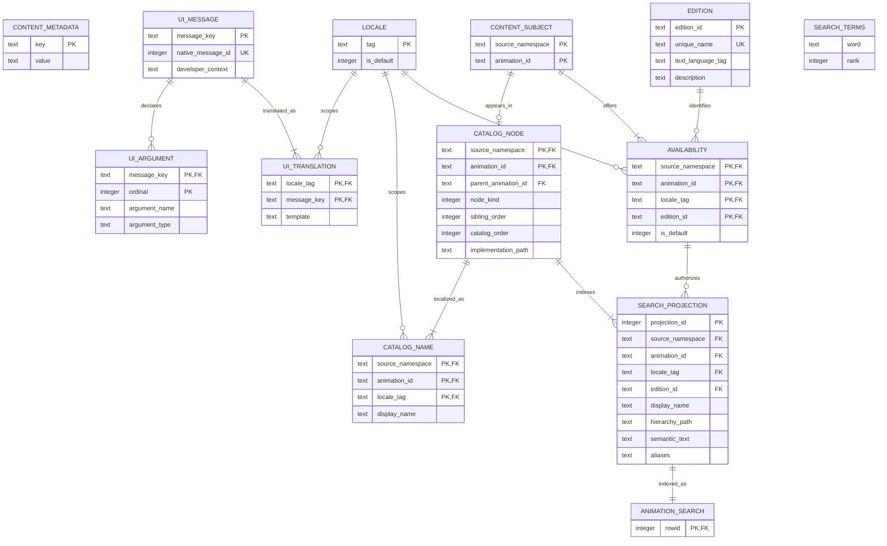
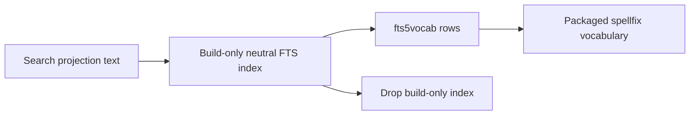
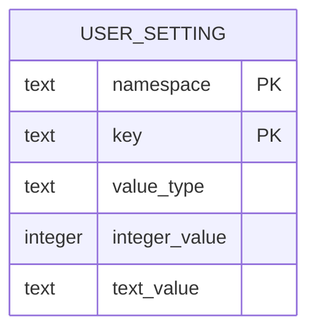
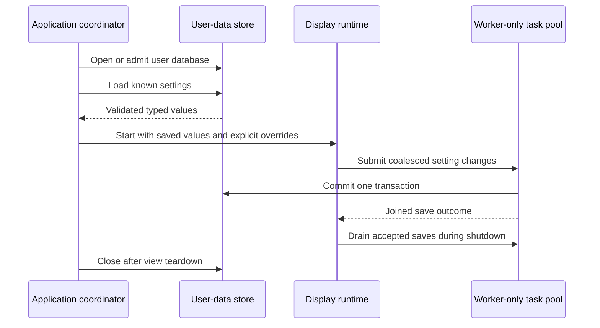

# SQLite Architecture

> Euclid uses SQLite for two different jobs: a packaged, immutable catalogue
> that ships with the application, and a separate writable database for durable
> user settings.

## Table Of Contents

1. [How The Database Role Grew](#how-the-database-role-grew)
1. [Two Databases, Different Lifetimes](#two-databases-different-lifetimes)
1. [Packaged Content And Search](#packaged-content-and-search)
1. [Persistent User Settings](#persistent-user-settings)
1. [Shared SQLite Mechanics](#shared-sqlite-mechanics)
1. [Where To Trace A Change](#where-to-trace-a-change)
1. [What Could Grow Next](#what-could-grow-next)

## How The Database Role Grew

SQLite entered Euclid to support full-text search (FTS) over the built-in animation
catalogue. As the content model expanded, the packaged database also became the home
for localization declarations, catalogue names, editions, availability, and the
search projection. Persistent application settings later introduced a separate
mutable user database.

The two paths share SQLite mechanics, but not a schema, owner, or lifecycle. Content is
authored and built into an application asset, then admitted as an immutable generation.
User settings are read from and committed to a durable per-user file at runtime. Treating
these as one generic “application database” would obscure those distinct responsibilities.

## Two Databases, Different Lifetimes

| | Packaged content database | User data database |
| --- | --- | --- |
| Purpose | Catalogue, localization and search data | Durable user preferences |
| Produced or changed by | Julia content declarations and the asset builder | Application startup and settings-save path |
| Runtime access | Read-only connection owned by the content worker | Read and write through the user-data store |
| Lifetime | Packaged asset and staged/active content generations | User-data file, admitted for the application session |
| Current publication model | Build, validate, package, then replace as a complete immutable asset | Load saved values; write validated setting batches transactionally |
| Schema ownership | Content builder and content-store admission | `src/userdata/`, using typed definitions from `src/settings/` |

Both databases use `src/sqlite/` for explicit connection, statement, binding, and column
operations. Sharing that substrate does not make their connections interchangeable:
each consumer owns its SQL and policy. The content worker keeps its connection exclusive
while servicing content requests. The settings connection is opened and admitted by the
application coordinator; settings writes run as worker-only tasks, are joined before
their payload or store can be reused, and are drained during shutdown.

The UI does not issue SQL. Content requests cross the worker boundary as bounded values.
Settings changes are collected as typed batches and handed to the persistence path;
display drawing and controls operate on application-owned settings state.

## Packaged Content And Search

The packaged database brings authored and generated facts together. This ERD is a
navigation map of the domain, not a promise that every internal FTS table or compatibility
view is a stable application API.

`CONTENT_METADATA` describes the generated content and search generation. UI message
definitions and translations serve typed native messages; catalogue nodes and localized
names describe the Library tree; editions and availability connect authored content to
the catalogue; `SEARCH_PROJECTION` gathers text used for retrieval. `ANIMATION_SEARCH`
is an FTS5 index over that projection. `SEARCH_TERMS` is the spelling-suggestion
vocabulary. SQLite-owned FTS shadow tables are omitted.

### Build-Only Vocabulary

The builder needs human-readable terms for spelling suggestions, while the retrieval
index uses Porter stemming. It therefore builds a second, neutral-tokenized projection
from the same search text, reads its `fts5vocab` rows into `SEARCH_TERMS`, and drops the
temporary projection before commit. This is build machinery, not another packaged
content model:

The builder's SQLite connection also keeps SQLite temporary work in memory. This is
separate from the two ordinary tables used for the intermediate vocabulary projection:
those exist only during construction and are removed before the database is finalized.

The lifecycle runs from content authoring through asset admission:

```mermaid
flowchart LR
    Julia[Localized declarations and search sidecars]
    Export[Canonical content records]
    Builder[Standalone content builder]
    Packaged[Immutable content database]
    Asset[Validated application asset]
    Worker[Content worker and read-only connection]
    Display[Display-owned Library state]

    Julia --> Export --> Builder --> Packaged --> Asset --> Worker
    Display -->|bounded query| Worker
    Worker -->|IDs and suggestion values| Display
```

The builder creates the normalized tables, publishes the search indexes, and validates
the result before it is packaged. Runtime admission checks the packaged identity and
content metadata, then materializes a bounded native generation. The content service
keeps active and staged generations in dedicated service storage: reload builds the
inactive slot while the active slot remains available, then publication either promotes
the candidate or retires it. This native generation storage is distinct from both
SQLite's temporary workspace and the packaged database.

The worker copies SQLite column values into the admitted generation before stepping
statements again; those borrowed column views do not escape. Query execution likewise
uses worker-local temporary storage, releases it after publishing the bounded result, and
returns identifiers and copied suggestion values—not SQLite pointers. The display
checks query and index generations before resolving accepted identifiers against the
active catalogue.

For editorial declarations and consumer behavior, see
[Localization And Editions](Localization.md). For Library search syntax and UI policy,
follow the source map below into the query compiler, worker, and coordinator.

## Persistent User Settings

The user database is not the packaged catalogue with writes enabled. It is a separate
durable file owned by the user-data subsystem. Today its schema is deliberately small:
one `user_setting` row per known preference, keyed by namespace and key.

The value type selects which scalar column is populated: booleans and integers use
`integer_value`; closed application enums use `text_value`. The `src/settings/` catalog
defines the known keys, value kinds, defaults, and validation. Unknown keys are not
loaded into application state. A reset deletes the saved row, allowing the current
application default to apply; it does not store a duplicate default.

Defaults are the starting point; saved values are loaded before explicit launch
overrides are applied. Invalid known rows are ignored and reported, while a failed read
or explicitly requested store is not silently presented as a successful load. During
the session, changes are coalesced into typed batches. A batch is validated and
committed in one transaction; failure leaves the batch uncommitted and the save path
retains it for its retry or reporting policy. Shutdown drains accepted writes before
the coordinator closes the store.

The current stored settings are window, rendering, drawing, and interface preferences.
There is no shared transaction or generation lifecycle between these rows and the
packaged catalogue.

## Shared SQLite Mechanics

`src/sqlite/` wraps the narrow native binding with explicit connection and statement
lifetimes, typed bind and column operations, and structured errors. It deliberately does
not own schemas, application records, migrations, worker scheduling, or transaction
policy. The content builder, content runtime, and user-data store each own those choices.

The vendored SQLite build includes FTS5 and the spellfix extension needed by the content
index. Runtime extension loading is not used. Connections must have exclusive,
sequential ownership; the content worker owns its connection, while the user-data store
is only handed to a settings worker for bounded work that is joined before reuse. See
[`sqlite/`](../../../src/sqlite/), the [SQLite binding](../../../libs/sqlite3/sqlite3.odin),
and [SQLite build configuration](../../../tools/build_config.jl).

The low-level binding also uses temporary scratch storage for operations such as
immutable-URI path encoding, and `SQLITE_TRANSIENT` when binding text so SQLite copies
the bytes before caller storage can expire. These short-lived mechanics buffers are
different from database-owned generations or durable rows; their exact APIs live in
the substrate rather than in consumer schema policy.

## Where To Trace A Change

| If the change is about… | Start here |
| --- | --- |
| Connection, statement, binding, or column mechanics | [`src/sqlite/`](../../../src/sqlite/) |
| SQLite native build and binding | [`libs/sqlite3/`](../../../libs/sqlite3/) and [`build_config.jl`](../../../tools/build_config.jl) |
| Content declarations, editions, or search corpus | [`src/content/localization/`](../../../src/content/localization/), [`src/julia/search/`](../../../src/julia/search/) |
| Content database schema and generation | [`schema.sql`](../../../tools/content_builder/sql/schema.sql), [`content_builder/`](../../../tools/content_builder/) |
| Content admission, named SQL, or worker lifecycle | [`src/view/content/`](../../../src/view/content/) |
| Search syntax and query validation | [`query.odin`](../../../src/view/content/query.odin) |
| Known preference identities, defaults, and validation | [`src/settings/`](../../../src/settings/) |
| User database schema, path, admission, and transactions | [`src/userdata/`](../../../src/userdata/) |
| Startup preference loading and overrides | [`launch.odin`](../../../src/app/launch.odin) |
| Runtime saves and shutdown drain | [`settings_save.odin`](../../../src/view/preferences/settings_save.odin), [`shutdown.odin`](../../../src/view/shutdown.odin) |

The tests beside these modules cover substrate mechanics, database admission,
content-generation validation, settings loads and commits, and save lifecycle behavior.
Use the narrowest documented language suite while developing; use the repository's
complete `check` target when a database or lifecycle change requires full validation.

## What Could Grow Next

Custom user lists and optional saved use history could support smarter Library features.
They are aspirations, not existing tables or behavior. Before adding them, decide which
database owns each record and how privacy, retention, migration, and deletion work.
User-created or learned data should not silently become part of the reproducible
packaged content index; the content and user-data lifecycles should remain distinct
unless a deliberate design gives them a safe bridge.
