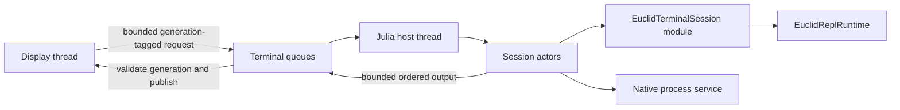

# Terminal Architecture

## Purpose And Scope

Terminal is Euclid's interactive Julia and shell surface. Odin owns visible terminal
state, input routing, native process integration, rendering, and lifecycle evidence.
The Julia host thread owns evaluation, completion, interpolation, actor policy, and one
generation-local `EuclidReplRuntime`.

Terminal is not an animation-tree node and does not use a parallel evaluator or bridge.
All interactive requests use the bounded Terminal protocol and are correlated with the
active session generation.

## Source Map

| Concern | Primary implementation |
| --- | --- |
| Shared Terminal protocol and bounded payload types | `src/core/` |
| Display-thread Terminal service and publication | `src/view/terminal_service.odin`, `src/view/terminal/` |
| Input polling, routing, and encoding | `src/view/input/` |
| PTY/ConPTY sessions and shell policy | `src/terminal/session/`, `src/terminal/shell/` |
| Julia host and generation lifecycle | `src/julia/host/`, `src/julia/runtime_host.jl` |
| Evaluation, completion, interpolation, and actors | `src/julia/terminal/`, `src/julia/actors/` |
| Generation-local Euclid drawing helpers | `src/julia/euclidrepl.jl` |
| Tick subscriptions | `src/julia/ticks.jl` |
| Behavioral scenarios and evidence | `src/view/scenario_runtime.odin`, `src/evidence/`, `tools/scenarios/` |

## Ownership And Execution

Each active Terminal generation owns a `HostSessionRuntime`. It contains the fresh
`EuclidTerminalSession_<generation>` module, evaluator and service actors, and one
`EuclidReplRuntime`. Only the Julia host thread enters libjulia or mutates these values.

The display thread owns visible cells, selection, scrolling, input state, Raylib
resources, and publication to the user. Native process services own PTY or ConPTY
resources behind explicit Terminal messages. Worker tasks remain finite CPU work and do
not call Julia or Raylib.

Dynamic request and output bytes remain producer-owned until the consumer returns their
envelope. Request IDs and session generations correlate evaluation, completion,
interpolation, process, and output events. Display handlers reject stale generations
before mutating visible state.

## EuclidRepl Lifecycle

`EuclidRepl.install_session_helpers!` installs closures into the active session module.
Those closures retain the generation-local runtime and the host's lifetime-stable Odin
state pointer. There is no global registry for session state.

Animated helper jobs subscribe through `Ticks.Subscription`. Starting a new job finalizes
and preempts the prior job. Session reset and shutdown unsubscribe active jobs before tick
admission closes, then clear managed geometry. A reload or replacement session receives a
fresh module and a fresh `EuclidReplRuntime`; state never crosses generations.

## Correctness Invariants

- Only the display thread mutates visible Terminal and Raylib state.
- Only the Julia host thread enters libjulia or mutates session actors.
- Every interactive operation is tagged with its Terminal generation.
- Stale results are rejected before display-owned state changes.
- EuclidRepl state and tick subscriptions are local to one Terminal generation.
- Shutdown resets EuclidRepl before tick admission stops and joins native resources.
- Terminal protocol storage remains bounded; overload is explicit rather than hidden
  growth.
- Scene and Dynview publication still commit through their owning Odin boundaries.

## Verification

Use focused Julia and Odin unit suites for actor, evaluation, Terminal, EuclidRepl, and
protocol changes. Use scenarios when correctness depends on frame ordering, session
replacement, process lifecycle, rendering, capture, or shutdown evidence. Run the full
CMake `check` target before delivery for substantive cross-boundary changes.
