# Terminal Architecture

## Table Of Contents

1. [Purpose And Architectural Role](#purpose-and-architectural-role)
1. [System Model](#system-model)
1. [Protocol Architecture](#protocol-architecture)
1. [Source Map](#source-map)
1. [Ownership Model](#ownership-model)
1. [Session Generations](#session-generations)
1. [Input And Evaluation](#input-and-evaluation)
1. [Completion And Interactive Input](#completion-and-interactive-input)
1. [Output, Emulation, And Rendering](#output-emulation-and-rendering)
1. [Shell And Native Processes](#shell-and-native-processes)
1. [Graphics Protocol Realization](#graphics-protocol-realization)
1. [Geometry And Container Policy](#geometry-and-container-policy)
1. [EuclidRepl And Tick Streams](#euclidrepl-and-tick-streams)
1. [Backpressure And Memory Ownership](#backpressure-and-memory-ownership)
1. [Failure And Shutdown](#failure-and-shutdown)
1. [Verification](#verification)
1. [Change Guide](#change-guide)
1. [Correctness Invariants](#correctness-invariants)

## Purpose And Architectural Role

Terminal is Euclid's interactive Julia and shell surface. It combines a native terminal
emulator with Julia-owned REPL policy while preserving the application's thread and
resource boundaries.

Terminal is selected through the animation catalog, but it is not implemented as an
animation evaluator. It has its own generation-scoped protocol, session actors, native
process service, terminal state, and rendering path. Scene changes requested by
interactive Julia still cross the ordinary bridge and commit through Odin's scene owner.

The central split is:

- **Odin owns the terminal machine:** input, visible cells, VT interpretation, native
  processes, graphics resources, selection, scrolling, rendering, and evidence.
- **Julia owns interactive policy:** evaluation, completion, shell interpolation,
  session actors, EuclidRepl helpers, and tick subscriptions.

## System Model

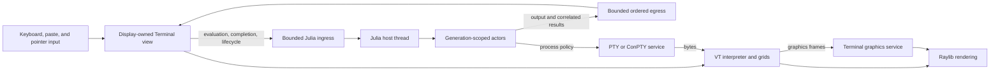

Two planes cooperate without sharing mutable state:

| Plane | Authority | Commit point |
| --- | --- | --- |
| Interactive policy | Julia owner thread and session actors | Typed egress accepted by the display |
| Terminal mechanism | Display thread and native services | Visible grid, process, graphics, or container state |

## Protocol Architecture

Terminal is organized around two different kinds of protocol. They meet at the display
owner but serve different trust and ownership boundaries.

| Protocol layer | Participants | Representation | Purpose |
| --- | --- | --- | --- |
| Terminal wire protocols | Julia evaluations or native child processes and the VT interpreter | UTF-8 plus ECMA-48, DEC, xterm, Kitty, Sixel, and iTerm2 escape sequences | Describe terminal behavior and receive terminal replies. |
| Host coordination protocol | Odin display owner and Julia session actors | Typed, generation-tagged messages in `src/core/protocol/` | Coordinate evaluation, completion, geometry, capabilities, ticks, processes, and lifecycle. |

The wire protocol is not passed through as trusted display state. The interpreter turns
complete bounded sequences into semantic operations owned by grids and services. Query
replies take the reverse path: the interpreter snapshots semantic state, retains a
producer-correlated response value, and the input layer encodes bytes only when the
matching Julia evaluation or native session can receive them.

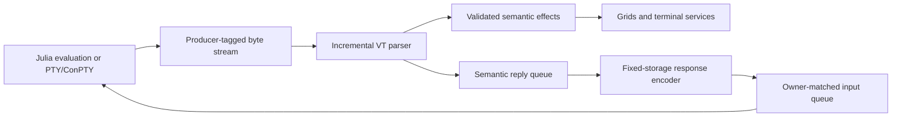

### Supported Wire Protocols

| Family | Supported surface | Architectural result |
| --- | --- | --- |
| UTF-8, C0, ECMA-48, and DEC | Text, cursor movement, save/restore, erase, cell and row editing, scrolling, tabs, margins, SGR, protected cells, primary/alternate screens, origin and autowrap modes | Synchronous mutation of the active display-owned grid and rendition state |
| Input negotiation | Application cursor/keypad, bracketed paste, focus events, button/motion mouse tracking, SGR and pixel mouse coordinates, xterm `modifyOtherKeys`, Kitty keyboard flags | Interpreter-owned mode snapshot consumed by the physical input encoder |
| Queries and reports | DA1/DA2, DSR and cursor position, ANSI/DEC mode status, window/cell/text-area size, DECRQSS, XTGETTCAP, keyboard negotiation, and color queries | Producer-correlated semantic replies encoded back to the requesting stream |
| OSC integration | Titles, indexed/default/cursor colors, hyperlinks, clipboard writes, working directory, and shell command markers | Transactional updates to dedicated display-owned services |
| Kitty graphics | Image transfer, placement, deletion, query, frame mutation, animation control, and composition | Bounded attachment identities, ordered mutations, acknowledgements, and asynchronous decode |
| Sixel and iTerm2 images | Sixel raster streams; iTerm2 inline and multipart images, including animated GIF | Bounded transfer admission followed by worker preparation and display publication |
| Synchronized output | DEC private mode 2026 across grids and attachments | One display-owned checkpoint published atomically or forced at a boundary |

Support means that the listed forms have explicit parsing, semantic ownership, bounded
storage, failure behavior, and tests. Unknown or malformed forms are consumed through
their proper terminator and counted; they do not leak payload bytes into visible text.

### Screen And Rendition Protocols

The VT interpreter owns escape syntax while `src/terminal/grid/` owns durable terminal
meaning. CSI and DEC operations update cursor and margin state, edit cells and rows,
select primary or alternate screens, and apply SGR attributes with ANSI, indexed, or
direct colors. The renderer reads those semantic cells; it never reinterprets escape
sequences.

Parser state is incremental because output may split any sequence across batches. CSI,
OSC, APC, DCS, and iTerm2 strings have fixed framing limits and terminator-aware discard
states. A producer change terminates an incomplete sequence so bytes from a Julia
evaluation and a native process can never combine into one command.

### Input Negotiation

Child output controls how later physical input is encoded. DEC private modes select
application cursor keys, bracketed paste, focus reporting, mouse tracking modes 1000,
1002, and 1003, SGR mouse encoding 1006, and pixel coordinates 1016. Keypad application
mode is selected by its escape form.

xterm `modifyOtherKeys` and the Kitty keyboard protocol are separate negotiated layers.
Kitty supports query, replace, set, clear, push, and pop for flags 1, 2, 4, 8, and 16;
its state is retained independently for primary and alternate screens. All negotiated
input state resets at an evaluation or process stream boundary.

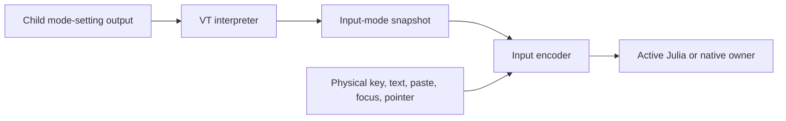

### Queries And Responses

Queries read committed semantic state, not parser buffers or rendering caches. Supported
reports include device identity, readiness and cursor position, ANSI and DEC private
mode status, window/cell/text-area geometry, current SGR/cursor-style/margins through
DECRQSS, and the allowlisted XTGETTCAP names `TN`, `Co`, `RGB`, and `Tc`.

Replies remain structured until final encoding. Every response records the producer
kind, ID, and generation captured when its sequence began. The display routes encoded
bytes only to that owner; stale replies are discarded rather than delivered to whichever
session happens to be active.

### OSC Services

| Sequence | Supported behavior | Owning service |
| --- | --- | --- |
| OSC 0 and 2 | Validate and replace the terminal title | Emulator title state |
| OSC 4, 10, 11, and 12 | Set or query indexed, foreground, background, and cursor colors | Palette service |
| OSC 104 and 110-112 | Reset indexed or default colors | Palette service |
| OSC 7 | Retain the validated current-working-directory URI | Shell integration |
| OSC 8 | Open, replace, or close a bounded hyperlink identity | Hyperlink registry |
| OSC 52 | Decode a canonical Base64 UTF-8 clipboard write | Clipboard action queue and display callback |
| OSC 133 | Index prompt, command, execution, and completion markers | Shell integration and grid row metadata |
| OSC 1337 | Frame iTerm2 inline-image transfers | Graphics protocol state |

These operations commit only after a complete payload validates. System effects stay
behind display-owned callbacks: an OSC sequence can request a clipboard write or retain
a link, but parser code does not call the operating system directly.

## Source Map

### Shared Protocol And Host Boundary

| Concern | Primary implementation |
| --- | --- |
| Internal typed messages, generations, capabilities, and geometry | `src/core/protocol/` |
| Odin-to-Julia bridge transport | `src/bridge/` |
| Julia host ingress, egress, and lifecycle | `src/julia/host/` |
| Julia host composition | `src/julia/host.jl`, `src/julia/runtime_host.jl` |

### Julia Policy

| Concern | Primary implementation |
| --- | --- |
| Actor runtime and policy types | `src/julia/policy.jl`, `src/julia/policy/` |
| Evaluation adapter and streaming output | `src/julia/eval.jl`, `src/julia/eval/` |
| Completion | `src/julia/eval/completion.jl` |
| Shell interpolation | `src/julia/interpolation.jl` |
| Public terminal capabilities and process API | `src/julia/terminal.jl` |
| Euclid drawing helpers | `src/julia/euclidrepl.jl` |
| Fixed-update subscriptions | `src/julia/ticks.jl` |
| Terminal container API | `src/julia/terminal_container.jl` |

### Odin Terminal

| Concern | Primary implementation |
| --- | --- |
| Display orchestration and Julia publication | `src/view/terminal_service.odin` |
| Terminal state, editing, selection, and rendering | `src/view/terminal/` |
| Input polling and physical-key encoding | `src/view/input/` |
| VT interpreter and response generation | `src/terminal/emulator/` |
| Primary, alternate, and scrollback grids | `src/terminal/grid/` |
| PTY/ConPTY lifecycle | `src/terminal/session/` |
| Shell parsing and command resolution | `src/terminal/shell/` |
| Shell command markers | `src/terminal/shell_integration/` |
| Attachments and raster protocols | `src/terminal/attachment/`, `src/terminal/graphics/` |
| Display-thread graphics publication | `src/view/graphics/`, `src/view/terminal_graphics_service.odin` |
| Hyperlinks, clipboard, palette, and history | `src/terminal/hyperlink/`, `clipboard/`, `palette/`, `history/` |
| Scenarios and semantic evidence | `src/view/scenario_runtime.odin`, `src/evidence/`, `tools/scenarios/` |

## Ownership Model

| Resource | Owner | Notes |
| --- | --- | --- |
| Visible terminal state | Display thread | Cells, prompt, cursor, selection, scroll, modes, and active generation |
| Raylib fonts, textures, and draw calls | Display thread | Never used from Julia or preparation workers |
| Julia runtime and session actors | Julia host thread | Only this thread enters libjulia |
| Evaluation scope | One `HostSessionRuntime` | Fresh module and runtime for each Terminal generation |
| PTY/ConPTY handles | Odin terminal-session service | Hidden behind typed process/session operations |
| Terminal graphics preparation | Shared task pool | CPU-only decode and preparation with display-thread publication |
| Dynamic transport bytes | Producing communication link | Borrowed until the consumer returns the envelope |
| Scene and Dynview state | Their existing Odin owners | Terminal code cannot bypass those commit boundaries |

The display never lends mutable terminal state to Julia. Julia never retains native
terminal, process, or graphics handles. Actor IDs are generation-bearing capabilities,
not ownership of the resources represented by their messages.

## Session Generations

Selecting Terminal creates an Odin terminal generation and requests the matching Julia
session. `HostSessionRuntime` groups every Julia-owned service that may act for that
generation:

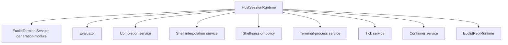

The fresh session module provides persistent interactive bindings within one generation.
It installs `Terminal`, `Ticks`, `TerminalContainer`, and EuclidRepl helpers. Completion
and shell interpolation are bound to that same module, so definitions entered by the
user are visible consistently across evaluation and related services.

### Startup Handshake

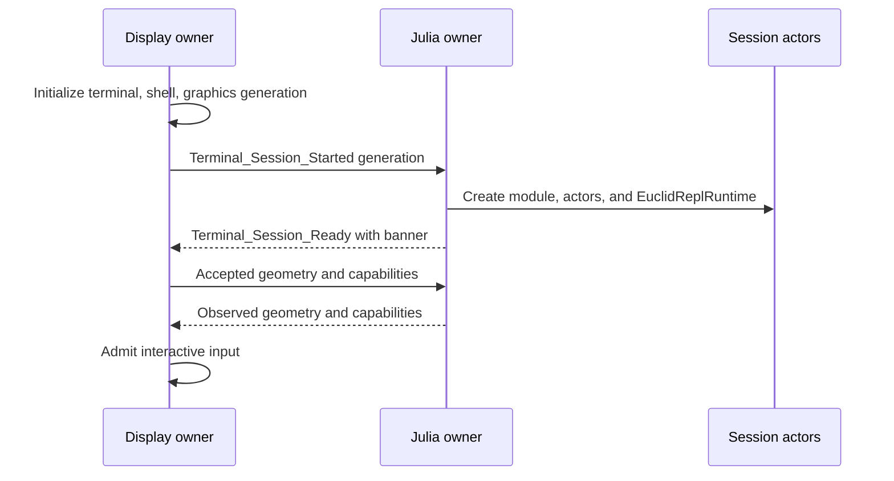

Readiness is more than actor creation. The display tracks the startup banner, capability
acknowledgement, and current geometry acknowledgement before treating the prompt as
ready. Every message carries the Terminal generation; stale generations are consumed
and released without mutating visible state.

## Input And Evaluation

The display owns immediate editing behavior. It translates input events into UTF-8 text,
physical-key actions, paste operations, cursor changes, or a complete submission. The
active mode determines where submission goes:

| Mode | Owner and behavior |
| --- | --- |
| Normal | Julia evaluator parses and evaluates in the session module. |
| Help | Julia REPL help machinery resolves documentation. |
| Pkg | Julia package-mode adapter owns interpretation and output. |
| Shell | Odin shell service parses and launches through native session ownership. |

### Julia Evaluation Flow

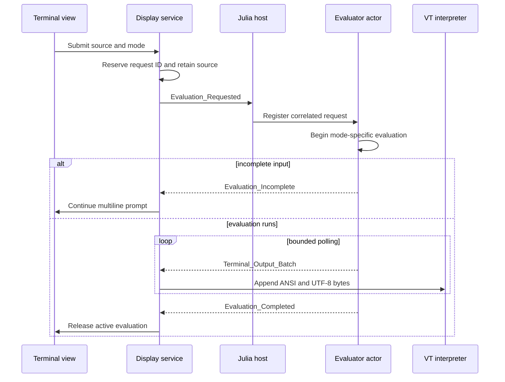

Only one evaluation stream is active per session. Starting evaluation may complete
immediately as incomplete input or an intercepted session-exit request. Otherwise the
actor advances it through bounded polls so actor scheduling, output draining, and
lifecycle work remain observable.

Output is correlated by both request ID and Terminal generation. The display accepts a
batch only for its active evaluation; completion releases only that same request. A
failed ingress attempt restores the display prompt instead of leaving a phantom active
evaluation.

Interactive Julia code runs inside the generation-local module. Calls to Euclid helpers
produce ordinary bridge operations; they do not receive direct access to canonical scene
state.

## Completion And Interactive Input

Completion snapshots the complete source and cursor byte offset. Julia resolves the
request in the active session module and returns a replacement range plus insertion.
The display applies it only when the generation and request identity are still current.
Older completion results cannot overwrite newer typing.

Some Julia operations request terminal input while evaluation is active. The evaluator
publishes an explicit lease:

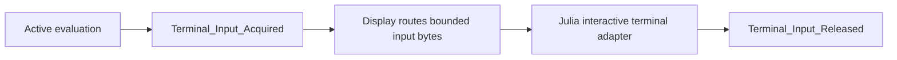

The lease is tied to the active evaluation request and generation. Outside that lease,
keyboard input continues to edit the display-owned prompt. During the lease, encoded
terminal bytes go to the evaluator's interactive input adapter. Session close sends an
interrupt when necessary before draining the evaluator.

## Output, Emulation, And Rendering

Julia evaluation and native processes both produce terminal byte streams. They enter the
same display-owned VT pipeline with producer identity attached; neither producer writes
cells directly.

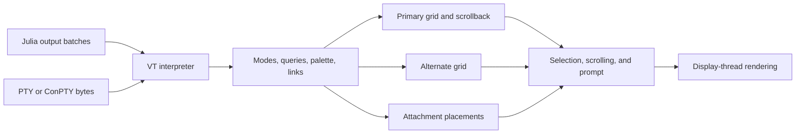

The interpreter owns control-sequence semantics, not pixels. It mutates terminal grids,
cursor and mode state, palette state, hyperlinks, shell markers, synchronized-output
checkpoints, and attachment protocol state. Query responses are routed back to the
producer that owns the corresponding session.

The grid stores visible cells and scrollback independently from rendering. It handles
wide and combining characters, editing operations, primary/alternate screen behavior,
and reflow. The view layer adds prompt editing, selection, command navigation, links,
scrolling, cursor presentation, font resolution, and scissored drawing.

Rendering is cache- and state-driven on the display thread. Text shaping may use the
resident font service, but terminal cells remain the semantic source. Unsupported or
pending shaped runs fall back without changing the grid.

## Shell And Native Processes

Shell mode and Julia's `Terminal.run_process` API share native process mechanisms but
have distinct policy entry points.

### Shell Submission

1. The display routes Shell-mode source to the Odin shell service.
1. Odin parses command templates and identifies explicit Julia interpolation leaves.
1. The Julia interpolation actor evaluates those leaves in the active session module.
1. Odin validates the bounded scalar results and resolves an executable process plan.
1. The terminal-session owner starts a PTY or ConPTY process for that plan.
1. Process output enters the VT interpreter; encoded user input returns to the session.

### Julia Process API

`Terminal.run_process` and related helpers create a bounded, evaluation-scoped request.
The Julia process actor owns policy and correlation; Odin owns executable resolution,
process creation, terminal attachment, cancellation, and final status. Task-local
process authority prevents calls outside an active Euclid evaluation from acquiring a
native process implicitly.

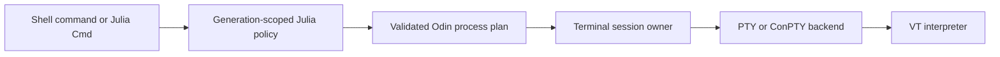

Only one foreground terminal owner receives ordinary input at a time. Process completion,
cancellation, and close are correlated with session generation and operation identity.
Shell-session policy does not own OS handles, and native backends do not enter Julia.

## Graphics Protocol Realization

Kitty, Sixel, and iTerm2 share storage and rendering after framing, but they do not share
wire semantics. Each protocol is parsed far enough to preserve its own identity,
placement, cursor, reply, and animation rules before producing common attachments.

| Protocol | Framing and payloads | Supported semantics |
| --- | --- | --- |
| Kitty graphics | APC `G`; direct and chunked Base64; PNG or RGB/RGBA with supported zlib compression | Transmit, transmit-and-place, place, delete, query, crop and offset geometry, image/placement IDs, frame edits, animation control, composition, and protocol acknowledgements |
| Sixel | DCS `q`; indexed raster commands | Repetition, carriage return, next band, raster attributes, RGB/HLS palette definitions, transparency, scrolling mode 80, and cursor-right mode 8452 |
| iTerm2 images | OSC 1337 `File`, `MultipartFile`, `FilePart`, and `FileEnd`; PNG, JPEG, or GIF | Inline placement, intrinsic/cell/pixel/percentage sizing, aspect-ratio policy, multipart assembly, and animated GIF playback |

Protocol controls become bounded scalar metadata before expensive image work begins.
Malformed headers, unsupported formats, invalid dimensions, incomplete chunks, and
quota failures reject the affected transaction without publishing an attachment.

```mermaid
flowchart LR
    Wire[APC, DCS, or OSC frame]
    Frame[Bounded protocol frame]
    Semantics[Protocol-specific validation]
    Store[Attachment and placement reservation]
    Work[CPU decode or raster expansion]
    Publish[Display-thread texture publication]
    Draw[Placement composition]

    Wire --> Frame --> Semantics --> Store --> Work --> Publish --> Draw
    Semantics -->|synchronous Kitty operation| Store
```

| Stage | Owner | Responsibility |
| --- | --- | --- |
| Framing | VT interpreter and `graphics/protocol` | Retain bounded headers, payload transfers, producer identity, and completed frames. |
| Semantics | `graphics/semantics` | Apply protocol commands, reserve identities and placements, and queue finite decode requests. |
| Durable model | `terminal/attachment` | Own attachment generations, placements, screens, and animation timelines. |
| Preparation | Shared task pool and `graphics/prepare` | Inspect and decode into caller-owned CPU storage without Raylib. |
| Publication | Display graphics service | Revalidate generation, create textures, commit mutations, and advance playback. |
| Composition | Terminal view | Draw placements at their sealed z-order relative to text. |

A Terminal generation binds one parser and attachment store to the reusable display
service. Replacement unbinds that generation and joins accepted preparation before
resources are reused. Synchronized output can hold both grid and attachment changes
until one display commit.

Kitty mutations retain stream order even when a frame requires worker preparation: a
later mutation cannot pass an earlier unfinished one. Protocol identities map to current
internal attachment generations, so replacement and deletion cannot accidentally target
reused storage. Replies return to the producer that issued the Kitty command.

## Geometry And Container Policy

Terminal geometry is measured in cells but originates from display-owned pixel bounds
and font metrics. A resize is transactional: prepare primary-grid reflow, alternate-grid
resize, attachment relocation, selection relocation, scroll state, and checkpoints;
then publish the complete replacement.

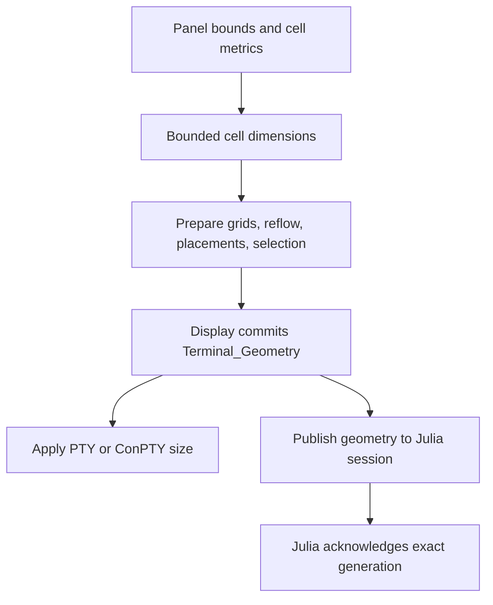

The Julia `Terminal.dimensions()` API reads the acknowledged geometry associated with
the current evaluation. Capability negotiation is parallel: the display publishes one
immutable snapshot describing encoding, color, keyboard modes, queries, hyperlinks,
clipboard, synchronized output, and graphics support.

Terminal-container policy is Julia-owned, while the display owns accepted placement and
size. Container requests cross a generation-scoped actor and commit only after Odin
applies bounds and minimum/maximum constraints. Pointer capture and visible geometry
remain display concerns.

## EuclidRepl And Tick Streams

`EuclidRepl.install_session_helpers!` installs closures into the fresh session module.
Those closures retain the generation-local `EuclidReplRuntime` and the lifetime-stable,
borrowed Odin state pointer. There is no process-global registry of user-session state.

EuclidRepl operations build ordinary scene intent through bridge APIs. Animated jobs use
a demand-driven `Ticks.Subscription` rather than an always-running frame hook:

1. A helper requests a stream period for its Terminal generation.
1. The display validates and acknowledges the stream generation.
1. Fixed simulation steps are coalesced into `Tick_Pulse` ranges.
1. Julia advances the active job from those pulses.
1. Completion or replacement requests idempotent stream shutdown.

Starting a new EuclidRepl job finalizes and preempts the previous job. Closing a session
resets managed geometry and stops tick admission before actors become quiescent. A new
Terminal generation always receives a fresh runtime; jobs and subscriptions never cross
generations.

## Backpressure And Memory Ownership

All cross-thread channels, actor mailboxes, output batches, process brokers, retained
source, and native terminal stores are bounded. Saturation is part of the protocol, not
an exceptional allocation path.

| Pressure point | Behavior |
| --- | --- |
| Julia ingress | Nonblocking rejection; caller retains or restores its local UI state. |
| Actor mailbox | Correlated failure or retry according to operation semantics. |
| Evaluation concurrency | Reject a second evaluation while one stream is active. |
| Output retention | Emit bounded UTF-8 batches; account for discarded bytes explicitly. |
| Completion | Fail the exact request without mutating newer input. |
| Graphics transfer or decode | Reject the affected transfer or placement without partial publication. |
| Native session queues | Preserve explicit ownership and cancellation outcomes. |

Dynamic strings belong to the producing communication link. Consumers borrow them only
while handling the envelope and must not retain aliases after return. Long-lived terminal
state uses fixed-capacity storage or dedicated owner-managed arenas. Julia collections
remain under Julia GC but are bounded by service policy.

## Failure And Shutdown

Failures remain local to the owner that can recover:

- Parse and evaluation errors become terminal output; they do not crash the host.
- Completion, interpolation, and process failures resolve their correlated request.
- Invalid or stale egress is discarded before visible mutation.
- Malformed VT, graphics, hyperlink, clipboard, or palette operations fail at their
  parser or semantic boundary.
- A failed graphics preparation never publishes a partial texture or placement.
- Actor failures are recorded by the Julia host and surfaced through diagnostics.

Session replacement is a drain, not an overwrite:

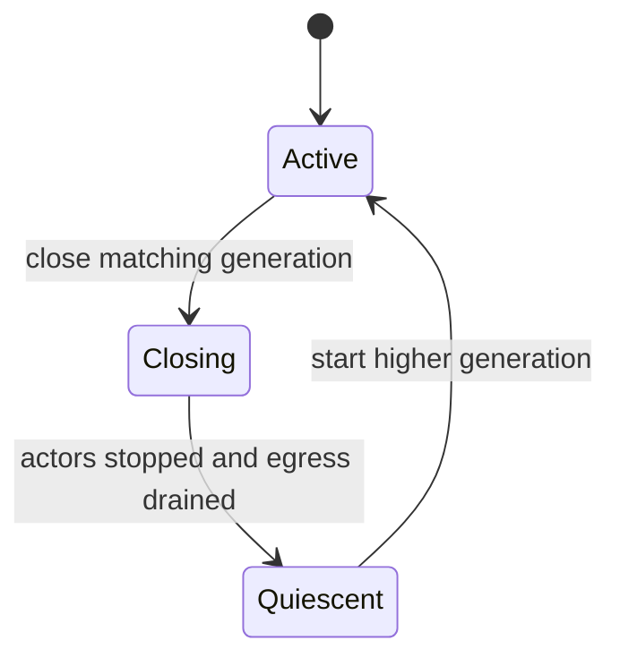

Closing stops new completion, interpolation, tick, container, and process admission;
interrupts an interactive evaluation when needed; drains outstanding output and terminal
commands; closes the interactive adapter; then emits one quiescence result. A higher
generation cannot start before that point.

Application shutdown follows the same ordering at larger scope: reject new work, stop
session services, drain actor output and pending requests, close native sessions, join
terminal graphics preparation, release display resources while Raylib is live, and only
then shut down Julia and shared services.

## Verification

Use the narrowest registered suite for the owner being changed:

| Concern | Relevant suites or evidence |
| --- | --- |
| Julia actors, evaluation, completion, or lifecycle | Julia runtime tests |
| Terminal editing, selection, rendering, and geometry | Terminal view and UI tests |
| VT/DEC parsing, modes, OSC, DCS, APC, and queries | Emulator and input-encoding tests |
| Grid, scrollback, and reflow | Termgrid tests |
| PTY/ConPTY and shell behavior | Terminal session and shell tests |
| Kitty, Sixel, and iTerm2 framing and semantics | Graphics protocol, semantics, and integration tests |
| Graphics preparation, publication, and playback | Graphics preparation/view tests and pixel scenarios |
| Cross-owner ordering | Scenario evidence and lifecycle scenarios |

Scenarios are required when a claim depends on frame ordering, generation replacement,
interactive evaluation, native process lifecycle, terminal graphics, container geometry,
capture, or shutdown. The checked-in scenarios under `tools/scenarios/` exercise these
flows through production ownership boundaries.

Run the complete CMake `check` target before delivery for substantive cross-boundary
changes. See [TestingStrategy.md](TestingStrategy.md) for the evidence model and scenario
artifact contract.

## Change Guide

### Add A Terminal Wire-Protocol Operation

1. Add framing only to `src/terminal/emulator/`; preserve arbitrary chunking and proper
    terminator-aware discard behavior.
1. Convert the complete sequence into bounded semantic values owned by the relevant
    grid, palette, hyperlink, clipboard, shell-integration, or graphics package.
1. If the operation replies, retain producer identity and encode the reply only in the
    display-owned input layer.
1. Put OS effects behind display callbacks and finite CPU work behind the task pool;
    parser code owns neither.
1. Define malformed, unsupported, over-capacity, stale-owner, stream-boundary, and
    shutdown behavior.
1. Test arbitrary chunk boundaries, valid forms, rejection, pressure, and reply routing;
    add a scenario when publication or pixels cross frames.

### Add A Host-Coordination Operation

1. Define the typed request and result in `src/core/protocol/` with generation and
   correlation semantics.
1. Add symmetric Odin ingress/egress transport and Julia host adaptation.
1. Route policy through the owning actor rather than the host pump itself.
1. Validate generation and request identity before display mutation.
1. Define saturation, cancellation, stale-result, and shutdown behavior.
1. Add owner-level tests and a scenario when ordering is observable across frames.

### Change Evaluation Or Completion

Keep session-module scope consistent across evaluation, completion, help, package mode,
and shell interpolation. Preserve one active evaluation stream, bounded output,
interactive-input leases, and current-request checks on the display side.

### Change VT Or Rendering Behavior

Put escape semantics in `src/terminal/emulator/`, durable cell behavior in
`src/terminal/grid/`, and presentation interaction in `src/view/terminal/`. Native OS
operations and Raylib calls stay behind display-owned callbacks or services.

### Add A Julia Terminal Helper

Install generation-local user helpers through the session module. Decide whether the
helper is immediate Julia state, a scene bridge operation, a tick subscription, a
container request, or a native process request; do not bypass that owner's protocol.

## Correctness Invariants

- Only the display thread mutates visible Terminal state or Raylib resources.
- Only the Julia host thread enters libjulia or mutates Julia session actors.
- Every interactive operation carries Terminal generation and required request identity.
- Stale results are released before any display-owned mutation.
- Evaluation, completion, and interpolation share one generation-local module.
- Dynamic transport bytes remain owned by their producer until envelope return.
- Julia and native process output pass through the same display-owned VT interpreter.
- Native process policy never owns OS handles; native backends never enter Julia.
- Grid semantics do not depend on rendering, and rendering does not reinterpret VT.
- Graphics preparation is CPU-only; texture publication and drawing are display-only.
- Geometry replacement publishes grids, placements, selection, and checkpoints together.
- EuclidRepl jobs and tick streams cannot survive their Terminal generation.
- Scene and Dynview mutations still commit through their owning Odin boundaries.
- Shutdown closes admission, drains correlated work, and joins owners before teardown.
