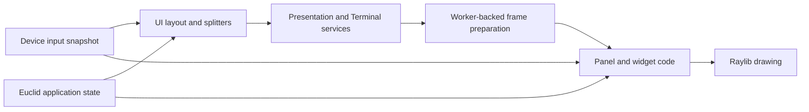
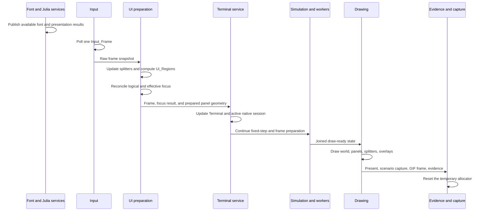
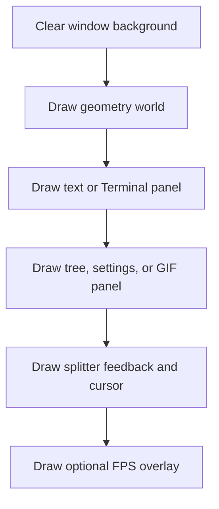
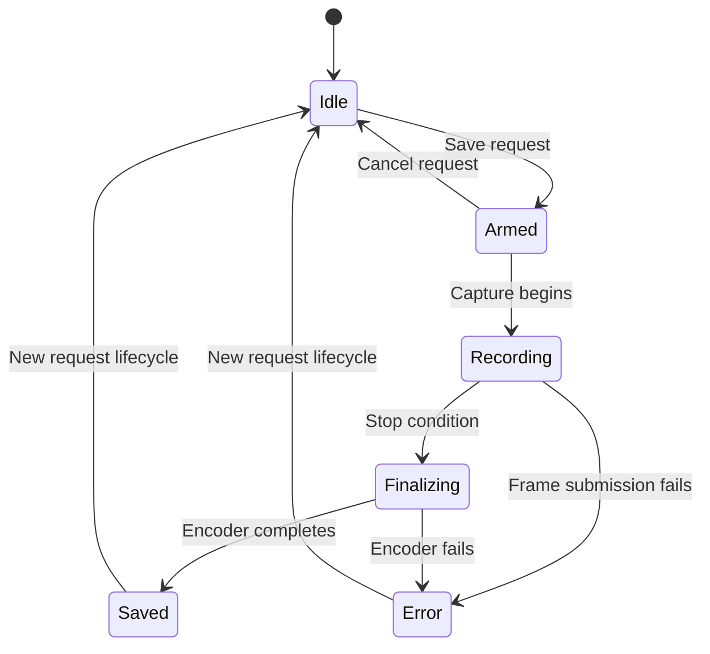

# UI System

## Table Of Contents

1. [Purpose And Scope](#purpose-and-scope)
1. [System Model](#system-model)
1. [Source Map](#source-map)
1. [Ownership Model](#ownership-model)
1. [Frame Lifecycle](#frame-lifecycle)
1. [Window And Layout](#window-and-layout)
1. [Panel Composition](#panel-composition)
1. [UI Runtime State](#ui-runtime-state)
1. [Input Model](#input-model)
1. [Press Ownership](#press-ownership)
1. [Widgets](#widgets)
1. [Scrolling](#scrolling)
1. [Presentation Panel](#presentation-panel)
1. [Terminal Panel](#terminal-panel)
1. [Tree And Utility Panels](#tree-and-utility-panels)
1. [Fonts And Text Drawing](#fonts-and-text-drawing)
1. [GIF Capture Coordination](#gif-capture-coordination)
1. [Allocation And Lifetime](#allocation-and-lifetime)
1. [Verification](#verification)
1. [Current Limitations](#current-limitations)
1. [Change Guide](#change-guide)
1. [Correctness Invariants](#correctness-invariants)

## Purpose And Scope

Euclid's UI is the display-thread-owned layer that turns application state into one
window containing the geometry world, presentation or Terminal content, animation
catalogue, settings, GIF controls, and shared panel chrome.

This guide documents the current implementation. It focuses on:

- frame ordering and display-thread ownership;
- fixed-window panel layout and splitter behavior;
- input snapshots, widget interaction, and shared press capture;
- presentation, Terminal, tree, settings, and GIF panel composition;
- scrolling, text selection, copy affordances, fonts, and drawing;
- current verification surfaces and architectural limitations.

It deliberately does not describe shape construction, constraint solving, particle
simulation, animation authoring, Dynview parsing, or terminal emulation in depth. Those
subsystems have their own owners and documentation. The UI consumes their prepared or
committed state and controls where it is visible.

Related guides are:

- [ArchitectureSummary.md](ArchitectureSummary.md) for process-wide ownership and
  execution roles;
- [TerminalArchitecture.md](TerminalArchitecture.md) for terminal protocols, sessions,
  grids, graphics, and Julia policy;
- [AnimationsStyle.md](AnimationsStyle.md) for visual and motion conventions;
- [LaTeXSupport.md](LaTeXSupport.md) for authored Dynview document and math syntax;
- [ToolRendering.md](ToolRendering.md) for pen and compass rendering details.

## System Model

The UI is not a separate thread or an independent retained widget runtime. It is a set
of Odin packages called by the display loop. The same display thread owns layout,
interaction state, visible application state, Raylib resources, and draw submission.



The UI combines immediate geometry and drawing with persistent interaction fields in
`Euclid_Ui_Runtime_State`. Widgets compute their rectangles each frame, inspect the
same `Input_Frame`, update display-owned state, and draw their current visual result.

This is a hybrid model:

| Property | Current behavior |
| --- | --- |
| Widget geometry | Recomputed from panel rectangles each frame. |
| Widget state | Stored in application, subsystem, or UI runtime state. |
| Input | One borrowed frame snapshot shared by UI consumers. |
| Drawing | Immediate Raylib calls on the display thread. |
| Layout caches | Dynview, font, shape, and Terminal owners retain derived state. |
| Cross-thread work | Workers prepare finite results; the display commits and draws. |

## Source Map

| Area | Primary files | Responsibility |
| --- | --- | --- |
| Window and frame loop | `src/view/view.odin` | Window lifecycle, frame order, world and panel drawing. |
| Shared UI entry point | `src/view/ui/ui.odin` | Constants, frame preparation, panel draw dispatch. |
| Region layout | `src/view/ui/layout.odin` | Clamp and derive all panel rectangles. |
| Splitters | `src/view/ui/splitter.odin` | Resize hit testing, capture, drag, fade, and cursor. |
| Containers | `src/view/ui/container.odin` | Clamped fill, border, and inner geometry. |
| Scrolling | `src/view/ui/scroll.odin` | Viewport, wheel, thumb geometry, capture, scissor, and draw. |
| Presentation panel | `src/view/ui/text_panel.odin` | Dynview/fallback dispatch, scrolling, selection, copy targets. |
| Dynview UI | `src/view/ui/dynview/` | Layout drawing, selection geometry, and styled presentation. |
| Terminal facade | `src/view/ui/terminal.odin` | Terminal panel layout, scroll container, and draw calls. |
| Terminal service | `src/view/terminal_service.odin` | Terminal lifecycle, input update, Julia messages, and links. |
| Terminal rendering | `src/view/terminal/` | Grid, prompt, selection, links, attachments, and overlays. |
| Tree panel | `src/view/ui/tree_panel.odin` | Catalogue traversal, row interaction, reveal, and scrolling. |
| Tree toolbar | `src/view/ui/tree_toolbar.odin` | Refresh, pause, tree, GIF, and settings actions. |
| Utility panels | `settings_panel.odin`, `gif_panel.odin` | Runtime settings and GIF controls. |
| Basic widgets | `*button.odin`, `checkbox.odin`, `sliders.odin` | Shared press/release and visuals. |
| Copy affordances | `src/view/core/copy_interaction.odin` | Copy icon interaction and clipboard action. |
| Input boundary | `src/view/input/` | Device polling, event storage, hotkeys, and Terminal encoding. |
| Font service | `src/view/font/` | Face preparation, publication, lookup, and shaping identity. |
| Shared state | `src/core/core.odin` | UI regions, press owner, runtime settings, selection, GIF state. |

## Ownership Model

The display thread is the sole writer of visible UI state and the only execution role
allowed to call Raylib drawing and resource APIs.

| Concern | Owner | Boundary |
| --- | --- | --- |
| Window and Raylib resources | Display thread | Initialized and destroyed by the view lifecycle. |
| Panel geometry | `Euclid_Ui_Runtime_State` | Computed before drawing each frame. |
| Widget press state | UI runtime or owning subsystem | Mutated only by display-thread UI calls. |
| Device frame storage | `input.Input_Runtime` | Borrowed until the next input poll. |
| Animation catalogue | Julia interface mirrored in Odin | Tree reads and requests changes; it does not run Julia. |
| Dynview content | Dynview system and compile cache | Prepared before display consumption. |
| Terminal cells and selection | Display-owned `Terminal_State` | Children send bounded messages or bytes. |
| Font atlases | Display-owned font cache | CPU preparation may run on workers; publication is display-owned. |
| World render packets | Shape and simulation owners | UI supplies viewport geometry and invokes drawing. |
| GIF state and capture | Display-owned GIF coordinator | UI requests actions; capture commits after presentation. |

The UI may call application services, such as animation reset or GIF capture, but it
does not bypass their ownership. A toolbar click sets display-owned request state; the
normal frame and service paths perform the operation.

## Frame Lifecycle

`run_window_frame` defines the authoritative ordering:



The concrete high-level order is:

1. service the font cache and synchronize math and prose shaping generations;
1. publish available Julia presentation state;
1. service presentation parsing and publication;
1. poll one device-independent `Input_Frame`;
1. call `ui.prepare_ui_frame`;
1. update the selected Terminal and active shell session;
1. advance fixed-step simulation;
1. run and join frame preparation that depends on the new UI geometry;
1. update audio and pre-presentation scenarios;
1. call `BeginDrawing`, draw the frame, and call `EndDrawing`;
1. service post-presentation scenarios and GIF capture;
1. publish frame evidence and reset `context.temp_allocator`.

Two ordering details are especially important:

- splitter changes happen before `Ui_Regions` and Dynview panel tracking;
- logical focus is reconciled after region computation and before Terminal processing;
- most ordinary widget interactions currently happen inside panel drawing, after the
  Terminal service has already processed the frame.

The second detail is a current limitation discussed below.

## Window And Layout

### Fixed Window

The current window is initialized at `1280x720`. `open_window` enables high-DPI output
and optional multisampling and VSync, but it does not enable Raylib's resizable-window
flag. UI layout therefore targets one logical window size rather than querying a
changing client extent.

The baseline starts with:

| Constant | Value | Meaning |
| --- | ---: | --- |
| `WINDOW_WIDTH` | 1280 | Logical window width. |
| `WINDOW_HEIGHT` | 720 | Logical window height. |
| `VIEW_WIDTH` | 900 | Initial vertical split position. |
| `VIEW_HEIGHT` | 500 | Initial horizontal split position. |
| `WORLD_MIN_WIDTH` | 320 | Minimum world-side width. |
| `WORLD_MIN_HEIGHT` | 240 | Minimum world-side height. |
| `RIGHT_PANEL_MIN_WIDTH` | 240 | Minimum right-side width. |
| `BOTTOM_PANEL_MIN_HEIGHT` | 140 | Minimum presentation height. |

### Regions

`compute_ui_regions` clamps the vertical and horizontal split positions and fills one
`Ui_Regions` value:

```text
+------------------------------+-------------------+
|                              |                   |
|          world_rect          |     tree_rect     |
|                              |                   |
+------------------------------+                   |
|          text_rect           |                   |
|   Dynview or Terminal view   |                   |
+------------------------------+-------------------+
```

`settings_rect` and `gif_rect` alias the tree list area because those panels replace
the catalogue rather than coexist with it. `terminal_rect` is a clamped inset of the
text region. Panel drawing applies additional container borders and padding where
required.

`validate_ui_regions` rejects negative dimensions. The frame falls back to baseline
split positions if validation fails.

### Splitters

The vertical splitter spans the window height. The horizontal splitter spans only the
left side up to the vertical split. Each has:

- a 3-pixel visible line;
- an 8-pixel centered hit rectangle;
- a 0.15-second hover fade;
- a stable press ID;
- clamped drag behavior preserving panel minimums.

At the splitter intersection, the nearest axis wins and an exact tie prefers the
vertical splitter. The active or hovered splitter selects the matching resize cursor.

GIF capture phases `Armed`, `Recording`, and `Finalizing` lock both splitters. Entering
one of those phases releases an existing splitter capture and removes hover feedback so
captured frames retain stable panel geometry.

## Panel Composition

The top-level draw order is:



The UI owns panel composition, not the internal world rendering order. `draw_world`
invokes the drawing surface, prepared geometry, tools, shadows, and particle layers.
Their data models and detailed layering belong to the shape, tool, and animation
documentation.

### Standard Containers

`container_geometry` clamps dimensions and returns outer and inner rectangles without
drawing. `draw_container_with_border` uses the same geometry to issue fill and border
commands. The shared variants are:

| Variant | Use |
| --- | --- |
| `Dark_Red` | Major panel background matching the application background. |
| `Grey` | Inset component and content regions. |

This geometry/drawing split is useful where callers need a content rectangle before
they issue their own rendering.

## UI Runtime State

`Euclid_Ui_Runtime_State` is embedded in `Euclid_General_State` and persists for the
window session.

| State group | Representative fields |
| --- | --- |
| Layout | `current_layout_mode`, `ui_regions`, split positions and hover fades |
| Scroll | Tree and presentation offsets, drag flags, and drag offsets |
| Interaction | Shared `ui_press_owner`, Dynview selection |
| Right-panel mode | `show_tree_settings`, `show_tree_gif` |
| Settings | FPS, simulation pause, SIMD, GPU dust, and slider state |
| FPS reporting | Fixed rolling bucket arrays, cursor, elapsed time, and average |
| GIF capture | Request flag, phase, frame counters, options, status, and last path |

Runtime initialization sets the split positions to `VIEW_WIDTH` and `VIEW_HEIGHT` and
the GIF downsample factor to two. Other zero-valued fields use their enum or scalar
defaults unless startup settings override them.

The runtime stores interaction state that must survive frames, but it does not own
Terminal grids, Dynview documents, fonts, animation catalogue nodes, shapes, or
particles. Those remain in their subsystem owners.

## Input Model

`input.input_poll_frame` drains Raylib input once and returns one device-independent
`Input_Frame`. Its event slice borrows fixed storage in `Input_Runtime` until the next
frame begins.

The snapshot contains:

| Input class | Representation |
| --- | --- |
| Keyboard and text | Ordered `Input_Event` slice with modifier and correlation data. |
| Window activation | Current focus and one-frame transition flag. |
| Pointer position | Screen-space `x` and `y`, plus a real-movement flag. |
| Pointer buttons | Pressed and released edges plus current down levels. |
| Pointer modifiers | Control, Shift, Alt, and Super snapshot. |
| Wheel | Signed vertical delta. |
| Time | Monotonic sample time for UI transitions. |
| Terminal coordinates | UI-resolved cell and pixel positions added to a frame copy. |

UI modules receive the frame by value and commonly use helpers in `ui.odin` for the
left-button aliases and Raylib-compatible pointer position.

`input_frame_filter_pointer` creates routed value copies without copying the borrowed
event storage. Its fixed mask independently controls screen position, motion, press and
release edges, button levels, wheel, resolved Terminal positions, and Terminal
ownership. Callers can therefore suppress a new press while preserving the release and
coordinates required by an already-admitted capture.

The input package also owns concerns that are not UI focus:

- device-to-portable key mapping;
- physical/text event correlation;
- synthetic scenario events;
- registered semantic hotkeys;
- terminal byte encoding and retained byte ownership;
- terminal protocol mouse capture and release retry.

These remain input-layer responsibilities even when UI code supplies hit-test facts.

## Press Ownership

The UI has one shared `Ui_Press_Owner_State`:

```odin
Ui_Press_Owner_State :: struct {
    active: bool,
    kind: Ui_Press_Owner_Kind,
    id: int,
}
```

Supported owner kinds currently include list items, icon and text buttons, checkboxes,
sliders, scrollbars, splitters, and Dynview selection.

The common lifecycle is:

1. hit test the widget and its interaction-space rectangle;
1. on a left press, capture only when no owner is active;
1. while captured, continue the widget's pressed or drag behavior;
1. on release, decide whether the action completes;
1. clear the shared owner.

The identity pairs a kind with a caller-supplied integer ID. Static controls use fixed
IDs. Tree rows derive a stable per-frame ID from the animation node pointer. The shared
state serializes ordinary UI press transactions so overlapping widgets do not both
capture the same press.

Press ownership is distinct from logical focus. Logical focus persists after release
and currently selects Terminal, Presentation, or Tree as the ordinary keyboard target.
Press ownership still does not identify a wheel owner or unify Terminal child mouse
capture.

## Widgets

### Buttons

Icon and text buttons use the shared capture pattern. They distinguish hover, active
press, enabled state, toggle state, and completed click. A click completes only after a
captured press reaches release according to the widget's hit policy.

The tree toolbar uses icon buttons for:

| ID | Action |
| ---: | --- |
| 2001 | Request animation refresh. |
| 2002 | Toggle simulation pause and play. |
| 2003 | Show or hide the GIF panel. |
| 2004 | Show or hide the settings panel. |
| 2005 | Return to or retain the tree catalogue. |

Tree, settings, and GIF modes are mutually resolved by `apply_tree_toolbar_hit`.

### Checkboxes

Checkboxes return a result containing the output checked state and whether a toggle
completed. The settings panel uses them for:

- FPS display;
- FPS limiting;
- drawing sound;
- SIMD projection when available;
- GPU dust instancing when the active OpenGL version supports it.

Unavailable optional features are forced false and shown with an unavailable label.

### Integer Sliders

Integer sliders support wheel steps, press capture, drag updates, clamping, and a
numeric value label. The settings panel controls maximum dust particles. The GIF panel
controls downsampling and frame step, each in the range one through four.

### List Items And Expanders

Animation rows use a list-item press transaction for selection. Expandable nodes also
draw and handle an expander icon. Selection clears the previous selected flag, updates
`selected_animation`, records a pending reveal identity, and requests the normal
animation transition path.

The tree walk is recursive but bounded by the registered animation count. It skips
offscreen row drawing while still advancing content height so scrollbar geometry stays
correct.

## Scrolling

`scroll.odin` provides one vertical scroll-container implementation shared by:

| Container | ID | Persistent offset |
| --- | ---: | --- |
| Presentation panel | 1001 | `view_text_scroll_y` or Terminal-owned offset |
| Terminal panel | 1002 | Terminal scroll offset committed through its facade |
| Tree catalogue | 1003 | `tree_scroll_y` |

Presentation and Tree retain the compatibility begin/end path. Terminal uses the
pre-render update path because its content consumes pointer input before drawing:



```mermaid
flowchart LR
    Geometry[Build geometry]
    Wheel[Apply hovered wheel]
    Capture[Resolve capture and drag]
    Commit[Commit scroll offset]
    Route[Route content input]
    Service[Update Terminal content]
    Scissor[Begin draw-only scissor]
    Draw[Draw content and scrollbar]

    Geometry --> Wheel --> Capture --> Commit --> Route --> Service --> Scissor --> Draw
```

The view rectangle, interaction-space rectangle, and optional scroll offset keep hit
testing aligned with nested or translated content. Wheel movement applies only while
the pointer is inside the active view. Scroll positions clamp to:

$$
0 \leq y_{scroll} \leq \max(0, h_{content} - h_{view})
$$

The scrollbar is eight pixels wide and its thumb has a minimum height of 24 pixels.
Thumb capture uses the shared press owner and persists while the button remains down.

The complete visible track is reserved above Terminal content. Track wheel input always
scrolls locally. In content, negotiated SGR mouse mode receives wheel input unless Shift
selects local scrollback. Thumb capture persists outside the track until release.
Prepared draw helpers begin and end Raylib scissoring and draw the scrollbar without
mutating scroll state.

## Presentation Panel

The bottom-left panel shows either the selected animation presentation or the Terminal.
`draw_view_text_panel` decides which path is active.

### Dynview Or Plain Text

For an ordinary animation, the panel:

1. obtains the current immutable presentation snapshot;
1. queries authoritative Dynview content height or the wrapped-text fallback height;
1. begins the shared presentation scroll container;
1. reconciles and updates selection state;
1. draws the compiled document, math, or fallback text;
1. refreshes and draws copy affordances;
1. ends scrolling and commits drag state.

Dynview remains responsible for semantic content, shaping, line breaking, math layout,
and copy-target generation. The UI supplies panel bounds, scroll offset, style metrics,
selection input, clipping, and final draw placement.

### Selection

Dynview selection supports semantic documents, atomic source, and wrapped plain text.
The selection stores mode, revision, anchor, head, active state, and drag state.

A left press inside selectable content captures `.Dynview_Selection` unless another
widget owns the press or a copy icon occupies the point. Dragging updates the head, and
release commits an active selection when anchor and head differ. `Ctrl+A` selects the
complete logical content and `Ctrl+C` writes selected source to the clipboard.

### Copy Affordances

Dynview compilation publishes bounded copy hit targets. The copy interaction runtime
tracks one hovered block, one pressed block, and short linger feedback. On a matching
release it publishes that block's canonical payload to the clipboard.

Copy interaction state currently lives in `Dynview_System` rather than the shared UI
press owner. The selection path explicitly excludes copy icon hit regions to avoid one
important overlap.

## Terminal Panel

When the selected animation node has kind `Terminal`, the presentation panel delegates
to the Terminal facade. The complete Terminal architecture is documented in
[TerminalArchitecture.md](TerminalArchitecture.md); this section describes only its UI
integration.

### Service Update

Before drawing, `terminal_service_update`:

1. confirms the committed Terminal animation is selected;
1. initializes generation-scoped Terminal state when needed;
1. requests and waits for the matching Julia session;
4. derives the same content panel used by later drawing;
5. resolves font, Terminal geometry, layout, and mouse coordinates;
6. resolves scrollbar capture and wheel ownership, then commits local scrolling;
7. routes a content frame that excludes scrollbar or foreign UI-owned input while
    retaining fields required by established local or child capture;
8. prepares hyperlink hover from the committed scroll position;
9. consumes the UI-prepared effective focus and transition;
10. updates local editor, selection, completion, and link behavior;
11. applies submissions and completion requests;
12. updates the active native shell session and terminal graphics;
13. publishes clipboard and hyperlink actions through display-owned adapters.

Terminal initialization and input routing are service work, not draw work. Julia never
receives a pointer to the visible Terminal state.

### Drawing

`ui.terminal_draw`:

1. resolves a font capability and draw theme;
1. consumes the prepared layout, scroll geometry, and hyperlink hover;
1. begins draw-only Terminal scissoring;
1. converts the prepared scroll offset into a content origin;
1. draws cells, prompt, cursor, selection, links, and raster attachments;
1. ends scissoring and draws the prepared scrollbar;
1. draws overlays outside content clipping.

Terminal prompt and output cursor styles consume effective Terminal focus. Focused
cursors are filled; unfocused cursors are outlined.

### Keyboard Focus

The display-owned `Ui_Interaction_State` retains logical focus independently of OS
window activation. Terminal entry focuses Terminal once. A primary press on Terminal,
Presentation, or Tree moves logical focus to that surface; world, background, and
splitter presses clear it. Leaving Terminal clears a Terminal focus target.

`ui_reconcile_focus` derives effective focus after splitter and region preparation:

```text
terminal_focused = window_focused && terminal_present && logical_focus == Terminal
```

OS deactivation therefore emits an effective focus-out without discarding logical
focus. Reactivation restores effective Terminal focus when the Terminal remains the
logical target. Local editing, clipboard chords, child keyboard bytes, DECSET 1004
reports, and cursor presentation all consume this one result. The raw polled
`Input_Frame` remains unchanged.

### Input Boundaries

The Terminal UI distinguishes several existing facts:

- pointer inside accepted grid bounds;
- one-based cell and content-pixel coordinates;
- Shift-based local ownership for selection;
- interpreter-negotiated child mouse modes;
- owner-bound retained bytes for Julia evaluation or native sessions.

These facts are intentionally not all the same concept. Current orchestration now has
explicit keyboard focus and Terminal pointer filtering. One routed content frame feeds
both local Terminal policy and native child byte encoding. A scrollbar or foreign UI
capture removes fresh Terminal presses, levels, motion, and wheel. Existing local
selection or hyperlink capture retains its real release point, while existing child
protocol capture retains resolved motion and release data outside content. General
application-wide pointer and wheel routing remains later migration work.

## Tree And Utility Panels

### Tree Catalogue

The right-side outer container is divided into a 28-pixel toolbar and a list panel with
a six-pixel gap. The list counts visible rows, applies pending reveal state, begins a
scroll container, recursively visits visible roots and expanded children, applies the
selected or toggled hit, and commits scrolling.

The reveal mechanism stores a stable animation UUID rather than a pointer. On the next
eligible tree frame it resolves the current node and minimally adjusts scroll so the row
becomes visible. This survives catalogue replacement better than retaining row geometry.

### Settings Panel

Settings replaces the catalogue list while the toolbar remains visible. It contains:

- a maximum-dust-particle slider;
- current low, middle, and high particle render counts;
- the number of Julia animation entries;
- FPS display and limit toggles;
- drawing sound;
- optional SIMD projection;
- optional GPU dust instancing.

The UI changes display-owned settings directly. Where a setting has an external effect,
such as target FPS, the control also calls the appropriate display-thread Raylib API.

### GIF Panel

GIF controls also replace the catalogue list. The panel contains downsample and frame
step sliders, a Save/Cancel button, current phase, status notes, and the final path after
success.

The button sets `save_gif_requested`; the owning GIF update path interprets that request
and advances the phase. Controls are disabled where recording or finalization policy
requires stable state.

## Fonts And Text Drawing

The UI uses the display-owned font cache rather than loading fonts per widget. Font CPU
preparation may execute on workers, but the display thread publishes Raylib resources
and resolves the active face generation.

Common UI text uses JuliaMono through either:

- a borrowed regular Raylib font;
- a `Font_Resolver` for styled or fallback runs;
- `view_core.ui_text_shaped` for shaped labels;
- terminal-specific fixed-column shaping for grid content;
- NewCM and OpenType MATH data through Dynview for mathematical presentation.

`prepare_ui_frame` tracks panel dimensions, prose font metrics, and style revision with
Dynview. Font generation changes invalidate derived presentation layout so worker
preparation can rebuild it before drawing.

UI code should resolve fonts through the cache and should not retain Raylib font or
texture ownership in widget state.

## GIF Capture Coordination

The GIF panel is only the control surface. Capture itself is coordinated by the view and
GIF runtime:



While capture requires stable framing, splitter interaction is locked. Frame submission
occurs after the presented frame and is skipped while simulation is paused. Status and
path strings live in bounded arrays in UI runtime state.

## Allocation And Lifetime

The UI runtime itself is embedded in the display-owned application state and does not
allocate per widget. Most widget parameter and result structs are frame-local values.

| Data | Lifetime and storage |
| --- | --- |
| `Euclid_Ui_Runtime_State` | Window session, embedded in application state. |
| `Input_Runtime` event storage | Display lifetime; borrowed by one `Input_Frame`. |
| `Input_Frame` scalar fields | Frame-local values. |
| UI rectangles and widget results | Stack or frame-local values. |
| Tree nodes | Julia interface lifecycle, read and selected by display UI. |
| Dynview selection | Persistent UI runtime state, reconciled to content revision. |
| Terminal selection and scrolling | Terminal generation state. |
| Font resources | Font-cache lifetime, published and destroyed on display thread. |
| Temporary formatted labels | `context.temp_allocator`, reset after each frame. |

Hot UI paths should not introduce hidden dynamic growth. New persistent interaction
state belongs in a lifetime-matched owner; temporary formatting should use the explicit
temporary allocator already reset at frame completion.

## Verification

### Focused Tests

| Test area | Coverage |
| --- | --- |
| `src/view/ui/ui_test.odin` | Region validation, splitter geometry/capture, tree layout and reveal, scroll math. |
| `src/view/ui/dynview/selection_test.odin` | Selection modes, hit boundaries, capture, and source extraction. |
| `src/view/core/copy_interaction_test.odin` | Copy target identity, hover, press, release, and animation state. |
| `src/view/input/input_test.odin` | Device-independent events, correlation, hotkeys, Terminal encoding. |
| `src/view/terminal/terminal_test.odin` | Terminal geometry, input, selection, links, cursor, and rendering policy. |
| `src/view/terminal_service_test.odin` | Display service selection and Terminal lifecycle behavior. |
| `src/view/view_test.odin` | View-level state transitions and UI-facing Terminal behavior. |

Run the complete Odin unit suite after UI behavior changes:

```sh
julia tools/make.jl unit odin
```

Build after package or shared-state changes:

```sh
cmake --build --preset default
```

The final repository gate is:

```sh
cmake --build --preset default --target check
```

### Behavioral Evidence

Scenarios exercise UI-visible behavior through production ownership paths. Checked-in
Terminal scenarios select the Terminal animation, wait for correlated state or events,
submit input, capture a presented frame, assert allocation state, and request orderly
shutdown.

Use scenario evidence when correctness depends on frame ordering, Terminal publication,
capture completion, or shutdown. A screenshot alone does not prove scenario success;
the artifact manifest and semantic trace remain authoritative.

## Current Limitations

The current UI is coherent enough for the present application, but several constraints
are important when changing it:

1. Logical keyboard focus exists for Terminal, Presentation, and Tree, but keyboard
    traversal, modal focus, and control-level focus are not implemented.
1. `Ui_Press_Owner_State` is pointer capture, not focus, and covers one press at a time.
1. Terminal child mouse capture and UI widget capture are independent mechanisms.
1. Terminal uses an explicit routed pointer frame, but other panels do not yet share one
    application-wide pointer or wheel routing result.
1. Splitters update before services, while most controls, scrollbars, tree rows,
   Dynview selection, and copy icons update during drawing.
1. Scroll-container functions combine input mutation, clipping, and scrollbar drawing.
1. Several `draw_*` procedures submit application actions as well as render visuals.
1. Z-order is partly encoded by draw and call order rather than one routing table.
1. The window uses fixed logical dimensions and has only the baseline layout mode.
1. Keyboard traversal, modal focus, and accessibility navigation are not implemented.

The remaining focus and routing redesign is staged in the repository root document
`staging_uifocus.md`. This guide describes the implemented focus model and Terminal
pointer filtering plus the current pre-router behavior of other panels.

## Change Guide

### Adding A Widget

1. Choose an existing widget primitive when its press and visual behavior match.
1. Assign a stable ID within the owning panel.
1. Pass both the widget rectangle and its containing interaction-space rectangle.
1. Use the shared press owner unless the subsystem has a documented specialized capture.
1. Keep persistent state in the owning runtime, not in transient draw parameters.
1. Add focused press, release, disabled, and boundary tests.

### Adding A Panel

1. Add its rectangle to `Ui_Regions` only if it has independent geometry.
1. Derive the rectangle in `compute_ui_regions` and include it in validation.
1. Decide whether it coexists with or replaces existing right/presentation content.
1. Keep service work before drawing and Raylib calls on the display thread.
1. Define clipping, scroll, font, and press-ID policy explicitly.
1. Add region and minimum-size tests.

### Changing Layout

1. Update region calculation and splitter constraints together.
1. Preserve non-negative rectangle validation and fallback behavior.
1. Revisit Dynview panel tracking and world viewport fitting.
1. Check Terminal geometry and native session resize propagation.
1. Check GIF capture framing and splitter locking.

### Changing Input Behavior

1. Identify whether the concern is hover, UI capture, Terminal child capture, byte
   ownership, keyboard event claims, or OS window focus.
1. Change the subsystem that owns that concept rather than adding a cross-layer flag.
1. Preserve press/release pairing and correlated physical/text event semantics.
1. Test pointer exit, owner replacement, disabled state, and overlapping hit regions.

### Changing Text Or Fonts

1. Resolve faces through the font cache.
1. Keep shaping generation consistent with the prepared layout being drawn.
1. Invalidate Dynview through its tracking APIs rather than mutating derived caches.
1. Preserve Terminal fixed-column geometry and fallback behavior.

## Correctness Invariants

The current UI depends on these invariants:

1. Only the display thread mutates visible UI state or calls Raylib drawing APIs.
1. Device input is polled once per frame and its event slice is borrowed only until the
   next poll.
1. Splitter updates precede region computation, viewport fitting, and Dynview tracking.
1. Every stored UI rectangle has non-negative dimensions before use.
1. At most one shared UI press owner is active at a time.
1. Scroll offsets remain clamped to the current content and viewport extents.
1. Tree traversal is bounded by registered animation count.
1. Presentation selection is reconciled when content mode or revision changes.
1. Terminal state and messages are accepted only for the matching animation generation.
1. Worker-prepared state commits before the display consumes it.
1. Font and texture resources are published and destroyed by the display thread.
1. Splitters cannot change capture framing during armed, recording, or finalizing GIF
   phases.
1. Temporary frame allocations are released after presentation and evidence handling.
