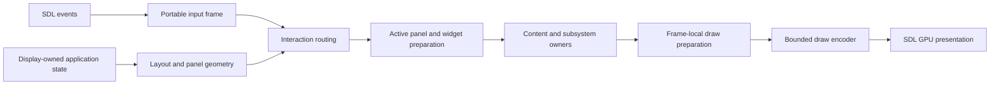
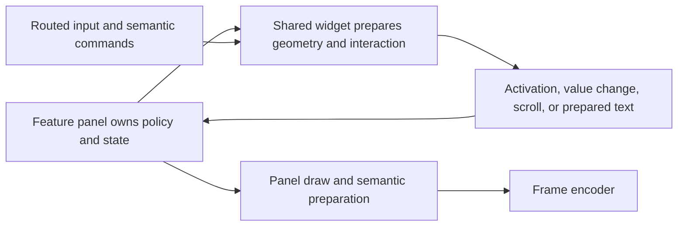
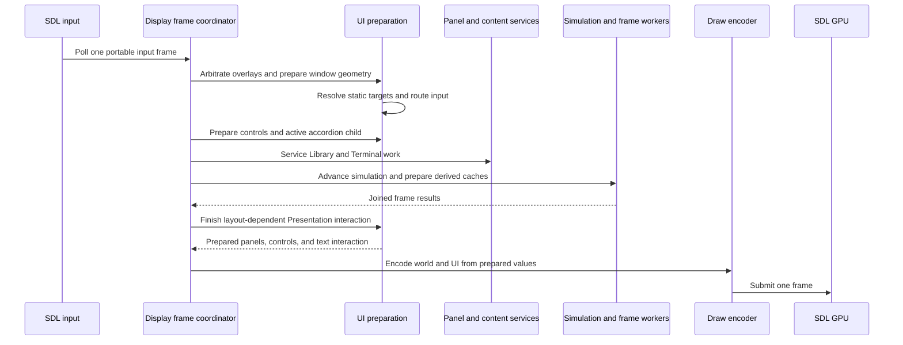
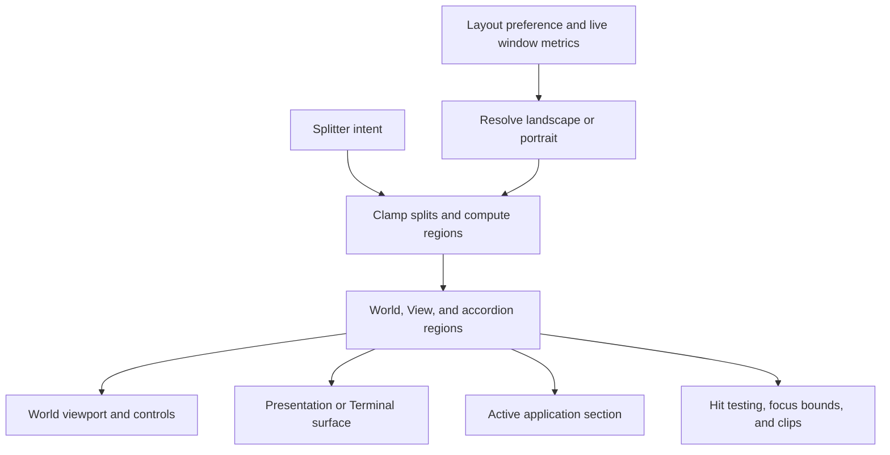
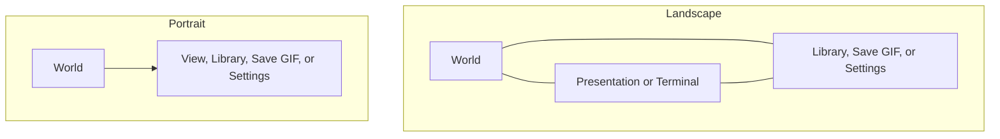
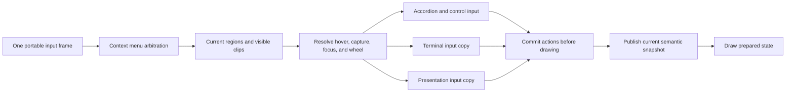
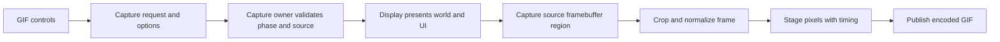

# UI System

> Euclid's UI system turns window geometry and routed input into an interactive
> application surface: it lays out the world and panels, composes reusable widgets,
> manages focus, and prepares the frame for rendering.

## Table Of Contents

1. [How The UI Grew](#how-the-ui-grew)
1. [The System At A Glance](#the-system-at-a-glance)
1. [Widgets: Shared Interaction Building Blocks](#widgets-shared-interaction-building-blocks)
1. [How A Frame Becomes A UI](#how-a-frame-becomes-a-ui)
1. [Layout And Panel Composition](#layout-and-panel-composition)
1. [Input, Capture, And Focus](#input-capture-and-focus)
1. [Choose A Route By Task](#choose-a-route-by-task)
1. [Changing The UI](#changing-the-ui)

## How The UI Grew

Euclid was first explored in Julia, GLMakie, and Jupyter notebooks. The desktop
application grew separately from Odin experiments, first using Raylib and later moving
to SDL. The UI followed that transition from Odin/Raylib to Odin/SDL.

The earliest application UI was a handful of controls drawn in a standard order: an
animation list at the side, text along the bottom, and a small toolbar above the Library
list. Settings and GIF controls joined that same right-hand space. As the application
grew, a single sequence of controls became a more organized UI system:

- reusable widgets separated common geometry and pointer behavior from panel policy;
- layout owners began deriving panel and splitter geometry from the current window;
- routed input and semantic focus replaced ad-hoc control checks in each drawing path;
- right-side controls became the active sections of an accordion;
- presentation text, localized shell labels, transitions, and capture acquired clearer
  ownership boundaries;
- Terminal became a full interactive surface integrated into View, rather than another
  ordinary widget.

The result is intentionally a hybrid. Most UI geometry is prepared anew from current
state, while selected interaction facts persist between frames. It is neither a
fully-retained widget tree nor a collection of draw calls with no state model. This
history helps explain why layout, preparation, service updates, and drawing live in
different parts of the view packages.

## The System At A Glance

Euclid's UI is the display-owned layer that makes the application usable: it arranges
the world, View, and side panels; provides reusable controls; routes pointer and
keyboard interaction; and connects those controls to the state-owning features. It is
more than drawing, but it is not one monolithic widget tree. Layout, shared widgets,
feature panels, and rendering cooperate while keeping their state with the subsystem
that owns it.

The display thread owns visible UI state and native drawing. The UI receives current
application state and one portable input frame, prepares frame-local geometry and
interaction results, commits actions to the owning subsystem, then encodes the prepared
result.

```mermaid
flowchart LR
    Device[SDL events] --> Input[Portable input frame]
    State[Display-owned application state] --> Layout[Layout and panel geometry]
    Input --> Route[Interaction routing]
    Layout --> Route
    Route --> Panels[Active panel and widget preparation]
    Panels --> Services[Content and subsystem owners]
    Services --> Prepared[Frame-local draw preparation]
    Prepared --> Encoder[Bounded draw encoder]
    Encoder --> GPU[SDL GPU presentation]
```

### Who owns what

| Concern | Owner | What crosses into the UI |
| --- | --- | --- |
| Frame order and composition | [`frame.odin`](../../../src/view/frame.odin) | Current application state and display services |
| Device polling and portable event facts | [`src/view/input/`](../../../src/view/input/) | One `Input_Frame`, with event storage borrowed for that frame |
| Layout, panels, widgets, and persistent UI interaction | [`src/view/ui/`](../../../src/view/ui/) | Display-owned state, routed input, prepared values |
| Animation catalogue and search | [`src/view/ui/library/`](../../../src/view/ui/library/) plus content service | IDs, copied labels, and bounded query results |
| Terminal state and interactive protocol | [`src/view/terminal/`](../../../src/view/terminal/) | Routed input, prepared terminal frame, draw requests |
| Font faces and shaping/raster publication | [`src/view/font/`](../../../src/view/font/) | Font capabilities and generation-aware prepared text |
| Capture policy and framebuffer/GIF lifecycle | [`src/view/capture/`](../../../src/view/capture/) | Capture state and framebuffer operations |
| Native drawing and presentation | [`src/view/native/`](../../../src/view/native/) | Bounded encoder commands consumed on the display thread |

The UI's persistent records are not the owners of every visible domain. For example,
the UI stores the active accordion section and the Presentation scroll offset, but
Terminal retains its own grid, scrollback, and editor state; Dynview retains compiled
presentation data; capture retains GIF phase and encoder state. The UI composes these
owners without merging their lifetimes.

Workers may prepare bounded derived results, such as simulation or text caches. The
display owner joins accepted work before consuming its results. See
[Architecture Summary](ArchitectureSummary.md) for the process-wide execution model.

## Widgets: Shared Interaction Building Blocks

The UI has a defined reusable widget layer under
[`src/view/ui/widgets/`](../../../src/view/ui/widgets/). These are the common controls
used to build the application panels—not merely drawing helpers or a possible future
abstraction. They provide reusable geometry and interaction behavior so a panel can
concentrate on what its controls mean.

| Widget family | Examples and route |
| --- | --- |
| Buttons | Text buttons, icon buttons, and ordinary activation: [`text_button.odin`](../../../src/view/ui/widgets/text_button.odin), [`icon_button.odin`](../../../src/view/ui/widgets/icon_button.odin), [`button.odin`](../../../src/view/ui/widgets/button.odin) |
| Choice and disclosure | Checkboxes and expandable controls: [`checkbox.odin`](../../../src/view/ui/widgets/checkbox.odin), [`disclosure.odin`](../../../src/view/ui/widgets/disclosure.odin) |
| Value entry | Text input, ranges, and sliders: [`input_box.odin`](../../../src/view/ui/widgets/input_box.odin), [`range.odin`](../../../src/view/ui/widgets/range.odin), [`sliders.odin`](../../../src/view/ui/widgets/sliders.odin) |
| Collections and scrolling | List items, scroll containers, and treeview primitives: [`list_item.odin`](../../../src/view/ui/widgets/list_item.odin), [`scroll.odin`](../../../src/view/ui/widgets/scroll.odin), [`treeview/`](../../../src/view/ui/widgets/treeview/) |
| Composition and display | Containers and text panels: [`container.odin`](../../../src/view/ui/widgets/container.odin), [`text_panel.odin`](../../../src/view/ui/widgets/text_panel.odin) |

Typical use follows this path:

```mermaid
flowchart LR
    Panel[Feature panel owns policy and state] --> Widget[Shared widget prepares geometry and interaction]
    Input[Routed input and semantic commands] --> Widget
    Widget --> Result[Activation, value change, scroll, or prepared text]
    Result --> Panel
    Panel --> Prepared[Panel draw and semantic preparation]
    Prepared --> Encoder[Frame encoder]
```

A widget usually receives geometry, routed input, and the relevant state or descriptor;
it returns an action/update and prepared geometry for the caller. The owning panel
decides what an activation or changed value means, updates its state, and participates
in semantic publication and drawing. The exact contract varies by widget: for example,
an input box edits caller-owned bounded text storage, while the button helper converges
pointer activation with addressed semantic activation.

This division is useful when extending the UI: add common control mechanics to the
widget layer when multiple callers can share them; keep feature policy in the owning
panel. The Library tree is a notable specialization: it uses treeview primitives, but
the Library still owns its production tree preparation, motion, and drawing integration.

## How A Frame Becomes A UI

A frame is split into preparation and presentation. The preparation path may update
state and consume input; the draw path consumes the prepared results and encodes
geometry. The boundary prevents drawing the same prepared frame twice from repeating a
button action or input commit.

```mermaid
sequenceDiagram
    participant SDL as SDL input
    participant Frame as Display frame coordinator
    participant UI as UI preparation
    participant Services as Panel and content services
    participant Sim as Simulation and frame workers
    participant Draw as Draw encoder
    participant GPU as SDL GPU

    SDL->>Frame: Poll one portable input frame
    Frame->>UI: Arbitrate overlays and prepare window geometry
    UI->>UI: Resolve static targets and route input
    Frame->>UI: Prepare controls and active accordion child
    Frame->>Services: Service Library and Terminal work
    Frame->>Sim: Advance simulation and prepare derived caches
    Sim-->>Frame: Joined frame results
    Frame->>UI: Finish layout-dependent Presentation interaction
    UI-->>Frame: Prepared panels, controls, and text interaction
    Frame->>Draw: Encode world and UI from prepared values
    Draw->>GPU: Submit one frame
```

This diagram is the conceptual ordering; the application coordinator is the authority
for exact calls. Start at
[`prepare_sdl_frame`](../../../src/view/frame.odin), then follow
[`prepare_ui_geometry`](../../../src/view/ui/geometry.odin),
[`prepare_ui_controls`](../../../src/view/ui/controls.odin), and
[`prepare_and_finish_ui_layout`](../../../src/view/ui/controls.odin). Drawing proceeds
through `encode_sdl_geometry_frame` in `frame.odin` and the panel encoders in
[`ui.odin`](../../../src/view/ui/ui.odin).

The phases answer different questions:

| Phase | Question it answers | Representative owner |
| --- | --- | --- |
| Poll | What device events occurred this frame? | SDL input adapter |
| Geometry | What are the current regions, splits, and clips? | UI layout |
| Static routing | Which visible surface owns pointer, wheel, or keyboard input? | UI interaction router |
| Control preparation | What widget actions and panel intents follow from that input? | Widget and active-panel owners |
| Services | What domain work must be processed before drawing? | Library, Terminal, settings, presentation |
| Derived preparation | What worker-built state is needed to render this frame? | Simulation and text preparation |
| Layout-dependent interaction | What can only be resolved after authoritative content layout exists? | Presentation and Dynview UI |
| Encoding and present | What prepared geometry is submitted? | Display thread |

One ordering dependency is especially useful when investigating UI bugs: splitters and
window metrics update before panel regions and Dynview tracking; interaction uses those
regions; then simulation and Dynview preparation run; finally layout-dependent
Presentation scrolling and selection use the resulting layout. A symptom that appears
one frame late often means a producer and consumer are on opposite sides of this
boundary.

## Layout And Panel Composition

`Ui_Regions` is the shared spatial vocabulary for the application. The region calculator
derives the world and application panels from the current logical window extent and
split intent. These regions are consumed by input hit testing, viewport fitting, content
tracking, clipping, and drawing—not only by panel painting.

```mermaid
flowchart TB
    Preference[Layout preference and live window metrics] --> Resolve[Resolve landscape or portrait]
    Split[Splitter intent] --> Compute[Clamp splits and compute regions]
    Resolve --> Compute
    Compute --> Regions[World, View, and accordion regions]
    Regions --> World[World viewport and controls]
    Regions --> View[Presentation or Terminal surface]
    Regions --> Accordion[Active application section]
    Regions --> Input[Hit testing, focus bounds, and clips]
```

The two layouts arrange those same application concerns differently:

```mermaid
flowchart TB
    subgraph Landscape
        LWorld[World]
        LView[Presentation or Terminal]
        LAccordion[Library, Save GIF, or Settings]
        LWorld --- LView
        LWorld --- LAccordion
        LView --- LAccordion
    end
    subgraph Portrait
        PWorld[World]
        PAccordion[View, Library, Save GIF, or Settings]
        PWorld --> PAccordion
    end
```

In landscape, the world and View share the left side while the accordion fills the right.
In portrait, the world occupies the upper region and View becomes an accordion section
alongside Library, Save GIF, and Settings. The application keeps separate layout intent
for the two modes; changing orientation need not destroy the other mode's split and
section choice.

The accordion has one logically active section. During an animated transition, an
outgoing section may remain visible as a clipped render-only tail, but it is not a
second interactive panel. This is important for focus and input: visual overlap does
not imply multiple controls own the same frame.

Useful layout entry points:

| Question | Owning source |
| --- | --- |
| How are regions derived and validated? | [`layout/regions/layout.odin`](../../../src/view/ui/layout/regions/layout.odin) |
| How are splitter interactions and ratios handled? | [`layout/splitter/`](../../../src/view/ui/layout/splitter/) |
| How are accordion sections and reveal clips prepared? | [`layout/accordion/`](../../../src/view/ui/layout/accordion/) |
| Where do those regions feed viewport and Dynview layout? | [`geometry.odin`](../../../src/view/ui/geometry.odin) |
| Where is composition selected and drawn? | [`composition.odin`](../../../src/view/ui/composition.odin), [`ui.odin`](../../../src/view/ui/ui.odin) |

When changing a region, follow all of its consumers. A split change can affect world
projection, presentation wrapping, Terminal geometry, pointer routing, accessibility
bounds, and the source area used for GIF capture.

## Input, Capture, And Focus

Device events are polled once and translated into an `Input_Frame`. UI routing turns
that frame into focused copies for the owners that need it. Filtering matters: a
pointer press intended for a splitter or popup should not also activate an accordion
child or the drawing world.

```mermaid
flowchart LR
    Raw[One portable input frame] --> Popup[Context menu arbitration]
    Popup --> Geometry[Current regions and visible clips]
    Geometry --> Router[Resolve hover, capture, focus, and wheel]
    Router --> Controls[Accordion and control input]
    Router --> Terminal[Terminal input copy]
    Router --> Presentation[Presentation input copy]
    Controls --> Commit[Commit actions before drawing]
    Terminal --> Commit
    Presentation --> Commit
    Commit --> Semantics[Publish current semantic snapshot]
    Semantics --> Draw[Draw prepared state]
```

The route is not a generic broadcast. Top-level hit testing chooses the visible
target; surface-specific filters then preserve only the input facts that surface may
consume. Existing capture takes precedence over current hover so a drag or release
does not jump to whichever control happens to be under the pointer now.

Three concepts are easy to conflate:

| Concept | Meaning | Owner |
| --- | --- | --- |
| Hover target | Topmost control or surface under the current pointer sample | UI interaction router |
| Press capture | One pointer transaction that keeps ownership through movement and release | Shared `Ui_Press_Owner_State` |
| Semantic focus | Persistent logical focus and addressed keyboard/accessibility actions | Semantic focus state |

Terminal protocol mouse capture is a fourth, separate mechanism. A Terminal child may
own mouse behavior inside the terminal emulator while the UI still routes the overall
surface. Avoid adding a single "focused" or "captured" boolean to stand in for all four
concepts.

Keyboard traversal and semantic actions operate on a prepared snapshot of visible
controls. That snapshot carries stable identities, roles, bounds, clips, labels, and
available actions; owners publish the snapshot after preparing controls. Accessibility
adapters consume the semantic model through their own display-owned boundary. For
platform capabilities and limitations, see the [Accessibility guide](Accessibility.md).

Follow this path when debugging an event that disappears or reaches the wrong place:

1. Check event translation and the single-poll contract in [`src/view/input/`](../../../src/view/input/).
2. Inspect top-level hover, capture, and wheel arbitration in [`interaction.odin`](../../../src/view/ui/interaction.odin).
3. Check focused frame copies and control ordering in [`controls.odin`](../../../src/view/ui/controls.odin).
4. Follow the target owner: a widget, Library, Presentation, or the Terminal facade.
5. Check semantic registration separately if pointer behavior works but keyboard or
   accessibility behavior does not.

## Choose A Route By Task

### A particular panel or feature

The application-level panel composition is in
[`ui.odin`](../../../src/view/ui/ui.odin) and
[`composition.odin`](../../../src/view/ui/composition.odin). The selected section owns
its interaction and domain-specific controls:

| Task | Start here | Deeper owner |
| --- | --- | --- |
| Search and browse animations | [`library/`](../../../src/view/ui/library/) | Content service at [`src/view/content/`](../../../src/view/content/) |
| Change application settings | [`settings/`](../../../src/view/ui/settings/) | Typed settings at [`src/settings/`](../../../src/settings/) |
| Configure or start a GIF | [`gif/`](../../../src/view/ui/gif/) | Capture policy at [`src/view/capture/`](../../../src/view/capture/) |
| Show authored animation text | [`presentation/`](../../../src/view/ui/presentation/) | Dynview compiler and [`src/dynview/`](../../../src/dynview/) |
| Use the interactive Terminal | [`terminal/`](../../../src/view/ui/terminal/) | [Terminal Architecture](TerminalArchitecture.md) |
| Refresh or pause/play an animation | [`animation/`](../../../src/view/ui/animation/) | Animation policy and bridge |
| Tooltip or context menu | [`overlay/`](../../../src/view/ui/overlay/) | UI routing and display input |

The general UI composes the panels; it does not own all their data. For example,
Library search results originate in the content service, Terminal state belongs to its
session subsystem, and GIF capture phase belongs to capture policy. Follow a feature
past its panel adapter to the state owner before changing persistence, threading, or
lifecycle.

### Reusable controls and scrolling

The [widget layer](#widgets-shared-interaction-building-blocks) provides shared
geometry and interaction mechanics. Panel owners apply those results to settings,
search, scroll offsets, or capture configuration. This keeps a button or slider from
importing the application coordinator merely to implement a press.

Scroll containers combine content extent, viewport geometry, wheel routing, scrollbar
capture, and clipping. They are shared by the tree and text surfaces, but the content
and scroll state stay with their respective owners. Start at
[`widgets/scroll.odin`](../../../src/view/ui/widgets/scroll.odin); then trace the caller
in `library/`, `presentation/`, or the Terminal facade.

Treeview contracts and primitives live in
[`widgets/treeview/`](../../../src/view/ui/widgets/treeview/). The Library continues to
own its production tree preparation, motion, and draw integration; do not assume the
primitive package is the sole owner of the Library tree.

### Text, fonts, and localization

Several kinds of text appear in the interface, and their ownership differs:

| Text kind | Examples | Route |
| --- | --- | --- |
| Shell labels | Accordion headers, control labels, accessible names | [`src/view/messages/`](../../../src/view/messages/) and [Localization And Editions](Localization.md) |
| Authored View content | Animation prose and mathematics | [`presentation/`](../../../src/view/ui/presentation/), [`src/dynview/`](../../../src/dynview/), [LaTeX Support](LaTeXSupport.md) |
| Terminal cells and prompt | Interactive Julia or shell output | [`src/view/terminal/`](../../../src/view/terminal/) and [Terminal Architecture](TerminalArchitecture.md) |
| Glyph preparation and shaping | Font faces, glyph residency, shaping identity | [`src/view/font/`](../../../src/view/font/) and [Font Rasterization](FontRasterization.md) |

UI text measurement and drawing helpers live under
[`text/`](../../../src/view/ui/text/); common palette and visual metrics live under
[`theme/`](../../../src/view/ui/theme/). These helpers route text to the right font
capability but do not make all text sources share a lifetime.

### Capture and the rendered frame

The GIF controls are ordinary UI; capture is not. The capture subsystem owns phase,
timing, framebuffer acquisition, normalization, and encoding. The current GIF source is
the world/view region, not the surrounding UI. The distinction is visible in the path:

```mermaid
flowchart LR
    Panel[GIF controls] --> Request[Capture request and options]
    Request --> Policy[Capture owner validates phase and source]
    Policy --> Present[Display presents world and UI]
    Present --> Readback[Capture source framebuffer region]
    Readback --> Normalize[Crop and normalize frame]
    Normalize --> Encoder[Stage pixels with timing]
    Encoder --> File[Publish encoded GIF]
```

Start at [`gif_panel.odin`](../../../src/view/ui/gif/gif_panel.odin) for the UI and
[`gif.odin`](../../../src/view/capture/gif.odin) for policy. Readback and native encoding
are under [`src/view/capture/backend/`](../../../src/view/capture/backend/). Splitter
changes can be locked while capture framing is active, so layout and capture must be
considered together.

### Startup presentation

Before normal view resources are ready,
[`loading.odin`](../../../src/view/loading.odin) draws a lightweight startup
presentation. [`startup_outline.odin`](../../../src/view/startup/startup_outline.odin)
derives its fixed geometry from the normal layout helpers, but does not depend on
initialized fonts or ordinary panel runtime state. It is a separate startup route, not
the first normal UI frame.

## Changing The UI

Use this as an investigation path, not a checklist that replaces local code and tests:

| Change | Inspect together |
| --- | --- |
| Add or move a panel | `ui.odin`, `composition.odin`, accordion descriptors/layout, active-panel preparation, draw dispatch, semantic labels |
| Change a split or orientation | region calculation, splitter intent, world viewport fit, Dynview tracking, Terminal geometry, capture framing |
| Add a widget interaction | widget preparation, stable identity, routed input copy, owner state update, semantic registration, focused tests |
| Change keyboard or accessibility behavior | semantic snapshot registration, focus reconciliation, event claiming, platform adapter behavior |
| Change displayed text | source owner (shell message, Dynview, Terminal), font capability, clipping/scrolling, and generation lifetime |
| Change GIF interaction | GIF panel, capture status/policy, framebuffer source, splitter lock, shutdown path |

Relevant tests:

| Concern | Useful tests |
| --- | --- |
| Region, interaction routing, widgets, and scrolling | [`ui_test.odin`](../../../src/view/ui/ui_test.odin) |
| Semantic focus | [`focus_test.odin`](../../../src/view/ui/focus_test.odin) |
| Accordion and tree transitions | [`accordion_transition_test.odin`](../../../src/view/ui/accordion_transition_test.odin), [`tree_transition_test.odin`](../../../src/view/ui/tree_transition_test.odin) |
| Dynview selection and text helpers | [`selection_test.odin`](../../../src/view/ui/dynview/selection_test.odin), [`text_test.odin`](../../../src/view/ui/text/text_test.odin) |
| Portable input behavior | [`input_test.odin`](../../../src/view/input/input_test.odin) |
| Framebuffer capture mechanics | [`framebuffer_test.odin`](../../../src/view/capture/framebuffer_test.odin) |

Scenario evidence is useful when correctness depends on frame ordering, interaction
commit, capture, or shutdown. See [Testing Strategy](TestingStrategy.md) for selecting
the appropriate evidence; a screenshot alone does not establish that an interaction
completed successfully.

## Boundaries Worth Keeping In Mind

- Poll device input once per frame; route copies rather than letting each panel repoll.
- Keep pointer hover, press capture, semantic focus, and Terminal protocol capture
  distinct.
- Let layout prepare geometry shared by hit testing, clipping, content layout, and draw.
- Keep persistent state with the subsystem whose lifetime it describes.
- Let reusable widgets return interaction results; let panel owners apply policy.
- Commit actions before drawing; the encoder consumes prepared state.
- Join worker-produced data before the display consumes or publishes it.

This guide is a map into the current system, not a second implementation specification.
For normative code practices use [Coding Standards](CodingStandards.md); for the
application-wide ownership model use [Architecture Summary](ArchitectureSummary.md).
