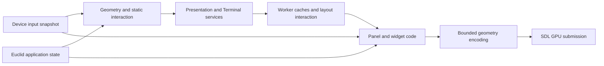
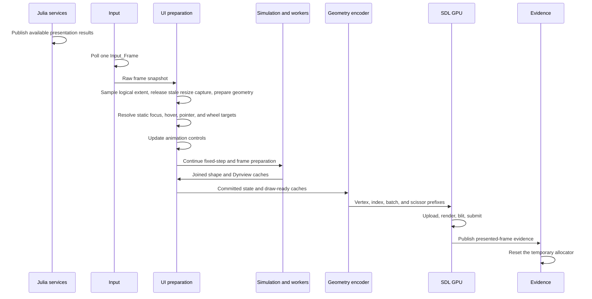
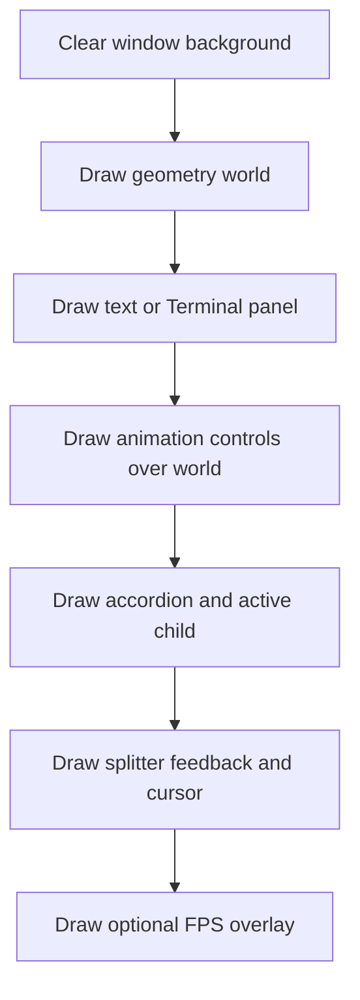
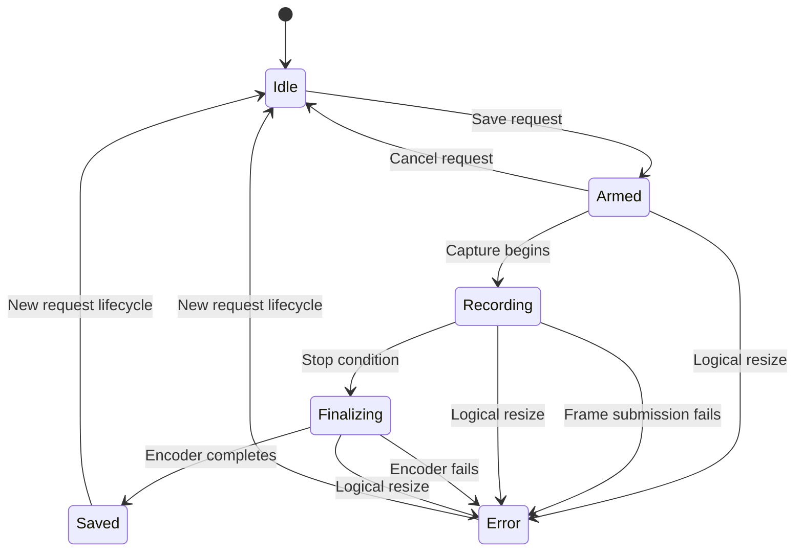

# UI System

## Table Of Contents

1. [Purpose And Scope](#purpose-and-scope)
1. [System Model](#system-model)
1. [Source Map](#source-map)
1. [Ownership Model](#ownership-model)
1. [Frame Lifecycle](#frame-lifecycle)
1. [Startup Assembly](#startup-assembly)
1. [Window And Layout](#window-and-layout)
1. [Panel Composition](#panel-composition)
1. [UI Runtime State](#ui-runtime-state)
1. [Input Model](#input-model)
1. [Press Ownership](#press-ownership)
1. [Semantic Focus](#semantic-focus)
1. [Interaction Routing](#interaction-routing)
1. [Widgets](#widgets)
1. [Scrolling](#scrolling)
1. [Presentation Panel](#presentation-panel)
1. [Terminal Panel](#terminal-panel)
1. [Accordion And Animation Controls](#accordion-and-animation-controls)
1. [Fonts And Text Drawing](#fonts-and-text-drawing)
1. [GIF Capture Coordination](#gif-capture-coordination)
1. [Allocation And Lifetime](#allocation-and-lifetime)
1. [Verification](#verification)
1. [Current Limitations](#current-limitations)
1. [Change Guide](#change-guide)
1. [Correctness Invariants](#correctness-invariants)

## Purpose And Scope

Euclid's UI is the display-thread-owned layer that turns application state into one
window containing the geometry world, presentation or Terminal content, animation
catalogue, settings, GIF controls, and shared panel chrome.

This guide documents the current implementation. It focuses on:

- frame ordering and display-thread ownership;
- fixed or resizable landscape panel layout and splitter behavior;
- input snapshots, widget interaction, and shared press capture;
- presentation, Terminal, accordion, animation controls, settings, and GIF composition;
- scrolling, text selection, clipboard publication, fonts, and drawing;
- current verification surfaces and architectural limitations.

It deliberately does not describe shape construction, constraint solving, particle
simulation, animation authoring, Dynview parsing, or terminal emulation in depth. Those
subsystems have their own owners and documentation. The UI consumes their prepared or
committed state and controls where it is visible.

Related guides are:

- [ArchitectureSummary.md](ArchitectureSummary.md) for process-wide ownership and
  execution roles;
- [TerminalArchitecture.md](TerminalArchitecture.md) for terminal protocols, sessions,
  grids, graphics, and Julia policy;
- [AnimationsStyle.md](AnimationsStyle.md) for visual and motion conventions;
- [LaTeXSupport.md](LaTeXSupport.md) for authored Dynview document and math syntax;
- [ToolRendering.md](ToolRendering.md) for pen and compass rendering details.

## System Model

The UI is not a separate thread or an independent retained widget runtime. It is a set
of Odin packages called by the display loop. The same display thread owns layout,
interaction state, visible application state, native resources, geometry encoding, and
draw submission.


```mermaid
flowchart LR
    Input[Device input snapshot]
    State[Euclid application state]
    Layout[Geometry and static interaction]
    Services[Presentation and Terminal services]
    Prepare[Worker caches and layout interaction]
    Panels[Panel and widget code]
    Draw[Bounded geometry encoding]
    Submit[SDL GPU submission]

    Input --> Layout
    State --> Layout
    Layout --> Services
    Services --> Prepare
    State --> Panels
    Input --> Panels
    Prepare --> Panels
    Panels --> Draw
    Draw --> Submit
```

The UI combines immediate geometry preparation with persistent interaction fields in
`Euclid_Ui_Runtime_State`. Update procedures compute widget rectangles, consume routed
frame copies, and commit display-owned state before encoding. Active draw procedures
append portable vertices, indices, clips, and batch state to fixed-capacity storage.

This is a hybrid model:

| Property | Current behavior |
| --- | --- |
| Widget geometry | Recomputed from panel rectangles each frame. |
| Widget state | Stored in application, subsystem, or UI runtime state. |
| Input | One borrowed raw snapshot filtered into per-surface value copies. |
| Drawing | Owner-local bounded geometry encoding and one SDL_GPU submission. |
| Layout caches | Dynview, font, shape, and Terminal owners retain derived state. |
| Cross-thread work | Workers prepare finite results; the display commits and draws. |

## Source Map

| Area | Primary files | Responsibility |
| --- | --- | --- |
| Window and frame loop | `src/view/view.odin` | Window lifecycle, frame order, world and panel drawing. |
| Startup presentation | `src/view/loading.odin`, `src/view/startup_outline.odin` | Loading milestones, reference UI silhouette, warning, and ready handoff. |
| Shared UI entry point | `src/view/ui/ui.odin` | Constants, frame preparation, panel draw dispatch. |
| Region layout | `src/view/ui/layout.odin` | Clamp and derive all panel rectangles. |
| Splitters | `src/view/ui/splitter.odin` | Prepared axis ranges, resize capture, owner commit, fade, and cursor. |
| Containers | `src/view/ui/container.odin` | Clamped fill, border, and inner geometry. |
| Scrolling | `src/view/ui/scroll.odin` | Viewport, wheel, thumb geometry, capture, scissor, and draw. |
| Presentation panel | `src/view/ui/text_panel.odin` | Dynview/fallback dispatch, scrolling, selection, and clipboard publication. |
| Dynview UI | `src/view/ui/dynview/` | Layout drawing, selection geometry, and styled presentation. |
| Terminal facade | `src/view/ui/terminal.odin` | Terminal panel layout, scroll container, and draw calls. |
| Terminal service | `src/view/terminal_service.odin` | Terminal lifecycle, input update, Julia messages, and links. |
| Terminal rendering | `src/view/terminal/` | Grid, prompt, selection, links, attachments, and overlays. |
| Accordion | `src/view/ui/accordion.odin` | Section layout, header interaction, and one-expanded-section policy. |
| Accordion children | `src/view/ui/tree_panel.odin` | Accordion orchestration plus catalogue traversal, reveal, and scrolling. |
| Animation controls | `src/view/ui/animation_controls.odin` | World-anchored refresh and pause/play interaction and drawing. |
| Utility panels | `settings_panel.odin`, `gif_panel.odin` | Runtime settings and GIF controls. |
| Basic widgets | `*button.odin`, `checkbox.odin`, `sliders.odin`, `range.odin` | Prepared actions, geometry, bounded values, and visuals. |
| Input boundary | `src/view/input/` | Device polling, event storage, hotkeys, and Terminal encoding. |
| Font service | `src/view/font/` | Face preparation, publication, lookup, and shaping identity. |
| Shared state | `src/view/model/model.odin` | UI regions, press owner, interaction, selection, and GIF state. |

## Ownership Model

The display thread is the sole writer of visible UI state and the only execution role
allowed to call SDL_GPU drawing and resource APIs.

| Concern | Owner | Boundary |
| --- | --- | --- |
| SDL window and GPU resources | Display thread | Initialized and destroyed by the active view lifecycle. |
| Panel geometry | `Euclid_Ui_Runtime_State` | Computed before drawing each frame. |
| Widget press state | UI runtime or owning subsystem | Mutated only by display-thread UI calls. |
| Device frame storage | `input.Input_Runtime` | Borrowed until the next input poll. |
| Animation catalogue | Julia interface mirrored in Odin | Tree reads and requests changes; it does not run Julia. |
| Dynview content | Dynview system and compile cache | Prepared before display consumption. |
| Terminal cells and selection | Display-owned `Terminal_State` | Children send bounded messages or bytes. |
| Font atlases | Display-owned font cache | CPU preparation may run on workers; publication is display-owned. |
| World render packets | Shape and simulation owners | UI supplies viewport geometry and invokes drawing. |
| GIF state and capture | Display-owned GIF coordinator | UI requests actions; capture commits after presentation. |

The UI may call application services, such as animation reset or GIF capture, but it
does not bypass their ownership. An animation-control or accordion-child click sets
display-owned request state; the normal frame and service paths perform the operation.

## Frame Lifecycle

`run_sdl_geometry_frame` defines the active authoritative ordering. The dormant
`run_window_frame` retains the fuller text, Terminal, tools, dust, and capture behavior
until those visual capabilities receive SDL owners.


```mermaid
sequenceDiagram
    participant F as Julia services
    participant I as Input
    participant U as UI preparation
    participant S as Simulation and workers
    participant D as Geometry encoder
    participant G as SDL GPU
    participant E as Evidence

    F->>F: Publish available presentation results
    I->>I: Poll one Input_Frame
    I->>U: Raw frame snapshot
    U->>U: Sample logical extent, release stale resize capture, prepare geometry
    U->>U: Resolve static focus, hover, pointer, and wheel targets
    U->>U: Update animation controls
    U->>S: Continue fixed-step and frame preparation
    S->>U: Joined shape and Dynview caches
    U->>D: Committed state and draw-ready caches
    D->>G: Vertex, index, batch, and scissor prefixes
    G->>G: Upload, render, blit, submit
    G->>E: Publish presented-frame evidence
    E->>E: Reset the temporary allocator
```

The active high-level order is:

1. publish available Julia presentation state;
1. service presentation parsing and publication;
1. poll SDL once and publish one device-independent `Input_Frame`;
1. call `ui.prepare_ui_geometry`;
1. call `ui.prepare_ui_static_interaction`;
1. prepare animation-control interaction;
1. advance fixed-step simulation;
1. run and join frame preparation that depends on the new UI geometry;
1. encode ordinary world, UI, and non-glyph Dynview geometry;
1. upload, render to the sampled scene target, blit, and submit once;
1. service post-presentation scenarios;
1. publish frame evidence and reset `context.temp_allocator`.

Three ordering details are especially important:

- splitter changes happen before `Ui_Regions` and Dynview panel tracking;
- a logical resize releases stale UI capture before frame capture is snapshotted;
- without a resize, capture identity from frame start survives widget release updates;
- static routing and geometry-known controls precede Terminal processing;
- Terminal scrollbar geometry refines the static panel target before input consumption;
- presentation scrolling, copy targets, and selection update after authoritative
    Dynview layout exists and before drawing begins;
- drawing consumes prepared records and does not commit UI interaction or actions.

The second detail is a current limitation discussed below.

## Startup Assembly

The display thread opens the SDL window before packaged assets, Julia content, and
normal UI resources are ready. During that interval, `loading.odin` pumps window events
and draws a dependency-free representation of the eventual interface. It does not enter
the normal frame lifecycle or access application-owned widget state.

`startup_outline.odin` builds one fixed-capacity sequence of line segments from the
same pure layout helpers used by the resolved live UI. The sequence traces the world,
presentation, accordion, accordion-header, and animation-control boundaries. It stores
no dynamic memory and requires no font cache, texture, Julia state, or initialized
presentation runtime.

Every startup frame samples the live logical extent and resolves layout with the normal
forced-mode or automatic hysteresis policy. A size or orientation change rebuilds the
fixed-capacity geometry while preserving both revealed and milestone target fractions
of total outline length. The normal UI therefore inherits the composition assembled
during startup without a reference-size handoff.

The assembling outline is the normal startup progress indicator; there is no separate
spinner or progress bar. Its reveal target follows the coarse startup milestones:

| Target | Startup phase |
| ---: | --- |
| 15% | Packaged assets |
| 35% | Julia runtime initialization |
| 65% | Julia content initialization |
| 85% | Fonts and graphics |
| 100% | All runtime owners ready |

The outline advances at a stable rate but never beyond the current milestone. These
targets communicate phase progress rather than estimated remaining time. Once startup
is actually ready, a bounded 240-millisecond ease-out completes the remaining trace and
the normal frame loop replaces it with the real UI.

The startup path currently contains no glyph dependency; warning text remains a
deferred text capability until font publication moves to the active backend.

## Window And Layout

### Window Policy

The default window remains fixed at `1280x720`. Startup policy may instead request a
landscape or portrait-sized preset, bounded custom dimensions, and an opt-in resizable
window. `sdl_platform_create` applies the requested initial extent and enables SDL
resizing only for `--window-mode=resizable`. Layout preference is stored
independently as Auto, Landscape, or Portrait. Forced modes remain fixed. Auto enters
portrait below aspect ratio `0.9`, enters landscape above `1.1`, and retains its current
mode inside that hysteresis band.

Each normal frame samples SDL's logical window extent before UI routing.
Those dimensions become `Euclid_Ui_Runtime_State.window` and are authoritative for
region calculation, splitter geometry, panel fills, hit testing, viewport fitting,
Dynview tracking, and Terminal panel preparation. Framebuffer dimensions remain a
capture concern and do not drive UI layout.

The baseline starts with:

| Constant | Value | Meaning |
| --- | ---: | --- |
| `WINDOW_WIDTH` | 1280 | Default and reference logical width. |
| `WINDOW_HEIGHT` | 720 | Default and reference logical height. |
| `VIEW_WIDTH` | 900 | Initial vertical split position. |
| `VIEW_HEIGHT` | 500 | Initial horizontal split position. |
| `WORLD_MIN_WIDTH` | 320 | Minimum world-side width. |
| `WORLD_MIN_HEIGHT` | 240 | Minimum world-side height. |
| `RIGHT_PANEL_MIN_WIDTH` | 240 | Minimum right-side width. |
| `BOTTOM_PANEL_MIN_HEIGHT` | 140 | Minimum presentation height. |

### Regions

`compute_ui_regions` accepts the resolved layout mode, live logical extent, and split
positions. Landscape clamps both axes and fills this topology:

```text
+------------------------------+-------------------+
|                              |                   |
|          world_rect          |  accordion_rect   |
|                              |                   |
+------------------------------+                   |
|          text_rect           |                   |
|   Dynview or Terminal view   |                   |
+------------------------------+-------------------+
```

`accordion_rect` is the complete right-side region. The accordion derives three
full-width headers and one flexible content rectangle inside it; only the active child
receives that content rectangle. `terminal_rect` is a clamped inset of the text region.
Panel drawing applies additional container borders and padding where required.

Portrait uses a full-width world above a full-width accordion:

```text
+--------------------------------------------------+
|                    world_rect                    |
+--------------------------------------------------+
|                 accordion_rect                   |
+--------------------------------------------------+
```

Portrait derives `text_rect` from the content geometry of its first View descriptor;
`terminal_rect` remains the same clamped inset of that region. Expanding View renders
the existing Presentation or Terminal surface there. Collapsed View content does not
receive interactive preparation, interaction, or focus. During accordion collapse,
a bounded render-only tail may draw current owner data behind the shrinking clip.
Its Presentation state and selected Terminal generation remain owned by their existing
subsystems for the next expansion.

### Presentation Visibility

The display publishes one `presentation_visible` fact after layout resolution and after
an accordion section commit. Landscape always publishes visible; portrait publishes
visible only while View is active. Presentation and Terminal consumers read that fact
rather than independently deriving composition state.

Hiding View clears Presentation or Terminal pointer capture, drag transactions, and
effective focus, including one Terminal focus-out transition. It retains Presentation
scroll and selection, Dynview documents, Terminal scrollback and editor state, and the
selected Terminal generation. Reopening View does not synthesize focus; an ordinary
press inside its content must establish Presentation or Terminal focus again.

Terminal selection, not visibility, owns generation initialization and Julia session
retry. While hidden, the display continues Julia egress dispatch, drains native PTY
output without forwarding UI input or geometry, and advances Terminal graphics service
bookkeeping. Visible preparation adds panel geometry, routed input, clipboard,
hyperlink, and drawing work.

When the extent can satisfy both preferred pane minima, normal clamps preserve them.
For smaller window-manager-assigned extents, the split remains inside the available
extent and child rectangles clamp to nonnegative dimensions. `validate_ui_regions`
still rejects any invalid result before publication.

### Splitters

In landscape, the vertical splitter spans the live window height and the horizontal
splitter spans only the live left side. Portrait exposes only one horizontal splitter,
spanning the full width between the world and accordion. Each active splitter has:

- a 3-pixel visible line;
- an 8-pixel centered hit rectangle;
- a 0.15-second hover fade;
- a stable press ID;
- clamped drag behavior preserving panel minimums.

At the splitter intersection, the nearest axis wins and an exact tie prefers the
vertical splitter. The active or hovered splitter selects the matching resize cursor.

GIF capture phases `Armed`, `Recording`, and `Finalizing` lock both splitters. Entering
one of those phases releases an existing splitter capture and removes hover feedback so
captured frames retain stable panel geometry.

Debug/test scenarios may request both splitter positions atomically with
`{"set_splitters":{"vertical":X,"horizontal":Y}}`. The display queues the request
after the current frame is prepared, then applies the same pane-minimum clamps before
the next frame computes `Ui_Regions`. A pending or active GIF capture rejects the
request, preserving capture geometry.

Landscape split intent is retained as normalized width and height ratios. Portrait
retains an independent normalized world-height ratio. Runtime initialization uses
landscape ratios equivalent to `900x500` at `1280x720` and a portrait ratio of `0.5`.
User drags and scenario mutations update only the active layout's ratios after
clamping; a later resize or mode transition derives pixels from that retained intent.
Portrait scenario splitter mutations ignore the vertical payload.

A logical extent change is a UI geometry boundary. Before routing the new frame, the
display releases widget, scrollbar, slider, splitter, and Dynview-selection capture,
clears their drag offsets and splitter hover fades, and then recomputes regions. This
does not reset animation, Presentation, Terminal, or simulation state.

## Panel Composition

The top-level draw order is:


```mermaid
flowchart TD
    Clear[Clear window background]
    World[Draw geometry world]
    Presentation[Draw text or Terminal panel]
    Controls[Draw animation controls over world]
    Accordion[Draw accordion and active child]
    Splitters[Draw splitter feedback and cursor]
    Overlay[Draw optional FPS overlay]

    Clear --> World --> Presentation --> Controls --> Accordion --> Splitters --> Overlay
```

The UI owns panel composition, not the internal world rendering order. `draw_world`
invokes the drawing surface, prepared geometry, tools, shadows, and particle layers.
Their data models and detailed layering belong to the shape, tool, and animation
documentation.

### Standard Containers

`container_geometry` clamps dimensions and returns outer and inner rectangles without
drawing. `draw_container_with_border` uses the same geometry to issue fill and border
commands. The shared variants are:

| Variant | Use |
| --- | --- |
| `Dark_Red` | Major panel background matching the application background. |
| `Grey` | Inset component and content regions. |

This geometry/drawing split is useful where callers need a content rectangle before
they issue their own rendering.

## UI Runtime State

`Euclid_Ui_Runtime_State` is embedded in `Euclid_General_State` and persists for the
window session.

| State group | Representative fields |
| --- | --- |
| Layout | Preference, resolved mode, live metrics, published Presentation visibility, independent landscape/portrait ratios and accordion sections, regions, split pixels, and hover fades |
| Scroll | Tree and presentation offsets, drag flags, and drag offsets |
| Interaction | Shared `ui_press_owner`, Dynview selection |
| Accordion | `active_accordion_section` selects View, Library, Save GIF, or Settings from the current layout descriptors |
| Settings | FPS, simulation pause, SIMD, GPU dust, and slider state |
| FPS reporting | Fixed rolling bucket arrays, cursor, elapsed time, and average |
| GIF capture | Request flag, phase, frame counters, options, status, and last path |

Runtime initialization stores the requested initial extent, resolves the initial mode,
initializes landscape ratios from `VIEW_WIDTH` and `VIEW_HEIGHT`, initializes the
portrait world ratio to one half, and sets the GIF downsample factor to two. The first
portrait entry selects View. A later mode transition saves the source layout's active
accordion section, releases stale capture, and restores the destination layout's ratios
and section. The first normal frame reconciles the requested extent with SDL's actual
logical extent.

The runtime stores interaction state that must survive frames, but it does not own
Terminal grids, Dynview documents, fonts, animation catalogue nodes, shapes, or
particles. Those remain in their subsystem owners.

## Input Model

The display coordinator calls `sdl_platform_poll_events` exactly once per frame. That
adapter drains SDL, updates native window state, and returns one device-independent
`Input_Frame`; downstream UI and Terminal consumers use routed value copies without
repolling devices. Its event slice borrows fixed storage in `Input_Runtime` until the
next frame begins. The active geometry frame routes pointer and control facts through
the migrated UI owners; Terminal text input remains with its dormant visual consumer.

The snapshot contains:

| Input class | Representation |
| --- | --- |
| Keyboard and text | Ordered physical-key and committed-text `Input_Event` values with modifier and correlation data. |
| Window activation | Current focus and one-frame transition flag. |
| Pointer position | Screen-space `x` and `y`, plus a real-movement flag. |
| Pointer buttons | Pressed and released edges plus current down levels. |
| Pointer modifiers | Control, Shift, Alt, and Super snapshot. |
| Wheel | Signed vertical delta. |
| Time | Monotonic sample time for UI transitions. |
| Terminal coordinates | UI-resolved cell and pixel positions added to a frame copy. |

UI modules receive the frame by value and commonly use helpers in `ui.odin` for
left-button aliases and portable pointer position.

`input_frame_filter_pointer` creates routed value copies without copying the borrowed
event storage. Its fixed mask independently controls screen position, motion, press and
release edges, button levels, wheel, resolved Terminal positions, and Terminal
ownership. Callers can therefore suppress a new press while preserving the release and
coordinates required by an already-admitted capture.

The input package also owns concerns that are not UI focus:

- device-to-portable key mapping;
- physical/text event correlation;
- synthetic scenario events;
- registered semantic hotkeys;
- terminal byte encoding and retained byte ownership;
- terminal protocol mouse capture and release retry.

These remain input-layer responsibilities even when UI code supplies hit-test facts.
SDL text input is active only while the window is focused. It provides committed UTF-8
characters, but this adapter does not publish a composition lifecycle, so the current
frame contains no preedit, composition selection, or cancellation state. Such state
must not be synthesized without a production source and separately validated feature
semantics.

## Press Ownership

The UI has one shared `Ui_Press_Owner_State`:

```odin
Ui_Press_Owner_State :: struct {
    active: bool,
    kind: Ui_Press_Owner_Kind,
    id: int,
}
```

Supported owner kinds currently include list items, icon and text buttons, checkboxes,
sliders, scrollbars, splitters, and Dynview selection.

The common lifecycle is:

1. hit test the widget and its interaction-space rectangle;
1. on a left press, capture only when no owner is active;
1. while captured, continue the widget's pressed or drag behavior;
1. on release, decide whether the action completes;
1. clear the shared owner.

The identity pairs a kind with a caller-supplied integer ID. Static controls use fixed
IDs. Tree rows derive a stable per-frame ID from the animation node pointer. The shared
state serializes ordinary UI press transactions so overlapping widgets do not both
capture the same press.

Press ownership is distinct from semantic keyboard focus. Semantic focus persists
after release, identifies one complete control or composite surface, and is qualified
by domain, local identity, stable UUID, and generation where applicable.
The interaction router classifies the legacy owner into a typed frame-local capture
target. It snapshots that identity before interaction updates so release-frame routing
cannot fall through to a newly hovered panel. Terminal child mouse capture remains an
independent protocol mechanism.

## Semantic Focus

`Ui_Semantic_Focus_State` is display-owned and contains persistent logical focus,
focus origin, bounded addressed commands, and two fixed semantic snapshots. UI
preparation registers each current control into staging storage with identity, parent,
role, state, actions, traversal region and order, final bounds, clip bounds, label,
value, and optional typed numeric range. Registration copies text into snapshot-owned
fixed storage. Publication
validates the complete snapshot, reconciles focus, and atomically swaps buffers;
invalid or over-capacity staging never replaces the last complete snapshot.

Keyboard routing uses the prior committed snapshot before current control preparation.
Tab and Shift+Tab traverse enabled `.Tab_Stop` nodes in explicit region and order,
wrap at the ends, and claim their input event before widget or Terminal routing.
Addressed commands then reach only a current-frame owner with the same complete node
identity. Pointer focus remains separate and sets pointer origin; keyboard traversal
sets keyboard origin. Only effective keyboard-origin focus draws the final clipped
focus outline, without changing layout.

Composite policy keeps navigation bounded:

- the Library tree is one global Tab stop with a UUID-backed active descendant;
- arrow, Home, End, Enter, and Space operate the visible tree topology;
- Presentation is one generation-scoped document with selection and copy actions;
- Terminal is one generation-scoped surface, retains plain Tab, and reserves Ctrl+Tab
    or Ctrl+Shift+Tab for leaving global focus forward or backward;
- hidden, disabled, filtered, or replaced targets repair deterministically against the
    next complete snapshot.

## Interaction Routing

`ui_route_interaction_frame` is the bounded display-owned router. It consumes the raw
frame, current regions, visible presentation kind, persistent focus, and the singleton
capture snapshot. It publishes one `Ui_Interaction_Frame` containing:

- logical and effective keyboard focus;
- topmost hover, pointer capture, pointer target, and wheel target identities;
- narrow keyboard, pointer, and wheel eligibility for Terminal, Presentation, and
    Accordion;
- the effective Terminal focus transition used by rendering and child protocols.

Targets carry an interaction class, focus surface, and stable ID. Static resolution
places splitters above Terminal, Presentation, Accordion, and world content. Animation
controls are explicit `.Control` targets above the world, so their hit rectangles
consume pointer input without allowing the same edge to reach world interaction.
Existing capture outranks current hover. A wheel delta receives the hovered target only
when no pointer capture is active, so it cannot follow a drag into another panel.

Terminal preparation refines its coarse content target once scrollbar geometry exists.
The complete visible track then replaces content for hover, pointer, and eligible wheel
routing. Presentation preparation similarly resolves scrolling, copy targets, and
selection after Dynview layout completes. The router uses only value state, fixed enums,
and borrowed frame copies; it allocates no region or target lists.

## Widgets

### Buttons

Icon and text buttons use the shared capture pattern. They distinguish hover, active
press, enabled state, toggle state, and completed click. A click completes only after a
captured press reaches release according to the widget's hit policy.

Each basic widget exposes an update procedure and a prepared-result draw procedure.
The result carries authoritative hit and clip geometry plus converged pointer and
semantic action provenance. Panel preparation commits a domain action or value once;
drawing and semantic publication consume the prepared facts without reconstructing
geometry. This is an internal UI contract, not a native accessibility adapter.

The world animation overlay uses icon buttons for:

| ID | Action |
| ---: | --- |
| 2101 | Request animation refresh. |
| 2102 | Toggle simulation pause and play. |

The controls are anchored to the lower-left edge of the current `world_rect`, so they
follow splitter changes. They are hidden while GIF capture is recording. Refresh also
resumes simulation, requests the normal animation-reset path, and cancels an in-flight
capture when refreshing from a paused capture.

Accordion headers are full-width text buttons with IDs 2201 through 2203. Clicking a
header assigns `active_accordion_section`; selecting the already expanded header leaves
it expanded because exactly one section is always active.

### Tooltips

`tooltip.odin` owns one display-owned tooltip slot in `Ui_Tooltip_State`. Each
`prepare_ui_controls` pass begins by clearing the offer; a control offers its semantic
owner, anchor rectangle, and label text, and the pass ends by resolving visibility.
Offer text is copied into bounded 128-byte storage at a UTF-8 codepoint boundary, so
nothing borrowed survives the frame.

- Pointer reach uses the routed `pointer_target`, so captures held by other surfaces
  suppress hover. A pointer offer shows after 0.5 seconds; while a tooltip was visible
  within the last 0.35 seconds, neighbouring controls switch immediately.
- Keyboard reach follows the focus-outline rule: window focused, keyboard focus origin,
  and logical focus on the control. Keyboard offers show immediately.
- A pointer offer supersedes a keyboard offer in the same frame.
- Pointer press or click, and Escape, dismiss the owner's tooltip until a different
  owner is offered or none is.
- Window focus loss and active GIF recording hide tooltips. Screenshots keep them.

The tooltip draws last in `encode_sdl_ui_geometry`, after the focus outline, as regular
JuliaMono at `TREE_FONT_SIZE` in a bordered component box. Placement centres below the
anchor, flips above when the bottom margin would be crossed, picks the roomier side when
neither fits, and clamps into the window margins. Tooltips are visual only; accessibility
continues to use the controls' semantic labels and publishes no tooltip node.

The animation Restart and Pause/Resume buttons currently offer their labels.

### Checkboxes

Checkboxes return a result containing the output checked state and whether a toggle
completed. The settings panel uses them for:

- FPS display;
- FPS limiting;
- drawing sound;
- SIMD projection when available;
- GPU dust instancing when the active OpenGL version supports it.

The [Particle System guide](ParticleSystem.md#rendering) owns the corresponding
all-sprite staging, upload, instanced draw, and immediate-mode fallback contracts.

Unavailable optional features are forced false and shown with an unavailable label.

### Integer Sliders

Integer sliders support wheel steps, press capture, drag updates, clamping, and a
numeric value label. The settings panel controls maximum dust particles. The GIF panel
controls downsampling and frame step, each in the range one through four.

`range.odin` owns pure integer and finite-float clamping, normalized-position,
ordinary-step, page-step, and bound operations. A slider receives its current integer
by value and returns the converged value, changed flag, source set, range facts, and
track/knob geometry. Settings and GIF owners apply that value once after all input
routes converge. Splitters use the float range vocabulary but retain pane constraints,
orientation policy, GIF locking, ratios, overlap arbitration, and cursor feedback in
their own component.

### Editable Text

Search, the read-only GIF path, and Terminal expose a shared borrowed editable-text
descriptor containing semantic identity, committed UTF-8 text, mode, byte cursor and
anchor, and content revision. Prepared text geometry carries the exact control bounds,
clip, caret, selection, and codepoint columns used by the UI. Search retains bounded
storage and query policy. Terminal adapts only committed Termhist input; completion
preview, output, PTY behavior, history, and selection remain Terminal-owned.

### List Items And Expanders

Animation rows use a list-item press transaction for selection. Expandable nodes also
draw and handle an expander icon. Selection clears the previous selected flag, updates
`selected_animation`, records a pending reveal identity, and requests the normal
animation transition path.

The tree update and draw walks are recursive but bounded by the registered animation
count. The update walk resolves one hovered row and expander identity without allocating
a row list. The draw walk skips offscreen rows while preserving content height.

## Scrolling

`scroll.odin` provides one vertical scroll-container implementation shared by:

| Container | ID | Persistent offset |
| --- | ---: | --- |
| Presentation panel | 1001 | `view_text_scroll_y` or Terminal-owned offset |
| Terminal panel | 1002 | Terminal scroll offset committed through its facade |
| Tree catalogue | 1003 | `tree_scroll_y` |

Presentation, Terminal, and Tree all use the pre-render update path:


```mermaid
flowchart LR
    Geometry[Build geometry and range]
    Wheel[Apply hovered wheel]
    Capture[Resolve capture and drag]
    Semantic[Apply composite semantic action]
    Commit[Commit scroll offset]
    Route[Route content input]
    Service[Update Terminal content]
    Scissor[Begin draw-only scissor]
    Draw[Draw content and scrollbar]

    Geometry --> Wheel --> Capture --> Semantic --> Commit --> Route --> Service --> Scissor --> Draw
```

The view rectangle, interaction-space rectangle, and optional scroll offset keep hit
testing aligned with nested or translated content. Wheel movement applies only while
the pointer is inside the active view. Scroll positions clamp to:

$$
0 \leq y_{scroll} \leq \max(0, h_{content} - h_{view})
$$

The scrollbar is eight pixels wide and its thumb has a minimum height of 24 pixels.
Thumb capture uses the shared press owner and persists while the button remains down.
The prepared result also returns minimum, maximum, current offset, step, orientation,
changed state, and pointer or semantic provenance. Those facts and scroll actions are
published on the existing Presentation, Terminal, and Tree composite nodes. The thumb
is a pointer affordance and never becomes a separate Tab stop.

The complete visible track is reserved above Terminal content. Track wheel input always
scrolls locally. In content, negotiated SGR mouse mode receives wheel input unless Shift
selects local scrollback. Thumb capture persists outside the track until release.
Prepared draw helpers append scissor and scrollbar commands without
mutating scroll state.

Debug/test scenarios may request non-Terminal presentation scrolling with
`{"set_view_scroll":{"y":Y}}`. The request clears presentation scrollbar capture,
clamps negative values to zero, and yields a frame. The next presentation preparation
computes the content-dependent maximum and clamps the effective offset before drawing;
Terminal scrollback and tree scrolling remain separately owned.

## Presentation Panel

The bottom-left panel shows either the selected animation presentation or the Terminal.
`draw_view_text_panel` decides which path is active.

### Dynview Or Plain Text

For an ordinary animation, the post-layout interaction stage:

1. obtains the current immutable presentation snapshot;
1. queries authoritative Dynview content height or the wrapped-text fallback height;
1. updates and commits the shared presentation scroll container;
1. reconciles and updates selection state;
1. publishes a fixed preparation record for drawing.

Drawing then clips with the prepared scroll result and renders selection, compiled or
fallback content, and the scrollbar without changing interaction.

Dynview remains responsible for semantic content, shaping, line breaking, math layout,
and semantic selection targets. The UI supplies panel bounds, scroll offset, style
metrics, selection input, clipping, clipboard publication, and final draw placement.

### Selection

Dynview selection supports semantic documents, atomic source, and wrapped plain text.
The selection stores mode, revision, anchor, head, active state, and drag state.

A left press inside selectable content captures `.Dynview_Selection` unless another
widget owns the press. Dragging updates the head, and release commits an active
selection when anchor and head differ. `Ctrl+A` selects the complete logical content
and `Ctrl+C` writes selected source to the clipboard only while Presentation has
effective keyboard focus.

## Terminal Panel

When the selected animation node has kind `Terminal`, the presentation panel delegates
to the Terminal facade. The complete Terminal architecture is documented in
[TerminalArchitecture.md](TerminalArchitecture.md); this section describes only its UI
integration.

### Service Update

Before drawing, `terminal_service_update`:

1. confirms the committed Terminal animation is selected;
1. initializes generation-scoped Terminal state when needed;
1. requests and waits for the matching Julia session;
1. derives the same content panel used by later drawing;
1. resolves font, Terminal geometry, layout, and mouse coordinates;
1. resolves scrollbar capture and wheel ownership, then commits local scrolling;
1. routes a content frame that excludes scrollbar or foreign UI-owned input while
    retaining fields required by established local or child capture;
1. prepares hyperlink hover from the committed scroll position;
1. consumes the UI-prepared effective focus and transition;
1. updates local editor, selection, completion, and link behavior;
1. applies submissions and completion requests;
1. updates the active native shell session and terminal graphics;
1. publishes clipboard and hyperlink actions through display-owned adapters.

Terminal initialization and input routing are service work, not draw work. Julia never
receives a pointer to the visible Terminal state.

### Drawing

`ui.terminal_draw`:

1. resolves a font capability and draw theme;
1. consumes the prepared layout, scroll geometry, and hyperlink hover;
1. begins draw-only Terminal scissoring;
1. converts the prepared scroll offset into a content origin;
1. draws cells, prompt, cursor, selection, links, and raster attachments;
1. ends scissoring and draws the prepared scrollbar;
1. draws overlays outside content clipping.

Terminal prompt and output cursor styles consume effective Terminal focus. Focused
cursors are filled; unfocused cursors are outlined.

### Keyboard Focus

The display-owned `Ui_Interaction_State` retains logical focus independently of OS
window activation. Terminal entry focuses Terminal once. A primary press on Terminal,
Presentation, or Tree moves logical focus to that surface; world, background, and
splitter presses clear it. Leaving Terminal clears a Terminal focus target.

`ui_route_interaction_frame` derives effective focus during static interaction routing:

```text
terminal_focused = window_focused && terminal_present && logical_focus == Terminal
```

OS deactivation therefore emits an effective focus-out without discarding logical
focus. Reactivation restores effective Terminal focus when the Terminal remains the
logical target. Local editing, clipboard chords, child keyboard bytes, DECSET 1004
reports, and cursor presentation all consume this one result. The raw polled
`Input_Frame` remains unchanged.

### Input Boundaries

The Terminal UI distinguishes several existing facts:

- pointer inside accepted grid bounds;
- one-based cell and content-pixel coordinates;
- Shift-based local ownership for selection;
- interpreter-negotiated child mouse modes;
- owner-bound retained bytes for Julia evaluation or native sessions.

These facts are intentionally not all the same concept. Current orchestration has one
application-wide interaction result plus Terminal pointer filtering. One routed content
frame feeds both local Terminal policy and native child byte encoding. A scrollbar or
foreign UI capture removes fresh Terminal presses, levels, motion, and wheel. Existing
local selection or hyperlink capture retains its real release point, while existing child
protocol capture retains resolved motion and release data outside content.

## Accordion And Animation Controls

### Layout Accordions

Landscape assigns the complete right-side region to an orientation-neutral accordion
with Library, Save GIF, and Settings descriptors. Portrait assigns the full lower
region to the same component and prepends View. The View label borrows the selected
catalogue node's exact name for one frame and falls back to `Animation` when no usable
name exists; it is never retained across Julia generation changes. Every section keeps
a header visible, and the active section receives all remaining height between the
headers. Each layout remembers its own active section across transitions. The
enum-backed `active_accordion_section` is the source of truth for the resolved layout.

The accordion component consumes a bounded ordered descriptor set and owns header
geometry, stable section-derived IDs, interaction, labels, disclosure icons, and the
one-expanded-section invariant. `tree_panel.odin` orchestrates the active child because
the Library was the original right-side owner. View dispatches to the existing
Presentation or Terminal preparation and drawing paths; Library, GIF, and Settings
retain their existing domain behavior. No presentation or terminal state is duplicated.

### Accordion Transitions

Ordinary selection transfers visible height simultaneously over 180 ms with one cubic
ease-out progress value. The sum of reveal heights remains the available content
height; header heights and the outer accordion remain fixed. Child layout retains
the full available height below its own header. Nested scissors reveal that layout
without scaling text, changing wrap width, shrinking Terminal grids, or adding fades.
Prepared geometry is shared by controls, deferred text, static input routing, focus
outlines, and accessibility clipping.

`active_accordion_section` changes immediately. Only that section is interactive and
logically expanded. Other still-visible sections use explicit visual-only preparation
without control actions or semantic publication. Hidden portions of selected controls
cannot admit fresh pointer input or enter keyboard traversal. Logical portrait View
visibility and Terminal focus-out remain immediate even while outgoing content is drawn.
Render-only tails borrow current content for one frame, not old pointers or snapshots
retained in transition state.

Pointer releases outside a reveal cancel the selected child's capture without issuing
an activation. Suppressed child frames also carry an off-viewport pointer position so
unrevealed controls cannot acquire hover or tooltip state.

The display-owned transition stores at most four section heights. A new selection
retargets all current heights without queuing or snapping to an obsolete endpoint.
Selecting the same section does not restart its clock. Startup, geometry changes
(including splitter movement), orientation changes, and effective reduced motion
settle immediately. Monotonic UI sample time drives progress independently of simulation
and authored animation pause.

Canonical debug acceptance is
[`accordion-transition-acceptance.jsonl`](../../../tools/scenarios/accordion-transition-acceptance.jsonl)
and
[`accordion-portrait-acceptance.jsonl`](../../../tools/scenarios/accordion-portrait-acceptance.jsonl).
The scenario runner supplies the portrait layout and a tall window for the latter.
`accordion_transitioning`, `accordion_settled`, `interface_reduced_motion`,
`presentation_visible`, and `presentation_hidden` expose bounded scalar observations.
Scenario state artifacts also record section reveal heights and the effective policy.

### Animation Controls

Refresh and pause/play are not accordion sections. They are a compact overlay inside
the lower-left corner of the current world viewport. Preparation resolves and commits
their actions before simulation, while drawing consumes the prepared button results.
Their explicit control targets outrank ordinary world interaction.

### Tree Catalogue

When Library is active, explicit pointer, keyboard, and accessibility branch toggles
reveal or conceal full-size descendants over 180 ms with the accordion's cubic ease-out.
Row height, indentation, and text metrics stay fixed. Subsequent siblings move by the
current revealed subtree height. Independent branches animate concurrently; nested clips
intersect ancestor reveals. Reversals sample current geometry rather than queuing work.

The display owner prepares one bounded row layout for chrome, deferred labels, pointer
interaction, semantic bounds, and scrollbar extent. Retained motion contains UUIDs,
generation, and geometry only; prepared node/label borrows expire with the frame.
The existing 256-node display topology bound covers the admitted catalogue through a
compile-time capacity check. Preparation does not grow storage per frame.

Logical collapse is immediate. Closing descendants are render-only and cannot receive
hover, clicks, navigation, or accessibility actions. Incoming row bounds are clipped to
their actual reveal. Keyboard navigation settles relevant ancestor reveals when it
needs an unrevealed descendant; unrelated branches continue animating.

Search/query/result changes, programmatic ancestor reveal, generation replacement,
viewport geometry changes, reduced motion, and leaving Library settle motion immediately.
Outgoing Library accordion drawing is observational and retains scroll intent without
running controls or consuming semantic commands.

Expansion does not automatically scroll children into view. The initiating parent stays
anchored where bounds permit; shrinking content applies only the minimum unavoidable
scroll clamp. Wheel/thumb scrolling and ordinary keyboard reveal take priority. The
scrollbar tracks fractional visual content height rather than obsolete logical row counts.

The reveal mechanism stores a stable animation UUID rather than a pointer. On the next
eligible tree frame it resolves the current node and minimally adjusts scroll so the row
becomes visible. This survives catalogue replacement better than retaining row geometry.
Its typed reason distinguishes ordinary navigation from programmatic topology changes.

[`tree-transition-acceptance.jsonl`](../../../tools/scenarios/tree-transition-acceptance.jsonl)
exercises rapid reversal, concurrent branches, keyboard reveal, search settling, reduced
motion, and Library hiding/reopening. `tree_transitioning` and `tree_settled` expose
the active transition count; state artifacts also retain visual content height and scroll.

### Settings Panel

When Settings is active, its controls occupy the accordion content region. It contains:

- a maximum-dust-particle slider;
- current low, middle, and high particle render counts;
- the number of Julia animation entries;
- FPS display and limit toggles;
- drawing sound;
- optional SIMD projection;
- optional GPU dust instancing.
- reduced interface motion.

The UI changes display-owned settings directly. The display coordinator applies
settings with external effects, such as frame pacing, through the owning native service.

The persisted boolean `interface.reduce_motion` defaults to false. It disables
accordion and tree transitions, not authored geometric animations or simulation. Effective
reduced motion is the user preference OR a supported platform request; unchecking
the box does not override the platform. Settings shows an additional notice when
the platform independently requests reduced motion.

Native policy is sampled at startup, window reactivation, and at most once every five
seconds. Windows queries client-area animation policy; macOS queries NSWorkspace's
accessibility reduced-motion preference. On Linux, optional GIO/GSettings reads
`enable-animations` for the current GNOME or Cinnamon desktop. Other desktops, missing
GIO, or absent schemas are explicitly unavailable; the saved checkbox still works.
Query failures are diagnosed and retain the last successfully observed platform request.
The Linux loader keeps GIO code resident for process-lifetime GObject type registration
while balancing transient library handles and releasing query-owned objects.
Native preference detection is separate from screen-reader/accessibility-tree
availability.

Short Settings viewports scroll rather than hiding the final preference and persistence
status. The shared scrollbar admits wheel, thumb, and keyboard page navigation; its
offset is retained across accordion switches. Outgoing visual-only preparation clamps
draw geometry without changing that offset or consuming scroll commands.

### GIF Panel

When Save GIF is active, its controls occupy the accordion content region. The panel
contains Output scale and Capture every sliders, an Animation/Recorded playback-timing
selector, a Save/Cancel button, current phase, status notes, and the final path after
success. Output scale presents the integer downsample factors as 100%, 50%, 33%, and
25%. Capture every presents the sampling cadence as one through four frames.

The button sets `save_gif_requested`; the owning GIF update path interprets that request
and advances the phase. Scale, cadence, and timing mode are snapshotted when recording
begins, so later UI edits cannot alter an active stream. Animation timing follows fixed
simulation progress and excludes capture stalls; Recorded timing follows monotonic wall
time and reproduces stalls and pauses visible during capture.

## Fonts And Text Drawing

The UI uses the display-owned font cache rather than loading fonts per widget. Font CPU
preparation may execute on workers, but the display thread publishes atlas resources
and resolves the active face generation.

Common UI text uses JuliaMono through:

- a `Font_Resolver` for styled or fallback runs;
- `view_core.ui_text_shaped` for shaped labels;
- terminal-specific fixed-column shaping for grid content;
- NewCM and OpenType MATH data through Dynview for mathematical presentation.

`prepare_ui_frame` tracks panel dimensions, prose font metrics, and style revision with
Dynview. Font generation changes invalidate derived presentation layout so worker
preparation can rebuild it before drawing.

UI code should resolve fonts through the cache and should not retain font atlas or
texture ownership in widget state.

## GIF Capture Coordination

The GIF panel is only the control surface. Capture itself is coordinated by the view and
GIF runtime:


```mermaid
stateDiagram-v2
    [*] --> Idle
    Idle --> Armed: Save request
    Armed --> Recording: Capture begins
    Armed --> Idle: Cancel request
    Armed --> Error: Logical resize
    Recording --> Finalizing: Stop condition
    Recording --> Error: Frame submission fails
    Recording --> Error: Logical resize
    Finalizing --> Saved: Encoder completes
    Finalizing --> Error: Encoder fails
    Finalizing --> Error: Logical resize
    Saved --> Idle: New request lifecycle
    Error --> Idle: New request lifecycle
```

While capture requires stable framing, splitter interaction is locked. Frame submission
occurs after the presented frame and is skipped while simulation is paused. Status and
path strings live in bounded arrays in UI runtime state. A logical extent change during
Armed, Recording, or Finalizing aborts active encoder work, clears frozen dimensions,
records the existing required GIF failure evidence, publishes Error with
`Window resized; GIF capture cancelled.`, and accepts the new UI geometry in that same
frame boundary.

Each submitted GIF frame uses the view's synchronous framebuffer capture lifecycle.
The display thread acquires and validates tightly packed RGBA8 pixels, applies the
session's frozen top-left crop and nearest-neighbor sizing, copies borrowed rows into one
exact-size encoder-owned staging buffer, and releases the framebuffer image before
returning. The next accepted presentation commits the staged image with its resolved
forward duration. Finalization flushes the last staged image before closing and
publishing the stream. This does not create pending GPU work or extend framebuffer
ownership across frames.

## Allocation And Lifetime

The UI runtime itself is embedded in the display-owned application state and does not
allocate per widget. Most widget parameter and result structs are frame-local values.

| Data | Lifetime and storage |
| --- | --- |
| `Euclid_Ui_Runtime_State` | Window session, embedded in application state. |
| `Input_Runtime` event storage | Display lifetime; borrowed by one `Input_Frame`. |
| `Input_Frame` scalar fields | Frame-local values. |
| UI rectangles and widget results | Stack or frame-local values. |
| Tree nodes | Julia interface lifecycle, read and selected by display UI. |
| Dynview selection | Persistent UI runtime state, reconciled to content revision. |
| Terminal selection and scrolling | Terminal generation state. |
| Font resources | Font-cache lifetime, published and destroyed on display thread. |
| Temporary formatted labels | `context.temp_allocator`, reset after each frame. |

Hot UI paths should not introduce hidden dynamic growth. New persistent interaction
state belongs in a lifetime-matched owner; temporary formatting should use the explicit
temporary allocator already reset at frame completion.

## Verification

### Focused Tests

| Test area | Coverage |
| --- | --- |
| `src/view/startup_outline_test.odin` | Fixed-capacity silhouette geometry and bounded milestone reveal. |
| `src/view/ui/ui_test.odin` | Router priority, focus, capture, wheel ownership, regions, splitters, animation controls, accordion layout, tree layout, and scrolling. |
| `src/view/ui/tooltip_test.odin` | Tooltip placement, bounded text, hover delay, warm switching, keyboard reach, dismissal, and suppression. |
| `src/view/ui/dynview/selection_test.odin` | Selection modes, hit boundaries, capture, and source extraction. |
| `src/view/input/input_test.odin` | Device-independent events, correlation, hotkeys, Terminal encoding. |
| `src/view/terminal/terminal_test.odin` | Terminal geometry, input, selection, links, cursor, and rendering policy. |
| `src/view/terminal_service_test.odin` | Display service selection and Terminal lifecycle behavior. |
| `src/view/view_test.odin` | View-level state transitions and UI-facing Terminal behavior. |

Run the complete Odin unit suite after UI behavior changes:

```sh
julia tools/make.jl unit odin
```

Build after package or shared-state changes:

```sh
cmake --build --preset default
```

The final repository gate is:

```sh
cmake --build --preset default --target check
```

### Behavioral Evidence

Scenarios exercise UI-visible behavior through production ownership paths. Checked-in
Terminal scenarios select the Terminal animation, wait for correlated state or events,
submit input, capture a presented frame, assert allocation state, and request orderly
shutdown.

Use scenario evidence when correctness depends on frame ordering, Terminal publication,
capture completion, or shutdown. A screenshot alone does not prove scenario success;
the artifact manifest and semantic trace remain authoritative.

`tools/scenarios/tooltip-acceptance.jsonl` proves keyboard-reached tooltip visibility,
Escape dismissal, focus-driven switching, and hiding through the `tooltip_visible` and
`tooltip_hidden` state predicates.

## Current Limitations

The current UI is coherent enough for the present application, but several constraints
are important when changing it:

1. Logical keyboard focus exists for Terminal, Presentation, and Accordion, but keyboard
    traversal, modal focus, and control-level focus are not implemented.
1. `Ui_Press_Owner_State` is pointer capture, not focus, and covers one press at a time.
1. Terminal child mouse capture and UI widget capture are independent mechanisms.
1. Accessibility navigation covers the current control, Search, and Tree surface;
    Dynview and Terminal semantic projection remain deferred.

The repository root document `staging_uifocus.md` records the completed interaction
migration and the deliberately deferred keyboard traversal and modal-focus work.

## Change Guide

### Adding A Widget

1. Choose an existing widget primitive when its press and visual behavior match.
1. Assign a stable ID within the owning panel.
1. Pass both the widget rectangle and its containing interaction-space rectangle.
1. Use the shared press owner unless the subsystem has a documented specialized capture.
1. Keep persistent state in the owning runtime, not in transient draw parameters.
1. Add focused press, release, disabled, and boundary tests.

### Adding A Panel

1. Add its rectangle to `Ui_Regions` only if it has independent geometry.
1. Derive the rectangle in `compute_ui_regions` and include it in validation.
1. Decide whether it coexists with or replaces existing right/presentation content.
1. For an accordion child, extend `Ui_Accordion_Section`, its label mapping, section
    count, child preparation, child drawing, and focused selection tests together.
1. Keep service work before drawing and GPU calls on the display thread.
1. Define clipping, scroll, font, and press-ID policy explicitly.
1. Add region and minimum-size tests.

### Changing Layout

1. Update region calculation and splitter constraints together.
1. Preserve non-negative rectangle validation and fallback behavior.
1. Revisit Dynview panel tracking and world viewport fitting.
1. Check Terminal geometry and native session resize propagation.
1. Check GIF capture framing and splitter locking.

### Changing Input Behavior

1. Identify whether the concern is hover, UI capture, Terminal child capture, byte
   ownership, keyboard event claims, or OS window focus.
1. Change the subsystem that owns that concept rather than adding a cross-layer flag.
1. Preserve press/release pairing and correlated physical/text event semantics.
1. Test pointer exit, owner replacement, disabled state, and overlapping hit regions.

### Changing Text Or Fonts

1. Resolve faces through the font cache.
1. Keep shaping generation consistent with the prepared layout being drawn.
1. Invalidate Dynview through its tracking APIs rather than mutating derived caches.
1. Preserve Terminal fixed-column geometry and fallback behavior.

## Correctness Invariants

The current UI depends on these invariants:

1. Only the display thread mutates visible UI state or calls GPU drawing APIs.
1. Device input is polled once per frame and its event slice is borrowed only until the
   next poll.
1. Splitter updates precede region computation, viewport fitting, and Dynview tracking.
1. Every stored UI rectangle has non-negative dimensions before use.
1. At most one shared UI press owner is active at a time.
1. Scroll offsets remain clamped to the current content and viewport extents.
1. Tree traversal is bounded by registered animation count.
1. Exactly one accordion section is expanded, and only that child receives content
    interaction.
1. Animation controls are anchored to `world_rect`, outrank world input, and are absent
    while GIF recording is active.
1. Presentation selection is reconciled when content mode or revision changes.
1. Every pointer edge and wheel delta reaches at most one routed top-level surface.
1. Control, accordion, presentation, copy, and Terminal interaction commits before
    drawing.
1. Repeating drawing for one prepared frame cannot duplicate a UI action.
1. Terminal state and messages are accepted only for the matching animation generation.
1. Worker-prepared state commits before the display consumes it.
1. Font and texture resources are published and destroyed by the display thread.
1. Splitters cannot change capture framing during armed, recording, or finalizing GIF
   phases.
1. Temporary frame allocations are released after presentation and evidence handling.
1. Startup drawing remains allocation-free and independent of resources that are still
    loading, and its reveal never exceeds the completed phase milestone.
