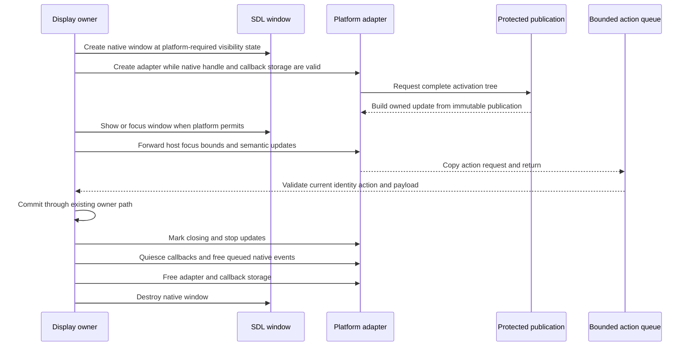

# Linux-First Native Accessibility for Euclid

## Proposal Status

This is an implementation staging document. It proposes adding native desktop
accessibility to Euclid through AccessKit C 0.23.1, beginning with the smallest valid
Linux proof and expanding only after each native contract is demonstrated by tests,
inspection, and a real assistive-technology workflow.

The recommendation is:

> Add one display-owned accessibility subsystem around Euclid's committed semantic UI
> state. First prove a static, structurally valid application tree on Linux. Then prove
> one real button, native updates, callback ingress, stale-action rejection, and clean
> teardown. Expand one control family at a time through ordinary controls, search,
> tree, scrolling, and Dynview. Perform a narrow macOS and Windows architecture smoke
> test before implementing Terminal. Implement Terminal last on Linux, then complete
> full three-platform qualification.

This proposal is grounded in
[`staging_access2_research.md`](staging_access2_research.md). That document is the
source ledger for current Euclid behavior, AccessKit C 0.23.1 capability, platform
contracts, effective-control inventory, known gaps, and unresolved empirical questions.
This staging document does not repeat that exhaustive ledger. It converts the research
into an ownership-preserving, test-first implementation program.

The proposal assumes the internal accessibility-ready control work already present in
Euclid:

- stable qualified semantic node identities;
- bounded double-buffered semantic snapshots;
- explicit roles, states, actions, hierarchy, traversal, labels, values, and bounds;
- converged pointer and semantic button actions;
- authoritative control geometry;
- editable-text descriptors and prepared caret/selection geometry;
- typed ranged-control facts and owner-side exactly-once mutation;
- composite scrolling on Tree, Presentation, and Terminal rather than focusable custom
  scrollbar thumbs.

Those facilities are necessary but not sufficient. Euclid still has no native
accessibility dependency, adapter, rooted native tree, immutable cross-thread
publication, native ID registry, action callback queue, AT-SPI publication,
NSAccessibility publication, UI Automation provider, native accessibility diagnostics,
or assistive-technology evidence.

## Decision Requested

Approve the following decisions before implementation begins:

| Decision | Recommendation |
| --- | --- |
| Delivery strategy | Prove the smallest complete Linux behavior, then expand one semantic family at a time. |
| AccessKit version | Pin AccessKit C 0.23.1. |
| Artifact provider | Use verified repository-owned upstream release binaries with exact manifests and hashes. |
| System fallback | Do not silently use a system AccessKit installation. |
| Native authority | Keep adapter lifetime, publication, focus forwarding, and action commit display-owned. |
| Julia boundary | Never enter Julia or borrow Julia-owned state from an accessibility callback. |
| Internal semantics | Keep Euclid's semantic snapshot backend-neutral and independent of AccessKit handles. |
| Native root | Add a synthetic application root in the native projection without changing internal Tab traversal. |
| Publication | Copy complete validated semantic facts into protected fixed storage before native callbacks can observe them. |
| Native identity | Map complete `Ui_Node_Id` values to monotonically allocated session-local `u64` IDs. |
| ID reuse | Never reuse a native node ID during one window session. |
| Callback ingress | Copy native requests into a bounded queue, free upstream ownership, and return immediately. |
| Mutation | Validate and commit native actions on the display thread through existing owner paths. |
| Update policy | Publish complete initial nodes and complete changed records, suppressing semantically identical frames. |
| Invalid state | Preserve the last good native publication when translation or validation fails. |
| Failure behavior | Diagnose accessibility failure while keeping the ordinary application operational. |
| Scrollbars | Keep custom scrollbar thumbs pointer-only and expose scroll range/actions on their composites. |
| Linux proof | Require deterministic tests, machine-readable AT-SPI evidence, and Orca workflows. |
| Platform sequencing | Smoke-test representative controls on macOS and Windows before Dynview and Terminal completion. |
| Dynview | Project semantic document/layout facts rather than interpreting GPU draw commands. |
| Terminal | Implement Terminal last on Linux after its component contracts are already proven elsewhere. |
| Privacy | Never publish non-echo input, secret text, or IME preedit. |
| Cross-platform claims | Qualify behavior against named OS, adapter, and assistive-technology versions. |
| Delivery gate | Stop expansion on malformed trees, inspector crashes, stale mutation, callback races, or teardown faults. |

## Executive Summary

Euclid's internal semantic snapshot is now useful enough to become the source for native
accessibility. It is not itself a native accessibility implementation. Orca,
VoiceOver, Narrator, Voice Control, Voice Access, and Switch Control cannot discover an
internal Odin tree. A native adapter must attach to the platform window, expose a
rooted tree, deliver focus and updates, receive actions, obey platform threading and
lifetime rules, and translate text and geometry into each platform contract.

The previous accessibility attempt failed too broadly. Too many unproven concerns were
combined at once: dependency integration, C ABI declarations, adapter admission,
hierarchy, dynamic updates, callbacks, text, Terminal, and platform behavior. When
Accerciser failed or crashed, there was no small known-good tree against which to
isolate the defect.

This proposal makes native validity the first product. The initial Linux tree contains
one application root and one static child. It has stable IDs, finite bounds, valid
UTF-8, complete parent/child relationships, clean activation, and clean teardown. It
contains no dynamic control behavior. Only after that tree remains healthy under
machine inspection and Orca does the implementation expose one existing button.

The button proves the complete round trip:

```mermaid
flowchart LR
    Owner[Display-owned control owner]
    Semantic[Committed Euclid semantic snapshot]
    Projection[Protected accessibility publication]
    Translator[AccessKit translator]
    Native[AT-SPI native tree]
    AT[Inspector or assistive technology]
    Callback[AccessKit callback]
    Queue[Bounded copied action queue]
    Validate[Display-thread validation]

    Owner --> Semantic
    Semantic --> Projection
    Projection --> Translator
    Translator --> Native
    Native --> AT
    AT --> Callback
    Callback --> Queue
    Queue --> Validate
    Validate --> Owner
```

After that round trip is correct, Euclid can add properties and control families in
small increments. Buttons and checkboxes precede ranges. Ranges precede search and
text. Search precedes Tree. Plain document text precedes structure and mathematics.
Terminal comes last because it combines mutable text, retained rows, cross-row
selection, scrolling, live updates, alternate screens, privacy, eviction, and stale
identity.

macOS and Windows are not deferred until after the entire Linux implementation. Once
ordinary controls and basic editable text work on Linux, each remaining platform gets
a narrow architectural smoke test. This tests window admission, callback threading,
coordinate conversion, focus forwarding, actions, text, and teardown before the
portable model becomes deeply Linux-shaped. Full platform qualification follows the
Linux Terminal implementation.

The work proceeds through ten phases:

1. pin and prove the AccessKit C artifact and ABI;
2. publish the smallest valid Linux tree;
3. expose one real button and prove dynamic correctness;
4. add ordinary controls and bounded status semantics;
5. add search, Tree, composite scrolling, and basic text;
6. smoke-test the architecture on macOS and Windows;
7. project Dynview documents and mathematical fallback semantics on Linux;
8. implement Terminal accessibility last on Linux;
9. complete macOS and Windows parity qualification;
10. finish documentation, packaging, evidence, and repository gates.

Every phase has a falsifiable claim and an explicit exit gate. A phase is not complete
because a tree appears once or a screenshot looks correct. It is complete only when the
portable translator, native adapter, action path, failure behavior, lifecycle, and
assistive-technology workflow all produce the expected evidence.

## The Argument for the Work

| Argument element | Case |
| --- | --- |
| Claim | Euclid should add native accessibility through the smallest independently verifiable Linux increments. |
| Current limitation | Internal semantic state is not translated to AT-SPI, NSAccessibility, or UI Automation. |
| User consequence | Screen-reader, voice, and switch users cannot discover or operate Euclid's custom interface. |
| Technical warrant | UI preparation already computes stable identity, owner intent, authoritative geometry, values, and immutable committed snapshots. |
| Architectural fit | A display-owned translator and adapter preserve Euclid's existing owner and thread boundaries. |
| Main risk | Invalid native records or lifecycle mistakes can destabilize inspectors and obscure the source of failure. |
| Mitigation | Begin with one static tree and add one property or control family per tested increment. |
| Product benefit | Ordinary controls, documents, mathematics, and Terminal become discoverable and operable through native desktop accessibility. |
| Verification benefit | Exact translator fixtures and native tree dumps distinguish Euclid defects from adapter or AT behavior. |
| Cost of delay | New UI and document behavior continue to widen the gap between visual operation and native accessibility. |

### Why Linux First

Linux is the current development host and offers a direct path to inspecting the
AT-SPI tree, events, actions, states, text, and geometry. Accerciser and direct AT-SPI
queries can expose malformed provider data before speech behavior is considered. Orca
then tests whether valid platform data produces a usable workflow.

Linux-first does not mean Linux-only design. The portable publication must use
AccessKit's shared semantic model rather than AT-SPI-specific records. Native lifecycle,
coordinates, and event delivery remain platform-owned. The early macOS and Windows
smoke phase exists specifically to detect Linux-shaped assumptions before Dynview and
Terminal depend on them.

### Why One Static Child Before One Button

A button includes several independent contracts:

- root and child hierarchy;
- role and name;
- focusability and native focus;
- enabled state;
- bounds and coordinate conversion;
- supported actions;
- callback ownership;
- callback thread behavior;
- target identity and generation;
- owner-side mutation;
- update publication after mutation;
- teardown while callbacks may still exist.

If all of those are introduced before basic tree admission is proven, an inspector
failure has too many plausible causes. The static child isolates tree structure,
identity, strings, bounds, activation, and teardown. The first button then adds focus,
action ingress, and dynamic updates against a known-good baseline.

### Why Missing Optional Values Are Different from Invalid Values

An omitted optional property may produce an incomplete experience. It must not corrupt
the native tree. A crash in Accerciser or another inspector is evidence of a provider,
adapter, or platform-contract defect until proven otherwise.

Likely defect classes include:

- duplicate or dangling IDs;
- inconsistent parent and child lists;
- cycles or multiple roots;
- malformed UTF-8 or invalid text-array lengths;
- non-finite or inverted geometry;
- unsupported role/action combinations;
- incomplete replacement records;
- stale references after removal;
- callback use after publication or adapter storage is retired;
- incorrect C declarations, union layout, ownership, or calling convention.

The implementation therefore validates every translated record before FFI and preserves
the last good native publication when current staging is invalid.

### Why Terminal Is Last

Terminal is not one text box. It combines nearly every difficult accessibility concern:

- stable logical row identity under bounded eviction;
- visual wrapping that must not duplicate spoken logical text;
- mutable output and optional editable input;
- cross-row selection and character geometry;
- primary and alternate screens;
- scrolling and follow-bottom behavior;
- live-output coalescing and event pressure;
- links and copy policy;
- local Julia editing versus child-process authority;
- non-echo and secret-input privacy;
- high update rates;
- generation replacement and stale actions.

By placing Terminal after ordinary ranges, editable search, Tree, scrolling, Dynview
text, document structure, selection, and live status, its implementation can compose
proven primitives. Terminal remains the owner of protocol, editing, history, privacy,
and alternate-screen policy.

## Current Architectural Foundation

### Semantic Publication

`Ui_Semantic_Focus_State` owns two fixed `Ui_Semantic_Snapshot` buffers. UI preparation
begins staging, registers bounded nodes and copied UTF-8 text, validates the complete
snapshot, reconciles logical focus, and atomically swaps the committed index. Invalid or
over-capacity staging does not replace the previous committed snapshot.

Current nodes include:

- complete `Ui_Node_Id` identity;
- parent and active-descendant identity;
- role;
- state and supported-action sets;
- traversal region and order;
- authoritative bounds and clip bounds;
- optional typed numeric range;
- copied label and value text.

Editable surfaces additionally prepare committed text, cursor and anchor byte
boundaries, content revision, read-only/editable mode, caret geometry, selection
geometry, and codepoint columns.

### Frame Ordering

The current display frame performs these relevant steps:

1. poll SDL input once;
2. service non-UI display state;
3. compute current UI geometry and splitter results;
4. route keyboard input against the prior committed semantic snapshot;
5. prepare controls and begin current semantic staging;
6. prepare Terminal, presentation, and layout-dependent interaction;
7. validate and commit the current semantic snapshot;
8. encode and present drawing;
9. finish evidence and frame bookkeeping.

Native accessibility adds two bounded boundaries:

1. drain copied native action requests after keyboard routing resets current commands
   and before current controls prepare their converged results;
2. copy the newly committed semantic facts into protected accessibility publication
   storage after semantic publication and before that storage can be observed by an
   adapter update factory.

### Existing Control Convergence

The recent control extractions establish the correct action boundary:

- controls prepare action intent, value, action sources, and geometry;
- pointer, keyboard/semantic, and scenario sources converge before owner mutation;
- domain owners commit meaningful state exactly once;
- drawing consumes prepared geometry;
- semantic registration consumes the same prepared geometry and values.

Native accessibility actions must enter this same result path. They must not call a
second application-level dispatcher that independently mutates settings, GIF state,
animation state, splitters, Tree selection, presentation scroll, or Terminal state.

## Proposed Architecture

### Package Ownership

| Package or file area | Responsibility |
| --- | --- |
| `libs/accesskit/` | Tagged C header, licenses, platform payloads, manifests, and narrow Odin C declarations. |
| `src/accessibility/` | Backend-neutral protected publication, validation, translation policy, native ID registry, differencing, action queue, diagnostics, and tests. |
| `src/view/native/accessibility/` | Unix, macOS, and Windows adapter lifecycle, platform handles, host focus, coordinates, queued events, and teardown. |
| `src/view/model/model.odin` | Internal UI semantic vocabulary and fixed committed snapshots. |
| `src/view/ui/` | Control- and owner-level semantic facts and existing exactly-once behavior. |
| `src/view/native/sdl_platform.odin` | Window-session ownership of one active platform adapter. |
| `src/view/view.odin` | Display-frame action draining and publication servicing. |
| `src/dynview/` and `src/view/ui/dynview/` | Semantic document, text, math, reading order, selection, and geometry source. |
| `src/view/terminal/` and `src/terminal/` | Terminal rows, selection, input authority, scrolling, live policy, privacy, and protocol behavior. |
| `tools/accessibility/` | ABI probes, native tree/event automation, evidence normalization, and manual qualification guides. |

AccessKit bindings do not belong in `src/bridge`. That package owns the Odin/Julia
boundary. Native accessibility is a display/native dependency and must not acquire a
false Julia ownership relationship.

### Portable Publication

The accessibility publication is not a third UI framework. It is a bounded native-ready
copy of already committed semantic facts plus the additional structured data required
for native text, relations, status, and document surfaces.

The publication must be:

- pointer-free except for storage owned by its publication slot;
- fixed-capacity and allocation-free in the display hot path;
- complete and validated before becoming current;
- immutable while any adapter callback can observe it;
- generation-tagged;
- independent of AccessKit opaque handles;
- safe to retain beyond the two-frame lifetime of UI semantic buffers;
- replaceable only after successful translation validation.

A protected slot or equivalent short synchronization boundary allows an activation or
update callback to construct AccessKit-owned records from a stable publication. The
callback must not hold the synchronization boundary while entering application owners,
waiting for the display thread, calling Julia, or performing unrelated I/O.

### Native Root and Child Ordering

Euclid's internal semantic snapshot currently permits a forest because top-level
controls have empty parents. AccessKit requires one complete rooted tree. The native
projection introduces one synthetic application root and makes current top-level
semantic nodes its ordered children.

The root does not become a Tab stop and does not change internal keyboard traversal.
Its native ID is reserved for the window session. Child ordering is deterministic and
comes from semantic hierarchy plus traversal/owner order, not hash-map iteration or
screen-coordinate sorting.

Before publication, validation rejects:

- empty or duplicate projected IDs;
- missing parents;
- parent/child disagreement;
- cycles;
- unreachable nodes;
- more than one projected root;
- invalid UTF-8;
- invalid text offsets or character arrays;
- non-finite numeric range values;
- invalid min/current/max/step relationships;
- non-finite or inverted bounds;
- unsupported role/state/action combinations;
- capacity overflow.

### Native ID Registry

`Ui_Node_Id` is richer than AccessKit's `u64` node ID. The accessibility subsystem owns
one display-lifetime registry that maps the complete qualified identity to a native ID.

The registry contract is:

- reserve known IDs for the synthetic root and any other process-defined roots;
- allocate monotonically within a window session;
- include domain, local ID, stable UUID, and generation in equality;
- retain reverse lookup needed for callback validation;
- retire mappings when identities disappear;
- never retarget or reuse a retired native ID during the same session;
- reject exhaustion rather than wrap;
- preserve a bounded diagnostic record of allocation and retirement pressure.

A generation replacement receives a new native ID unless a platform contract and a
specific semantic identity policy prove that continuity is correct. Internal focus
repair remains responsible for choosing a current Euclid target.

### Update Differencing

AccessKit initial activation receives a complete rooted tree. Later updates contain
complete records for every changed node, not partial property patches. The translator
retains the last successfully published native facts and compares structured records.

Updates are emitted only for semantic differences such as:

- child ordering or reachability;
- name, description, value, state, or supported actions;
- focus or active descendant;
- relation targets;
- numeric range or scroll facts;
- text, selection, or character geometry;
- meaningful status/live content;
- bounds after actual layout, scale, or window changes.

A 60 Hz frame with identical semantic facts does not generate native updates. A failed
current translation leaves the prior native tree current and records a typed rejection.

### Callback and Action Queue

AccessKit action requests may arrive on a platform callback thread. A callback performs
only bounded ingress:

1. validate that callback storage is still admitting work;
2. copy the action kind, native target ID, publication generation, and bounded payload;
3. reject oversized or unsupported payloads;
4. enqueue the copied request or record overflow;
5. free the AccessKit-owned request exactly once;
6. return without waiting for display mutation.

The display thread drains requests at a defined frame boundary. It resolves the native
ID through the current registry, validates the complete target identity and generation
against the current committed semantic snapshot, verifies action support, validates
payload type and range, and offers the action to the owning control preparation.

Rejected requests do not mutate logical focus or domain state. Rejection reasons
include:

- adapter closing;
- queue full;
- unknown native ID;
- retired ID;
- stale publication generation;
- target absent from the current committed snapshot;
- unsupported action;
- wrong payload kind;
- malformed or oversized string;
- invalid text position;
- NaN or infinity;
- out-of-range numeric value.

### Platform Lifecycle

Unix, macOS, and Windows do not share identical admission details:

- Unix adapter handlers may run on another thread and must observe only protected
  publication or bounded queue storage. X11 and Wayland root-coordinate capability
  differs.
- macOS integration must preserve AppKit/main-thread object lifetime and AccessKit's
  focus-forwarder or subclassing contract. Irreversible class mutation means the
  library must remain loaded for process lifetime.
- Windows adapter/subclass setup must occur before the window is shown or focused when
  that API path requires it. Euclid may need to create the SDL window hidden, attach the
  adapter, then show it. HWND, COM, queued event, and callback-thread rules remain
  platform-owned.

Accessibility initialization failure unwinds partial native resources in reverse order,
records the exact stage and platform error, and allows Euclid to continue without a
native accessibility tree. Silent absence is not called graceful degradation.

## Phase 0: Pin and Prove the C Boundary

### Phase 0 Objective

Establish that every retained AccessKit C 0.23.1 artifact matches its tagged public
header, platform, architecture, toolchain, runtime closure, and ownership contract
before application code calls it.

### Phase 0 Work

1. Download the upstream 0.23.1 release bundle under `.build/accesskit-audit/`.
2. Verify the published bundle SHA-256 before extraction.
3. Inventory archive members, target triples, architectures, file formats, exported
   symbols, transitive dependencies, and included license files.
4. Record per-member hashes and reject artifacts whose provenance or target cannot be
   tied to the 0.23.1 tag.
5. Add `libs/accesskit/` with:
   - the exact tagged `accesskit.h`;
   - selected MIT or Apache-2.0 license material and required notices;
   - role-specific payload directories for supported platform/architecture pairs;
   - one schema-versioned `manifest.toml` per payload.
6. Record in each manifest:
   - AccessKit C version;
   - underlying AccessKit and adapter crate versions;
   - platform, architecture, and toolchain/ABI;
   - artifact filename and runtime/link role;
   - artifact and license SHA-256;
   - declared native dependencies.
7. Extend `tools/build_config.jl` with mandatory manifest and hash validation, linker
   paths, runtime directories, and provider identity.
8. Thread the validated artifact through application builds, Odin tests, run targets,
   runtime environment setup, closure inspection, and generated CycloneDX output.
9. Add narrow Odin declarations for only the C surface used by the current phase.
10. Add a C/Odin ABI probe that compares:
    - enum widths and selected values;
    - `accesskit_node_id` and tree UUID representation;
    - rect and optional scalar size/alignment;
    - text position;
    - action data and action request union layout;
    - callback calling convention;
    - exported symbols;
    - ownership and required free paths.
11. Run the ABI probe on Linux, macOS, and Windows before enabling an adapter on each
    platform.
12. Add build-driver tests for missing payloads, modified hashes, wrong architecture,
    wrong platform/toolchain, unsupported schema, missing license, and runtime-path
    selection.

### Phase 0 Falsifiable Claim

The repository can identify, validate, link, load, and call the exact AccessKit C
0.23.1 C ABI on each supported desktop target without relying on ambient system state.

### Phase 0 Exit Gate

- all retained artifact and license hashes match manifests;
- all required exports and transitive dependencies are known;
- C/Odin ABI probes pass on Linux, macOS, and Windows;
- build-driver tests reject every malformed fixture;
- generated runtime closure identifies AccessKit and its provider;
- no application adapter exists yet.

## Phase 1: Smallest Valid Linux Tree

### Phase 1 Objective

Publish one static, structurally valid Euclid tree through AT-SPI and prove lifecycle,
focus, bounds, inspection, and teardown before introducing actions or dynamic controls.

### Phase 1 Work

1. Add the bounded portable publication, validator, native ID registry, translator,
   action queue storage, and diagnostics under `src/accessibility/`.
2. Add the Unix adapter owner under `src/view/native/accessibility/`.
3. Add the synthetic application root and exactly one static noninteractive child.
4. Publish only proven facts:
   - stable IDs;
   - role;
   - concise valid UTF-8 name;
   - ordered children;
   - finite bounds;
   - host focus state where required.
5. Do not publish actions, ranges, relations, live state, text ranges, or dynamic UI
   controls in this phase.
6. Add adapter storage to `Sdl_Platform` and create/destroy it inside the window
   session's native lifecycle.
7. Copy the validated root publication into protected storage before an activation
   callback can request it.
8. Forward host-window focus and meaningful bounds changes.
9. Add failure injection for every partial-construction stage and verify reverse-order
   unwind.
10. Add a Linux native evidence command under `tools/accessibility/` that starts Euclid
   on the desktop accessibility bus and writes a machine-readable AT-SPI tree/event dump.
11. Query root and child IDs, roles, names, states, parent/child links, bounds, focus,
    and disappearance after shutdown.
12. Exercise service activation/deactivation, application focus/unfocus, resize,
    display-scale change, repeated open/close, and shutdown under X11 and Wayland where
    available.
13. Perform one Orca discovery workflow.

### Phase 1 Required Regression Cases

- duplicate projected ID;
- dangling parent;
- cycle;
- unreachable node;
- invalid UTF-8;
- non-finite or inverted bounds;
- capacity overflow;
- activation after failed construction;
- service deactivation during update;
- adapter destruction while the application closes;
- callback attempt after closing begins.

### Phase 1 Falsifiable Claim

A native Linux accessibility client can repeatedly discover and remove one valid Euclid
application tree without malformed AccessKit-supported data or callback access to
retired storage.

### Phase 1 Exit Gate

- deterministic projection tests pass;
- direct AT-SPI inspection reports the expected rooted tree;
- Orca identifies the application and static child;
- bounds and host focus update coherently;
- shutdown removes the provider cleanly;
- sanitizer/debug diagnostics report no late callback, bad free, or use-after-retire.

## Phase 2: One Real Button and Dynamic Correctness

### Phase 2 Objective

Expose one existing animation button and prove the complete native action round trip,
retained updates, focus, identity retirement, rejection, and teardown.

### Phase 2 Work

1. Select one stable animation control as the sole real control in the native tree.
2. Translate its existing `Button_Semantics` and prepared geometry into:
   - Button role;
   - visible accessible name;
   - enabled and focusable state;
   - authoritative bounds and clipping policy;
   - Focus action;
   - Activate action.
3. Add retained native differencing and suppress updates when the complete translated
   record and focus are unchanged.
4. Publish complete records for changed nodes.
5. Handle label, enabled state, bounds, focus, removal, reappearance, and generation
   replacement without dangling IDs.
6. Add callback ingress that copies and frees the AccessKit request before returning.
7. Drain copied actions on the display thread before current control preparation.
8. Resolve the current target and offer activation to the same prepared result used by
   keyboard and pointer input.
9. Preserve owner-side exactly-once mutation when two input sources request the same
   action in one frame.
10. Add typed diagnostics for every rejection reason.
11. Add a debug scenario that keeps the button available and emits ordinary owner
    evidence after activation.

### Phase 2 Required Regression Cases

- exact root/button translation;
- semantically identical frame suppression;
- focus gain and loss;
- native activation exactly once;
- native plus keyboard or pointer activation in one frame;
- disabled activation rejection;
- unknown and retired native IDs;
- stale publication generation;
- queue overflow;
- action after node removal;
- generation replacement;
- adapter inactive during update;
- callback ownership freed exactly once;
- late callback during shutdown.

### Phase 2 Falsifiable Claim

Accerciser or Orca can focus and activate one real Euclid button, and that request
produces exactly the same owner mutation as keyboard or pointer input without stale
mutation or lifecycle failure.

### Phase 2 Exit Gate

- translator, queue, ID, differencing, and owner-convergence tests pass;
- AT-SPI reports exact role, name, state, actions, focus, and bounds;
- Accerciser invokes the action without instability;
- Orca can discover, focus, and activate the control;
- pointer, keyboard, and native activation produce one owner event each;
- removed or stale targets never mutate current state;
- repeated teardown remains clean.

## Phase 3: Linux Ordinary Controls and Status

### Phase 3 Objective

Expand the proven button path through ordinary controls while adding one semantic
family at a time and preserving exact native records.

### Work Order

1. remaining push buttons;
2. checkboxes and toggled state;
3. integer sliders;
4. splitters as keyboard/native ranged controls;
5. accordion groups, panels, and header relations;
6. GIF timing choices and selected state;
7. save/cancel busy and disabled state;
8. bounded application and GIF status/error nodes.

### Control Requirements

#### Buttons

- Names match visible labels where practical.
- Pause/resume uses a stable identity and coherent state rather than relying only on a
  changing name.
- Presentation copy buttons include expression context sufficient for voice and switch
  disambiguation.
- Disabled actions are absent or rejected consistently.

#### Checkboxes

- Publish CheckBox role, toggled state, enabled state, name, focus, bounds, and click or
  toggle action.
- Keep unavailable-feature identity in the stable name and put availability detail in
  state or description.

#### Sliders and Splitters

- Publish finite numeric current, minimum, maximum, step, jump/page step, orientation,
  and formatted value text.
- Validate `minimum <= current <= maximum` and positive step before FFI.
- Convert native payloads through typed range helpers and owner-side clamping.
- Make splitters focusable only while operable and unlocked.
- Preserve pane minimums, portrait behavior, overlap arbitration, and GIF locking.

#### Accordion

- Add stable panel/group identities.
- Relate headers to controlled panels.
- Publish expanded and selected state consistently.
- Omit inactive panel descendants.
- Preserve the one-open-section policy and deterministic focus repair.

#### Status

- Publish meaningful startup, GIF pending, completion, and error milestones.
- Use stable status nodes and bounded update frequency.
- Do not make FPS, particle statistics, animation frames, or other high-rate telemetry
  live.
- Treat exact speech timing and queueing as AT-qualified behavior, not a schema
  guarantee.

### Verification Rhythm

For each control family:

1. add exact translator fixtures;
2. add invalid-value and action-rejection fixtures;
3. prove owner convergence with native source included;
4. run Odin unit tests;
5. run existing keyboard and feature scenarios;
6. run AT-SPI property/action automation;
7. inspect with Accerciser;
8. complete one Orca workflow;
9. proceed only when the family is independently healthy.

### Phase 3 Falsifiable Claim

Every ordinary visible Euclid control exposes a coherent native identity, role, name,
state, value, range, relationship, focus, bounds, and supported action without
introducing malformed records or duplicate owner mutation.

### Phase 3 Exit Gate

- ordinary-control translator and owner tests pass;
- existing keyboard, GIF, and splitter scenarios remain passing;
- AT-SPI automation can inspect and operate every exposed family;
- Orca can traverse and operate representative controls;
- status updates are meaningful and not high-rate;
- custom scrollbar thumbs remain intentionally absent from native focus order;
- Accerciser remains stable throughout dynamic panel changes.

## Phase 4: Linux Search, Tree, Scroll, and Basic Text

### Phase 4 Objective

Prove portable editable text and dynamic composite hierarchy before document and
Terminal work.

### Semantic Model Extensions

Add only the missing portable facts required by this phase:

- description and placeholder;
- labelled-by, described-by, and controls relations;
- level, position in set, and set size;
- scroll current, minimum, and maximum;
- scroll action support;
- committed UTF-8 character lengths;
- word starts where available;
- text selection positions;
- bounded text replacement and selection action payloads.

All additions remain fixed-capacity, copied into complete staging, validated before
commit, and independent of AccessKit opaque storage.

### Search Work

1. Use Library Search as the first editable native text surface.
2. Translate the existing `Ui_Editable_Text_Descriptor` and prepared geometry.
3. Publish SearchInput role, name, placeholder, committed value, editable state, caret,
   selection, character mapping, bounds, and replacement/set-selection actions.
4. Keep IME preedit outside committed accessible value.
5. Keep query storage, debounce, suggestion, generation, and filtering Library-owned.
6. Relate search to the controlled Tree.
7. Give the suggestion action a spoken target that includes the actual suggestion.
8. Publish bounded result-count and no-results status.

### Tree Work

1. Publish one Tree composite and ordered visible TreeItem descendants.
2. Preserve stable UUID-backed item identity.
3. Publish parentage, active descendant, selected and expanded state, level, position,
   and set size.
4. Keep one global Tab stop with roving active descendant unless native qualification
   demonstrates a required mapping adjustment.
5. Support selection, expansion, collapse, and scroll-into-view through current owner
   behavior.
6. Atomically remove filtered nodes and reject actions against retired results.
7. Preserve active identity when still visible and repair focus predictably otherwise.
8. Publish scroll range and actions on the Tree composite.
9. Do not expose the visual scrollbar thumb as a child control.

### Text and Unicode Tests

- empty and maximum-length values;
- ASCII and multibyte UTF-8;
- combining sequences;
- bidi text;
- cursor and anchor at every valid boundary;
- invalid byte boundaries;
- collapsed and extended selections;
- replacement at current and stale revisions;
- read-only rejection;
- geometry under horizontal clipping;
- malformed character-length arrays;
- cross-platform index conversion fixtures where adapter behavior differs.

### Phase 4 Falsifiable Claim

A Linux accessibility client can edit and inspect Library Search, receive coherent
result feedback, navigate and operate the filtered Tree, and scroll the composite
without stale targets, malformed text ranges, or focus theft.

### Phase 4 Exit Gate

- deterministic text, relation, Tree, filtering, and scroll tests pass;
- AT-SPI automation edits text and inspects caret/selection;
- Orca reports search value and navigates the Tree coherently;
- filtered identities remain stable when valid and retire safely otherwise;
- no-results and result-count feedback is bounded;
- scrolling reveals acted items without moving unrelated focus;
- Accerciser remains stable through rapid filtering and removal.

## Phase 5: Early macOS and Windows Architecture Smoke

### Phase 5 Objective

Demonstrate that the portable publication, translator, ID registry, action queue, text
model, and owner commit are not Linux-specific before deeper document and Terminal work.

### macOS Work

1. Add the macOS adapter owner under `src/view/native/accessibility/`.
2. Obtain and retain the correct SDL native view/window references without taking SDL
   ownership.
3. Create and use adapter objects on the required AppKit/main thread.
4. Implement host focus forwarding, bounds conversion, queued events, and teardown.
5. Respect irreversible class/focus-forwarder behavior and process-lifetime library
   requirements.

### Windows Work

1. Add the Windows adapter owner under `src/view/native/accessibility/`.
2. Select and document the subclass or `WM_GETOBJECT` integration path.
3. If required, create the SDL window hidden, attach AccessKit before first show/focus,
   then show it through the display owner.
4. Preserve HWND, COM, callback-thread, queued-event, and teardown contracts.
5. Convert logical SDL bounds through current window scale and native screen/client
   coordinates.

### Shared Smoke Corpus

Run the same narrow corpus on both platforms:

- application root and hierarchy;
- one button;
- one checkbox;
- one slider;
- one search field with caret and selection;
- native focus and host focus loss/restoration;
- resize and scale changes;
- action round trip;
- stale target rejection;
- initialization failure;
- repeated open/close and shutdown.

Use Accessibility Inspector and VoiceOver on macOS. Use Inspect or Accessibility
Insights and Narrator on Windows.

### Phase 5 Falsifiable Claim

Representative controls and basic text can use the same portable semantic publication
and action contract on macOS and Windows, with differences confined to native adapter
lifecycle, coordinates, event delivery, and platform API mapping.

### Phase 5 Exit Gate

- platform ABI probes remain passing;
- native inspectors report the expected representative tree and properties;
- VoiceOver and Narrator complete the smoke workflow;
- action, stale-target, focus, bounds, and teardown tests pass;
- no portable semantic policy has been forked solely to accommodate one adapter;
- architecture defects are resolved before Dynview or Terminal begins.

## Phase 6: Linux Dynview Document and Mathematics

### Phase 6 Objective

Expose readable, selectable, scrollable document structure from authoritative Dynview
semantic compilation and layout.

### Phase 6 Work

1. Add a bounded pointer-free document accessibility projection owned by Dynview
   compilation/layout.
2. Begin with fallback plain text and one small document containing a heading and
   paragraph.
3. Publish semantic reading order rather than sorting visual coordinates.
4. Publish read-only text, UTF-8 character lengths, word starts, selection, character
   positions and widths, viewport bounds, clipping policy, and scroll state.
5. Map selection and hit testing through authoritative shaped text geometry.
6. Expand through the actual supported block taxonomy:
   - headings and levels;
   - paragraphs;
   - lists and list items;
   - block quotes;
   - labels;
   - figures with concise descriptions;
   - contextual copy affordances.
7. Keep decorative geometry, dust, and primitive-level animation objects out of the
   native tree.
8. Use stable document-revision identities and retire old nodes deterministically.
9. Publish only semantic revision or meaningful animation milestone changes.
10. Add Math nodes only after plain text range behavior is stable.
11. Give each math node a readable fallback derived from semantic TeX, with fixtures
    for fractions, roots, scripts, operators, and matrices.
12. Do not claim MathML parity or identical mathematical speech across AT products.

### Phase 6 Required Tests

- semantic reading order independent of screen position;
- wrapping and clipping;
- scaling and viewport movement;
- combining and bidi text;
- collapsed and cross-run selections;
- character geometry and hit testing;
- scrolling and visible range;
- document revision replacement;
- contextual copy naming;
- representative math fallback strings;
- bounded behavior for large documents;
- no per-frame update when semantic content is unchanged.

### Phase 6 Falsifiable Claim

Orca can read representative Dynview prose and mathematical fallback in semantic order,
inspect and change selection, scroll the document, and operate contextual copy actions
without geometry drift or high-rate event noise.

### Phase 6 Exit Gate

- document projection and text geometry tests pass;
- AT-SPI text/range automation agrees with rendered geometry;
- Accerciser inspects dynamic document replacement without failure;
- Orca completes prose, selection, scrolling, copy, and representative math workflows;
- decorative visual content remains excluded;
- animation does not emit frame-rate accessibility churn.

## Phase 7: Linux Terminal Last

### Phase 7 Objective

Compose the already-proven identity, text, selection, scrolling, action, status, live,
privacy, and lifecycle contracts into a usable Linux Terminal projection.

### Terminal Contract

The projection contains:

- one stable Terminal composite for the current Terminal generation;
- bounded logical row or paragraph children in reading order;
- logical identities independent of visual wrapping;
- one editable child only while Euclid owns prompt editing;
- text selection and character geometry;
- scroll current/min/max and actions;
- follow-bottom state policy;
- optional stable Link children when a text range and target are valid;
- atomic alternate-screen replacement and primary-screen restoration;
- deterministic row ID retirement on eviction;
- conservative live-output status.

It does not move these responsibilities out of Terminal:

- PTY and ConPTY protocol;
- Julia editor, completion, history, and continuation;
- child-process input and mouse authority;
- primary and alternate grids;
- selection and copy policy;
- links;
- wrapping and reflow;
- non-echo and secret-input policy;
- live-output coalescing.

### Privacy Contract

- Never publish non-echo input.
- Never publish a known secret value to a node, status, event, diagnostic, or test log.
- Never publish IME preedit as committed text.
- Do not role the entire Terminal as a password field.
- Use controlled sacrificial values for privacy tests.
- Clear or replace accessible input promptly when Terminal ownership or echo policy
  changes.

### Live Output Contract

- Announce only completed logical output selected by Terminal policy.
- Enable conservative live behavior only while following bottom.
- Do not move semantic focus, caret, selection, or an off-bottom reading position when
  output arrives.
- Coalesce bursts.
- Suppress alternate-screen and high-volume chatter unless a tested meaningful event
  requires publication.
- Record dropped/coalesced pressure without logging content.

### Phase 7 Required Tests

- stable logical row identity;
- visual wrap and reflow without duplicate speech;
- UTF-8 character mapping;
- cross-row selection and geometry;
- local editable input and child-process authority;
- history and continuation state;
- copy and links;
- scroll and follow-bottom behavior;
- off-bottom review during incoming output;
- bounded eviction and ID retirement;
- stale actions after eviction;
- primary/alternate screen entry and restoration;
- slow output and burst output;
- live-event pressure and coalescing;
- no-echo privacy;
- generation replacement;
- reload and shutdown;
- existing PTY and full-screen child scenarios.

### Phase 7 Falsifiable Claim

Orca can review Terminal output, inspect and edit application-owned input, navigate
selection and scrolling, follow bounded live output, and survive alternate-screen and
eviction transitions without secret disclosure, reading-position theft, event floods,
or stale identity.

### Phase 7 Exit Gate

- deterministic Terminal projection and privacy tests pass;
- existing Terminal PTY and full-screen application scenarios remain passing;
- AT-SPI text, selection, scroll, and event probes pass;
- Orca completes local Julia and child-process workflows;
- privacy fixtures never appear in accessible output or diagnostics;
- output bursts remain bounded;
- alternate-screen and eviction transitions do not expose stale rows;
- shutdown quiesces callbacks before Terminal and adapter storage retire.

## Phase 8: Full macOS and Windows Qualification

### Phase 8 Objective

Enable the complete Linux-proven projection on macOS and Windows and qualify platform
behavior without creating separate domain mutation paths.

### Phase 8 Work

1. Enable all ordinary controls, status, search, Tree, scroll, Dynview, math fallback,
   and Terminal projections on both adapters.
2. Keep semantic policy in `src/accessibility/` or the owning UI, Dynview, and Terminal
   packages.
3. Keep platform files limited to:
   - native lifecycle and handles;
   - coordinate conversion;
   - host focus;
   - queued native events;
   - platform text-unit translation;
   - documented adapter limitations.
4. Run VoiceOver, Voice Control, and Switch Control workflows on macOS.
5. Run Narrator and Voice Access workflows on Windows.
6. Verify visible-name agreement for voice targeting.
7. Verify switch scan order and grouping.
8. Verify DPI, multiple monitors, resize, move, minimize, restore, focus loss, and
   service activation/deactivation.
9. Repeat document/math and Terminal workflows.
10. Record exact OS, AccessKit adapter, inspector, and AT versions with every empirical
    result.
11. Document genuine platform divergence rather than weakening the portable model to
    force identical speech.

### Phase 8 Falsifiable Claim

The same Euclid semantic authority and owner actions support complete representative
workflows through macOS and Windows native accessibility, with platform differences
confined to documented native contracts and AT behavior.

### Phase 8 Exit Gate

- full native tree/property/action automation passes where platform tooling permits;
- VoiceOver, Voice Control, Switch Control, Narrator, and Voice Access complete the
  agreed workflow matrix;
- names and scan order are coherent;
- text ranges and geometry remain correct across scaling and monitors;
- Terminal privacy and live-output behavior remain intact;
- repeated activation and teardown are race-free;
- platform differences are documented with exact evidence.

## Phase 9: Documentation, Evidence, Packaging, and Final Gates

### Documentation

Update:

- `docs/wiki/Guides/ArchitectureSummary.md` with accessibility owners, publication,
  callback, action, and lifecycle boundaries;
- `docs/wiki/Guides/UiSystem.md` with native semantic projection and owner convergence;
- a dedicated accessibility verification guide with platform prerequisites, inspector
  commands, AT workflows, expected evidence, and supported-version matrix;
- dependency and packaging documentation with AccessKit artifact provenance, license,
  closure, and update procedure.

### Diagnostics and Evidence

Record bounded, content-safe facts for:

- adapter create, activate, deactivate, and destroy;
- publication generation and result;
- node/text/range high-water marks;
- validation rejection reason and target identity;
- native update counts and suppression;
- action queue pressure and overflow;
- stale/unsupported action rejection;
- callback admission and quiescence;
- initialization failure stage;
- platform focus and bounds transitions.

Do not log arbitrary text-field, document, or Terminal content merely to prove
accessibility. Scenario artifacts state whether native accessibility evidence was
collected and whether it was complete. Screenshots do not prove accessibility.

### Repository Verification

After each behavioral slice:

1. run `julia tools/make.jl unit odin`;
2. run Julia unit tests after build-driver, manifest, closure, or evidence-tool changes;
3. run the validated build after package, ABI, link, or application-boundary changes;
4. run the relevant existing scenarios for owner behavior;
5. run the native accessibility evidence workflow for the current platform;
6. inspect enlarged procedures with the repository statistics command;
7. run strict/debug builds and failure injection near each platform milestone;
8. finish with `cmake --build --preset default --target check`.

Do not report the complete gate as passing when only unit, scenario, inspector, or AT
checks have run.

### Phase 9 Falsifiable Claim

A release candidate can reproduce its dependency provenance, native tree, action
behavior, failure behavior, privacy claims, and assistive-technology workflows on every
supported desktop platform.

### Phase 9 Exit Gate

- documentation matches implementation and ownership;
- checked and generated runtime closures include AccessKit correctly;
- platform evidence bundles and manual AT records are archived;
- all phase-specific acceptance matrices pass;
- the complete canonical repository gate passes on every supported build platform;
- unresolved AT heuristics are explicitly version-qualified and do not masquerade as
  proven parity.

## Verification Matrix

| Surface | Deterministic proof | Native automation | Human AT proof |
| --- | --- | --- | --- |
| Artifact and ABI | Manifest/hash/layout/export tests | Loader and closure inspection | None |
| Static root | Projection validation and lifecycle failure tests | Rooted tree, focus, bounds, disappearance | Application discovery |
| Button | Exact node/update/action/owner tests | Invoke, focus, state, bounds | Discover and activate |
| Checkbox | Toggled/disabled/owner tests | Toggle action and events | State and operation |
| Slider/splitter | Finite range and clamp tests | Range properties and actions | Value speech and operation |
| Accordion | Relation and focus-repair tests | Expanded/controlled panel tree | Navigate sections |
| Status | Coalescing and severity tests | Node updates and events | Pending/completion/error feedback |
| Search | UTF-8/index/selection/replacement tests | Text/value/selection/actions | Edit and review query |
| Tree | Identity/filter/active-descendant tests | Hierarchy/state/actions/scroll | Navigate, expand, select, filter |
| Dynview | Reading-order/range/geometry tests | Document/Text ranges and bounds | Read, select, scroll, copy |
| Math | Semantic fallback fixtures | Math role and readable value | Representative expression speech |
| Terminal | Row/input/selection/scroll/privacy/live tests | Text/range/event/action probes | Review, edit, select, scroll, follow output |
| Lifecycle | Failure unwind, late callback, quiescence tests | Service activation and provider removal | Repeated application use |

## Inspector Failure Protocol

When Accerciser, Accessibility Inspector, Inspect, Accessibility Insights, or another
native client crashes or reports malformed data:

1. stop adding properties or controls;
2. preserve the failing artifact, tree dump, event log, application diagnostics, OS,
   adapter, and inspector versions;
3. reduce the projection to the last known-good tree;
4. reintroduce only the smallest changed record or transition;
5. identify whether the defect is ABI, tree structure, value validation, update
   completeness, adapter lifecycle, platform mapping, or inspector behavior;
6. add a deterministic regression fixture when the defect is under Euclid's control;
7. add a native reproduction when deterministic translation alone cannot expose it;
8. proceed only after the known-good tree remains stable again.

An inspector crash is never waived merely because another assistive technology appears
to work.

## Failure and Degradation Policy

| Failure | Required behavior |
| --- | --- |
| Missing or modified artifact | Fail build/provider validation with exact path and expected identity. |
| ABI probe mismatch | Disable implementation work for that target and fail the probe. |
| Adapter creation failure | Log typed stage/platform error, unwind partial resources, continue Euclid without native accessibility. |
| Activation with no valid publication | Return no malformed tree and record the reason. |
| Current semantic translation invalid | Keep the last good native publication. |
| Native update rejected | Keep prior tree, record generation and reason, avoid partial application mutation. |
| Action queue overflow | Drop the new request, record bounded pressure, do not mutate state. |
| Stale or retired action | Reject and diagnose without retargeting. |
| Invalid numeric/text payload | Reject before owner mutation. |
| Accessibility service deactivation | Stop unnecessary updates while preserving safe adapter lifetime. |
| Window close | Stop admission, quiesce callbacks, free queued events and adapter, then destroy SDL window. |
| Terminal privacy uncertainty | Omit the uncertain input/content rather than risk disclosure. |

## Risks and Mitigations

| Risk | Consequence | Mitigation |
| --- | --- | --- |
| Release artifact does not cover all supported targets as expected | Build or packaging dead end | Audit the bundle before committing provider design and block unsupported targets explicitly. |
| Odin C declarations drift from tagged header | Memory corruption or callback crashes | Narrow declarations, generated/manual ABI probe, per-target layout assertions. |
| Native tree diverges from UI | Wrong names, state, actions, or bounds | Translate committed prepared facts and test exact records. |
| Callback borrows frame-reused storage | Use-after-retire | Protected display-lifetime publication and copied queue payloads only. |
| Native ID reuse retargets stale actions | Wrong control mutation | Monotonic session IDs and explicit retirement. |
| Frame-rate publication floods AT | Poor performance and unusable speech | Structured differencing and semantic milestone policy. |
| Text indices disagree across platforms | Wrong caret/selection/ranges | Explicit UTF-8 mapping and platform conversion tests. |
| Wayland coordinates differ from X11 | Incorrect absolute bounds or hit testing | Platform-qualified bounds tests and documented limitations. |
| Voice names diverge from visible labels | Voice targeting fails | Visible-name agreement tests and contextual duplicate names. |
| Live Terminal output overwhelms users | Chatter and lost reading position | Follow-bottom gating, completed-row policy, coalescing, and pressure tests. |
| Secret Terminal input leaks | Severe privacy failure | Owner-controlled echo policy, omission by default, sacrificial privacy fixtures. |
| Early Linux design does not fit macOS/Windows | Expensive late redesign | Representative platform smoke test before Dynview and Terminal. |
| Accessibility failure prevents application startup | Product regression | Isolated adapter admission and reverse-order failure unwind. |

## Non-Goals

This proposal does not promise:

- portable MathML or identical mathematical speech across AT products;
- custom VoiceOver rotors;
- a portable exact announcement-string API;
- accessibility nodes for decorative particles, every line segment, every geometric
  primitive, or every animation frame;
- focusable custom scrollbar thumbs;
- mobile AccessKit adapters;
- a replacement retained-mode UI framework;
- Julia-authored native accessibility objects;
- callbacks that mutate display or Julia state directly;
- identical object trees or spoken wording across AT-SPI, NSAccessibility, and UIA;
- empirical claims for platform/AT combinations that were not actually run.

## Completion Criteria

The program is complete when all of the following are true:

1. AccessKit C 0.23.1 artifacts, licenses, symbols, ABI, and runtime closure are
   reproducibly validated on every supported desktop platform.
2. Euclid publishes one rooted, bounded, generation-aware native accessibility tree
   from protected display-owned semantic state.
3. Native IDs are stable, retired safely, and never reused during a window session.
4. Native callbacks copy bounded requests and never mutate UI, SDL, GPU, Terminal, or
   Julia state directly.
5. Display owners validate current identity, action, payload, and generation before
   exactly-once mutation.
6. Invalid staging preserves the last good native publication.
7. Ordinary controls expose coherent roles, names, states, values, ranges,
   relationships, focus, bounds, and actions.
8. Search and Tree provide usable text, hierarchy, filtering, status, and scrolling.
9. Dynview provides semantic reading order, readable text, selection, geometry,
   document structure, and qualified mathematical fallback.
10. Terminal provides stable logical rows, owner-appropriate input, selection,
    scrolling, bounded live output, alternate-screen behavior, eviction safety, and
    proven privacy.
11. Machine-readable native evidence and real AT workflows pass on representative
    GNOME and KDE Linux sessions, macOS, and Windows.
12. Accerciser and platform inspectors remain stable through updates and teardown.
13. Voice and switch workflows use coherent visible names and scan order.
14. Accessibility initialization and runtime failures are diagnosed without corrupting
    native state or preventing ordinary Euclid operation.
15. Documentation, generated closure, platform evidence, and the complete repository
    gate are current and passing.

## Relevant Files

- [`staging_access2_research.md`](staging_access2_research.md) — evidence ledger and
  platform research controlling this proposal.
- `libs/accesskit/` — new tagged header, license, manifest, binary, and Odin binding
  boundary.
- `tools/build_config.jl` — artifact validation, provider identity, linkage, and runtime
  paths.
- `tools/make.jl` — closure, evidence commands, run environment, and packaging.
- `cmake/EuclidTargets.cmake`, `cmake/EuclidTests.cmake`, `CMakeLists.txt` — checked
  build/run/test propagation.
- `tools/accessibility/` — new ABI and native evidence tools.
- `src/accessibility/` — new portable publication, validation, translator, native ID,
  differencing, queue, and diagnostics package.
- `src/view/native/accessibility/` — new Unix, macOS, and Windows adapter owners.
- `src/view/native/sdl_platform.odin` — adapter lifetime inside the SDL window session.
- `src/view/model/model.odin` — current semantic IDs, nodes, ranges, editable text, and
  bounded snapshots.
- `src/view/ui/focus.odin` — current validation, publication, focus repair, and addressed
  command semantics.
- `src/view/ui/ui.odin` — current semantic begin/finish boundary.
- `src/view/view.odin` — display-frame callback draining and adapter servicing.
- `src/view/ui/button.odin`, `checkbox.odin`, `sliders.odin`, `splitter.odin`,
  `range.odin`, and `scroll.odin` — prepared action, value, geometry, and owner
  convergence.
- `src/view/ui/accordion.odin`, `settings_panel.odin`, `gif_panel.odin`,
  `library_search.odin`, `tree_panel.odin`, and `text_panel.odin` — owner-level names,
  relationships, status, units, and behavior.
- `src/dynview/` and `src/view/ui/dynview/` — document/text/math source and layout.
- `src/view/ui/terminal.odin`, `src/view/terminal/`, and `src/terminal/` — Terminal
  projection source, protocol, privacy, and owner behavior.
- `src/view/ui/focus_test.odin`, `src/view/ui/ui_test.odin`, and
  `src/view/ui/input_box_test.odin` — current semantic and control tests to extend.
- `docs/wiki/Guides/ArchitectureSummary.md` and `docs/wiki/Guides/UiSystem.md` —
  normative architecture and UI documentation.

## Final Recommendation

Approve the Linux-first program with strict native-validity gates.

The decisive implementation rule is not merely "start small." It is:

> Maintain one known-good native tree, add one independently testable semantic family,
> and refuse to expand while any native client can demonstrate malformed data, stale
> mutation, callback lifetime failure, or teardown instability.

That discipline converts accessibility from one broad platform gamble into a sequence
of bounded proofs. It also matches Euclid's existing architecture: complete immutable
publication, explicit ownership, bounded queues, generation-aware identity, prepared
control facts, and owner-controlled commit boundaries.
