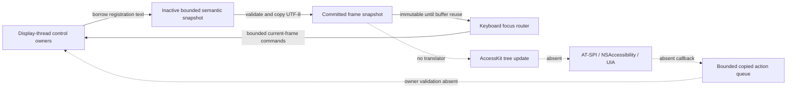
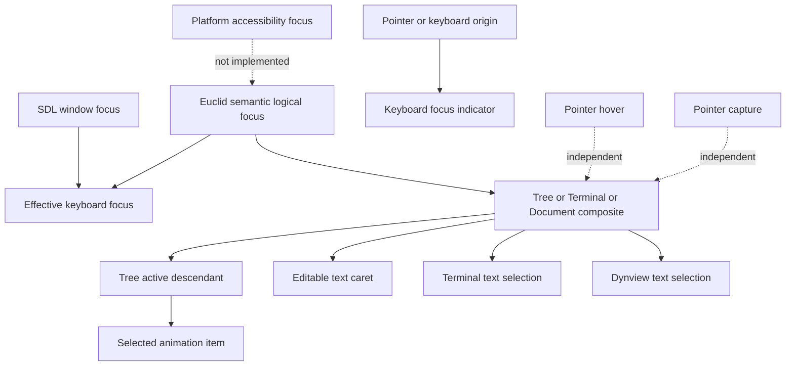
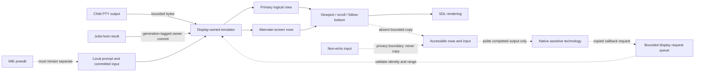
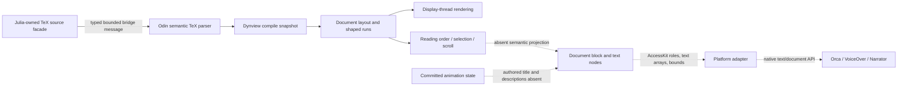
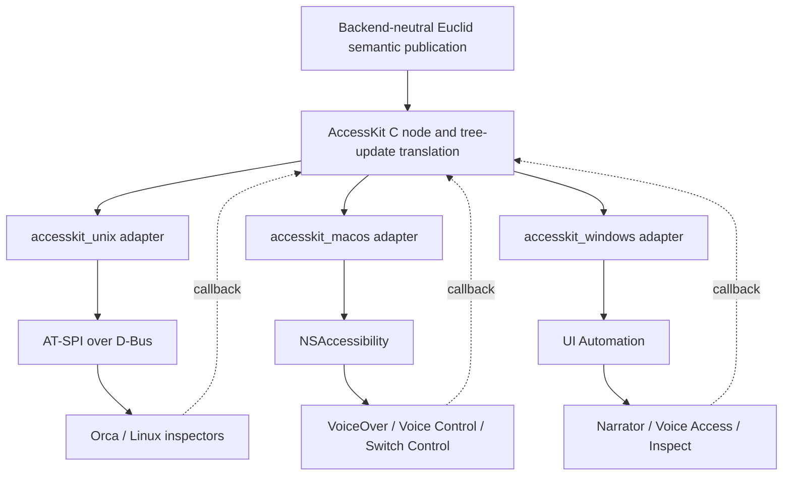
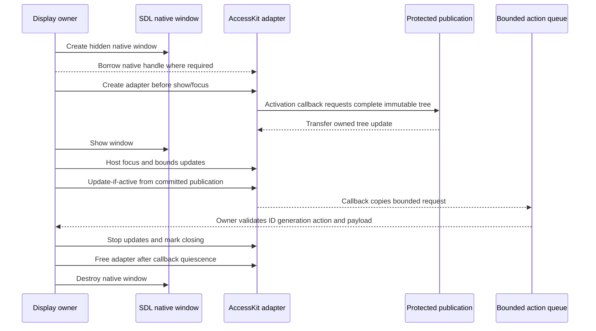

# Exhaustive AccessKit and Cross-Platform Accessibility Research for Euclid

## 1. Scope and Reproducibility

Research date: 2026-09-28. Repository: `EuclidApp`, branch `dev`, commit
`4407759a0e01ccb4932a7eeb81a97959869bfeb0`. The worktree was clean before this
file was created. Submodules were `libs/julia/bindings` at
`3dc128e3431fa6e6e98278e3e672e99471d89adf`, `libs/sdl_shadercross/source` at
`1ff05bec573988a98ef9e0260b4da44f512b8367`, and `tools/analysis` at
`70b818f5f428bdf91234c63b7aedafb6853e6668`.

Host: Gentoo Linux x86-64, kernel `7.2.3-gentoo-dist`, AMD Ryzen 7 5700G.
Tools observed: CMake 4.3.5, Julia 1.13.0, Odin `dev-2026-08`, Rust 1.98.1,
Cargo 1.98.1. The previously completed repository gate
`cmake --build --preset default --target check` exited 0. No native
assistive-technology session was run during this research, so all Orca,
VoiceOver, Narrator, Voice Access, and Switch Control statements below are
public-contract or documented-behavior claims unless explicitly marked
**Empirical**.

A decisive checkout fact is that this branch has **no AccessKit dependency**:
no `libs/accesskit`, header, archive, Odin declaration, CMake reference,
SBOM/runtime-closure component, adapter, action callback, or protected
accessibility publication exists. Therefore there is no “currently pinned
release” in current source. `staging_ime_accessibility.md` records work done on
another branch and proposes 0.23.1; it is historical evidence, not current
implementation evidence. The candidate audited here is AccessKit C 0.23.1,
the newest stable release on the research date.

Evidence labels used throughout:

- **ES**: Euclid source, test, metadata, or checked runtime evidence.
- **APC**: versioned AccessKit/AccessKit C public contract.
- **AI**: AccessKit adapter source/test implementation detail.
- **PPC**: official platform or toolkit public contract.
- **AT**: documented assistive-technology behavior.
- **EMP**: reproduced observation in the stated environment.
- **INF**: inference from cited facts.
- **UNK**: unresolved fact and its smallest resolving experiment.

The investigation read `AGENTS.md`, the architecture, coding, and animation
style guides, `staging_focussystem.md`, `staging_uifocus.md`,
`staging_terminal.md`, `staging_ime_accessibility.md`, current UI, Terminal,
Dynview, focus, input, tests, scenarios, CMake, dependency manifests, and
runtime closure. Staging documents were never used as proof of current code.

## 2. Executive Findings

1. **No native user can discover Euclid through accessibility today.** The
   application has a useful backend-neutral semantic snapshot and keyboard
   focus system, but nothing translates it to AT-SPI, NSAccessibility, or UIA.
   Tree presence inside Euclid is not native tree presence. `ES`
2. **The internal model is structurally valuable but much narrower than the
   native contract.** It owns stable qualified IDs, hierarchy, active
   descendant, role, nine states, eleven actions, bounds, clipping, names and
   values. It lacks descriptions, labelled-by/described-by/controls relations,
   numeric range metadata, orientation, level/set position, live policy,
   busy/error state, text ranges/geometry, scroll ranges, hidden/offscreen
   distinctions, and native update events. `ES`
3. **Many effective controls are already keyboard-operable.** Animation
   restart/pause, accordion headers, search, tree, three integer sliders, five
   checkboxes, four GIF actions, a read-only GIF path, presentation copy
   buttons, Terminal, and presentation participate in semantic focus. `ES`
   Splitters and three scrollbar thumbs remain pointer-only and have no
   semantic nodes. Status and statistics are drawn but unpublished. `ES`
4. **Terminal and Dynview are only structural placeholders.** Terminal is one
   focusable node without rows, prompt, input, caret, selection, scrolling,
   privacy, link, alternate-screen, or live-output semantics. Presentation is
   one document node plus copy buttons; its document blocks, text, math,
   selection and animation meaning are absent from the semantic snapshot.
   These surfaces are not usable through a screen reader. `ES`
5. **Search is editable visually but not an accessible text model.** The node
   publishes a UTF-8 value but no caret, selection, replacement action,
   placeholder, controlled-tree relation, result count, suggestion relation,
   or IME composition boundary. SDL consumes only committed `TEXT_INPUT`; no
   current `TEXT_EDITING` path exists. `ES`
6. **The library tree is the strongest composite.** It publishes a tree,
   visible tree items, parent relations, selected/expanded state, and active
   descendant, and keyboard navigation reveals active rows. It omits levels,
   set size/position, scroll metadata, result status, and offscreen semantics;
   item bounds are published even when clipped. `ES`
7. **AccessKit C 0.23.1 can carry most ordinary-control requirements.** Exact
   C setters exist for roles, names/descriptions/values, relations, active
   descendant, expanded/selected/toggled, numeric min/max/step/jump,
   orientation, level/set position, live/busy/read-only/disabled, scroll
   ranges, text selection, UTF-8 character lengths, word starts, character
   positions/widths, transforms and bounds. Actions cover click, focus,
   expand/collapse, increment/decrement, replace selected text, scrolling,
   text selection and set value. `APC`
8. **Representability is not platform parity.** Math has an AccessKit role but
   no portable MathML or speech-expression payload. AccessKit has no portable
   announcement string API, custom rotor API, native notification policy, or
   complete terminal protocol. Adapter mappings and AT heuristics must be
   qualified on each OS. `APC``AI``INF`
9. **0.23.1 changes dependency and packaging facts, not Euclid behavior.** It
   uses `accesskit` 0.25.1, Windows 0.35.1, macOS 0.27.1, Unix 0.24.0, Rust
   1.87, staticlib/cdylib, MIT OR Apache-2.0. Euclid has no binding to be ABI
   compatible or incompatible with; every declaration is absent. `APC``ES`
10. **The staging implementation record is not present on this branch.** Its
    Phase 0-6 claims are **absent here**, not partially merged: no FFI probe,
    archive manifest, publication, ID registry, adapter, action queue, IME
    state, Terminal rows, presentation structure, or native evidence exists.
    Existing semantic focus and committed text input are the prerequisites
    that remain. `ES`

## 3. Evidence Method and Source Ledger

### Repository sources

| Evidence | Scope and result |
| --- | --- |
| `src/view/model/model.odin` | Authoritative semantic capacities, IDs, roles, states, actions and double buffers. |
| `src/view/ui/focus.odin` | Registration, validation, keyboard routing, focus repair, atomic frame commit. |
| `src/view/ui/*.odin` | Every semantic producer and every pointer-only surface. |
| `src/view/terminal/**`, `src/terminal/**` | Retained grids, logical lines, selection, links, local input, child process and scrolling. |
| `src/dynview/**`, `src/view/ui/dynview/**` | Parsed document/layout, selection and copy-target behavior. |
| `src/view/sdl_input.odin` | Committed text only; no composition event handling. |
| `src/view/ui/focus_test.odin`, UI/Terminal/Dynview tests | Internal behavior only; no native adapter or AT claim. |
| `tools/scenarios/keyboard-*.jsonl` | Keyboard focus vocabulary and ordinary routed behavior. |
| `CMakeLists.txt`, `cmake/**`, `libs/**`, closure JSON | Confirm AccessKit absence. |
| `staging_ime_accessibility.md` | Historical implementation record on another branch; claims reconciled below. |

### Upstream sources

| Class | Versioned source |
| --- | --- |
| AccessKit C releases | <https://github.com/AccessKit/accesskit-c/releases> |
| 0.23.1 tag/header/build | <https://github.com/AccessKit/accesskit-c/tree/0.23.1>, <https://raw.githubusercontent.com/AccessKit/accesskit-c/0.23.1/include/accesskit.h>, <https://raw.githubusercontent.com/AccessKit/accesskit-c/0.23.1/Cargo.toml> |
| 0.23.1 schema docs | <https://docs.rs/accesskit/0.25.1/accesskit/> |
| AccessKit adapters | <https://github.com/AccessKit/accesskit/tree/main/platforms> and crate versions named by 0.23.1 `Cargo.toml`; source behavior is AI, not APC. |
| AT-SPI | <https://gnome.pages.gitlab.gnome.org/at-spi2-core/devel-docs/> and <https://gitlab.gnome.org/GNOME/at-spi2-core> |
| GTK | <https://docs.gtk.org/gtk4/section-accessibility.html> |
| Orca | <https://help.gnome.org/users/orca/stable/> and <https://gitlab.gnome.org/GNOME/orca> |
| Qt | <https://doc.qt.io/qt-6/qaccessible.html>, <https://doc.qt.io/qt-6/accessible-qwidget.html> |
| Apple | <https://developer.apple.com/documentation/appkit/nsaccessibilityprotocol>, <https://developer.apple.com/design/human-interface-guidelines/accessibility>, <https://support.apple.com/guide/voiceover/welcome/mac> |
| Microsoft | <https://learn.microsoft.com/windows/win32/winauto/entry-uiauto-win32>, <https://learn.microsoft.com/windows/apps/design/accessibility/accessibility>, <https://support.microsoft.com/windows/narrator-complete-guide> |
| Secondary comparison | <https://www.w3.org/WAI/ARIA/apg/>; used only for accordion/tree/search comparison where desktop guidance is incomplete. |

Search-result snippets were not accepted as evidence. GitHub release pages, tagged
headers, official API references and source repositories were inspected directly.
Claims about adapter mappings below are scoped as AI unless the platform contract itself
requires the behavior.

## 4. Current Euclid Accessibility Architecture

### Current publication path

Each display frame starts the inactive semantic snapshot, control owners register
complete nodes and copied UTF-8 strings, validation rejects missing parents, duplicate
IDs, bad UTF-8, overflow and tab-order collisions, focus is repaired, and the buffers
swap. Capacities are 1,344 nodes, 64 KiB text and 128 current-frame commands.
`Ui_Node_Id` combines domain, local `u64`, UUID and generation. The committed snapshot
is immutable by convention until reused as staging two frames later. `ES`

There is no application root node. Top-level controls have an empty parent; validation
therefore permits a forest. There is no native attachment, activation, focus forwarding,
bounds update, teardown, callback ingress, privacy filter, protected publication or
platform API edge. `ES`

Keyboard events route against the previous committed snapshot, produce bounded commands,
and are consumed by ordinary owners during the next preparation pass. Pointer capture
can set focus while registering the current frame. Tab order is region then
`traversal_order`: animation overlay, accordion headers, active accordion content,
presentation. Plain Tab remains Terminal input; Ctrl+Tab exits Terminal. Focus repair
prefers same identity without generation, sibling, parent, nearby tab stop, then first
stop. `ES`

### Identity and update behavior

- Static controls use domain/local ID; tree items add stable UUID; Terminal and
  presentation use owner generation. `ES`
- Every valid frame is a full backend-neutral snapshot. No duplicate suppression occurs.
  `ES`
- A native AccessKit update would require complete node records for changed nodes and a
  retained prior publication; neither exists. `ES``APC`
- IDs are not allocated to `u64`, retired, quarantined or checked against native action
  generations because no registry/action callback exists. `ES`
- Bounds and clip bounds are logical SDL coordinates. Clip bounds are not translated to
  hidden/offscreen state; visible tree descendants may have bounds beyond the viewport.
  `ES`
- Rendering and input own hit testing. No semantic hit-test API exists. `ES`

### Staging record reconciliation

| Recorded claim in `staging_ime_accessibility.md` | Current `dev` classification | Current evidence |
| --- | --- | --- |
| 0.23.1 payload, manifest, FFI and ABI probe | Absent | No files, build edge, archive or closure identity. |
| Protected immutable accessibility publication | Absent | Only two frame-reused semantic buffers. |
| Backend ID registry and stale action rejection | Absent | No AccessKit IDs or callback queue. |
| Linux Unix adapter and hidden-window admission | Absent | No adapter symbols or lifecycle path. |
| Bounded native action ingress | Absent | Only keyboard-derived focus commands. |
| SDL IME preedit/caret area | Absent | `TEXT_INPUT` only; no `TEXT_EDITING`. |
| Ordinary controls translated to AccessKit | Absent | Backend-neutral nodes only. |
| Terminal rows, selection and live output | Absent | One Terminal node only. |
| Presentation title/state/structured text | Absent | One Document node plus copy buttons. |
| Semantic focus prerequisites | Completed | Current model/focus/control files and tests. |
| Committed Unicode input | Completed but not IME | UTF-8 `TEXT_INPUT` is decoded to rune events. |
| macOS and Windows parity | Absent/unverified | No platform integration. |

The record may accurately describe another branch, but it cannot prove this checkout.

## 5. Complete Effective-Control Inventory

The compact table below is exhaustive for effective current UI surfaces discovered by
semantic registration, rendering, input routing, focus names and scenarios. `AK` names
0.23.1 symbols or properties; “none now” always means no native publication.

| Surface or meaningful part | Owner; visible/input/focus behavior | Current semantics | Native contract and exact AK mapping | Return route; evidence/gap |
| --- | --- | --- | --- | --- |
| Application window | SDL/native display owner; focus, move, resize, scale | No root node | `WINDOW`, label “Euclid”, children, bounds; adapter focus/bounds calls | Native actions absent; root forest blocks complete tree. |
| Loading/startup/failure | Display startup and diagnostics | No node/status | root `busy`, `STATUS`/`ALERT`, `live` by severity | No announcement or accessibility-failure user feedback. |
| World/construction region | Display renderer; pointer drawing/tools; animation geometry and dust | No node | `REGION`/`GRAPHICS_DOCUMENT`, authored summary; avoid primitive/particle flood | Pointer-only meaning; authored diagram description absent. |
| Accordion container | `accordion.odin`; one panel always expanded | Headers only | `GROUP`, ordered headers/panels | No group/panel nodes or `controls` relations. |
| View header (portrait) | Header label is animation title; click/Enter/Space selects | `Accordion_Header`, selected+expanded | `BUTTON` or `DISCLOSURE_TRIANGLE`, label title, expanded, controls panel | Ordinary owner mutation; changing name may cause noisy speech. |
| Library header | Click/Enter/Space selects | Same | disclosure button “Library”, expanded, controls Library panel | No collapse state: one section always selected. |
| Save GIF header | Same | Same | disclosure button “Save GIF” | No controlled panel identity. |
| Settings header | Same | Same | disclosure button “Settings” | No heading/group semantics. |
| Accordion content panels | Layout owner; hidden when inactive | Descendants omitted | `GROUP`/`PANE`, labelled-by header, hidden descendants omitted | Focus repair exists; native collapse focus outcome untested. |
| Vertical splitter | `splitter.odin`; drag only; EW cursor | None | `SPLITTER`, horizontal orientation, numeric position/range, set/increment/decrement | Pointer-only, unreachable by keyboard/AT. |
| Horizontal splitter | Drag only; NS cursor | None | `SPLITTER`, vertical orientation and range | Pointer-only. |
| Restart animation | overlay icon; click/Enter/Space | Button “Restart animation” | `BUTTON`, click, disabled/busy while unavailable | Same owner command; completion/status absent. |
| Pause/resume animation | overlay icon, state-changing label | Button name changes “Pause/Resume animation” | Prefer stable “Animation” toggle with `toggled` or button name plus state description; click | Name-change announcement behavior platform-dependent; only simulation pause is exposed. |
| Library search input | bounded 512-byte UTF-8; pointer/text keys, Enter, Right accepts suggestion | Input, name, value, focus only | `SEARCH_INPUT`, value, placeholder, text selection, character lengths, replace/set actions, controls tree | Current node cannot edit through AT; no IME preedit model. |
| Search clear icon | enabled only for nonempty query; click/Enter/Space | Button “Clear search” | `BUTTON`, click, disabled state | Correct visible name; no result feedback. |
| “Did you mean” prompt | Drawn text | None | `LABEL` describing suggestion; relation/status as policy warrants | Unreadable. |
| Suggested query | Button; Right at end caret or click/Enter/Space | Button “Use suggested search”, value suggestion | `BUTTON`, label including suggestion or labelled/described relation; click | Current name alone omits spoken target unless value is mapped by adapter. |
| Animation library tree root | wheel/scrollbar, arrow/Home/End, Enter, Space, pointer | Tree, active descendant, select/expand/collapse | `TREE`, label, active descendant, scroll ranges, controls relation from search | Strong structure; no result count/empty node. |
| Tree branch item | Pointer row/expander; roving active item | Tree item, parent, selected, expanded; focusable not tab stop | `TREE_ITEM`, level, expanded, selected, size/position, click/expand/collapse/scroll-into-view | Current hierarchy good; level/count/offscreen missing. |
| Tree leaf item | Pointer row; Enter selects animation | Tree item selected, select | `TREE_ITEM`, level/set metadata, selected, click | Focused vs selected distinct internally; native events absent. |
| Filtered hierarchy | Search policy includes visible ancestors/results; result cap 64, visible ID cap 256 | Rebuilt visible item subset | Stable IDs, retained expansion/selection policy, status count, excluded nodes removed | Same-frame visual/semantic builder is close; asynchronous generation and announcements need proof. |
| Empty results | Tree preparation returns no tree when zero rows | Nothing | status “No animations found”, search controls relation | AT receives no explanation. |
| Tree scrollbar | Thumb drag/wheel, implicit scroll | None | Prefer scroll properties/actions on tree; expose scrollbar only if keyboard-operable | Pointer-only thumb. |
| Presentation document | Dynview or fallback; pointer selection, copy, wheel/Page keys | One Document with no value/content | `DOCUMENT` children in reading order, read-only text runs, selection, scroll ranges | Structural and text semantics absent. |
| Presentation semantic blocks | Parsed headings/paragraph-like TeX blocks | None | `HEADING`, `PARAGRAPH`, `LIST`, `BLOCKQUOTE`, `LABEL` as source warrants | Exact discovered block taxonomy must be read from compiled document; not published. |
| Math expression | Shaped native TeX; selectable/copyable | None, except separate copy button | `MATH` plus readable label/value fallback; no MathML field in AK | Mathematical speech cannot be represented exactly/portably. |
| Copy expression affordance | One icon per copy target; click/Enter/Space | Button “Copy expression” | `BUTTON`, click, contextual name/description; controls/details relation to expression | Duplicate names are ambiguous; no copied status. |
| Dynview selection/caret | Pointer and keyboard selection over compiled/fallback content | Not in node | `text_selection`, character lengths/positions/widths and set-selection action | Internal byte/glyph geometry not translated. |
| Presentation scrollbar | Wheel/thumb and Page Up/Down through document | Document only advertises Scroll | Scroll min/max/current plus four scroll actions | Thumb pointer-only; no scroll offsets in semantics. |
| Fallback plain text | Wrapped selectable text | Document has no value | paragraph/text-run nodes with UTF-8 units and geometry | Unreadable natively. |
| Animation title/state | Title is portrait header; pause overlay | Fragmentary | document/window label; status or state description for selected animation and paused/running | No coherent presentation identity. |
| Terminal composite | Focus, child/local input, mouse, wheel, Ctrl+Tab exit | One Terminal node | `TERMINAL` root with document/input projection and scroll state | Focus only; all text/action semantics absent. |
| Retained output/logical rows | Bounded terminal model, primary and alternate grids, scrollback | None | stable row/paragraph children, text, logical order, visible/offscreen policy | Capacities/eviction must retire IDs and preserve reading position. |
| Wrapped visual rows | Renderer derives wraps/cells from logical content | None | logical text identity with line starts/geometry; do not duplicate speech by visual wrap | Exact mapping absent. |
| Prompt/local editable input | Julia local editing/history/continuation | None | `TEXT_INPUT` child, value/caret/selection, replace/set actions | AT cannot inspect or edit. |
| Child-process mode | PTY input/output, mouse tracking | None | terminal mode/state description; text/action behavior depends on child protocol | Authority and privacy policy absent. |
| Terminal caret/selection | Internal selection, drag, copy | None | `text_selection`, character geometry, set selection, copy policy | AccessKit has no Copy action; copy is app policy/custom action. |
| Terminal history | Up/down local editing | None | remains input behavior, not separate node unless visible chooser | AT result unverified. |
| Continuation state | Prompt/session state | None | description/status attached to input | Unannounced. |
| Alternate screen | Separate grid, no ordinary scrollback expectation | None | same Terminal identity with atomic content update; preserve privacy and avoid stale rows | Real AT behavior unknown. |
| Hyperlinks | Hit-test/pressed state exists | None | `LINK` child with URL/click if stable text range exists | Keyboard/AT link navigation absent. |
| Inline graphics/attachments | No verified accessible projection | None | concise image/figure description if present; never cell flood | Presence and protocols require source/runtime probe. |
| Sensitive/non-echo input | Terminal modes can suppress echo; staging promises privacy only | None/native absent | omit secret text and preedit; password role only for application-owned secret input | Current single node does not leak, but future projection policy unimplemented. |
| Maximum Dust particles | integer 0..`MAX_LOW_PARTICLES`; drag, wheel, arrows, Home/End/Page | Slider name/value only | `SLIDER`, numeric value/min/max/step=1/jump, horizontal, formatted count | Internal commands validate/clamp; no native numeric payload path. |
| Display FPS | checkbox click/Space | Checkbox checked/enabled | `CHECK_BOX`, toggled, click | Complete internally, no native output. |
| Limit FPS | checkbox | Same | Same | Same. |
| Enable Drawing Sound | checkbox | Same | Same | Same. |
| Use SIMD Projection | checkbox, disabled when unavailable | Checkbox name includes “Unavailable”, enabled state | `CHECK_BOX`, disabled; name should remain stable, description may explain | Name conflates availability with identity. |
| GPU Dust Instancing | checkbox, disabled when unavailable | Same issue | Same | Same. |
| Particle/statistics labels | Four changing text rows | None | grouped labels/status; avoid live announcements for every frame | Unreadable; high-rate FPS/stat speech would be harmful. |
| GIF Output scale | integer slider 1..4 displayed 100/50/33/25% | Slider name “Downsample”, numeric string factor | `SLIDER`, 1..4 step 1 plus value text percentage; horizontal | Visible and semantic names differ, harming voice discovery. |
| GIF Capture every | slider 1..4 displayed frame(s) | Slider name/value integer | `SLIDER`, 1..4, value text “frame/N frames” | Units absent. |
| GIF Animation timing | choice button, visually selected | Plain Button, no selected/toggled state | radio button in group or toggle choice; selected/toggled; click | Current native candidate would not expose selected choice. |
| GIF Recorded timing | Same | Same | Same | Same. |
| Save/Cancel GIF | phase-dependent button; disabled recording/finalizing | Button with changing name/enabled | button; busy on operation/status; click | Recording/finalizing label looks actionable while disabled; completion absent. |
| GIF phase/status/note | Idle/Armed/Recording count/Saving/Saved/Error plus note | Drawn only | `STATUS` polite for completion, `ALERT` for error, busy on group/button | Entire asynchronous feedback unreadable. |
| Saved GIF path | read-only selectable input after success | Input, read-only, name/value, focus | read-only text field, selection/character model and copy action/custom policy | Current node exposes string but no selection/copy action. |
| Scrollbars generally | Three custom pointer thumbs plus wheel | No nodes | Prefer scrollable-container properties/actions; separately expose operable scrollbar only if it supports keyboard/value | Pointer-only controls are inaccessible. |
| Keyboard focus indicator | Drawn only for keyboard-origin logical focus | `Focus_Visible` internal flag | native focus separate from visual modality; bounds and focus event | Window focus and semantic focus tracked, native a11y focus absent. |
| Tooltips/popovers/menus/dialogs | None found in current UI | None | No current mapping | Confirm with runtime inspection; no implementation source found. |
| Screenshot scenario action | Test-only, not visible control | None | Not user UI | No application screenshot button found. |

## 6. Cross-Platform Best Practices

### Naming, grouping and relationships

All four families require a concise accessible identity derived from the visible label
where possible; help/description is additional context, not a repeated name. GTK/AT-SPI
uses accessible name/description and relation sets; Qt exposes Name/Description and
relations through QAccessible; AppKit distinguishes label, value, help, role and linked
UI elements; UIA distinguishes Name, HelpText, Value, LabeledBy and control/content
views. `PPC` Voice operation makes exact visible-name agreement especially important on
macOS Voice Control and Windows Voice Access. `PPC``AT`

AccessKit 0.23.1 provides `label`, `description`, `value`, `placeholder`, `tooltip`,
`labelled_by`, `described_by`, `controls`, `details`, `owns`, `active_descendant` and
`member_of`. It does not implement an application-specific name computation; Euclid must
supply coherent data. `APC`

### Focus and operation

Keyboard focus, platform accessibility focus, roving active descendant, text caret,
selection, hover and pointer capture are independent. GTK/Qt trees conventionally put
focus on the composite or item depending widget implementation; AppKit outlines expose
rows and VoiceOver interaction groups; UIA trees expose keyboard focus and
SelectionItem/ExpandCollapse patterns. `PPC` AccessKit has one update `focus` ID and an
`active_descendant` relation. It cannot encode Euclid’s visual focus modality flag as a
portable native concept. `APC`

Tab/Shift+Tab moves among controls. Arrow/Home/End operate trees and sliders. Enter and
Space invoke buttons; Space conventionally toggles checkboxes. Page keys operate
scrollable composites where the application owns them. Escape behavior is contextual;
Euclid has no popup/modal surface. Native AT action handlers should converge on the same
owner mutations as keyboard/pointer, but current code has no AT path. `PPC``ES`

### Text

AT-SPI Text, QAccessibleTextInterface, NSAccessibility text APIs and UIA Text/Text2 are
range models, not one value string. They require text units, caret/selection, range
bounds, hit testing and visible ranges. Platform offsets differ: Unix/Qt contracts are
Unicode-character oriented, AppKit uses `NSRange` UTF-16 conventions in Cocoa strings,
and UIA text providers implement logical text units through provider ranges. `PPC`
AccessKit’s portable model uses UTF-8 value plus `character_lengths` (byte lengths),
`word_starts`, `character_positions`, `character_widths`, and node-based character
indices. Adapter translation remains implementation behavior and must be tested with
combining sequences, bidi and surrogate pairs. `APC``AI`

### Live and asynchronous state

AT-SPI events, Qt announcement events, AppKit notifications and UIA LiveSetting/
notification events differ. AccessKit supplies `live`, `live_atomic`, `busy` and changed
node updates, but no portable “announce this exact string now” callback. `APC` Therefore
status-node updates are portable data while timing, coalescing and exact speech remain
adapter/AT behavior. High-rate animation, FPS and terminal output must not be assumed to
speak usefully. `INF``UNK`

## 7. Control-by-Control Platform Comparison

| Category | GNOME/GTK/AT-SPI/Orca | KDE/Qt/AT-SPI | macOS/AppKit/VoiceOver | Windows/UIA/Narrator/Voice Access | Divergence |
| --- | --- | --- | --- | --- | --- |
| Window/panes | application/window with ordered accessible children; AT-SPI Component bounds | QAccessible Window/Pane; Qt activates Linux bridge from accessibility bus | window/group/pane; VoiceOver interacts into groups | Window/Pane control types and control/content views | Root attachment and grouping differ. |
| Splitter | Separator/split-pane conventions; Value/Action if operable | QAccessible Splitter/ValueInterface | split group and splitter with previous/next contents | Splitter control type, RangeValue where applicable | Keyboard resizing is application/toolkit policy. |
| Search | editable text/search role, name, caret/selection; status result updates | EditableText/TextInterface; explicit relations | search field, label/value/help; VO text interaction | Edit control, Value/Text patterns, Name; result status/notification | Result announcements are not automatic from filtering. |
| Tree | Tree/TreeItem, expanded/selected, level and active descendant; Orca uses widget navigation | QAccessible Tree/TreeItem and Selection/Action; converges through AT-SPI | Outline/row/disclosure, selected rows; interaction group | Tree/TreeItem with SelectionItem, ExpandCollapse, ScrollItem | Active descendant mapping and item focus vary. |
| Slider | Slider + Value interface; arrows adjust and changes announced | Slider + ValueInterface | Slider, min/max/value; increment/decrement actions | Slider + RangeValue, orientation, keyboard | Formatted value speech and discrete allowed values vary. |
| Checkbox | CheckBox, checked/disabled, toggle action | CheckBox/action | checkbox/switch according to meaning | CheckBox or Switch + Toggle pattern | Choose by behavior, not visuals. |
| Push button | PushButton/action | Button/press | button/press | Button/Invoke | Stable visible names aid voice systems. |
| Accordion | Usually disclosure button/heading + expanded; no universal GTK accordion contract | Toolkits commonly use button/disclosure and expanded state | Disclosure triangle/button and group; VO hierarchy | Button + ExpandCollapse; heading is separate text structure | Arrow navigation and single-open policy are application conventions. |
| Status/error | Status/Alert and object events; Orca behavior event-dependent | Status/Alert/Announcement event | status/value change or announcement notification | Status/Text + LiveSetting/Notification | AccessKit cannot force identical queueing. |
| Read-only document | Document + Text, headings/paragraphs | Document/StaticText/TextInterface | document/group/static text, headings and text ranges | Document/Text with Text pattern | Structural navigation breadth differs. |
| Terminal | AT-SPI Terminal/Text; Orca flat review and terminal scripts are empirical | QAccessible Terminal; Konsole behavior is toolkit-specific | terminal/text areas; VO behavior empirical | terminal apps commonly expose Text providers; AccessKit may map Terminal specially | No universal terminal node shape. |
| Math | AT-SPI Math/Equation ecosystem is limited; Orca behavior source/app-specific | QAccessible Equation exists, speech support uncertain | no portable MathML channel in AccessKit/AppKit mapping | UIA math/document support depends provider/AT | Plain speech fallback is common meaning, not semantic parity. |
| Scroll | ScrollPane/Component and actions/value | ScrollArea/ScrollBar interfaces | scroll area and scroll actions | Scroll/ScrollItem patterns | AccessKit scroll properties/actions must be adapter-qualified. |
| Live animation | AT-SPI object events; avoid frame-level chatter | QAccessible announcements available but Euclid does not use Qt | announcements/layout/value notifications | LiveSetting/Notification | Meaningful milestones must be app policy. |

GNOME and KDE must not be conflated. Both often converge at AT-SPI, but GTK and Qt build
different object trees, emit different event sequences and apply different widget keyboard
conventions. Orca is the principal Linux screen reader in both sessions, but Konsole,
Qt custom controls and Plasma focus integration require a representative KDE session.

## 8. AccessKit C Releases, API, and ABI

### Release ledger

There is no Euclid pin. The ledger starts at 0.20.0 because it is the current 2026
release line preceding the candidate and includes every later release through the newest
stable. Earlier transitions are included where they explain ABI semantics.

| C version/date/tag commit | Material change | Candidate impact/evidence |
| --- | --- | --- |
| 0.20.0, 2026-01-18, tag commit `6e07e3d` | Breaking AccessKit crate update | Baseline only; no Euclid binding. Release/changelog APC. |
| 0.21.0, 2026-02-25, `4a7d034` | Android support; Rust 1.85; null accepted for empty slices; custom-action Vec UB fix | Memory-safety and empty-slice behavior matter to any C caller; mobile irrelevant to Euclid desktop scope. |
| 0.21.1, 2026-02-26, `39dd05f` | Android CMake detection fix | Desktop-neutral. |
| 0.21.2, 2026-03-11, `72460cd` | Rust crate dependency batch | Rebuild/provenance change; inspect crate diffs for adapter behavior. |
| 0.22.0, 2026-05-23, `ef2ff77` | iOS adapters, dependency updates | Additive mobile API; desktop candidate remains affected by crate versions. |
| 0.22.1, 2026-05-24, `ff60072` | Windows binary publishing fix | Relevant to artifact provenance, not schema. |
| 0.22.2, 2026-06-15, `68edb3d` | Dependency batch | Rebuild/adapter diff, no release-note C surface claim. |
| 0.22.3, 2026-07-14, `826d672` | Dependency batch; quick-xml build vulnerability exception | Supply-chain review fact. |
| 0.23.0, 2026-09-07, `0824c4a` | Breaking six-crate update | Header/source diff and adapter qualification required; “breaking” is upstream’s classification. |
| 0.23.1, 2026-09-26, `8b6ed37` | Rust MSRV corrected to 1.87; `zbus_xml` 5.2 | Newest candidate. Release bundle SHA-256 `35b7ca8a6f1e038b5da35e1e9e5a0adaed9bfcf21e1496d29598fbbadcc7043f`, 63.9 MB. |

Relevant older ABI landmarks: 0.7.0 changed IDs to `u64`, separated host-window
focus and in-tree focus, and moved app/toolkit metadata to Tree; 0.9.0 changed lazy
initialization; 0.10.0 renamed checked to toggled, dropped ToggleButton, renamed
hierarchical level to level and added owns; 0.11.0 renamed the text-selection setter;
0.12.0 transferred action-request ownership to callbacks and renamed StaticText to Label;
0.13.0 moved C bindings to the standalone repository; 0.18.0 made custom actions opaque,
added length-aware strings and geometry functions. `APC`

### 0.23.1 package/build facts

`Cargo.toml` declares Rust edition 2024, MSRV 1.87, `staticlib` and `cdylib`, release
LTO, `opt-level="z"`, one codegen unit, debug info and `panic="abort"`. Dependencies are
`accesskit` 0.25.1, `accesskit_windows` 0.35.1, `accesskit_macos` 0.27.1,
`accesskit_unix` 0.24.0, Android 0.9.0 and iOS 0.2.1. License is MIT OR Apache-2.0.
`APC`

The release bundle is broader than Euclid’s current desktop targets. The published page
shows one bundle rather than per-target checksums. Exact archive members, target triples,
architectures and per-member hashes were not extracted in this research. [UNK: download
the verified bundle under `.build/`, run `unzip -l`, `sha256sum`, `file`, `nm`/`dumpbin`
and archive-member hashes on each retained library.]

### C ABI cross-check

Because Euclid declares **zero** AccessKit symbols, every 0.23.1 declaration is “missing
by design/current absence”; there are no wrong widths, alignment errors or stale enum
values to report. This is a complete cross-check of the Euclid binding surface: empty
versus nonempty upstream. The exact types required by the discovered UI are:

| ABI item | Exact 0.23.1 representation | Euclid declaration/status |
| --- | --- | --- |
| Action/role and small enums | C typedef `uint8_t`; C++ fixed `: uint8_t` | Absent |
| `accesskit_node_id` | `uint64_t` | Absent; Euclid qualified ID is larger/different |
| `accesskit_tree_id` | 16 big-endian UUID bytes | Absent |
| optional scalar structs | `bool has_value` then typed value; C ABI padding is target-dependent | Absent; requires target layout assertions |
| `accesskit_rect` | four `double`: x0,y0,x1,y1 | Absent; Euclid Rectangle uses `f32` x/y/width/height |
| text position | node `u64` plus `size_t character_index` | Absent; target-width-sensitive |
| action data | enum tag plus anonymous union; includes owned `char *` in request value | Absent; union layout must be asserted per target |
| action request | action, tree ID, node ID, optional action data | Absent; callback owns and must free request |
| callbacks | C calling convention function pointers plus `void *userdata` | Absent |
| opaque node/tree/update/adapters | incomplete structs, pointer-only | Absent |
| arrays | `size_t length` plus pointer; custom action vector differs | Absent; empty null slices allowed since 0.21.0 |

Ownership comments in the tagged header are controlling: node setters copy caller-owned
strings/arrays; AccessKit getter strings must use `accesskit_string_free`; pushing a node
transfers it to the update; pushing a custom action transfers it to the node; action
request ownership transfers to the callback and requires
`accesskit_action_request_free`; queued-event `raise` functions also free events.
`APC`

## 9. Exact Euclid-to-AccessKit Mapping

### AccessKit property matrix

| Requirement | Exact 0.23.1 C surface | Ownership/support | Euclid producer now |
| --- | --- | --- | --- |
| Role/actions | `accesskit_node_new`, `accesskit_node_add_action` | Node owned until update push | role/action sets in semantic nodes |
| Name/description/value | `set_label[_with_length]`, `set_description`, `set_value`, placeholder/tooltip/state-description setters | Setter copies; input remains caller-owned | label/value only |
| Children | `set_children`/`push_child` | Setter copies; update node complete | parent relation must be inverted; no root |
| Relations | controls/details/described-by/labelled-by/owns/radio-group push/set; active-descendant setter | Node IDs retained | only parent/active descendant internally |
| Visibility/state | hidden, disabled, busy, read-only, selected, expanded, toggled | Adapter mapping varies | visible/enabled/read-only/selected/expanded/checked |
| Numeric value | numeric/min/max/step/jump setters | finite doubles required by Euclid validation policy | only formatted string values |
| Structure | level, size-of-set, position-in-set | `size_t` | absent |
| Live | live enum, live-atomic, busy | event speech adapter/AT-dependent | absent |
| Scroll | scroll x/y/min/max plus scroll actions/data | double and point payloads | owner offsets exist, unpublished |
| Text | value, character lengths, word starts, positions, widths, text selection | arrays copied; positions/widths float | source/selection geometry exists in owners, unpublished |
| Geometry | bounds, affine transform, clips-children | doubles/floats; adapter coordinate conversion | logical bounds and clip only |
| Focus | TreeUpdate focus ID; focus/blur actions; active descendant relation | Host focus separately updated on adapters | logical focus/window focus internal |
| Update | tree-update with capacity/focus, push node, tree info/id | update transferred through callback/factory according API | no translator |
| Action payload | optional value, numeric, scroll unit/hint/point/offset/text selection | callback must bounded-copy before free | no ingress |
| Tree metadata | tree info root/toolkit name/version, tree ID | process/tree policy | no app root/tree ID |
| Adapters | Unix/macOS/Windows constructors, update-if-active, focus updates, debug/free | platform thread/lifetime rules | absent |

### Semantic conversion rules supported by evidence

- `Ui_Node_Role.Button` -> `ACCESSKIT_ROLE_BUTTON`; checkbox -> CHECK_BOX;
  input -> SEARCH_INPUT for library and TEXT_INPUT/read-only input as appropriate;
  slider -> SLIDER; tree/tree item -> TREE/TREE_ITEM; document -> DOCUMENT;
  Terminal -> TERMINAL. Accordion header needs semantic reclassification by behavior,
  not a direct one-to-one current enum mapping. `ES``APC``PPC`
- Checked maps to `toggled`, selected remains selected, expanded remains optional bool,
  unavailable maps to disabled. FocusVisible is not native focus. `APC`
- AccessKit children are ordered IDs, while Euclid stores parent IDs. A translator would
  need a complete rooted ordering; no current source specifies an application root or
  group/panel children. `ES``APC`
- Logical bounds must become x0/y0/x1/y1 and account for SDL logical scale/window origin.
  Clip can be represented by `clips_children` on containers and omission/hidden policy;
  AccessKit has no separate clip rectangle property. `APC`
- Full initial admission requires TreeInfo/root and every reachable node. Later updates
  replace complete records for listed IDs; removal follows retained-tree reachability,
  not a Euclid “delete node” C call. `APC``AI`

## 10. Terminal Accessibility Research

### Current contract

The display owns a bounded primary/alternate emulator, logical rows and wrapping,
selection, links, local Julia editing/history/continuation, PTY child mode, mouse
tracking, scrolling and follow-bottom behavior. The UI exposes helpers for line count and
line text. None of those values enter the semantic snapshot. `ES`

The sole node is `Terminal`, label “Terminal”, focusable/tab stop, with only Focus. It
has generation `terminal.animation_generation`, so selection of a replacement Terminal
retires identity internally. There are no row IDs, text value, selection, caret,
character geometry, scroll range, read-only/editable child, live policy, link children,
alternate-screen marker or privacy state. `ES`

### Native and AccessKit contract

A usable projection needs one stable Terminal composite, bounded logical row/paragraph
children in reading order, and a distinct editable input child only when Euclid owns
editing. Rows need stable IDs until eviction, UTF-8 value, character lengths, word
starts and geometry sufficient for native Text APIs. Wrapped visual rows must not become
duplicate logical speech. Selection uses cross-node AccessKit text positions; replacement
belongs only to the editable input. `APC``PPC``INF`

Scroll min/max/current and item/page actions belong on the Terminal or scroll view.
Off-bottom review must remain stable: incoming output may update/append rows without
moving semantic focus or selection. A conservative live node may announce completed
logical output only while following bottom; high-volume and alternate-screen output
requires coalescing policy. AccessKit can mark polite/assertive/live-atomic but does not
specify rate limits. `APC``INF``UNK`

Password/non-echo input must not be copied to any semantic value, log, status or live
node. IME preedit is not committed value; only owner-approved committed text belongs in
the accessible text model. `PASSWORD_INPUT` is inappropriate for a terminal-wide node
because output remains readable. `PPC``APC``INF`

### Platform observations and unknowns

GNOME Terminal/VTE and Orca, Konsole/Qt/AT-SPI, macOS Terminal/VoiceOver and Windows
Terminal/Narrator are useful comparators, but their internal trees are toolkit/application
behavior, not universal requirements. Real testing must establish retained-scrollback
reading, line boundaries, prompt speech, selection, live output, alternate screen and
focus mode for Euclid’s AccessKit adapter. Static inspectors cannot prove any of these.

## 11. Dynview, Mathematics, and Animation Accessibility Research

Current Dynview owns native parsing/compilation, document blocks, shaped text, layout,
copy targets, selection and scrolling. The semantic output collapses all content to one
empty Document node plus generic “Copy expression” buttons. Reading order, headings,
paragraphs, labels, math and fallback text are absent. `ES`

AccessKit 0.23.1 has DOCUMENT, HEADING, PARAGRAPH, LIST/LIST_ITEM, BLOCKQUOTE, LABEL,
MATH, FIGURE and text-run roles, level, text direction, language, character arrays,
selection and geometry. It has no MathML, TeX AST, speech string separate from ordinary
label/value, or portable custom rotor. `APC` Therefore a MATH node can identify category
but cannot preserve fractions, roots, scripts, matrices and operator semantics unless
Euclid also supplies a carefully authored/readable textual representation. Adapter and
AT math speech must be measured on each platform. `INF``UNK`

Reading order must follow the semantic document, not screen coordinates. Character
geometry supports selection/hit testing, but bidi, grapheme clusters and platform range
units require adapter qualification. Copy buttons need expression context; identical
“Copy expression” names are poor voice and switch targets. Decorative geometry and dust
must remain out of the tree. Pedagogically meaningful constructions need concise
authored diagram/proof descriptions and milestone updates; one node per primitive or
particle would be unusable and exceed bounded publication. `PPC``INF`

Animation title, selected animation, paused/running state and meaningful proof progression
are distinct from 60 Hz geometry. Current source exposes title visually and pause state
through a changing button name only. No authored animation-description channel was found.
`ES`[UNK: inspect Julia content schema for explicit narration/description fields; if none,
record that exact absence rather than deriving prose from geometry.]

## 12. Focus, Keyboard, Voice, and Switch Operation

| Composite | Tab/focus current behavior | Roving/caret/selection | Native convention | Current gap |
| --- | --- | --- | --- | --- |
| Overlay | Restart then pause by region/order | None | individual controls in scan/tab order | no native focus/actions |
| Accordion | Every header is a tab stop; one always selected | No roving header model | disclosure buttons, controlled groups; platform arrow convention varies | no controls relation/panel identity |
| Library search/tree | input, clear, suggestion, then tree | tree root holds active descendant; item selected separately | explicit search and composite tree; focus/selection distinct | result restoration/announcement not native |
| Settings | slider then five checks | slider value only | arrows/Home/End/Page, Space toggles | exact ranges/units unpublished |
| GIF | two sliders, two timing buttons, capture, optional path | timing selection not semantic | grouped choices and asynchronous status | choice/status misleading |
| Presentation | document then each copy button | internal text selection | browse/read document, interact with buttons | document content absent |
| Terminal | Terminal tab stop; plain Tab stays in Terminal, Ctrl+Tab exits | local caret/selection independent | application/AT interaction mode empirical | no text/native focus projection |

Voice Control/Voice Access need names matching visible labels. “Downsample” versus visible
“Output scale”, and generic copy buttons, violate that discoverability principle. Switch
Control scanning needs every operable control in ordered groups; pointer-only splitters
and scrollbars are unreachable. `PPC``INF`

Focus restoration is implemented internally when a node disappears or its generation
changes, but there are no native focus-change events. Filtering can preserve active UUID,
and reveal-on-focus exists for tree commands, yet actions arriving during an async filter
transition cannot be stale-checked because no action queue exists. `ES`

## 13. Text, Selection, IME, and Privacy

### Text-surface matrix

| Surface | Storage/editing | Selection units/geometry | Privacy/live | AccessKit requirement/status |
| --- | --- | --- | --- | --- |
| Search | bounded UTF-8, byte cursor/anchor, committed rune input | byte boundaries; visual input geometry exists | not sensitive; no live result policy | SEARCH_INPUT value + character lengths, selection, replace/set actions; absent now |
| GIF path | borrowed saved UTF-8, read-only input widget | internal input selection state | path may reveal filesystem/user names; no redaction policy | read-only text/value/selection; current value exposed internally only |
| Terminal input | local UTF-8 or PTY protocol | owner-specific caret; geometry in renderer | non-echo must be omitted; preedit separate | editable child only in owner mode; absent |
| Terminal output | bounded cells/logical rows | logical lines to visual cells | conservative live policy; eviction | row text/ranges/geometry; absent |
| Dynview | parsed source, shaped runs, fallback text | internal selection and hit testing | animation changes need milestone policy | document/text nodes and range arrays; absent |
| Labels/status | frame strings | no selection | status may be live by meaning | LABEL/STATUS/ALERT; mostly absent |

SDL currently handles valid committed `TEXT_INPUT` and converts it to rune events. It
does not consume `TEXT_EDITING`; there is no composition owner, preedit text, selection,
candidate rectangle or cancellation state. Thus the staging document’s IME isolation
claims are absent. `ES`

AccessKit character indices are not UTF-8 byte offsets. `character_lengths` can describe
how UTF-8 bytes map to characters, but grapheme, word, line, paragraph and visual units
are adapter/platform concerns. Malformed UTF-8 is rejected by semantic registration;
capacity overflow rejects the entire current staging snapshot and retains the previous
committed snapshot. This avoids partial publication internally but has no user-visible
native diagnostic. `ES`

## 14. Lifecycle, Threading, Memory, and Failure

### Lifecycle and threading matrix

| Stage | Current Euclid owner/thread | 0.23.1 adapter contract | Current result/failure |
| --- | --- | --- | --- |
| Process/static linkage | Build system | staticlib/cdylib; platform system closure | not linked |
| Hidden-window creation | SDL display thread creates window per native path | Windows subclassing must precede visible/focus; macOS focus forwarder is relevant to SDL; Unix no window handle constructor | no adapter |
| Adapter creation | none | Unix handlers always on another thread; macOS view pointer lifetime; Windows HWND/thread rules | inaccessible application |
| Activation/initial tree | none | activation callback returns owned complete update | no root/tree |
| Per-frame publication | display thread full internal snapshot | update-if-active factory/queued events by platform | no delivery |
| Host focus | internal window-focused bool | platform adapter focus-state calls | no native focus update |
| Window bounds/scale | SDL metrics/display thread | Unix root bounds meaningful under X11, not Wayland; platform adapters use native coordinates | no native bounds |
| Action callback | none | request ownership transfers; Unix callbacks another thread; Windows action may be off window thread | no AT operation |
| Bounded request commit | keyboard commands only on display thread | application must copy/validate and mutate on owner thread | absent for AT |
| Reload/generation | display owner repairs semantic IDs | retained native IDs need retirement/stale rejection | absent |
| Deactivation/service loss | none | Unix deactivation callback; inactive update may not build | silent native absence |
| Teardown | SDL/native resources | stop callbacks, free queued events/adapters before native window and callback storage | absent |

Current semantic snapshots borrow no control strings after registration; they copy into
64 KiB storage. They are not safe for asynchronous callbacks because each buffer is
reused. A native callback must never borrow them. Julia remains isolated: accessibility
must consume display-owned committed projections, not call Julia. `ES``INF`

The Unix header explicitly says all handlers are called from another thread. The macOS
focus forwarder mutates the NSWindow class and cannot be reversed, so the header calls
static linkage safest and requires library code never unload. Windows subclassing must
be created before the window is shown or focused and its action handler may run on a
non-window thread. `APC`

Invalid, stale, unsupported, NaN/infinite and out-of-range payload behavior is currently
undefined because there is no callback. Any later evidence must distinguish rejected
actions from silently ignored actions. Accessibility initialization failure currently
has no concept or diagnostic; the application simply has no accessibility. It is not
evidence-based to call that graceful degradation. `ES`

## 15. Build, Packaging, Licensing, and Platform Closure

Current checked build intent, archives, linked binary, packaged files, SBOM and runtime
closure contain no AccessKit. `ES` Candidate 0.23.1 offers static and dynamic Rust
libraries and has MIT OR Apache-2.0 licensing. Exact release notices and archive members
must accompany whichever license path is selected; this report makes no packaging
decision. `APC`

Platform closure expected from adapter contracts/source includes AT-SPI over D-Bus on
Unix, AppKit/Objective-C frameworks on macOS, and UI Automation/COM/Win32 on Windows.
These are runtime/platform dependencies, not files that necessarily appear beside the
executable. `PPC``AI` SDL native handle acquisition must preserve SDL ownership: HWND or
NSView/NSWindow pointers are borrowed for adapter lifetime; Unix uses its own adapter and
root bounds. Exact link libraries/order/deployment target and release archive symbols
remain unverified for Euclid. `UNK`

The 0.23.1 release profile aborts on Rust panic. C header comments also document
constructor panic conditions. No evidence shows that every panic is contained at the C
boundary; partial construction and malformed input require a probe rather than an
assumption. `APC``UNK`

## 16. Verification Evidence and Empirical Log

### Commands/searches executed

- `git status --short --branch`, `git rev-parse HEAD`, `git submodule status`.
- `cmake --version`, `julia --version`, `odin version`, `rustc --version`,
  `cargo --version`, `uname -a`.
- Repository `rg` searches for AccessKit/accessibility, semantic registrations, roles,
  actions, controls, labels, focus names, build and closure entries.
- Direct reads of model/focus and every control producer named in this report.
- Direct fetch of AccessKit C release page, tagged 0.23.1 changelog, header and
  `Cargo.toml`, plus AccessKit 0.25.1 docs.

Observed: no local AccessKit references except staging/docs; semantic model and controls
listed above; release page latest is 0.23.1; tagged header and package versions match the
ledger. `EMP`

### Current verification matrix

| Behavior | Deterministic coverage now | Inspector/AT evidence now | What it proves / smallest missing check |
| --- | --- | --- | --- |
| Atomic semantic registration | focus tests | none | copied UTF-8/capacity/validation only; needs native tree dump |
| Focus traversal/repair | focus tests, keyboard scenarios | none | internal focus only; needs platform focus event observation |
| Tree keyboard/hierarchy | tests/scenarios | none | owner behavior; needs Orca/VO/Narrator selection/expand speech |
| Search editing | input-box tests | none | committed UTF-8 editing; needs native Text interface and IME test |
| Sliders/checks/buttons | UI/focus tests | none | keyboard/pointer owner mutation; needs native action/value events |
| Terminal selection/copy | Terminal tests | none | internal logical selection; needs Text API and real AT review |
| Dynview selection/copy | Dynview tests/scenarios | none | internal geometry; needs range inspection and speech |
| Adapter ABI/lifecycle | none | none | candidate header only; needs compile/link/layout/symbol probe |
| Bounds/scale | SDL geometry tests/scenarios | none | visual geometry; needs native inspector on move/DPI/monitor |
| Privacy | no native projection exists | none | currently no native leak; future row/input projection needs redaction test |

### Reproducible research probes

These are experiments, not an implementation sequence.

| Hypothesis | Environment and exact procedure | Expected native behavior / question | Portability limit |
| --- | --- | --- | --- |
| Candidate ABI/artifacts match header | Download 0.23.1 to `.build/accesskit-audit`; verify published SHA; list archive; `file`, `ar t`, `nm -g --defined-only`; compile a temporary C `sizeof`/enum/callback probe for each target | Symbols/layouts match tagged header; identify system link closure | Host can inspect Linux only; macOS/Windows need native toolchains |
| Current binary has no AT-SPI tree | Gentoo GNOME/Wayland and X11; launch debug Euclid with Orca, inspect with Accerciser/AT-SPI query | No Euclid custom tree is present | Linux only; confirms current absence, not candidate quality |
| Tree is usable after adapter projection | Representative GNOME+Orca, KDE Plasma+Orca, macOS+VO, Windows+Narrator; filter, arrows, expand/collapse, activate, clear | Role/name/level/count/selected/expanded and focus restoration are coherent | Each result scoped to exact OS/AT/adapter version |
| Search preedit stays private | IBus/Fcitx, macOS Japanese IME, Windows TSF; inspect value during preedit and after commit | Published value remains committed text; caret/candidate position correct | Requires an implementation; current checkout fails at event ingestion |
| Terminal review is stable off-bottom | Generate timestamped slow then burst output; scroll back with AT; inspect selection and continue output | Reading position remains, completed output policy avoids chatter | Terminal/AT heuristics differ |
| Alternate screen does not expose stale rows | Run full-screen child, enter/exit alternate screen, inspect tree/text | Current screen is coherent; primary rows restore without stale IDs | Child applications differ |
| Sensitive input is absent | Use a known no-echo prompt; inspect tree/events/log and speech | Secret and preedit never appear | Requires controlled sacrificial input, never real credentials |
| Dynview order/math is meaningful | Load representative headings, paragraphs, fractions, roots, scripts, matrices; inspect tree and read with each AT | Semantic order beats coordinates; fallback speech is understandable | No single AT result generalizes |
| Geometry is authoritative | Move/resize across DPI monitors; query character and node bounds; hit-test; repeat X11/Wayland | Inspector focus rectangle matches pixels | Wayland absolute window position is restricted; adapter behavior differs |
| Status feedback is neither lost nor duplicated | Start/cancel/save/fail GIF; reset/pause/select animation; observe event/speech log | One meaningful pending/completion/error announcement | Notification queue behavior is AT-specific |
| Late callback is rejected | During reload/filter/removal, issue action from inspector automation against old runtime ID | No unrelated new node is mutated; diagnostic records stale rejection | Requires action-capable automation per platform |
| Shutdown is race-free | Activate AT, repeatedly open/close app under sanitizer/debug diagnostics | No callback after storage/window teardown; native element becomes unavailable | Sanitizers/platform diagnostics differ |

No probe above was executed beyond source/release inspection; observed-result cells are
therefore intentionally absent rather than fabricated.

## 17. Confirmed Gaps, Divergences, and Unknowns

| Finding | Class/confidence | User consequence | Evidence needed to close |
| --- | --- | --- | --- |
| No native adapter/tree | Confirmed, high `ES` | Entire custom UI undiscoverable to AT | Native inspector after integration |
| No root/protected publication | Confirmed, high `ES` | No valid complete async tree/lifetime | deterministic publication/lifecycle test |
| Splitters/scrollbars pointer-only | Confirmed, high `ES` | keyboard/voice/switch users cannot resize/drag thumbs | keyboard and AT action tests |
| Terminal one empty node | Confirmed, high `ES` | output/input/caret/selection unavailable | Text API + real AT qualification |
| Dynview one empty document | Confirmed, high `ES` | proof/math/fallback unreadable | document tree/range inspector and AT speech |
| Search lacks text actions/ranges | Confirmed, high `ES` | AT cannot edit or inspect caret | native text/action automation |
| Tree lacks level/set/scroll metadata | Confirmed, high `ES` | hierarchy/count/location may be ambiguous | adapter tree dump and speech |
| GIF choice buttons lack selected state | Confirmed, high `ES` | timing choice is misleading | role/state inspection |
| Status/statistics absent | Confirmed, high `ES` | save failures/completion unreadable | event/announcement tests |
| Duplicate copy names | Confirmed, high `ES` | voice and switch target ambiguity | Voice Control/Voice Access discovery |
| Pause uses changing name | Confirmed, medium `ES``PPC` | AT announcement may be confusing | per-platform speech observation |
| No IME composition | Confirmed, high `ES` | CJK/dead-key composition contract incomplete | native IME tests after event support |
| 0.23.1 can encode ordinary properties | Confirmed, high `APC` | candidate is semantically broad | adapter mapping tests still required |
| Math semantic speech parity | Unsupported/unknown `APC``AI` | equations may be poorly spoken | exact AT/version matrix with representative math |
| Terminal adapter quality | Unknown `AI``AT` | tree may exist but remain unusable | real Orca/VO/Narrator workflows |
| Wayland absolute bounds | Platform divergence `APC``PPC` | screen extents/hit testing may differ | GNOME/KDE Wayland inspector probe |
| Custom rotor/announcement API | Unsupported directly `APC` | portable tree cannot request all native affordances | adapter feature audit or platform extension evidence |
| Archive closure and ABI | Unknown for Euclid `ES``APC` | build/link/release risk | artifact/symbol/layout probes on three targets |
| Accessibility failure UX | Confirmed absent `ES` | silent loss of semantic updates | diagnostics/failure injection and user observation |

## 18. Required Matrices

The preceding inventory and comparison tables are normative parts of the required
matrices. This section collects the remaining cross-cuts without collapsing controls.

| Required matrix | Location in this report |
| --- | --- |
| 1. Complete control inventory | Section 5, exhaustive surface/subpart table |
| 2. Platform practice | Sections 6 and 7, control-by-control platform comparison |
| 3. AccessKit property | Section 9, AccessKit property matrix |
| 4. Focus and navigation | Section 12 |
| 5. Text surface | Section 13 |
| 6. Treeview | This section, Treeview matrix |
| 7. Value control | This section, Value-control matrix |
| 8. Button and accordion | This section, Button and accordion matrix |
| 9. Terminal contract | This section, Terminal contract matrix |
| 10. Dynview and math | This section, Dynview and math matrix |
| 11. AccessKit C release ledger | Section 8 |
| 12. C ABI cross-check | Section 8 |
| 13. Lifecycle and threading | Section 14 |
| 14. Platform adapter | This section, Platform adapter matrix |
| 15. Verification | Section 16 |
| 16. Gap | Sections 17 and 18 |

### Treeview matrix

| Part | Identity/hierarchy | State/action/filter behavior | Missing AccessKit fields |
| --- | --- | --- | --- |
| Root | static Animation_Tree local ID | active descendant, Select/Expand/Collapse; one tab stop | controls relation, scroll values, multiselect policy |
| Branch | stable UUID plus parent tree | expanded/selected; Select/Expand/Collapse/Toggle | level, position/size, scroll-into-view action |
| Leaf | stable UUID plus parent tree | selected; Select | level, position/size |
| Filtered ancestor | same UUID, policy-expanded | included to preserve hierarchy | reason/result match state optional |
| Excluded item | absent from current snapshot | not drawn/operable | retained adapter removal/event behavior unimplemented |
| Empty result | no root registration | no status | STATUS “No animations found” |
| Scroll/reveal | owner offset/thumb; keyboard reveal | wheel/drag and active-item reveal | min/max/current, page/item actions |
| Generation transition | current query/index/commit generations | internal search rejects stale result generations | native request generation/stale rejection absent |

### Value-control matrix

| Control | Range/step/unit/display | Pointer/keyboard | Native mapping/gap |
| --- | --- | --- | --- |
| Maximum Dust particles | 0..MAX_LOW_PARTICLES, step 1, count | drag/wheel; arrows, Home/End, 10% Page | SLIDER numeric min/max/value/step/jump/orientation; current publishes string only |
| GIF Output scale | factor 1..4, step 1; 100/50/33/25% | same | numeric factor plus percentage value text; name mismatch |
| GIF Capture every | 1..4, step 1; frame/N frames | same | numeric range plus cadence value text/unit |
| Vertical splitter | clamped layout pixels/ratio | drag only | SPLITTER numeric position/range, horizontal orientation, set/increment |
| Horizontal splitter | clamped layout pixels/ratio | drag only | SPLITTER, vertical orientation |
| Presentation scroll | 0..content-view | wheel/thumb/Page | scroll_y/min/max + item/page/set offset |
| Terminal scroll | model-dependent | wheel/thumb | same plus follow-bottom state policy |
| Tree scroll | 0..rows-view | wheel/thumb, reveal active | same plus ScrollIntoView on item |

All numeric callback values require finite checks, action support checks, exact target and
generation validation, conversion policy, owner-side clamp, and no mutation on NaN,
infinity or stale ID. No current native path performs these checks.

### Button and accordion matrix

| Control | Semantic role/state | Feedback/focus consequence |
| --- | --- | --- |
| Restart | push button, enabled/busy according to owner | retain focus; completion/failure status absent |
| Pause/resume | toggle or stateful push button; paused state | retain focus; animation state announcement absent |
| Clear search | push button disabled when empty | focus remains or moves by owner policy; result status absent |
| Suggestion | push button with suggestion in name/context | query changes, tree updates; announcement absent |
| Copy expression | push button contextualized by expression | clipboard result/status absent |
| GIF timing choices | radio/toggle choices in named group | selected state absent now |
| Save/Cancel GIF | push button; busy/disabled phases | status/error nodes absent |
| Accordion headers | disclosure buttons, expanded, controls panel | one panel always expanded; hidden descendants omitted; native relation absent |

### Terminal contract matrix

| Concern | Current owner fact | Required semantic fact | Status |
| --- | --- | --- | --- |
| Logical rows | bounded emulator/view helpers | stable row identity/text/order | absent |
| Wrapping | visual cells/layout | logical text plus line geometry | absent |
| Prompt/input | local Julia or child mode | editable child only when app owns it | absent |
| Continuation/history | local editing state | state description, ordinary input behavior | absent |
| Caret/selection | internal byte/logical selection | character-index selection and range geometry | absent |
| Copy | internal clipboard route | selection plus app/custom copy action policy | absent |
| Scroll/follow | model offset and wheel/thumb | scroll values; no reading-position theft | absent |
| Live output | ordinary model updates | bounded completed-row policy | absent |
| Alternate screen | separate emulator grid | atomic replacement/restoration | absent |
| Privacy | echo/protocol state | never publish secret/preedit | policy absent |
| Links | hit-test structures | LINK range/URL/click | absent |
| Eviction | bounded storage | deterministic ID retirement and stale action rejection | absent |

### Dynview and math matrix

| Structure | Current source capability | Desired AccessKit representation | Limit |
| --- | --- | --- | --- |
| Document root | compiled revision, viewport | DOCUMENT, label/title, scroll state | present only as empty node |
| Heading/paragraph/list/quote | semantic parser/block model | corresponding roles, ordered children, level | exact current block coverage needs a generated-document census |
| Text run | shaped UTF-8 and glyph geometry | LABEL/TEXT_RUN value, character arrays | bidi/grapheme adapter behavior unknown |
| Inline/display math | native TeX semantic parse/layout | MATH with readable expression fallback | no portable MathML/speech tree |
| Fraction/root/scripts/matrix | parser/layout semantics | authored or generated speech within math subtree/text | AT quality unknown |
| Selection/copy | internal ranges/copy targets | text selection/geometry; contextual copy buttons | no current publication |
| Scrolling/clipping | viewport/offset/scissor | scroll range, clips-children, hidden/offscreen policy | no separate clip rectangle in AK |
| Animation meaning | title, selected state, geometry changes | title/state/status and authored milestone description | authored description channel unverified |
| Geometry/dust | render primitives/particles | omit decorative nodes; concise figure description | descriptions absent |

### Platform adapter matrix

| Adapter | Public entry/lifecycle | Mapping guarantees vs implementation | Key limitations/unknowns |
| --- | --- | --- | --- |
| Unix | new with activation/action/deactivation; update-if-active; host-focus; X11 root bounds; free | C signatures/thread comments APC; exact AT-SPI roles/events AI | handlers on another thread; Wayland position caveat; Orca heuristics empirical |
| macOS | view adapter or subclassing; queued events must raise; host-focus; children/focus/hit-test; free | NSAccessibility contract PPC; mapping AI | SDL window focus forwarder irreversible; main-thread/native-object lifetime; rotors/announcements not in schema |
| Windows | HWND adapter or pre-show subclassing; WM_GETOBJECT for non-subclass; queued events; host-focus; free | UIA patterns PPC; role/event implementation AI | COM/callback thread, runtime ID/stale element behavior and Text2 mapping require tests |

### Gap confidence matrix

“Confirmed gaps” are source absences, not proposed work. “Release-dependent” means
0.23.1 represents the fact but earlier/candidate adapter behavior may differ.

| Gap | Release dependence | Confidence | User impact |
| --- | --- | --- | --- |
| Native tree absent | none | high | total AT inaccessibility |
| Rich ordinary properties absent locally | 0.23.1 supports them | high | controls structurally incomplete |
| Text range models absent | 0.23.1 supports base arrays/selection | high | text unusable |
| Math speech payload unsupported | schema-wide | high | limited equation meaning |
| Platform announcements/rotors | adapter/platform extension | medium-high | differing update/navigation quality |
| Terminal semantics | schema supports primitives, app policy required | high | terminal unusable |
| Callback/lifecycle safety | adapter-specific | high absence, behavior unknown | crashes/stale mutation risk if added incorrectly |

## 19. Required Diagrams

### Current publication and missing native edge

### Focus relationships

### Terminal flow and privacy

### Dynview document flow

### Platform adapter mapping

### Adapter lifecycle

The protected publication and queue in this lifecycle are required authority boundaries
from the governing ownership model, but are explicitly **absent current behavior**.

## 20. Source Index

### Euclid

- `AGENTS.md`
- `docs/wiki/Guides/ArchitectureSummary.md`
- `docs/wiki/Guides/CodingStandards.md`
- `docs/wiki/Guides/AnimationsStyle.md`
- `docs/wiki/Guides/UiSystem.md`
- `staging_focussystem.md`, `staging_uifocus.md`, `staging_terminal.md`,
  `staging_ime_accessibility.md`
- `src/view/model/model.odin`
- `src/view/ui/focus.odin`, `focus_test.odin`, `ui.odin`, `ui_test.odin`
- `src/view/ui/accordion.odin`, `animation_controls.odin`, `library_search.odin`,
  `tree_panel.odin`, `settings_panel.odin`, `sliders.odin`, `checkbox.odin`,
  `gif_panel.odin`, `splitter.odin`, `scroll.odin`, `text_panel.odin`,
  `terminal.odin`, `interaction.odin`, `input_box.odin`
- `src/view/ui/dynview/**`, `src/dynview/**`
- `src/view/terminal/**`, `src/terminal/**`
- `src/view/sdl_input.odin`, `src/view/native/**`
- `tools/scenarios/keyboard-focus-acceptance.jsonl`,
  `tools/scenarios/keyboard-tree-focus-acceptance.jsonl`, and presentation scenarios
- `CMakeLists.txt`, `cmake/**`, `.gitmodules`, `runtime-closure.cdx.json`,
  `bin/runtime-closure.generated.cdx.json`

### AccessKit

- <https://github.com/AccessKit/accesskit-c/releases>
- <https://github.com/AccessKit/accesskit-c/releases/tag/0.23.1>
- <https://raw.githubusercontent.com/AccessKit/accesskit-c/0.23.1/include/accesskit.h>
- <https://raw.githubusercontent.com/AccessKit/accesskit-c/0.23.1/Cargo.toml>
- <https://raw.githubusercontent.com/AccessKit/accesskit-c/0.23.1/CHANGELOG.md>
- <https://docs.rs/accesskit/0.25.1/accesskit/>
- <https://github.com/AccessKit/accesskit>

### Linux

- <https://docs.gtk.org/gtk4/section-accessibility.html>
- <https://gnome.pages.gitlab.gnome.org/at-spi2-core/devel-docs/>
- <https://gitlab.gnome.org/GNOME/at-spi2-core>
- <https://help.gnome.org/users/orca/stable/>
- <https://gitlab.gnome.org/GNOME/orca>
- <https://doc.qt.io/qt-6/qaccessible.html>
- <https://doc.qt.io/qt-6/accessible-qwidget.html>

### Apple

- <https://developer.apple.com/documentation/appkit/nsaccessibilityprotocol>
- <https://developer.apple.com/documentation/appkit/nsaccessibility>
- <https://developer.apple.com/design/human-interface-guidelines/accessibility>
- <https://support.apple.com/guide/voiceover/welcome/mac>
- <https://support.apple.com/guide/mac-help/use-voice-control-mh40719/mac>
- <https://support.apple.com/guide/mac-help/use-switch-control-mh43607/mac>

### Microsoft

- <https://learn.microsoft.com/windows/win32/winauto/entry-uiauto-win32>
- <https://learn.microsoft.com/windows/win32/winauto/uiauto-controlpatternsoverview>
- <https://learn.microsoft.com/windows/win32/winauto/uiauto-supportinguiautocontroltypes>
- <https://learn.microsoft.com/windows/apps/design/accessibility/accessibility>
- <https://support.microsoft.com/windows/narrator-complete-guide>
- <https://support.microsoft.com/windows/use-voice-access-to-control-your-pc-author-text-and-interact-with-text>

### Secondary semantic comparison

- <https://www.w3.org/WAI/ARIA/apg/patterns/treeview/>
- <https://www.w3.org/WAI/ARIA/apg/patterns/accordion/>
- <https://www.w3.org/WAI/ARIA/apg/patterns/slider/>

This log intentionally makes no implementation decision, phased proposal, schedule,
estimate or patch recommendation. It records current behavior, exact candidate capability,
platform contracts, adapter limitations, user consequences and the smallest evidence
needed to resolve each unknown.

## 21. Development Addendum: Empirical Record Through Linux Basic Text

### Addendum scope and baseline supersession

This addendum records implementation and native observations made after the research
baseline above. It does not rewrite the original 2026-09-28 checkout facts. Statements
above that describe AccessKit, a native adapter, protected publication, native actions,
or AT-SPI as absent remain accurate for commit
`4407759a0e01ccb4932a7eeb81a97959869bfeb0`; they are superseded for the current
development branch by this addendum.

The recorded implementation state is the clean `dev-access2` worktree at commit
`651e3f6ed3a00d8cb552078d6b16e491b1e4ecb5`. The accessibility implementation
sequence after the original `dev` baseline is:

| Commit | Implemented slice |
| --- | --- |
| `221d516` | Repository-owned AccessKit C provider and build integration. |
| `e7a6c87` | Smallest rooted Linux accessibility tree. |
| `dffd163` | First real restart-animation button and native action round trip. |
| `eb7ddb7` | Linux ordinary controls and bounded status. |
| `651e3f6` | Linux Search, Tree, composite scrolling, and basic editable text. |

Evidence labels retain the meanings defined in Section 1. In this addendum, `EMP`
means reproduced during implementation on the Linux development host. Generated
native evidence is under `.build/accessibility-button/`; it is reproducible output,
not checked-in source.

### Implemented dependency and ABI facts

AccessKit C is no longer absent. `libs/accesskit/` pins AccessKit C 0.23.1 from source
commit `8b6ed37c20ed4c59390e253407983333053662ba` and the upstream release bundle with
SHA-256 `35b7ca8a6f1e038b5da35e1e9e5a0adaed9bfcf21e1496d29598fbbadcc7043f`.
The tagged header hash is
`1a99c7a8dac2f5b4fa99ab323d0274ab5a3bbac8bee02220ef941cde4d36af4f`.
The repository retains and validates these payload classes without system fallback:

- Linux x86-64 GNU shared library;
- macOS arm64 and x86-64 shared libraries;
- Windows x86-64 MSVC DLL and import library.

Each payload has a schema-versioned manifest with platform, architecture, ABI,
artifact role, hashes, license, notices, crate versions, and declared native
dependencies. The Linux manifest records `accesskit` 0.25.1 and `accesskit_unix`
0.24.0. Build configuration validates the selected manifest and hashes before exposing
link and runtime paths. Generated runtime closure identifies the retained provider.
`ES``EMP`

The checked-in C/Odin ABI probe now compiles against the tagged header, links the
retained host payload, checks selected enums and layouts, and exercises node ownership.
On the Linux x86-64 host it passed with these observed values:

| Fact | Observed value |
| --- | ---: |
| Click action enum | 0 |
| Focus action enum | 1 |
| Button role enum | 18 |
| Node ID size | 8 bytes |
| Tree ID size | 16 bytes |
| Optional node ID | 16 bytes |
| Optional scalar/index | 16 bytes |
| Rectangle | 32 bytes |
| Text position | 16 bytes |
| Text selection | 32 bytes |
| Action data | 40 bytes |
| Optional action data | 48 bytes |
| Action request | 80 bytes |
| Action request data offset | 32 bytes |

The retained macOS and Windows artifacts are manifest-validated in source, but this
addendum does not claim that their ABI probes or adapters were run natively. `EMP`

### Implemented ownership and publication facts

The Linux implementation preserves the ownership model proposed by the research:

- `src/accessibility/` owns backend-neutral native-ready publication, validation,
  protected snapshot storage, monotonic native IDs, retirement, and the bounded action
  queue.
- `src/view/native/accessibility/` owns the AccessKit Unix adapter, callbacks, native
  translation, action validation, lifecycle diagnostics, and platform teardown.
- `src/view/view.odin` drains validated actions on the display thread and converges
  them through existing UI owner commands.
- Native callbacks do not enter Julia, mutate UI state, or retain frame-owned semantic
  pointers.

The ordinary-control publication is fixed-capacity and owns complete copied records:
320 controls, 32 KiB of text, and 1,024 character and word-start entries. It carries a
synthetic root, generation, hierarchy, active descendant, controls relation, role,
bounds, label, value, placeholder, action set, numeric range, state, text selection,
level, position, and set size. A mutex-protected current slot remains immutable while
callbacks copy or translate it. Invalid staging does not publish a partial native tree.
`ES`

The native registry has 4,096 entries, reserves native ID 1 for the synthetic root,
allocates monotonically, retains full qualified identities, retires removed mappings,
and never reuses retired IDs during the window session. The callback queue has 64
entries and copies payloads up to 512 bytes. It records bounded accepted, drained,
closing, overflow, invalid-request, and peak-pressure diagnostics. `ES`

Adapter action validation distinguishes unknown targets, stale publication generation,
removed targets, unsupported actions, disabled targets, and invalid values. Display
delivery carries only copied identity, numeric value, text, and selection facts. Adapter
creation, activation, callback rejection, actions, deactivation, updates, destruction,
and action rejection are counted without logging user text. `ES`

The enlarged native platform owner crossed Odin's strict stack threshold during
development. The display loop now allocates `Sdl_Platform` explicitly with
`context.allocator` for the window-session lifetime and frees it after native teardown.
This was a concrete lifetime/stack correction, not an accessibility semantic change.
`EMP`

### Implemented Linux surface

The Linux projection now contains a synthetic application root and the implemented
ordinary UI controls. Proven families include:

- restart and pause animation buttons;
- accordion headers and panel visibility;
- checkboxes and toggled state;
- integer sliders and finite numeric values;
- bounded application/GIF status;
- Library Search with committed editable text;
- the Library Tree, nested TreeItems, active descendant, selection, expansion,
  structural position, and composite scrolling.

Publication uses prepared semantic identity and geometry. Top-level controls become
ordered children of the synthetic root without making the root an internal Tab stop.
Removed controls retire their native IDs, and reappearing qualified identities receive
fresh IDs. Empty child lists and an absent active descendant are explicitly cleared in
AccessKit updates; omitting those properties was empirically found to preserve stale
native state because AccessKit node updates are partial. `ES``EMP`

Search owns the interactive text node and a stable derived `TextRun` child. Search
publishes its name, placeholder, committed value, caret and selection, UTF-8 character
lengths, word starts, editable actions, bounds, and a controls relation to the Tree.
IME preedit is not copied into the committed value. Library ownership of query,
debounce, spell correction, filtering, result generation, suggestion, and status is
unchanged. Suggestion naming includes the suggested text, and result/no-result feedback
uses bounded status publication. `ES`

Tree keeps one composite Tab stop and a roving active descendant. Visible items retain
UUID-backed identity and publish nested parentage, selected state, branch expansion,
level, position, set size, and clipped bounds. Search filtering atomically replaces the
visible topology. Tree scroll range is exposed on the composite; the visual scrollbar
thumb remains absent from native focus order. `ES`

### Empirical AccessKit text contracts

Live development exposed contracts that were not safely inferable from the C schema
alone:

1. A flat `SearchInput` with a string value did not expose the AT-SPI Text interface.
  AccessKit's consumer requires a `TextRun` descendant for text ranges. `EMP``AI`
2. Every `TextRun` must have a value property, including the empty string. An empty
  TextRun without a value reached an AccessKit consumer unwrap and disconnected the
  client. `EMP``AI`
3. Character lengths and word starts belong on the `TextRun`. The editable SearchInput
  owns selection, but its AccessKit text positions point into that child. Incoming
  positions are normalized back to the Search owner before display mutation.
  `EMP``AI`
4. AT-SPI `EditableText.setTextContents` arrives from `accesskit_unix` as
  `Action::SetValue` with string data, not `ReplaceSelectedText`. Euclid therefore has
  a distinct bounded whole-text replacement command in addition to selected-text
  replacement. `EMP``AI`
5. Euclid's editor stores UTF-8 byte boundaries while AccessKit and AT-SPI use character
  indices. Publication performs byte-to-character conversion and owner delivery
  validates the resulting positions against current committed text. `ES``EMP`

Deterministic tests cover empty, ASCII, multibyte UTF-8, whole-value replacement,
selected replacement, and text selection. The live probe replaced Search text with
`Elements`, observed eight characters, set selection `[0, 8]`, and later replaced the
query with `algebra`. `EMP`

### Empirical AccessKit Unix and AT-SPI action contracts

The pinned Linux stack does not expose every AccessKit action as a named AT-SPI action.
Inspection of `accesskit_atspi_common` 0.21.0 and live pyatspi/Accerciser behavior found:

- the AT-SPI Action interface is present only when the node is considered clickable;
- it reports exactly one action named `click`;
- invoking that action always emits AccessKit `Action::Click`;
- AccessKit `Expand` and `Collapse` actions are not exposed as separately named AT-SPI
  actions by this adapter version;
- the adapter does not translate AccessKit's expanded property into an AT-SPI expanded
  state visible in the observed state set.

Therefore the absence of named `expand` and `collapse` entries in Accerciser is an
adapter fact, not proof that Euclid omitted its portable action set. Euclid continues to
publish explicit Expand/Collapse actions for adapters that can use them, but the Linux
compatibility behavior maps the sole TreeItem `click` as follows:

- a branch TreeItem with Toggle capability toggles expansion;
- a leaf TreeItem selects the represented animation.

Development of that behavior uncovered two owner-routing defects. First, Tree consumed
only commands addressed to the Tree composite, so item-addressed structural commands
were discarded. Second, display routing rewrote every TreeItem target to the composite,
destroying the requested branch identity. The final path preserves item targets for
selection and structural actions, resolves the stable UUID in the Tree owner, and
remaps only native focus to the one composite Tab stop. `EMP``ES`

The final two-session AT-SPI report records the same branch object path while its child
count transitions `1 -> 0 -> 1` through two `click` invocations. It then invokes
`click` on a leaf and observes `selected`. This is stronger evidence than action-name
inspection because it proves callback ingress, target identity, display routing, owner
mutation, republication, and native child removal/restoration. `EMP`

AccessKit Unix also did not expose Tree scrolling as useful named Action entries in this
version. Publishing a finite numeric current/minimum/maximum/step gives the Tree an
AT-SPI Value interface. Setting `currentValue` arrives as numeric `SetValue` and maps to
an absolute owner scroll command. The live probe observed the requested value after
publication. A leaf-selection reveal can independently change scroll, so acceptance
tests perform the absolute value assertion before scheduling leaf reveal. `EMP``AI`

### Empirical dynamic-tree and identity findings

Library Search is worker-backed and debounced. Immediate text publication does not
prove that filtered Tree topology has committed. Native automation must wait for both a
required result and removal of a prior result before acting on the filtered tree.
`EMP`

Initial retirement experiments used no-result and misspelled queries. Those exercised
production spell-fix work and produced unsuitable latency for deterministic native ID
acceptance. The final probe uses positive disjoint filters, `Elements` followed by
`algebra`, waits for each committed topology, and verifies that the prior TreeItem
object path disappears while the provider remains alive. Provider disappearance is not
accepted as successful item retirement. `EMP`

The live implementation explicitly publishes empty child arrays when a branch
collapses or filtering removes descendants. This was necessary because omitted
properties retain old values in AccessKit's partial update model. The same rule applies
to clearing active descendant. `EMP``AI`

### Native Linux evidence record

`julia tools/make.jl accessibility-tree` launches the debug application twice and
writes `.build/accessibility-button/atspi.json` with schema version 4. Each session
exercises:

- application and synthetic-root discovery;
- role, name, hierarchy, state, relation, bounds, and stable object-path inspection;
- Search Text and EditableText interfaces;
- Search-to-Tree controller relation;
- whole-text replacement and selection;
- committed filtered topology;
- branch collapse and expansion through `click`;
- leaf selection through `click`;
- Tree Value scrolling;
- disjoint-filter TreeItem retirement;
- ordinary button, checkbox, and slider operation;
- host focus/resize transitions when Hyprland is available;
- orderly provider removal;
- a second complete application session.

Both recorded sessions passed. dbind printed repeated warnings for unknown
`AddAccessible` and `RemoveAccessible` cache signal signatures; those warnings did not
prevent pyatspi discovery, actions, topology changes, or provider removal. They remain
environment/tooling noise to track rather than evidence of semantic parity. `EMP`

Accerciser was used during development to inspect the live tree and exposed the missing
named expansion action that led to the branch-click qualification above. This addendum
does not record a completed Orca speech/navigation workflow. It therefore proves direct
AT-SPI operation and inspector discovery on the development host, not final Orca user
experience or GNOME/KDE parity. `EMP`

### Verification at the recorded revision

The following checks passed after the final TreeItem compatibility correction:

| Verification | Result |
| --- | --- |
| Focused UI and Unix adapter tests | 96 passed, 0 failed. |
| Linux two-session AT-SPI probe | Passed; schema-4 report written. |
| Strict application build | Passed. |
| Application tests in canonical gate | 3,834 passed. |
| Analyzer regression tests | 710 passed. |
| Analyzer self-analysis | 55 files, 0 warnings, 0 failures. |
| Repository analysis | 810 files, 14 report-tier warnings, 0 failures. |
| Canonical `check` target | Passed. |
| Diff whitespace validation | Passed before the recorded clean revision. |

The 14 repository-analysis diagnostics are report-tier warnings, not gate failures.
No claim in this table substitutes deterministic tests for AT-SPI evidence or AT-SPI
evidence for a screen-reader workflow. `EMP`

### Claims now proven, narrowed, or still open

| Research claim | Development result |
| --- | --- |
| AccessKit artifact and ABI can be pinned reproducibly | Proven on Linux x86-64; other retained targets still require native probe execution. |
| A rooted static Linux tree can survive discovery and teardown | Proven by repeated direct AT-SPI sessions. |
| A real button can complete the native callback round trip | Proven for restart and representative ordinary controls. |
| Native callbacks can remain outside display and Julia mutation | Proven by copied bounded queue and display-thread owner delivery. |
| IDs can retire without stale retargeting | Proven deterministically and by disjoint-filter object-path retirement. |
| Search can expose portable editable text | Proven for committed basic text, selection, and replacement on Linux. |
| Tree can expose hierarchy, selection, filtering, and scrolling | Proven through direct AT-SPI; named expand/collapse and expanded state are narrowed by the pinned Unix adapter. |
| Accerciser stability through representative updates | Observed during development, but no exhaustive crash matrix is archived. |
| Orca usability and speech quality | Still open; no completed workflow is recorded here. |
| GNOME and KDE parity | Still open. The current live evidence is scoped to the development desktop session. |
| macOS and Windows representative architecture smoke | Still open. No platform adapter implementation or native AT workflow is claimed. |
| Dynview document and mathematical accessibility | Not implemented in this development record. |
| Terminal accessibility, live output, and privacy | Not implemented in this development record. |

### Revised smallest next experiments

The next evidence-producing work should not reopen the Linux ordinary-control model.
The smallest unresolved experiments are:

1. Complete and archive one exact Orca Search/Tree workflow against the current Linux
   projection, including spoken value, selection, branch operation, and filtered focus
   repair.
2. Repeat direct AT-SPI and Orca qualification under named GNOME and KDE sessions,
   recording compositor, AT-SPI, dbind, Orca, and AccessKit versions.
3. Run the checked-in ABI probe natively on macOS arm64/x86-64 and Windows x86-64,
   then implement the narrow representative platform smoke before expanding Linux into
   Dynview or Terminal.
4. Preserve the pinned Unix limitation in tests: Accerciser should be expected to show
   `click`, not separately named Expand/Collapse, until an AccessKit adapter upgrade is
   independently audited and qualified.
5. Keep generated native evidence and manual AT records version-qualified. A passing
   canonical repository gate alone must never be reported as assistive-technology
   qualification.
